# Azure - Storage container reconnaissance

## Metadata

- **UUID**: `2d7ed070-e5c5-4796-b150-ea1d02ed1785`
- **Schema**: `threat::1.0`
- **Version**: `3`
- **Created**: `2025-05-27`
- **Modified**: `2025-09-08`
- **TLP**: clear (`TLP:CLEAR`)
- **Organisation**: EC DIGIT CSOC (`56b0a0f0-b0bc-47d9-bb46-02f80ae2065a`)

## References
### Public
- **1**: [https://www.microsoft.com/en-us/security/blog/2021/04/08/threat-matrix-for-storage/](https://www.microsoft.com/en-us/security/blog/2021/04/08/threat-matrix-for-storage/)
- **2**: [https://learn.microsoft.com/en-us/azure/defender-for-cloud/alerts-azure-storage](https://learn.microsoft.com/en-us/azure/defender-for-cloud/alerts-azure-storage)
- **3**: [https://www.microsoft.com/en-us/security/blog/2023/09/07/cloud-storage-security-whats-new-in-the-threat-matrix/](https://www.microsoft.com/en-us/security/blog/2023/09/07/cloud-storage-security-whats-new-in-the-threat-matrix/)

## Description
Azure storage container reconnaissance is a threat vector involving adversaries 
actively or passively gathering information about Azure Storage accounts and their 
containers to identify potential targets for further exploitation. This reconnaissance 
phase is critical for attackers to map the attack surface, discover misconfigurations, 
and locate storage resources that may be exposed or contain sensitive data.

## Key Techniques Used in Azure Storage Container Reconnaissance

- **Storage Account Discovery**: Attackers enumerate Azure Storage account names 
to find active accounts. Techniques include:
  - Using search engine dorks (e.g., `site:*.blob.core.windows.net`)
  - Brute-force enumeration of account names
  - Leveraging public scanning tools such as Microburst and BlobHunter
  - Crawling for storage endpoints referenced in public websites or code repositories

- **Public Container Discovery**: Once a storage account is identified, attackers 
enumerate container names within that account. They attempt to:
  - List container names by guessing or brute-forcing
  - Use scripts or automated tools to scan for containers with public or misconfigured access

- **DNS/Passive DNS Enumeration**: Attackers query DNS records or use passive DNS 
databases to identify valid Azure Storage account names in the wild. This can reveal 
storage endpoints that may not be directly linked from public sources.

- **Victim-Owned Website Analysis**: Attackers analyze a target’s own websites for 
references or direct links to Azure Storage containers, which can reveal storage 
account URLs and access patterns.

## Tools and Methods

- **Automated Scanning Tools**: Tools like Microburst and BlobHunter automate the 
process of discovering storage accounts and containers by scanning for open or misconfigured 
resources.
- **Scripting and Brute-Force**: Custom scripts may be used to guess container names 
or enumerate access permissions.
- **Search Engine Indexing**: Attackers use indexed URLs from search engines to 
find publicly accessible containers.

## Criticality
**High** - A High priority incident is likely to result in a demonstrable impact to public health or safety, national security, economic security, foreign relations, civil liberties, or public confidence.

## Terrain
> **Adversaries need to enumerate and discover publicly accessible or misconfigured 
Azure storage containers by scanning for storage account names and container names, 
often using automated tools or scripts, to identify open containers that may expose 
sensitive data.

Domains: Private Cloud, Public Cloud
Targets: Cloud Storage Accounts, Public-Facing Servers, API Endpoints, Cloud Portal
Platforms: Azure, Azure AD**

## Threat Assessment
| Dimension | Assessment | Description |
| --- | --- | --- |
| Severity | Moderate incident | A cyber attack on a small organisation, or which poses a considerable risk to a medium-sized organisation, or preliminary indications of cyber activity against a large organisation or the government. |
| Impact | Data Breach; IP Loss; Reputational Damages; Business disruption | - |
| Leverage | Information Disclosure; Infrastructure Compromise; Spoofing | - |
| Viability | Likely | Probable (probably) - 55-80% |
| Kill Chain | Reconnaissance | Researching, identifying and selecting targets using active or passive reconnaissance. |

## ATT&CK Techniques
| Technique | Name | Description |
| --- | --- | --- |
| `T1530` | [Data from Cloud Storage](https://attack.mitre.org/techniques/T1530) | Adversaries may access data from cloud storage.  Many IaaS providers offer solutions for online data object storage such as Amazon S3, Azure Storage, and Google Cloud Storage. Similarly, SaaS enterprise platforms such as Office 365 and Google Workspace provide cloud-based document storage to users through services such as OneDrive and Google Drive, while SaaS application providers such as Slack, Confluence, Salesforce, and Dropbox may provide cloud storage solutions as a peripheral or primary use case of their platform.   In some cases, as with IaaS-based cloud storage, there exists no overarching application (such as SQL or Elasticsearch) with which to interact with the stored objects: instead, data from these solutions is retrieved directly though the [Cloud API](https://attack.mitre.org/techniques/T1059/009). In SaaS applications, adversaries may be able to collect this data directly from APIs or backend cloud storage objects, rather than through their front-end application or interface (i.e., [Data from Information Repositories](https://attack.mitre.org/techniques/T1213)).   Adversaries may collect sensitive data from these cloud storage solutions. Providers typically offer security guides to help end users configure systems, though misconfigurations are a common problem.(Citation: Amazon S3 Security, 2019)(Citation: Microsoft Azure Storage Security, 2019)(Citation: Google Cloud Storage Best Practices, 2019) There have been numerous incidents where cloud storage has been improperly secured, typically by unintentionally allowing public access to unauthenticated users, overly-broad access by all users, or even access for any anonymous person outside the control of the Identity Access Management system without even needing basic user permissions.  This open access may expose various types of sensitive data, such as credit cards, personally identifiable information, or medical records.(Citation: Trend Micro S3 Exposed PII, 2017)(Citation: Wired Magecart S3 Buckets, 2019)(Citation: HIPAA Journal S3 Breach, 2017)(Citation: Rclone-mega-extortion_05_2021)  Adversaries may also obtain then abuse leaked credentials from source repositories, logs, or other means as a way to gain access to cloud storage objects. |
| `T1087.004` | [Account Discovery: Cloud Account](https://attack.mitre.org/techniques/T1087/004) | Adversaries may attempt to get a listing of cloud accounts. Cloud accounts are those created and configured by an organization for use by users, remote support, services, or for administration of resources within a cloud service provider or SaaS application.  With authenticated access there are several tools that can be used to find accounts. The <code>Get-MsolRoleMember</code> PowerShell cmdlet can be used to obtain account names given a role or permissions group in Office 365.(Citation: Microsoft msolrolemember)(Citation: GitHub Raindance) The Azure CLI (AZ CLI) also provides an interface to obtain user accounts with authenticated access to a domain. The command <code>az ad user list</code> will list all users within a domain.(Citation: Microsoft AZ CLI)(Citation: Black Hills Red Teaming MS AD Azure, 2018)   The AWS command <code>aws iam list-users</code> may be used to obtain a list of users in the current account while <code>aws iam list-roles</code> can obtain IAM roles that have a specified path prefix.(Citation: AWS List Roles)(Citation: AWS List Users) In GCP, <code>gcloud iam service-accounts list</code> and <code>gcloud projects get-iam-policy</code> may be used to obtain a listing of service accounts and users in a project.(Citation: Google Cloud - IAM Servie Accounts List API) |
| `T1046` | [Network Service Discovery](https://attack.mitre.org/techniques/T1046) | Adversaries may attempt to get a listing of services running on remote hosts and local network infrastructure devices, including those that may be vulnerable to remote software exploitation. Common methods to acquire this information include port, vulnerability, and/or wordlist scans using tools that are brought onto a system.(Citation: CISA AR21-126A FIVEHANDS May 2021)     Within cloud environments, adversaries may attempt to discover services running on other cloud hosts. Additionally, if the cloud environment is connected to a on-premises environment, adversaries may be able to identify services running on non-cloud systems as well.  Within macOS environments, adversaries may use the native Bonjour application to discover services running on other macOS hosts within a network. The Bonjour mDNSResponder daemon automatically registers and advertises a host’s registered services on the network. For example, adversaries can use a mDNS query (such as <code>dns-sd -B _ssh._tcp .</code>) to find other systems broadcasting the ssh service.(Citation: apple doco bonjour description)(Citation: macOS APT Activity Bradley) |

## Chaining

```mermaid
flowchart LR
2d7ed070_e5c5_4796_b150_ea1d02ed1785["Azure - Storage container reconnaissance"]
53f4e2f0_7d11_4629_bb26_905993a589db["Azure - Storage account reconnaissance"]
2743bf18_3b86_4721_bf3e_153dcda0b149["Azure - Valid Credentials"]
b1593e0b_1b3b_462d_9ab6_21d1c136469d["Azure - Gather Resource Data"]
53063205_4404_4e6d_a2f5_d566c6085d96["Data collection using SharpHound, SoapHound, Bloodhound and Azurehound"]
2d7ed070_e5c5_4796_b150_ea1d02ed1785 -->|support::enabled| 53f4e2f0_7d11_4629_bb26_905993a589db
53f4e2f0_7d11_4629_bb26_905993a589db -->|support::enabled| 2743bf18_3b86_4721_bf3e_153dcda0b149
2743bf18_3b86_4721_bf3e_153dcda0b149 -->|support::enabled| b1593e0b_1b3b_462d_9ab6_21d1c136469d
b1593e0b_1b3b_462d_9ab6_21d1c136469d -->|support::enabled| 53063205_4404_4e6d_a2f5_d566c6085d96
```

### Chaining details
#### enabled -> Azure - Storage account reconnaissance (`support::enabled`)
Adversaries need to scan and discover publicly accessible storage containers by 
guessing or enumerating storage account and container names.

- **Target UUID**: `53f4e2f0-7d11-4629-bb26-905993a589db`
#### enabled -> Azure - Valid Credentials (`support::enabled`)
Adversaries obtain the username and password of an AzureAD user either through phishing, 
password spraying, brute-force attacks, or credentials leaked online.

- **Target UUID**: `2743bf18-3b86-4721-bf3e-153dcda0b149`
#### enabled -> Azure - Gather Resource Data (`support::enabled`)
The attacker obtains credentials (via phishing, password spray, leaked keys) granting 
at least Reader access to the target Azure tenant.

- **Target UUID**: `b1593e0b-1b3b-462d-9ab6-21d1c136469d`
#### enabled -> Data collection using SharpHound, SoapHound, Bloodhound and Azurehound (`support::enabled`)
Attackers need to establish an initial presence within the target environment, in 
order to gather sufficient permissions to execute the data collection tools.

- **Target UUID**: `53063205-4404-4e6d-a2f5-d566c6085d96`
