# Azure - Unmanaged Scripting

## Metadata

- **UUID**: `0815bc77-169d-4320-aa32-770cf062509a`
- **Schema**: `threat::1.0`
- **TLP**: clear

## Description
Adversaries can use Azure function apps, automation accounts, or other scriptable 
cloud resources, to execute malicious code or operations.

## Example Attack Scenario

An attacker gains access to credentials or a compromised user account with permissions 
to create or modify Azure Function Applications. The attacker then uploads a malicious 
script (PowerShell, Python, etc.) into a Function App that is linked to production 
resources. Upon execution, this script can perform unauthorized actions—such as 
exfiltrating data, creating new users, or altering configurations—using the inherent 
privileges of the Function App. This does not require direct access to virtual machines 
or servers, but abuses the cloud-native scripting capabilities.

## Attack Goals and Impact

- **Privilege Escalation**: By abusing scripting environments, an attacker may use 
a compromised identity to escalate their access rights, gaining broader or administrative 
control over Azure resources.
- **Data Exfiltration**: Malicious scripts can be designed to access sensitive information 
like secrets, credentials, or customer data and move it off the platform.
- **Persistence and Lateral Movement**: Attackers can establish persistence by deploying 
scripts that create new accounts, tokens, or credentials, or by moving laterally 
to other services and resources in the cloud environment.
- **Service Disruption**: Unmanaged scripts may also be used to delete, modify, 
or take resources offline, impacting business continuity.

## Attack Flow and Methodology

1. **Deployment of Malicious Script**: The attacker uploads and executes a script 
in an unmanaged environment (such as Azure Functions, Automation Accounts, or pipelines) 
using operational permissions like "Microsoft.Web/sites/functions/write".
2. **Execution of Malicious Actions**: The script leverages privileged roles to 
perform sensitive operations (like reading secrets, writing corrupted configurations, 
or creating service identities).
3. **Evade Detection**: The attacker may implement techniques to hide their activities, 
such as using legitimate accounts, storing scripts in hard-to-monitor locations, 
or obfuscating code logic.
4. **Persistence, Lateral Movement, or Exfiltration**: The attacker continues their 
campaign, using the script to create new credentials, pivot to additional resources 
or exfiltrate sensitive data.

## Techniques
- T1059
- T1078
- T1204

## Chaining

```mermaid
flowchart LR
0815bc77_169d_4320_aa32_770cf062509a["Azure - Unmanaged Scripting"]
140907eb_c9fb_4330_9d71_656422388b2b["Azure - Gather Role Information"]
b1593e0b_1b3b_462d_9ab6_21d1c136469d["Azure - Gather Resource Data"]
2743bf18_3b86_4721_bf3e_153dcda0b149["Azure - Valid Credentials"]
61ddc240_e5a6_4ca8_ae77_6b471b498913["Code execution via custom script extensions in Azure"]
23f6a192_a25d_48b8_a235_7bb55e483682["Persistence with Azure Automanage Machine Configuration"]
b954303c_0ad0_4dc0_b5ca_492c3de9cd53["Collecting sensitive information via custom script extensions"]
0815bc77_169d_4320_aa32_770cf062509a --> 140907eb_c9fb_4330_9d71_656422388b2b
140907eb_c9fb_4330_9d71_656422388b2b --> b1593e0b_1b3b_462d_9ab6_21d1c136469d
b1593e0b_1b3b_462d_9ab6_21d1c136469d --> 2743bf18_3b86_4721_bf3e_153dcda0b149
2743bf18_3b86_4721_bf3e_153dcda0b149 --> 61ddc240_e5a6_4ca8_ae77_6b471b498913
61ddc240_e5a6_4ca8_ae77_6b471b498913 --> 23f6a192_a25d_48b8_a235_7bb55e483682
23f6a192_a25d_48b8_a235_7bb55e483682 --> b954303c_0ad0_4dc0_b5ca_492c3de9cd53
```

