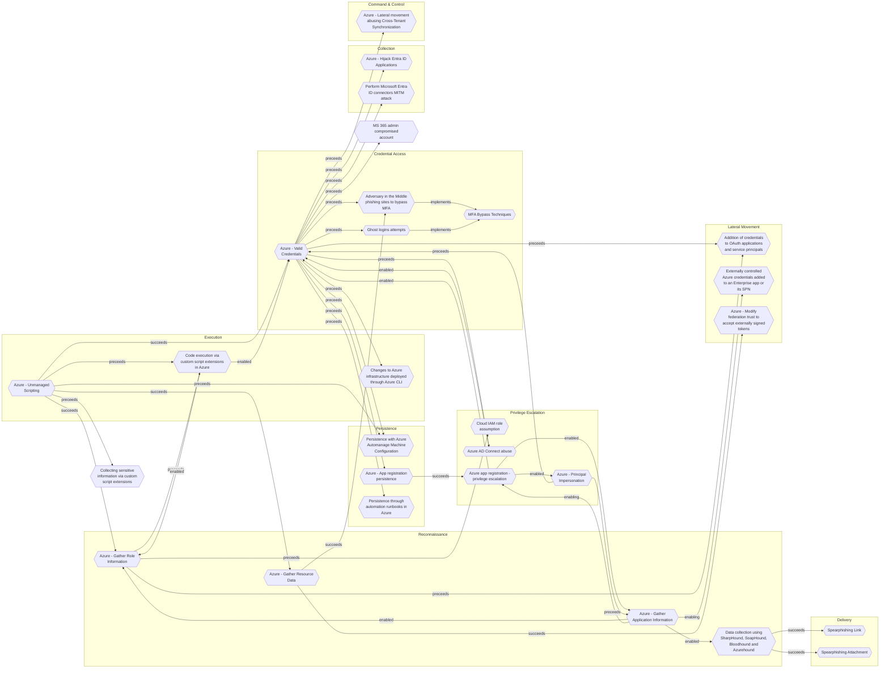

# Azure - Unmanaged Scripting

## Metadata
| Field | Value |
| --- | --- |
| UUID | `0815bc77-169d-4320-aa32-770cf062509a` |
| Schema | `threat::1.0` |
| Version | `1` |
| Created | `2025-09-02` |
| Modified | `2025-09-04` |
| TLP | clear (`TLP:CLEAR`) |
| Organisation | EC DIGIT CSOC (`56b0a0f0-b0bc-47d9-bb46-02f80ae2065a`) |

## References
### Public
- **1**: [https://orca.security/resources/blog/azure-shared-key-authorization-exploitation/](https://orca.security/resources/blog/azure-shared-key-authorization-exploitation/)
- **2**: [https://microsoft.github.io/Azure-Threat-Research-Matrix/PrivilegeEscalation/AZT404/AZT404-3/](https://microsoft.github.io/Azure-Threat-Research-Matrix/PrivilegeEscalation/AZT404/AZT404-3/)
- **3**: [https://github.com/Cloud-Architekt/AzureAD-Attack-Defense/blob/main/ServicePrincipals-ADO.md](https://github.com/Cloud-Architekt/AzureAD-Attack-Defense/blob/main/ServicePrincipals-ADO.md)

## Description
Adversaries can use Azure function apps, automation accounts, or other scriptable 
cloud resources, to execute malicious code or operations.

## Example Attack Scenario

An attacker gains access to credentials or a compromised user account with permissions 
to create or modify Azure Function Applications. The attacker then uploads a malicious 
script (PowerShell, Python, etc.) into a Function App that is linked to production 
resources. Upon execution, this script can perform unauthorized actions—such as 
exfiltrating data, creating new users, or altering configurations—using the inherent 
privileges of the Function App. This does not require direct access to virtual machines 
or servers, but abuses the cloud-native scripting capabilities.

## Attack Goals and Impact

- **Privilege Escalation**: By abusing scripting environments, an attacker may use 
a compromised identity to escalate their access rights, gaining broader or administrative 
control over Azure resources.
- **Data Exfiltration**: Malicious scripts can be designed to access sensitive information 
like secrets, credentials, or customer data and move it off the platform.
- **Persistence and Lateral Movement**: Attackers can establish persistence by deploying 
scripts that create new accounts, tokens, or credentials, or by moving laterally 
to other services and resources in the cloud environment.
- **Service Disruption**: Unmanaged scripts may also be used to delete, modify, 
or take resources offline, impacting business continuity.

## Attack Flow and Methodology

1. **Deployment of Malicious Script**: The attacker uploads and executes a script 
in an unmanaged environment (such as Azure Functions, Automation Accounts, or pipelines) 
using operational permissions like "Microsoft.Web/sites/functions/write".
2. **Execution of Malicious Actions**: The script leverages privileged roles to 
perform sensitive operations (like reading secrets, writing corrupted configurations, 
or creating service identities).
3. **Evade Detection**: The attacker may implement techniques to hide their activities, 
such as using legitimate accounts, storing scripts in hard-to-monitor locations, 
or obfuscating code logic.
4. **Persistence, Lateral Movement, or Exfiltration**: The attacker continues their 
campaign, using the script to create new credentials, pivot to additional resources 
or exfiltrate sensitive data.

## Criticality
**High** - A High priority incident is likely to result in a demonstrable impact to public health or safety, national security, economic security, foreign relations, civil liberties, or public confidence.

## Terrain
Adversaries obtains valid credentials, permissions, or exploits a 
vulnerability to gain access to the Azure portal or a relevant
scripting service.

## Surface
> **Azure**
> Microsoft Azure cloud platform

> **Azure::Security::Entra ID**
> Microsoft Entra ID in Azure (cloud identity)

> **AWS::Storage**
> AWS storage services

> **Serverless**
> Cloud-agnostic serverless compute (when not provider-specific)

## Threat Assessment
| Dimension | Assessment | Description |
| --- | --- | --- |
| Severity | Significant incident | A cyber attack which has a serious impact on a large organisation or on wider / local government, or which poses a considerable risk to central government or (inter)national essential services. |
| Impact | Data Breach Reputational Damages | Non-public information has been accessed from the outside, and successfully extracted. Damages to the organization public view may be achieved by using directly the access gained, or indirectly with data gathered. |
| Leverage | Elevation of privilege Modify configuration Modify privileges | Capacity to augment leverage over the target system by upgrading the compromised access rights Modify configuration or services Modify privileges or permissions |
| Viability | Likely | Probable (probably) - 55-80% |
| Kill Chain | Execution | Techniques that result in execution of attacker-controlled code on a local or remote system. |

## Actors
| Actor | ID | Source | Description |
| --- | --- | --- | --- |
| APT29 | `misp::b2056ff0-00b9-482e-b11c-c771daa5f28a` | ('misp',) | A 2015 report by F-Secure describe APT29 as: 'The Dukes are a well-resourced, highly dedicated and organized cyberespionage group that we believe has been working for the Russian Federation since at least 2008 to collect intelligence in support of foreign and security policy decision-making. The Dukes show unusual confidence in their ability to continue successfully compromising their targets, as well as in their ability to operate with impunity. The Dukes primarily target Western governments and related organizations, such as government ministries and agencies, political think tanks, and governmental subcontractors. Their targets have also included the governments of members of the Commonwealth of Independent States;Asian, African, and Middle Eastern governments;organizations associated with Chechen extremism;and Russian speakers engaged in the illicit trade of controlled substances and drugs. The Dukes are known to employ a vast arsenal of malware toolsets, which we identify as MiniDuke, CosmicDuke, OnionDuke, CozyDuke, CloudDuke, SeaDuke, HammerDuke, PinchDuke, and GeminiDuke. In recent years, the Dukes have engaged in apparently biannual large - scale spear - phishing campaigns against hundreds or even thousands of recipients associated with governmental institutions and affiliated organizations. These campaigns utilize a smash - and - grab approach involving a fast but noisy breakin followed by the rapid collection and exfiltration of as much data as possible.If the compromised target is discovered to be of value, the Dukes will quickly switch the toolset used and move to using stealthier tactics focused on persistent compromise and long - term intelligence gathering. This threat actor targets government ministries and agencies in the West, Central Asia, East Africa, and the Middle East; Chechen extremist groups; Russian organized crime; and think tanks. It is suspected to be behind the 2015 compromise of unclassified networks at the White House, Department of State, Pentagon, and the Joint Chiefs of Staff. The threat actor includes all of the Dukes tool sets, including MiniDuke, CosmicDuke, OnionDuke, CozyDuke, SeaDuke, CloudDuke (aka MiniDionis), and HammerDuke (aka Hammertoss). ' |

## ATT&CK Techniques
| Technique | Name | Description |
| --- | --- | --- |
| `T1059` | [Command and Scripting Interpreter](https://attack.mitre.org/techniques/T1059) | Adversaries may abuse command and script interpreters to execute commands, scripts, or binaries. These interfaces and languages provide ways of interacting with computer systems and are a common feature across many different platforms. Most systems come with some built-in command-line interface and scripting capabilities, for example, macOS and Linux distributions include some flavor of [Unix Shell](https://attack.mitre.org/techniques/T1059/004) while Windows installations include the [Windows Command Shell](https://attack.mitre.org/techniques/T1059/003) and [PowerShell](https://attack.mitre.org/techniques/T1059/001).  There are also cross-platform interpreters such as [Python](https://attack.mitre.org/techniques/T1059/006), as well as those commonly associated with client applications such as [JavaScript](https://attack.mitre.org/techniques/T1059/007) and [Visual Basic](https://attack.mitre.org/techniques/T1059/005).  Adversaries may abuse these technologies in various ways as a means of executing arbitrary commands. Commands and scripts can be embedded in [Initial Access](https://attack.mitre.org/tactics/TA0001) payloads delivered to victims as lure documents or as secondary payloads downloaded from an existing C2. Adversaries may also execute commands through interactive terminals/shells, as well as utilize various [Remote Services](https://attack.mitre.org/techniques/T1021) in order to achieve remote Execution.(Citation: Powershell Remote Commands)(Citation: Cisco IOS Software Integrity Assurance - Command History)(Citation: Remote Shell Execution in Python) |
| `T1078` | [Valid Accounts](https://attack.mitre.org/techniques/T1078) | Adversaries may obtain and abuse credentials of existing accounts as a means of gaining Initial Access, Persistence, Privilege Escalation, or Defense Evasion. Compromised credentials may be used to bypass access controls placed on various resources on systems within the network and may even be used for persistent access to remote systems and externally available services, such as VPNs, Outlook Web Access, network devices, and remote desktop.(Citation: volexity_0day_sophos_FW) Compromised credentials may also grant an adversary increased privilege to specific systems or access to restricted areas of the network. Adversaries may choose not to use malware or tools in conjunction with the legitimate access those credentials provide to make it harder to detect their presence.  In some cases, adversaries may abuse inactive accounts: for example, those belonging to individuals who are no longer part of an organization. Using these accounts may allow the adversary to evade detection, as the original account user will not be present to identify any anomalous activity taking place on their account.(Citation: CISA MFA PrintNightmare)  The overlap of permissions for local, domain, and cloud accounts across a network of systems is of concern because the adversary may be able to pivot across accounts and systems to reach a high level of access (i.e., domain or enterprise administrator) to bypass access controls set within the enterprise.(Citation: TechNet Credential Theft) |
| `T1204` | [User Execution](https://attack.mitre.org/techniques/T1204) | An adversary may rely upon specific actions by a user in order to gain execution. Users may be subjected to social engineering to get them to execute malicious code by, for example, opening a malicious document file or link. These user actions will typically be observed as follow-on behavior from forms of [Phishing](https://attack.mitre.org/techniques/T1566).  While [User Execution](https://attack.mitre.org/techniques/T1204) frequently occurs shortly after Initial Access it may occur at other phases of an intrusion, such as when an adversary places a file in a shared directory or on a user's desktop hoping that a user will click on it. This activity may also be seen shortly after [Internal Spearphishing](https://attack.mitre.org/techniques/T1534).  Adversaries may also deceive users into performing actions such as:  * Enabling [Remote Access Tools](https://attack.mitre.org/techniques/T1219), allowing direct control of the system to the adversary * Running malicious JavaScript in their browser, allowing adversaries to [Steal Web Session Cookie](https://attack.mitre.org/techniques/T1539)s(Citation: Talos Roblox Scam 2023)(Citation: Krebs Discord Bookmarks 2023) * Downloading and executing malware for [User Execution](https://attack.mitre.org/techniques/T1204) * Coerceing users to copy, paste, and execute malicious code manually(Citation: Reliaquest-execution)(Citation: proofpoint-selfpwn)  For example, tech support scams can be facilitated through [Phishing](https://attack.mitre.org/techniques/T1566), vishing, or various forms of user interaction. Adversaries can use a combination of these methods, such as spoofing and promoting toll-free numbers or call centers that are used to direct victims to malicious websites, to deliver and execute payloads containing malware or [Remote Access Tools](https://attack.mitre.org/techniques/T1219).(Citation: Telephone Attack Delivery) |

## Chaining

### Chaining details
#### succeeds -> [Azure - Gather Role Information](azure-gather-role-information.md) (`140907eb-c9fb-4330-9d71-656422388b2b`) (`sequence::succeeds`)
Adversaries need to identify privileged accounts and misconfigured role 
assignments that can be exploited for privilege escalation.

- **Target UUID**: `140907eb-c9fb-4330-9d71-656422388b2b`
#### succeeds -> [Azure - Gather Resource Data](azure-gather-resource-data.md) (`b1593e0b-1b3b-462d-9ab6-21d1c136469d`) (`sequence::succeeds`)
The attacker obtains credentials (via phishing, password spray, leaked keys)
granting at least Reader access to the target Azure tenant.

- **Target UUID**: `b1593e0b-1b3b-462d-9ab6-21d1c136469d`
#### succeeds -> [Azure - Valid Credentials](azure-valid-credentials.md) (`2743bf18-3b86-4721-bf3e-153dcda0b149`) (`sequence::succeeds`)
Adversaries obtain the username and password of an AzureAD user either through
phishing, password spraying, brute-force attacks, or credentials leaked online.

- **Target UUID**: `2743bf18-3b86-4721-bf3e-153dcda0b149`
#### preceeds -> [Code execution via custom script extensions in Azure](code-execution-via-custom-script-extensions-in-azure.md) (`61ddc240-e5a6-4ca8-ae77-6b471b498913`) (`sequence::preceeds`)
Adversaries must have an Azure role that grants the ability to write or deploy 
custom script extensions on virtual machines.

- **Target UUID**: `61ddc240-e5a6-4ca8-ae77-6b471b498913`
#### preceeds -> [Persistence with Azure Automanage Machine Configuration](persistence-with-azure-automanage-machine-configuration.md) (`23f6a192-a25d-48b8-a235-7bb55e483682`) (`sequence::preceeds`)
The adversary needs the owner access role on the targeted Azure subscription to apply
the Azure Policy and grant permissions for the system-managed identities.

- **Target UUID**: `23f6a192-a25d-48b8-a235-7bb55e483682`
#### preceeds -> [Collecting sensitive information via custom script extensions](collecting-sensitive-information-via-custom-script-extensions.md) (`b954303c-0ad0-4dc0-b5ca-492c3de9cd53`) (`sequence::preceeds`)
Attackers need to gain access to an Azure account with the Virtual Machine Contributor 
role (or equivalent) can use custom script extensions to execute arbitrary code 
as SYSTEM or root on VMs.

- **Target UUID**: `b954303c-0ad0-4dc0-b5ca-492c3de9cd53`
