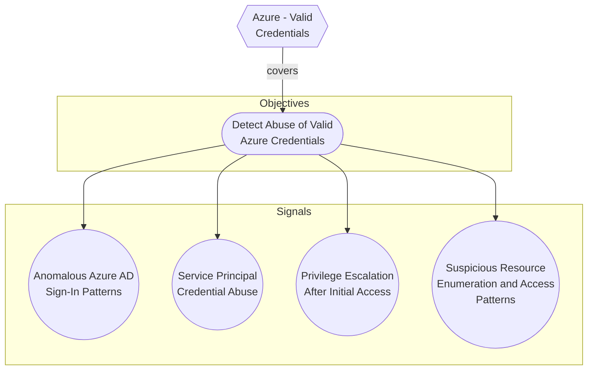

# Azure - Valid Credentials

## Metadata
| Field | Value |
| --- | --- |
| UUID | `2743bf18-3b86-4721-bf3e-153dcda0b149` |
| Schema | `threat::1.0` |
| Version | `2` |
| Created | `2025-08-14` |
| Modified | `2025-09-04` |
| TLP | clear (`TLP:CLEAR`) |
| Organisation | EC DIGIT CSOC (`56b0a0f0-b0bc-47d9-bb46-02f80ae2065a`) |

## References
### Public
- **1**: [https://cthfm-azure.gitbook.io/azure/mitre-att-and-ck/azure-mitre-frameworks/identity-provider-matrix-entra-id/initial-access-ta0001](https://cthfm-azure.gitbook.io/azure/mitre-att-and-ck/azure-mitre-frameworks/identity-provider-matrix-entra-id/initial-access-ta0001)
- **2**: [https://attack.mitre.org/techniques/T1078/](https://attack.mitre.org/techniques/T1078/)

## Description
This threat vector within the Initial Access phase represents a significant risk 
in Azure environments. This attack technique—formally designated around adversaries 
acquiring and abusing legitimate authentication credentials to gain access to Azure 
resources or Azure Active Directory (AzureAD).

### Example Attack Scenario

- The attacker logs in directly to the Azure Portal or via CLI (e.g., `az login`) 
using valid credentials.
- Once inside, the attacker can enumerate resources, exfiltrate data, manipulate 
configurations, or leverage the account for further attacks, depending on the permissions 
granted to the compromised account.
- If privileged service principal credentials are obtained, the attacker can use 
secrets or certificates to automate access and escalate privileges.

### Attack Goals and Impact

- **Primary Goals:**
  - Establish initial access to Azure environments in a stealthy, low-noise manner 
  by using valid, non-malicious authentication flows.
  - Access sensitive data, manipulate cloud resources, and potentially escalate 
  privileges or persist within the target environment.

- **Impact:**
  - Complete compromise of Azure resources accessible by the stolen account (files, 
  databases, VMs, identity services, etc.).
  - Potential for privilege escalation if the account is eligible for higher roles 
  or Privileged Identity Management (PIM).
  - Ability to create backdoors, perform lateral movement, and evade detection (since 
  all actions appear legitimate).
  - Depending on account privileges, ransomware deployment, data exfiltration, and 
  broad access to organizational assets may occur.

### Attack Flow and Methodology

1. **Reconnaissance**
  - Attackers gather information on users or service principals, identifying potential 
  targets through open-source intelligence, misconfigurations, or enumeration of 
  publicly accessible resources.

2. **Credential Acquisition**
  - Common methods: phishing (email/SMS/voice), brute-force/password spraying, 
  harvesting credentials from previous breaches, or exploiting cloud API/application 
  misconfigurations.
  - Service principal secrets/certificates may be obtained from publicly accessible 
  repositories, misconfigured code, or automation scripts.

3. **Authentication**
  - Adversary logs into Azure Portal or invokes cloud APIs using the acquired credentials.
  - For service principals: authentication occurs via CLI or programmatic access 
  using certificates/secrets.

4. **Enumeration and Expansion**
  - Mapping out resources, roles, permissions; searching for sensitive data or 
  additional high-value targets.
  - Assessing role activation and privilege escalation opportunities (e.g., via 
  PIM or RBAC misconfigurations).

5. **Execution of Attack Objectives**
  - Data exfiltration, sabotage, account persistence (creating additional user 
  accounts or credentials), lateral movement to other resources, or exploitation 
  for financial gain.
  - Actions are typically performed under the guise of the legitimate account to 
  avoid detection.

6. **Persistence and Defense Evasion**
  - Adversaries may create new accounts, modify access policies, or abuse automation 
  to ensure continued access.
  - Use of valid credentials enables attackers to blend with legitimate user activity, 
  thus evading many traditional security detection systems.

## Criticality
**High** - A High priority incident is likely to result in a demonstrable impact to public health or safety, national security, economic security, foreign relations, civil liberties, or public confidence.

## Terrain
Adversaries obtain the username and password of an AzureAD user either through phishing, 
password spraying, brute-force attacks, or credentials leaked online.

## Surface
> **Azure**
> Microsoft Azure cloud platform

> **Azure::Security::Entra ID**
> Microsoft Entra ID in Azure (cloud identity)

> **Microsoft::Microsoft 365**
> Microsoft 365 cloud-based productivity suite (formerly Office 365)

> **AWS::Storage**
> AWS storage services

> **Entra ID**
> Microsoft Entra ID (formerly Azure Active Directory)

## Threat Assessment
| Dimension | Assessment | Description |
| --- | --- | --- |
| Severity | Significant incident | A cyber attack which has a serious impact on a large organisation or on wider / local government, or which poses a considerable risk to central government or (inter)national essential services. |
| Impact | Data Breach<br>IP Loss<br>Reputational Damages<br>Identity Theft<br>Lose Capabilities<br>Business disruption | Non-public information has been accessed from the outside, and successfully extracted.<br>Particular, key data, information and blueprint conducive to the organization capability to gain and retain a commercial or geopolitical advantage has been accessed, and their content potentially used by competitors or other adversaries.<br>Damages to the organization public view may be achieved by using directly the access gained, or indirectly with data gathered.<br>Acquisition of sufficient information and privileges to profess as a given individual, for the purpose of abusing and deceiving human trust relationships.<br>Vector execution will remove key functions to the organization, which will not be easily circumvented. Most day-to-day is heavily impaired, but processes can reorganize at a loss.<br>Business disruption |
| Leverage | Spoofing<br>Tampering<br>Repudiation<br>Information Disclosure<br>Elevation of privilege<br>Modify configuration<br>Modify privileges<br>Modify data | Threat action aimed at accessing and use of another user’s credentials, such as username and password.<br>Threat action intending to maliciously change or modify persistent data, such as records in a database, and the alteration of data in transit between two computers over an open network, such as the Internet.<br>Threat action aimed at performing prohibited operations in a system that lacks the ability to trace the operations.<br>Threat action intending to read a file that one was not granted access to, or to read data in transit.<br>Capacity to augment leverage over the target system by upgrading the compromised access rights<br>Modify configuration or services<br>Modify privileges or permissions<br>Modify stored data or content |
| Viability | Likely | Probable (probably) - 55-80% |
| Kill Chain | Credential Access | Techniques resulting in the access of, or control over, system, service or domain credentials. |

## Actors
| Actor | ID | Source | Description |
| --- | --- | --- | --- |
| APT28 | `misp::5b4ee3ea-eee3-4c8e-8323-85ae32658754` | ('misp',) | The Sofacy Group (also known as APT28, Pawn Storm, Fancy Bear and Sednit) is a cyber espionage group believed to have ties to the Russian government. Likely operating since 2007, the group is known to target government, military, and security organizations. It has been characterized as an advanced persistent threat. |
| APT29 | `misp::b2056ff0-00b9-482e-b11c-c771daa5f28a` | ('misp',) | A 2015 report by F-Secure describe APT29 as: 'The Dukes are a well-resourced, highly dedicated and organized cyberespionage group that we believe has been working for the Russian Federation since at least 2008 to collect intelligence in support of foreign and security policy decision-making. The Dukes show unusual confidence in their ability to continue successfully compromising their targets, as well as in their ability to operate with impunity. The Dukes primarily target Western governments and related organizations, such as government ministries and agencies, political think tanks, and governmental subcontractors. Their targets have also included the governments of members of the Commonwealth of Independent States;Asian, African, and Middle Eastern governments;organizations associated with Chechen extremism;and Russian speakers engaged in the illicit trade of controlled substances and drugs. The Dukes are known to employ a vast arsenal of malware toolsets, which we identify as MiniDuke, CosmicDuke, OnionDuke, CozyDuke, CloudDuke, SeaDuke, HammerDuke, PinchDuke, and GeminiDuke. In recent years, the Dukes have engaged in apparently biannual large - scale spear - phishing campaigns against hundreds or even thousands of recipients associated with governmental institutions and affiliated organizations. These campaigns utilize a smash - and - grab approach involving a fast but noisy breakin followed by the rapid collection and exfiltration of as much data as possible.If the compromised target is discovered to be of value, the Dukes will quickly switch the toolset used and move to using stealthier tactics focused on persistent compromise and long - term intelligence gathering. This threat actor targets government ministries and agencies in the West, Central Asia, East Africa, and the Middle East; Chechen extremist groups; Russian organized crime; and think tanks. It is suspected to be behind the 2015 compromise of unclassified networks at the White House, Department of State, Pentagon, and the Joint Chiefs of Staff. The threat actor includes all of the Dukes tool sets, including MiniDuke, CosmicDuke, OnionDuke, CozyDuke, SeaDuke, CloudDuke (aka MiniDionis), and HammerDuke (aka Hammertoss). ' |
| APT33 | `misp::4f69ec6d-cb6b-42af-b8e2-920a2aa4be10` | ('misp',) | Our analysis reveals that APT33 is a capable group that has carried out cyber espionage operations since at least 2013. We assess APT33 works at the behest of the Iranian government. |
| APT5 | `misp::a47b79ae-7a0c-4308-9efc-294af19cc795` | ('misp',) | We have observed one APT group, which we call APT5, particularly focused on telecommunications and technology companies. More than half of the organizations we have observed being targeted or breached by APT5 operate in these sectors. Several times, APT5 has targeted organizations and personnel based in Southeast Asia. APT5 has been active since at least 2007. It appears to be a large threat group that consists of several subgroups, often with distinct tactics and infrastructure. APT5 has targeted or breached organizations across multiple industries, but its focus appears to be on telecommunications and technology companies, especially information about satellite communications.  APT5 targeted the network of an electronics firm that sells products for both industrial and military applications. The group subsequently stole communications related to the firm’s business relationship with a national military, including inventories and memoranda about specific products they provided.  In one case in late 2014, APT5 breached the network of an international telecommunications company. The group used malware with keylogging capabilities to monitor the computer of an executive who manages the company’s relationships with other telecommunications companies |
| Scattered Spider | `misp::3b238f3a-c67a-4a9e-b474-dc3897e00129` | ('misp',) | Scattered Spider, a highly active hacking group, has made headlines by targeting more than 130 organizations, with the number of victims steadily increasing. |
| HAFNIUM | `misp::4f05d6c1-3fc1-4567-91cd-dd4637cc38b5` | ('misp',) | HAFNIUM primarily targets entities in the United States across a number of industry sectors, including infectious disease researchers, law firms, higher education institutions, defense contractors, policy think tanks, and NGOs. Microsoft Threat Intelligence Center (MSTIC) attributes this campaign with high confidence to HAFNIUM, a group assessed to be state-sponsored and operating out of China, based on observed victimology, tactics and procedures. HAFNIUM has previously compromised victims by exploiting vulnerabilities in internet-facing servers, and has used legitimate open-source frameworks, like Covenant, for command and control. Once they’ve gained access to a victim network, HAFNIUM typically exfiltrates data to file sharing sites like MEGA.In campaigns unrelated to these vulnerabilities, Microsoft has observed HAFNIUM interacting with victim Office 365 tenants. While they are often unsuccessful in compromising customer accounts, this reconnaissance activity helps the adversary identify more details about their targets’ environments. HAFNIUM operates primarily from leased virtual private servers (VPS) in the United States. |
| [[Enterprise] Ke3chang](https://attack.mitre.org/groups/G0004) | `att&ck::G0004` | ('att&ck',) | [Ke3chang](https://attack.mitre.org/groups/G0004) is a threat group attributed to actors operating out of China. [Ke3chang](https://attack.mitre.org/groups/G0004) has targeted oil, government, diplomatic, military, and NGOs in Central and South America, the Caribbean, Europe, and North America since at least 2010.(Citation: Mandiant Operation Ke3chang November 2014)(Citation: NCC Group APT15 Alive and Strong)(Citation: APT15 Intezer June 2018)(Citation: Microsoft NICKEL December 2021) |
| LAPSUS | `misp::d9e5be22-1a04-4956-af6c-37af02330980` | ('misp',) | An actor group conducting large-scale social engineering and extortion campaign against multiple organizations with some seeing evidence of destructive elements. |

## ATT&CK Techniques
| Technique | Name | Description |
| --- | --- | --- |
| `T1078.004` | [Valid Accounts: Cloud Accounts](https://attack.mitre.org/techniques/T1078/004) | Valid accounts in cloud environments may allow adversaries to perform actions to achieve Initial Access, Persistence, Privilege Escalation, or Defense Evasion. Cloud accounts are those created and configured by an organization for use by users, remote support, services, or for administration of resources within a cloud service provider or SaaS application. Cloud Accounts can exist solely in the cloud; alternatively, they may be hybrid-joined between on-premises systems and the cloud through syncing or federation with other identity sources such as Windows Active Directory.(Citation: AWS Identity Federation)(Citation: Google Federating GC)(Citation: Microsoft Deploying AD Federation)  Service or user accounts may be targeted by adversaries through [Brute Force](https://attack.mitre.org/techniques/T1110), [Phishing](https://attack.mitre.org/techniques/T1566), or various other means to gain access to the environment. Federated or synced accounts may be a pathway for the adversary to affect both on-premises systems and cloud environments - for example, by leveraging shared credentials to log onto [Remote Services](https://attack.mitre.org/techniques/T1021). High privileged cloud accounts, whether federated, synced, or cloud-only, may also allow pivoting to on-premises environments by leveraging SaaS-based [Software Deployment Tools](https://attack.mitre.org/techniques/T1072) to run commands on hybrid-joined devices.  An adversary may create long lasting [Additional Cloud Credentials](https://attack.mitre.org/techniques/T1098/001) on a compromised cloud account to maintain persistence in the environment. Such credentials may also be used to bypass security controls such as multi-factor authentication.   Cloud accounts may also be able to assume [Temporary Elevated Cloud Access](https://attack.mitre.org/techniques/T1548/005) or other privileges through various means within the environment. Misconfigurations in role assignments or role assumption policies may allow an adversary to use these mechanisms to leverage permissions outside the intended scope of the account. Such over privileged accounts may be used to harvest sensitive data from online storage accounts and databases through [Cloud API](https://attack.mitre.org/techniques/T1059/009) or other methods. For example, in Azure environments, adversaries may target Azure Managed Identities, which allow associated Azure resources to request access tokens. By compromising a resource with an attached Managed Identity, such as an Azure VM, adversaries may be able to [Steal Application Access Token](https://attack.mitre.org/techniques/T1528)s to move laterally across the cloud environment.(Citation: SpecterOps Managed Identity 2022) |
| `T1110` | [Brute Force](https://attack.mitre.org/techniques/T1110) | Adversaries may use brute force techniques to gain access to accounts when passwords are unknown or when password hashes are obtained.(Citation: TrendMicro Pawn Storm Dec 2020) Without knowledge of the password for an account or set of accounts, an adversary may systematically guess the password using a repetitive or iterative mechanism.(Citation: Dragos Crashoverride 2018) Brute forcing passwords can take place via interaction with a service that will check the validity of those credentials or offline against previously acquired credential data, such as password hashes.  Brute forcing credentials may take place at various points during a breach. For example, adversaries may attempt to brute force access to [Valid Accounts](https://attack.mitre.org/techniques/T1078) within a victim environment leveraging knowledge gathered from other post-compromise behaviors such as [OS Credential Dumping](https://attack.mitre.org/techniques/T1003), [Account Discovery](https://attack.mitre.org/techniques/T1087), or [Password Policy Discovery](https://attack.mitre.org/techniques/T1201). Adversaries may also combine brute forcing activity with behaviors such as [External Remote Services](https://attack.mitre.org/techniques/T1133) as part of Initial Access. |
| `T1555` | [Credentials from Password Stores](https://attack.mitre.org/techniques/T1555) | Adversaries may search for common password storage locations to obtain user credentials.(Citation: F-Secure The Dukes) Passwords are stored in several places on a system, depending on the operating system or application holding the credentials. There are also specific applications and services that store passwords to make them easier for users to manage and maintain, such as password managers and cloud secrets vaults. Once credentials are obtained, they can be used to perform lateral movement and access restricted information. |

## Chaining
```mermaid
flowchart LR
subgraph "Credential Access"
2743bf18_3b86_4721_bf3e_153dcda0b149{{"Azure - Valid<br>Credentials"}}
518ff777_f10d_4201_9e54_2779c31c512e{{"Consent phishing attack"}}
09aec351_7dfb_4cde_8570_d3c7a36e1241{{"Azure - KeyVault Dumping"}}
ce7194f8_2398_4e79_b964_162ca5ee175b{{"Secrets stored in<br>repository"}}
37381f28_ad9f_40c3_80f8_d8a82d6ce9a3{{"Resource Secret Reveal<br>in Azure"}}
c4edae81_5790_4b9c_88b7_d11d6985b1a4{{"Azure - Service<br>Principal Secret Reveal"}}
b6543cff_2e86_4fe6_afb7_6d3595188190{{"Azure - Steal Service<br>Principal Certificate"}}
6a7a493a_511a_4c9d_aa9c_4427c832a322{{"SIM-card swapping"}}
4a807ac4_f764_41b1_ae6f_94239041d349{{"MFA Bypass Techniques"}}
66aafb61_9a46_4287_8b40_4785b42b77a3{{"Adversary in the Middle<br>phishing sites to bypass<br>MFA"}}
b0d6bf74_b204_4a48_9509_4499ed795771{{"Pass-the-cookie Attack"}}
6e988fa7_69c9_4aef_897c_a34fa5066dac{{"Ghost logins attempts"}}
end
subgraph "Privilege Escalation"
c698fc79_3ed6_44a7_a9d7_bc447600e4c3{{"Azure AD Connect abuse"}}
c7e260d8_d391_41eb_be1a_7f276c99b383{{"Azure app registration -<br>privilege escalation"}}
bb2501d5_99c7_44a6_ac5a_9510102d6611{{"Azure - Principal<br>Impersonation"}}
10a89280_d42e_446d_9f8d_840b1218f532{{"Azure - Elevated Access<br>Toggle"}}
85c8e0dd_b012_402d_bb09_5d354c16ebb9{{"Azure - Local Resource<br>Hijack"}}
f1dc4341_eb45_4d07_8075_b1a6b227cc76{{"Cloud IAM role<br>assumption"}}
end
subgraph "Reconnaissance"
fe6827f2_efb4_43b3_9ca3_b7d417111b32{{"Azure - Gather<br>Application Information"}}
2900d389_3098_49d3_8166_5b2612d03576{{"Azure - Gather User<br>Information"}}
4e7eae8e_6615_41f2_bfe1_21a04f7a6088{{"Azure - Gather Victim<br>Data"}}
53063205_4404_4e6d_a2f5_d566c6085d96{{"Data collection using<br>SharpHound, SoapHound,<br>Bloodhound and<br>Azurehound"}}
b1593e0b_1b3b_462d_9ab6_21d1c136469d{{"Azure - Gather Resource<br>Data"}}
81338b90_f80c_40cc_8a57_ba97cdf86948{{"Azure - Key Vault<br>reconnaissance"}}
140907eb_c9fb_4330_9d71_656422388b2b{{"Azure - Gather Role<br>Information"}}
41f57a57_1ed6_407e_bb70_a0f6ab52af10{{"Azure - Storage Blobs<br>Reconnaissance"}}
2d7ed070_e5c5_4796_b150_ea1d02ed1785{{"Azure - Storage<br>container reconnaissance"}}
end
subgraph "Execution"
490a5d5d_5880_45bd_a05d_176878e0ae24{{"Azure DevOps pipelines"}}
4d9cc646_debc_477b_93cb_4ea74c47c02c{{"Azure - Managed Device<br>Scripting"}}
61ddc240_e5a6_4ca8_ae77_6b471b498913{{"Code execution via<br>custom script extensions<br>in Azure"}}
0815bc77_169d_4320_aa32_770cf062509a{{"Azure - Unmanaged<br>Scripting"}}
3435c5fd_1069_40ee_ae79_54c672ce454d{{"Azure - Virtual Machine<br>Scripting"}}
60c5b065_7d06_4697_850f_c2f80765f10b{{"Changes to Azure<br>infrastructure deployed<br>through Azure CLI"}}
end
subgraph "Persistence"
5d43ef75_4637_4a75_b1ed_6716052cff0e{{"Azure - App registration<br>persistence"}}
bcf3bb96_ed97_4853_98ab_937c2d214f4e{{"Azure - Key Vault<br>persistence"}}
31e7f292_8370_4255_861d_edd68ed8b7b0{{"Azure - External Entity<br>Access"}}
23f6a192_a25d_48b8_a235_7bb55e483682{{"Persistence with Azure<br>Automanage Machine<br>Configuration"}}
37f24c48_4a38_4682_aa76_5845ed2d6890{{"Azure - Policy with<br>DeployIfNotExists<br>definition"}}
50c7e353_ac1c_48a7_8c98_2515b45f31f4{{"Persistence through<br>automation runbooks in<br>Azure"}}
end
subgraph "Command & Control"
2fd1cddb_c66d_4a99_9779_31e32b67495e{{"Azure - Lateral movement<br>abusing Cross-Tenant<br>Synchronization"}}
end
subgraph "Lateral Movement"
9bb31c65_8abd_48fc_afe3_8aca76109737{{"Azure - Modify<br>federation trust to<br>accept externally signed<br>tokens"}}
a8c7b250_a2d4_4a0d_82f8_23dc99c77d7b{{"Addition of credentials<br>to OAuth applications<br>and service principals"}}
ca2751c7_8641_4fb0_a90b_30c5987015dc{{"Externally controlled<br>Azure credentials added<br>to an Enterprise app or<br>its SPN"}}
end
subgraph "Impact"
d24fcc84_0e1e_41e1_8d0e_6ee9f8c6a068{{"Azure - File Share<br>Mounting"}}
942ed69c_700a_469a_9591_07b87815a909{{"Azure - Storage Account<br>Replication"}}
4805a7a1_807c_4869_aefe_3047823f64b5{{"Azure - Soft-Delete<br>Recovery"}}
2c6058fb_21db_47fe_99bc_a07cb70c53e4{{"Azure - Backup Delete"}}
end
subgraph "Collection"
c856d1b5_b351_49ad_b8f4_8ab9720ba510{{"Azure - Storage blobs<br>data collection"}}
78d5e363_14db_40c0_a1c4_4ba02a3e60d4{{"Azure - Hijack Entra ID<br>Applications"}}
f18be76e_f2b3_410a_80c5_d67e7b8e7b03{{"Perform Microsoft Entra<br>ID connectors MITM<br>attack"}}
end
subgraph "Delivery"
8934c19a_954b_4dce_8081_0a6acca599f6{{"Malicious container<br>image deployed"}}
1a68b5eb_0112_424d_a21f_88dda0b6b8df{{"Spearphishing Link"}}
dd5d942c_bac4_4000_b9a6_ca4fef6cfb84{{"Spearphishing Attachment"}}
58b98d75_fc63_4662_8908_a2a7f4200902{{"Spearphishing with an<br>attachment extension<br>.rdp"}}
06c60af1_5fa8_493c_bf9b_6b2e215819f1{{"Social engineering<br>attack using Microsoft<br>Teams"}}
end
subgraph "Social Engineering"
0cdaee96_8595_4f3f_ba07_758b8be9d359{{"Social engineering<br>without attachment or<br>URL"}}
end
53f4e2f0_7d11_4629_bb26_905993a589db{{"Azure - Storage account<br>reconnaissance"}}
b954303c_0ad0_4dc0_b5ca_492c3de9cd53{{"Collecting sensitive<br>information via custom<br>script extensions"}}
20bd3620_b13b_4895_b291_b1a26bd9aef3{{"MS 365 admin compromised<br>account"}}
c698fc79_3ed6_44a7_a9d7_bc447600e4c3 -->|enabled| 2743bf18_3b86_4721_bf3e_153dcda0b149
c7e260d8_d391_41eb_be1a_7f276c99b383 -->|enabled| 2743bf18_3b86_4721_bf3e_153dcda0b149
c7e260d8_d391_41eb_be1a_7f276c99b383 -->|enabled| bb2501d5_99c7_44a6_ac5a_9510102d6611
c7e260d8_d391_41eb_be1a_7f276c99b383 -->|enabled| fe6827f2_efb4_43b3_9ca3_b7d417111b32
490a5d5d_5880_45bd_a05d_176878e0ae24 -->|enabled| 2743bf18_3b86_4721_bf3e_153dcda0b149
490a5d5d_5880_45bd_a05d_176878e0ae24 -->|enabled| 2900d389_3098_49d3_8166_5b2612d03576
490a5d5d_5880_45bd_a05d_176878e0ae24 -->|enabled| bb2501d5_99c7_44a6_ac5a_9510102d6611
10a89280_d42e_446d_9f8d_840b1218f532 -->|succeeds| 2743bf18_3b86_4721_bf3e_153dcda0b149
10a89280_d42e_446d_9f8d_840b1218f532 -->|succeeds| 2900d389_3098_49d3_8166_5b2612d03576
10a89280_d42e_446d_9f8d_840b1218f532 -->|preceeds| 5d43ef75_4637_4a75_b1ed_6716052cff0e
10a89280_d42e_446d_9f8d_840b1218f532 -->|preceeds| bcf3bb96_ed97_4853_98ab_937c2d214f4e
31e7f292_8370_4255_861d_edd68ed8b7b0 -->|implemented| 2743bf18_3b86_4721_bf3e_153dcda0b149
31e7f292_8370_4255_861d_edd68ed8b7b0 -->|implemented| 4e7eae8e_6615_41f2_bfe1_21a04f7a6088
31e7f292_8370_4255_861d_edd68ed8b7b0 -->|enabled| 53063205_4404_4e6d_a2f5_d566c6085d96
31e7f292_8370_4255_861d_edd68ed8b7b0 -->|enabled| 10a89280_d42e_446d_9f8d_840b1218f532
31e7f292_8370_4255_861d_edd68ed8b7b0 -->|enabled| 4e7eae8e_6615_41f2_bfe1_21a04f7a6088
31e7f292_8370_4255_861d_edd68ed8b7b0 -->|enabled| 2900d389_3098_49d3_8166_5b2612d03576
31e7f292_8370_4255_861d_edd68ed8b7b0 <-->|synergize| 2fd1cddb_c66d_4a99_9779_31e32b67495e
31e7f292_8370_4255_861d_edd68ed8b7b0 <-->|synergize| 9bb31c65_8abd_48fc_afe3_8aca76109737
d24fcc84_0e1e_41e1_8d0e_6ee9f8c6a068 -->|enabled| 2743bf18_3b86_4721_bf3e_153dcda0b149
d24fcc84_0e1e_41e1_8d0e_6ee9f8c6a068 -->|enabled| 53f4e2f0_7d11_4629_bb26_905993a589db
d24fcc84_0e1e_41e1_8d0e_6ee9f8c6a068 -->|enabled| b1593e0b_1b3b_462d_9ab6_21d1c136469d
d24fcc84_0e1e_41e1_8d0e_6ee9f8c6a068 <-->|synergize| 942ed69c_700a_469a_9591_07b87815a909
d24fcc84_0e1e_41e1_8d0e_6ee9f8c6a068 <-->|synergize| 85c8e0dd_b012_402d_bb09_5d354c16ebb9
d24fcc84_0e1e_41e1_8d0e_6ee9f8c6a068 -->|preceeds| 518ff777_f10d_4201_9e54_2779c31c512e
81338b90_f80c_40cc_8a57_ba97cdf86948 -->|enabled| 2743bf18_3b86_4721_bf3e_153dcda0b149
81338b90_f80c_40cc_8a57_ba97cdf86948 -->|enabled| b1593e0b_1b3b_462d_9ab6_21d1c136469d
81338b90_f80c_40cc_8a57_ba97cdf86948 -->|implements| bcf3bb96_ed97_4853_98ab_937c2d214f4e
09aec351_7dfb_4cde_8570_d3c7a36e1241 -->|enabled| 2743bf18_3b86_4721_bf3e_153dcda0b149
09aec351_7dfb_4cde_8570_d3c7a36e1241 -->|enabled| 81338b90_f80c_40cc_8a57_ba97cdf86948
09aec351_7dfb_4cde_8570_d3c7a36e1241 -->|enabled| b1593e0b_1b3b_462d_9ab6_21d1c136469d
09aec351_7dfb_4cde_8570_d3c7a36e1241 -->|enabled| 53063205_4404_4e6d_a2f5_d566c6085d96
09aec351_7dfb_4cde_8570_d3c7a36e1241 <-->|synergize| bcf3bb96_ed97_4853_98ab_937c2d214f4e
09aec351_7dfb_4cde_8570_d3c7a36e1241 <-->|synergize| ce7194f8_2398_4e79_b964_162ca5ee175b
09aec351_7dfb_4cde_8570_d3c7a36e1241 <-->|synergize| 37381f28_ad9f_40c3_80f8_d8a82d6ce9a3
4d9cc646_debc_477b_93cb_4ea74c47c02c -->|succeeds| 2743bf18_3b86_4721_bf3e_153dcda0b149
4d9cc646_debc_477b_93cb_4ea74c47c02c -->|succeeds| 140907eb_c9fb_4330_9d71_656422388b2b
4d9cc646_debc_477b_93cb_4ea74c47c02c -->|succeeds| b1593e0b_1b3b_462d_9ab6_21d1c136469d
4d9cc646_debc_477b_93cb_4ea74c47c02c -->|preceeds| 61ddc240_e5a6_4ca8_ae77_6b471b498913
4d9cc646_debc_477b_93cb_4ea74c47c02c -->|preceeds| 23f6a192_a25d_48b8_a235_7bb55e483682
37f24c48_4a38_4682_aa76_5845ed2d6890 -->|preceeds| 2743bf18_3b86_4721_bf3e_153dcda0b149
37f24c48_4a38_4682_aa76_5845ed2d6890 -->|preceeds| 61ddc240_e5a6_4ca8_ae77_6b471b498913
37f24c48_4a38_4682_aa76_5845ed2d6890 -->|preceeds| 23f6a192_a25d_48b8_a235_7bb55e483682
37f24c48_4a38_4682_aa76_5845ed2d6890 -->|preceeds| b954303c_0ad0_4dc0_b5ca_492c3de9cd53
37f24c48_4a38_4682_aa76_5845ed2d6890 -->|enabled| fe6827f2_efb4_43b3_9ca3_b7d417111b32
37f24c48_4a38_4682_aa76_5845ed2d6890 -->|enabled| b1593e0b_1b3b_462d_9ab6_21d1c136469d
37f24c48_4a38_4682_aa76_5845ed2d6890 -->|enabled| 53063205_4404_4e6d_a2f5_d566c6085d96
bb2501d5_99c7_44a6_ac5a_9510102d6611 -->|preceeds| 2743bf18_3b86_4721_bf3e_153dcda0b149
bb2501d5_99c7_44a6_ac5a_9510102d6611 -->|preceeds| fe6827f2_efb4_43b3_9ca3_b7d417111b32
c4edae81_5790_4b9c_88b7_d11d6985b1a4 -->|implemented| 2743bf18_3b86_4721_bf3e_153dcda0b149
c4edae81_5790_4b9c_88b7_d11d6985b1a4 -->|enabled| 53063205_4404_4e6d_a2f5_d566c6085d96
c4edae81_5790_4b9c_88b7_d11d6985b1a4 -->|enabled| 4e7eae8e_6615_41f2_bfe1_21a04f7a6088
c4edae81_5790_4b9c_88b7_d11d6985b1a4 -->|enabled| fe6827f2_efb4_43b3_9ca3_b7d417111b32
c4edae81_5790_4b9c_88b7_d11d6985b1a4 -->|enabled| bb2501d5_99c7_44a6_ac5a_9510102d6611
c4edae81_5790_4b9c_88b7_d11d6985b1a4 -->|enabling| 5d43ef75_4637_4a75_b1ed_6716052cff0e
c4edae81_5790_4b9c_88b7_d11d6985b1a4 -->|enabling| c7e260d8_d391_41eb_be1a_7f276c99b383
4805a7a1_807c_4869_aefe_3047823f64b5 -->|implemented| 2743bf18_3b86_4721_bf3e_153dcda0b149
4805a7a1_807c_4869_aefe_3047823f64b5 -->|enabled| 53063205_4404_4e6d_a2f5_d566c6085d96
4805a7a1_807c_4869_aefe_3047823f64b5 -->|enabled| b1593e0b_1b3b_462d_9ab6_21d1c136469d
4805a7a1_807c_4869_aefe_3047823f64b5 -->|enabled| 4e7eae8e_6615_41f2_bfe1_21a04f7a6088
4805a7a1_807c_4869_aefe_3047823f64b5 -->|enabled| 81338b90_f80c_40cc_8a57_ba97cdf86948
4805a7a1_807c_4869_aefe_3047823f64b5 -->|enabled| 41f57a57_1ed6_407e_bb70_a0f6ab52af10
4805a7a1_807c_4869_aefe_3047823f64b5 -->|enabled| 2d7ed070_e5c5_4796_b150_ea1d02ed1785
4805a7a1_807c_4869_aefe_3047823f64b5 <-->|synergize| 2c6058fb_21db_47fe_99bc_a07cb70c53e4
4805a7a1_807c_4869_aefe_3047823f64b5 -->|enabling| 37381f28_ad9f_40c3_80f8_d8a82d6ce9a3
b6543cff_2e86_4fe6_afb7_6d3595188190 -->|succeeds| 2743bf18_3b86_4721_bf3e_153dcda0b149
b6543cff_2e86_4fe6_afb7_6d3595188190 -->|succeeds| 140907eb_c9fb_4330_9d71_656422388b2b
b6543cff_2e86_4fe6_afb7_6d3595188190 -->|succeeds| b1593e0b_1b3b_462d_9ab6_21d1c136469d
b6543cff_2e86_4fe6_afb7_6d3595188190 -->|preceeds| 61ddc240_e5a6_4ca8_ae77_6b471b498913
b6543cff_2e86_4fe6_afb7_6d3595188190 -->|preceeds| 23f6a192_a25d_48b8_a235_7bb55e483682
b6543cff_2e86_4fe6_afb7_6d3595188190 -->|enabled| bb2501d5_99c7_44a6_ac5a_9510102d6611
b6543cff_2e86_4fe6_afb7_6d3595188190 -->|enabled| 53063205_4404_4e6d_a2f5_d566c6085d96
b6543cff_2e86_4fe6_afb7_6d3595188190 -->|enabled| a8c7b250_a2d4_4a0d_82f8_23dc99c77d7b
53f4e2f0_7d11_4629_bb26_905993a589db -->|enabled| 2743bf18_3b86_4721_bf3e_153dcda0b149
53f4e2f0_7d11_4629_bb26_905993a589db -->|enabled| 41f57a57_1ed6_407e_bb70_a0f6ab52af10
53f4e2f0_7d11_4629_bb26_905993a589db -->|enabled| b1593e0b_1b3b_462d_9ab6_21d1c136469d
53f4e2f0_7d11_4629_bb26_905993a589db -->|enabled| 53063205_4404_4e6d_a2f5_d566c6085d96
942ed69c_700a_469a_9591_07b87815a909 -->|preceeds| 2743bf18_3b86_4721_bf3e_153dcda0b149
942ed69c_700a_469a_9591_07b87815a909 -->|enabled| 53f4e2f0_7d11_4629_bb26_905993a589db
942ed69c_700a_469a_9591_07b87815a909 -->|enabled| 41f57a57_1ed6_407e_bb70_a0f6ab52af10
942ed69c_700a_469a_9591_07b87815a909 -->|enabled| 2d7ed070_e5c5_4796_b150_ea1d02ed1785
c856d1b5_b351_49ad_b8f4_8ab9720ba510 -->|enabled| 2743bf18_3b86_4721_bf3e_153dcda0b149
c856d1b5_b351_49ad_b8f4_8ab9720ba510 -->|enabled| b1593e0b_1b3b_462d_9ab6_21d1c136469d
c856d1b5_b351_49ad_b8f4_8ab9720ba510 -->|enabled| 53063205_4404_4e6d_a2f5_d566c6085d96
41f57a57_1ed6_407e_bb70_a0f6ab52af10 -->|enabled| 2743bf18_3b86_4721_bf3e_153dcda0b149
41f57a57_1ed6_407e_bb70_a0f6ab52af10 -->|enabled| 53f4e2f0_7d11_4629_bb26_905993a589db
41f57a57_1ed6_407e_bb70_a0f6ab52af10 -->|enabled| b1593e0b_1b3b_462d_9ab6_21d1c136469d
41f57a57_1ed6_407e_bb70_a0f6ab52af10 -->|enabled| 53063205_4404_4e6d_a2f5_d566c6085d96
2d7ed070_e5c5_4796_b150_ea1d02ed1785 -->|enabled| 2743bf18_3b86_4721_bf3e_153dcda0b149
2d7ed070_e5c5_4796_b150_ea1d02ed1785 -->|enabled| 53f4e2f0_7d11_4629_bb26_905993a589db
2d7ed070_e5c5_4796_b150_ea1d02ed1785 -->|enabled| b1593e0b_1b3b_462d_9ab6_21d1c136469d
2d7ed070_e5c5_4796_b150_ea1d02ed1785 -->|enabled| 53063205_4404_4e6d_a2f5_d566c6085d96
0815bc77_169d_4320_aa32_770cf062509a -->|succeeds| 2743bf18_3b86_4721_bf3e_153dcda0b149
0815bc77_169d_4320_aa32_770cf062509a -->|succeeds| 140907eb_c9fb_4330_9d71_656422388b2b
0815bc77_169d_4320_aa32_770cf062509a -->|succeeds| b1593e0b_1b3b_462d_9ab6_21d1c136469d
0815bc77_169d_4320_aa32_770cf062509a -->|preceeds| 61ddc240_e5a6_4ca8_ae77_6b471b498913
0815bc77_169d_4320_aa32_770cf062509a -->|preceeds| 23f6a192_a25d_48b8_a235_7bb55e483682
0815bc77_169d_4320_aa32_770cf062509a -->|preceeds| b954303c_0ad0_4dc0_b5ca_492c3de9cd53
3435c5fd_1069_40ee_ae79_54c672ce454d -->|succeeds| 2743bf18_3b86_4721_bf3e_153dcda0b149
3435c5fd_1069_40ee_ae79_54c672ce454d -->|succeeds| 140907eb_c9fb_4330_9d71_656422388b2b
3435c5fd_1069_40ee_ae79_54c672ce454d -->|succeeds| b1593e0b_1b3b_462d_9ab6_21d1c136469d
3435c5fd_1069_40ee_ae79_54c672ce454d -->|preceeds| 61ddc240_e5a6_4ca8_ae77_6b471b498913
3435c5fd_1069_40ee_ae79_54c672ce454d -->|preceeds| 23f6a192_a25d_48b8_a235_7bb55e483682
3435c5fd_1069_40ee_ae79_54c672ce454d -->|preceeds| b954303c_0ad0_4dc0_b5ca_492c3de9cd53
3435c5fd_1069_40ee_ae79_54c672ce454d -->|preceeds| 8934c19a_954b_4dce_8081_0a6acca599f6
61ddc240_e5a6_4ca8_ae77_6b471b498913 -->|enabled| 2743bf18_3b86_4721_bf3e_153dcda0b149
61ddc240_e5a6_4ca8_ae77_6b471b498913 -->|enabled| 140907eb_c9fb_4330_9d71_656422388b2b
37381f28_ad9f_40c3_80f8_d8a82d6ce9a3 -->|enabled| 2743bf18_3b86_4721_bf3e_153dcda0b149
37381f28_ad9f_40c3_80f8_d8a82d6ce9a3 -->|implemented| b1593e0b_1b3b_462d_9ab6_21d1c136469d
37381f28_ad9f_40c3_80f8_d8a82d6ce9a3 -->|implemented| 53f4e2f0_7d11_4629_bb26_905993a589db
37381f28_ad9f_40c3_80f8_d8a82d6ce9a3 -->|implemented| 81338b90_f80c_40cc_8a57_ba97cdf86948
37381f28_ad9f_40c3_80f8_d8a82d6ce9a3 <-->|synergize| bcf3bb96_ed97_4853_98ab_937c2d214f4e
fe6827f2_efb4_43b3_9ca3_b7d417111b32 -->|enabled| 140907eb_c9fb_4330_9d71_656422388b2b
fe6827f2_efb4_43b3_9ca3_b7d417111b32 -->|enabled| 53063205_4404_4e6d_a2f5_d566c6085d96
fe6827f2_efb4_43b3_9ca3_b7d417111b32 -->|enabling| ca2751c7_8641_4fb0_a90b_30c5987015dc
fe6827f2_efb4_43b3_9ca3_b7d417111b32 -->|enabling| c7e260d8_d391_41eb_be1a_7f276c99b383
140907eb_c9fb_4330_9d71_656422388b2b -->|preceeds| a8c7b250_a2d4_4a0d_82f8_23dc99c77d7b
140907eb_c9fb_4330_9d71_656422388b2b -->|preceeds| 61ddc240_e5a6_4ca8_ae77_6b471b498913
140907eb_c9fb_4330_9d71_656422388b2b -->|preceeds| f1dc4341_eb45_4d07_8075_b1a6b227cc76
53063205_4404_4e6d_a2f5_d566c6085d96 -->|succeeds| 1a68b5eb_0112_424d_a21f_88dda0b6b8df
53063205_4404_4e6d_a2f5_d566c6085d96 -->|succeeds| dd5d942c_bac4_4000_b9a6_ca4fef6cfb84
2900d389_3098_49d3_8166_5b2612d03576 -->|succeeds| 58b98d75_fc63_4662_8908_a2a7f4200902
2900d389_3098_49d3_8166_5b2612d03576 -->|succeeds| 0cdaee96_8595_4f3f_ba07_758b8be9d359
2900d389_3098_49d3_8166_5b2612d03576 -->|succeeds| 06c60af1_5fa8_493c_bf9b_6b2e215819f1
58b98d75_fc63_4662_8908_a2a7f4200902 -->|implements| dd5d942c_bac4_4000_b9a6_ca4fef6cfb84
0cdaee96_8595_4f3f_ba07_758b8be9d359 -->|preceeds| 1a68b5eb_0112_424d_a21f_88dda0b6b8df
0cdaee96_8595_4f3f_ba07_758b8be9d359 -->|preceeds| dd5d942c_bac4_4000_b9a6_ca4fef6cfb84
0cdaee96_8595_4f3f_ba07_758b8be9d359 -->|preceeds| 6a7a493a_511a_4c9d_aa9c_4427c832a322
6a7a493a_511a_4c9d_aa9c_4427c832a322 -->|implements| 4a807ac4_f764_41b1_ae6f_94239041d349
5d43ef75_4637_4a75_b1ed_6716052cff0e -->|succeeds| c7e260d8_d391_41eb_be1a_7f276c99b383
4e7eae8e_6615_41f2_bfe1_21a04f7a6088 -->|preceeds| dd5d942c_bac4_4000_b9a6_ca4fef6cfb84
4e7eae8e_6615_41f2_bfe1_21a04f7a6088 -->|preceeds| 1a68b5eb_0112_424d_a21f_88dda0b6b8df
b1593e0b_1b3b_462d_9ab6_21d1c136469d -->|succeeds| 66aafb61_9a46_4287_8b40_4785b42b77a3
b1593e0b_1b3b_462d_9ab6_21d1c136469d -->|succeeds| 9bb31c65_8abd_48fc_afe3_8aca76109737
66aafb61_9a46_4287_8b40_4785b42b77a3 -->|implements| 4a807ac4_f764_41b1_ae6f_94239041d349
85c8e0dd_b012_402d_bb09_5d354c16ebb9 -->|preceeds| b1593e0b_1b3b_462d_9ab6_21d1c136469d
518ff777_f10d_4201_9e54_2779c31c512e -->|succeeds| 1a68b5eb_0112_424d_a21f_88dda0b6b8df
518ff777_f10d_4201_9e54_2779c31c512e -->|implements| b0d6bf74_b204_4a48_9509_4499ed795771
b0d6bf74_b204_4a48_9509_4499ed795771 -->|succeeds| 66aafb61_9a46_4287_8b40_4785b42b77a3
b0d6bf74_b204_4a48_9509_4499ed795771 -->|implements| 4a807ac4_f764_41b1_ae6f_94239041d349
2c6058fb_21db_47fe_99bc_a07cb70c53e4 -->|enabled| b1593e0b_1b3b_462d_9ab6_21d1c136469d
2c6058fb_21db_47fe_99bc_a07cb70c53e4 -->|enabled| 140907eb_c9fb_4330_9d71_656422388b2b
2c6058fb_21db_47fe_99bc_a07cb70c53e4 -->|enabled| 2900d389_3098_49d3_8166_5b2612d03576
2c6058fb_21db_47fe_99bc_a07cb70c53e4 -->|enabled| 10a89280_d42e_446d_9f8d_840b1218f532
2743bf18_3b86_4721_bf3e_153dcda0b149 -->|preceeds| a8c7b250_a2d4_4a0d_82f8_23dc99c77d7b
2743bf18_3b86_4721_bf3e_153dcda0b149 -->|preceeds| 66aafb61_9a46_4287_8b40_4785b42b77a3
2743bf18_3b86_4721_bf3e_153dcda0b149 -->|preceeds| c698fc79_3ed6_44a7_a9d7_bc447600e4c3
2743bf18_3b86_4721_bf3e_153dcda0b149 -->|preceeds| 5d43ef75_4637_4a75_b1ed_6716052cff0e
2743bf18_3b86_4721_bf3e_153dcda0b149 -->|preceeds| 60c5b065_7d06_4697_850f_c2f80765f10b
2743bf18_3b86_4721_bf3e_153dcda0b149 -->|preceeds| 6e988fa7_69c9_4aef_897c_a34fa5066dac
2743bf18_3b86_4721_bf3e_153dcda0b149 -->|preceeds| 78d5e363_14db_40c0_a1c4_4ba02a3e60d4
2743bf18_3b86_4721_bf3e_153dcda0b149 -->|preceeds| 2fd1cddb_c66d_4a99_9779_31e32b67495e
2743bf18_3b86_4721_bf3e_153dcda0b149 -->|preceeds| 20bd3620_b13b_4895_b291_b1a26bd9aef3
2743bf18_3b86_4721_bf3e_153dcda0b149 -->|preceeds| f18be76e_f2b3_410a_80c5_d67e7b8e7b03
2743bf18_3b86_4721_bf3e_153dcda0b149 -->|preceeds| 50c7e353_ac1c_48a7_8c98_2515b45f31f4
2743bf18_3b86_4721_bf3e_153dcda0b149 -->|preceeds| 23f6a192_a25d_48b8_a235_7bb55e483682
6e988fa7_69c9_4aef_897c_a34fa5066dac -->|implements| 4a807ac4_f764_41b1_ae6f_94239041d349
```
### Chaining details
#### preceeds -> [Addition of credentials to OAuth applications and service principals](addition-of-credentials-to-oauth-applications-and-service-principals.md) (`a8c7b250-a2d4-4a0d-82f8-23dc99c77d7b`) (`sequence::preceeds`)
Adversaries need to have gained a sufficient foothold in the  on-premises environment before starting to modify Azure Active Directory.

- **Target UUID**: `a8c7b250-a2d4-4a0d-82f8-23dc99c77d7b`
#### preceeds -> [Adversary in the Middle phishing sites to bypass MFA](adversary-in-the-middle-phishing-sites-to-bypass-mfa.md) (`66aafb61-9a46-4287-8b40-4785b42b77a3`) (`sequence::preceeds`)
An adversary needs to target companies and contacts to distribute the malware, it's used a massive distrigution technique on a random principle.

- **Target UUID**: `66aafb61-9a46-4287-8b40-4785b42b77a3`
#### preceeds -> [Azure AD Connect abuse](azure-ad-connect-abuse.md) (`c698fc79-3ed6-44a7-a9d7-bc447600e4c3`) (`sequence::preceeds`)
Adversaries need local administrative access to the Azure AD Connect server.

- **Target UUID**: `c698fc79-3ed6-44a7-a9d7-bc447600e4c3`
#### preceeds -> [Azure - App registration persistence](azure-app-registration-persistence.md) (`5d43ef75-4637-4a75-b1ed-6716052cff0e`) (`sequence::preceeds`)
Adversaries need to compromise user or administrator credentials that have permissions to register or modify applications within Microsoft Entra ID.

- **Target UUID**: `5d43ef75-4637-4a75-b1ed-6716052cff0e`
#### preceeds -> [Changes to Azure infrastructure deployed through Azure CLI](changes-to-azure-infrastructure-deployed-through-azure-cli.md) (`60c5b065-7d06-4697-850f-c2f80765f10b`) (`sequence::preceeds`)
A threat actor controls either privileged credentials or a service principal (SPN) and an endpoint from which Azure CLI can be run.

- **Target UUID**: `60c5b065-7d06-4697-850f-c2f80765f10b`
#### preceeds -> [Ghost logins attempts](ghost-logins-attempts.md) (`6e988fa7-69c9-4aef-897c-a34fa5066dac`) (`sequence::preceeds`)
Application with SSO login requiring MFA, with legacy authentication (local login) not disabled.

- **Target UUID**: `6e988fa7-69c9-4aef-897c-a34fa5066dac`
#### preceeds -> [Azure - Hijack Entra ID Applications](azure-hijack-entra-id-applications.md) (`78d5e363-14db-40c0-a1c4-4ba02a3e60d4`) (`sequence::preceeds`)
The threat actor first needs to compromise an account with a privileged directory role that was granted the ability to modify Enterprise Applications 
or Application Registrations.

- **Target UUID**: `78d5e363-14db-40c0-a1c4-4ba02a3e60d4`
#### preceeds -> [Azure - Lateral movement abusing Cross-Tenant Synchronization](azure-lateral-movement-abusing-cross-tenant-synchronization.md) (`2fd1cddb-c66d-4a99-9779-31e32b67495e`) (`sequence::preceeds`)
Attackers must have compromised a tenant and gained elevated privileges.

- **Target UUID**: `2fd1cddb-c66d-4a99-9779-31e32b67495e`
#### preceeds -> [MS 365 admin compromised account](ms-365-admin-compromised-account.md) (`20bd3620-b13b-4895-b291-b1a26bd9aef3`) (`sequence::preceeds`)
Attackers got valid credentials from MS 365 admin, and they manage to bypass 2FA mechanism.

- **Target UUID**: `20bd3620-b13b-4895-b291-b1a26bd9aef3`
#### preceeds -> [Perform Microsoft Entra ID connectors MITM attack](perform-microsoft-entra-id-connectors-mitm-attack.md) (`f18be76e-f2b3-410a-80c5-d67e7b8e7b03`) (`sequence::preceeds`)
The threat actors would need to access the credentials of the users or administrators interacting with the connectors.

- **Target UUID**: `f18be76e-f2b3-410a-80c5-d67e7b8e7b03`
#### preceeds -> [Persistence through automation runbooks in Azure](persistence-through-automation-runbooks-in-azure.md) (`50c7e353-ac1c-48a7-8c98-2515b45f31f4`) (`sequence::preceeds`)
Adversaries must have compromised credentials or accounts with sufficient permissions to create or modify Automation Accounts and runbooks.

- **Target UUID**: `50c7e353-ac1c-48a7-8c98-2515b45f31f4`
#### preceeds -> [Persistence with Azure Automanage Machine Configuration](persistence-with-azure-automanage-machine-configuration.md) (`23f6a192-a25d-48b8-a235-7bb55e483682`) (`sequence::preceeds`)
The adversary needs the owner access role on the targeted Azure Subscription to apply the Azure Policy and grant permissions for
the system-managed identities.

- **Target UUID**: `23f6a192-a25d-48b8-a235-7bb55e483682`

## Coverage

## Related objects
| Type | Name | Direction | Relation |
| --- | --- | --- | --- |
| Objective | [Detect Abuse of Valid Azure Credentials](../Objectives/detect-abuse-of-valid-azure-credentials.md) (`f4a8b3c2-7e5d-4f1a-bc8e-9d2a6e7c8f0b`) | Downstream | objective |
| Signal | [Privilege Escalation After Initial Access](../Objectives/detect-abuse-of-valid-azure-credentials.md#privilege-escalation-after-initial-access) (`11686b3d-5f9d-4c1e-b3a8-4bae83653d24`) | Downstream | signal |
| Signal | [Anomalous Azure AD Sign-In Patterns](../Objectives/detect-abuse-of-valid-azure-credentials.md#anomalous-azure-ad-sign-in-patterns) (`12fb0e6a-a4e4-42d3-b77b-3c9c96f90f0b`) | Downstream | signal |
| Signal | [Suspicious Resource Enumeration and Access Patterns](../Objectives/detect-abuse-of-valid-azure-credentials.md#suspicious-resource-enumeration-and-access-patterns) (`353add53-6e14-47df-b65a-a591d2c6aacd`) | Downstream | signal |
| Signal | [Service Principal Credential Abuse](../Objectives/detect-abuse-of-valid-azure-credentials.md#service-principal-credential-abuse) (`d4d7e42b-3f9b-41c7-8dfb-ee7021ee806f`) | Downstream | signal |
