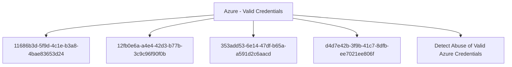

# Azure - Valid Credentials

## Metadata

- **UUID**: `2743bf18-3b86-4721-bf3e-153dcda0b149`
- **Schema**: `threat::1.0`
- **TLP**: clear

## Description
This threat vector within the Initial Access phase represents a significant risk 
in Azure environments. This attack technique—formally designated around adversaries 
acquiring and abusing legitimate authentication credentials to gain access to Azure 
resources or Azure Active Directory (AzureAD).

### Example Attack Scenario

- The attacker logs in directly to the Azure Portal or via CLI (e.g., `az login`) 
using valid credentials.
- Once inside, the attacker can enumerate resources, exfiltrate data, manipulate 
configurations, or leverage the account for further attacks, depending on the permissions 
granted to the compromised account.
- If privileged service principal credentials are obtained, the attacker can use 
secrets or certificates to automate access and escalate privileges.

### Attack Goals and Impact

- **Primary Goals:**
  - Establish initial access to Azure environments in a stealthy, low-noise manner 
  by using valid, non-malicious authentication flows.
  - Access sensitive data, manipulate cloud resources, and potentially escalate 
  privileges or persist within the target environment.

- **Impact:**
  - Complete compromise of Azure resources accessible by the stolen account (files, 
  databases, VMs, identity services, etc.).
  - Potential for privilege escalation if the account is eligible for higher roles 
  or Privileged Identity Management (PIM).
  - Ability to create backdoors, perform lateral movement, and evade detection (since 
  all actions appear legitimate).
  - Depending on account privileges, ransomware deployment, data exfiltration, and 
  broad access to organizational assets may occur.

### Attack Flow and Methodology

1. **Reconnaissance**
  - Attackers gather information on users or service principals, identifying potential 
  targets through open-source intelligence, misconfigurations, or enumeration of 
  publicly accessible resources.

2. **Credential Acquisition**
  - Common methods: phishing (email/SMS/voice), brute-force/password spraying, 
  harvesting credentials from previous breaches, or exploiting cloud API/application 
  misconfigurations.
  - Service principal secrets/certificates may be obtained from publicly accessible 
  repositories, misconfigured code, or automation scripts.

3. **Authentication**
  - Adversary logs into Azure Portal or invokes cloud APIs using the acquired credentials.
  - For service principals: authentication occurs via CLI or programmatic access 
  using certificates/secrets.

4. **Enumeration and Expansion**
  - Mapping out resources, roles, permissions; searching for sensitive data or 
  additional high-value targets.
  - Assessing role activation and privilege escalation opportunities (e.g., via 
  PIM or RBAC misconfigurations).

5. **Execution of Attack Objectives**
  - Data exfiltration, sabotage, account persistence (creating additional user 
  accounts or credentials), lateral movement to other resources, or exploitation 
  for financial gain.
  - Actions are typically performed under the guise of the legitimate account to 
  avoid detection.

6. **Persistence and Defense Evasion**
  - Adversaries may create new accounts, modify access policies, or abuse automation 
  to ensure continued access.
  - Use of valid credentials enables attackers to blend with legitimate user activity, 
  thus evading many traditional security detection systems.

## Techniques
- T1078.004
- T1110
- T1555

## Chaining

```mermaid
flowchart LR
2743bf18_3b86_4721_bf3e_153dcda0b149["Azure - Valid Credentials"]
a8c7b250_a2d4_4a0d_82f8_23dc99c77d7b["Addition of credentials to OAuth applications and service principals"]
66aafb61_9a46_4287_8b40_4785b42b77a3["Adversary in the Middle phishing sites to bypass MFA"]
c698fc79_3ed6_44a7_a9d7_bc447600e4c3["Azure AD Connect abuse"]
5d43ef75_4637_4a75_b1ed_6716052cff0e["Azure - App registration persistence"]
60c5b065_7d06_4697_850f_c2f80765f10b["Changes to Azure infrastructure deployed through Azure CLI"]
6e988fa7_69c9_4aef_897c_a34fa5066dac["Ghost logins attempts"]
78d5e363_14db_40c0_a1c4_4ba02a3e60d4["Azure - Hijack Entra ID Applications"]
2fd1cddb_c66d_4a99_9779_31e32b67495e["Azure - Lateral movement abusing Cross-Tenant Synchronization"]
20bd3620_b13b_4895_b291_b1a26bd9aef3["MS 365 admin compromised account"]
f18be76e_f2b3_410a_80c5_d67e7b8e7b03["Perform Microsoft Entra ID connectors MITM attack"]
50c7e353_ac1c_48a7_8c98_2515b45f31f4["Persistence through automation runbooks in Azure"]
23f6a192_a25d_48b8_a235_7bb55e483682["Persistence with Azure Automanage Machine Configuration"]
2743bf18_3b86_4721_bf3e_153dcda0b149 --> a8c7b250_a2d4_4a0d_82f8_23dc99c77d7b
a8c7b250_a2d4_4a0d_82f8_23dc99c77d7b --> 66aafb61_9a46_4287_8b40_4785b42b77a3
66aafb61_9a46_4287_8b40_4785b42b77a3 --> c698fc79_3ed6_44a7_a9d7_bc447600e4c3
c698fc79_3ed6_44a7_a9d7_bc447600e4c3 --> 5d43ef75_4637_4a75_b1ed_6716052cff0e
5d43ef75_4637_4a75_b1ed_6716052cff0e --> 60c5b065_7d06_4697_850f_c2f80765f10b
60c5b065_7d06_4697_850f_c2f80765f10b --> 6e988fa7_69c9_4aef_897c_a34fa5066dac
6e988fa7_69c9_4aef_897c_a34fa5066dac --> 78d5e363_14db_40c0_a1c4_4ba02a3e60d4
78d5e363_14db_40c0_a1c4_4ba02a3e60d4 --> 2fd1cddb_c66d_4a99_9779_31e32b67495e
2fd1cddb_c66d_4a99_9779_31e32b67495e --> 20bd3620_b13b_4895_b291_b1a26bd9aef3
20bd3620_b13b_4895_b291_b1a26bd9aef3 --> f18be76e_f2b3_410a_80c5_d67e7b8e7b03
f18be76e_f2b3_410a_80c5_d67e7b8e7b03 --> 50c7e353_ac1c_48a7_8c98_2515b45f31f4
50c7e353_ac1c_48a7_8c98_2515b45f31f4 --> 23f6a192_a25d_48b8_a235_7bb55e483682
```

## Relations

