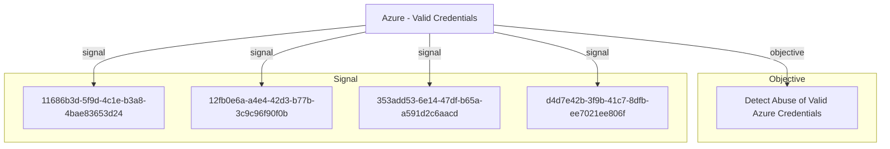

# Azure - Valid Credentials

## Metadata

- **UUID**: `2743bf18-3b86-4721-bf3e-153dcda0b149`
- **Schema**: `threat::1.0`
- **Version**: `2`
- **Created**: `2025-08-14`
- **Modified**: `2025-09-04`
- **TLP**: clear (`TLP:CLEAR`)
- **Organisation**: EC DIGIT CSOC (`56b0a0f0-b0bc-47d9-bb46-02f80ae2065a`)

## References
### Public
- **1**: [https://cthfm-azure.gitbook.io/azure/mitre-att-and-ck/azure-mitre-frameworks/identity-provider-matrix-entra-id/initial-access-ta0001](https://cthfm-azure.gitbook.io/azure/mitre-att-and-ck/azure-mitre-frameworks/identity-provider-matrix-entra-id/initial-access-ta0001)
- **2**: [https://attack.mitre.org/techniques/T1078/](https://attack.mitre.org/techniques/T1078/)

## Description
This threat vector within the Initial Access phase represents a significant risk 
in Azure environments. This attack technique—formally designated around adversaries 
acquiring and abusing legitimate authentication credentials to gain access to Azure 
resources or Azure Active Directory (AzureAD).

### Example Attack Scenario

- The attacker logs in directly to the Azure Portal or via CLI (e.g., `az login`) 
using valid credentials.
- Once inside, the attacker can enumerate resources, exfiltrate data, manipulate 
configurations, or leverage the account for further attacks, depending on the permissions 
granted to the compromised account.
- If privileged service principal credentials are obtained, the attacker can use 
secrets or certificates to automate access and escalate privileges.

### Attack Goals and Impact

- **Primary Goals:**
  - Establish initial access to Azure environments in a stealthy, low-noise manner 
  by using valid, non-malicious authentication flows.
  - Access sensitive data, manipulate cloud resources, and potentially escalate 
  privileges or persist within the target environment.

- **Impact:**
  - Complete compromise of Azure resources accessible by the stolen account (files, 
  databases, VMs, identity services, etc.).
  - Potential for privilege escalation if the account is eligible for higher roles 
  or Privileged Identity Management (PIM).
  - Ability to create backdoors, perform lateral movement, and evade detection (since 
  all actions appear legitimate).
  - Depending on account privileges, ransomware deployment, data exfiltration, and 
  broad access to organizational assets may occur.

### Attack Flow and Methodology

1. **Reconnaissance**
  - Attackers gather information on users or service principals, identifying potential 
  targets through open-source intelligence, misconfigurations, or enumeration of 
  publicly accessible resources.

2. **Credential Acquisition**
  - Common methods: phishing (email/SMS/voice), brute-force/password spraying, 
  harvesting credentials from previous breaches, or exploiting cloud API/application 
  misconfigurations.
  - Service principal secrets/certificates may be obtained from publicly accessible 
  repositories, misconfigured code, or automation scripts.

3. **Authentication**
  - Adversary logs into Azure Portal or invokes cloud APIs using the acquired credentials.
  - For service principals: authentication occurs via CLI or programmatic access 
  using certificates/secrets.

4. **Enumeration and Expansion**
  - Mapping out resources, roles, permissions; searching for sensitive data or 
  additional high-value targets.
  - Assessing role activation and privilege escalation opportunities (e.g., via 
  PIM or RBAC misconfigurations).

5. **Execution of Attack Objectives**
  - Data exfiltration, sabotage, account persistence (creating additional user 
  accounts or credentials), lateral movement to other resources, or exploitation 
  for financial gain.
  - Actions are typically performed under the guise of the legitimate account to 
  avoid detection.

6. **Persistence and Defense Evasion**
  - Adversaries may create new accounts, modify access policies, or abuse automation 
  to ensure continued access.
  - Use of valid credentials enables attackers to blend with legitimate user activity, 
  thus evading many traditional security detection systems.

## Criticality
**High** - A High priority incident is likely to result in a demonstrable impact to public health or safety, national security, economic security, foreign relations, civil liberties, or public confidence.

## Terrain
> **Adversaries obtain the username and password of an AzureAD user either through phishing, 
password spraying, brute-force attacks, or credentials leaked online.

Domains: Public Cloud
Targets: Cloud Storage Accounts, Identity Services, Cloud Portal
Platforms: Azure, Azure AD, Office 365**

## Threat Assessment
| Dimension | Assessment | Description |
| --- | --- | --- |
| Severity | Significant incident | A cyber attack which has a serious impact on a large organisation or on wider / local government, or which poses a considerable risk to central government or (inter)national essential services. |
| Impact | Data Breach; IP Loss; Reputational Damages; Identity Theft; Lose Capabilities; Business disruption | - |
| Leverage | Spoofing; Tampering; Repudiation; Information Disclosure; Elevation of privilege; Modify configuration; Modify privileges; Modify data | - |
| Viability | Likely | Probable (probably) - 55-80% |
| Kill Chain | Credential Access | Techniques resulting in the access of, or control over, system, service or domain credentials. |

## Actors
| Actor | ID | Source | Description |
| --- | --- | --- | --- |
| APT28 | `misp::5b4ee3ea-eee3-4c8e-8323-85ae32658754` | ('misp',) | The Sofacy Group (also known as APT28, Pawn Storm, Fancy Bear and Sednit) is a cyber espionage group believed to have ties to the Russian government. Likely operating since 2007, the group is known to target government, military, and security organizations. It has been characterized as an advanced persistent threat. |
| APT29 | `misp::b2056ff0-00b9-482e-b11c-c771daa5f28a` | ('misp',) | A 2015 report by F-Secure describe APT29 as: 'The Dukes are a well-resourced, highly dedicated and organized cyberespionage group that we believe has been working for the Russian Federation since at least 2008 to collect intelligence in support of foreign and security policy decision-making. The Dukes show unusual confidence in their ability to continue successfully compromising their targets, as well as in their ability to operate with impunity. The Dukes primarily target Western governments and related organizations, such as government ministries and agencies, political think tanks, and governmental subcontractors. Their targets have also included the governments of members of the Commonwealth of Independent States;Asian, African, and Middle Eastern governments;organizations associated with Chechen extremism;and Russian speakers engaged in the illicit trade of controlled substances and drugs. The Dukes are known to employ a vast arsenal of malware toolsets, which we identify as MiniDuke, CosmicDuke, OnionDuke, CozyDuke, CloudDuke, SeaDuke, HammerDuke, PinchDuke, and GeminiDuke. In recent years, the Dukes have engaged in apparently biannual large - scale spear - phishing campaigns against hundreds or even thousands of recipients associated with governmental institutions and affiliated organizations. These campaigns utilize a smash - and - grab approach involving a fast but noisy breakin followed by the rapid collection and exfiltration of as much data as possible.If the compromised target is discovered to be of value, the Dukes will quickly switch the toolset used and move to using stealthier tactics focused on persistent compromise and long - term intelligence gathering. This threat actor targets government ministries and agencies in the West, Central Asia, East Africa, and the Middle East; Chechen extremist groups; Russian organized crime; and think tanks. It is suspected to be behind the 2015 compromise of unclassified networks at the White House, Department of State, Pentagon, and the Joint Chiefs of Staff. The threat actor includes all of the Dukes tool sets, including MiniDuke, CosmicDuke, OnionDuke, CozyDuke, SeaDuke, CloudDuke (aka MiniDionis), and HammerDuke (aka Hammertoss). ' |
| APT33 | `misp::4f69ec6d-cb6b-42af-b8e2-920a2aa4be10` | ('misp',) | Our analysis reveals that APT33 is a capable group that has carried out cyber espionage operations since at least 2013. We assess APT33 works at the behest of the Iranian government. |
| APT5 | `misp::a47b79ae-7a0c-4308-9efc-294af19cc795` | ('misp',) | We have observed one APT group, which we call APT5, particularly focused on telecommunications and technology companies. More than half of the organizations we have observed being targeted or breached by APT5 operate in these sectors. Several times, APT5 has targeted organizations and personnel based in Southeast Asia. APT5 has been active since at least 2007. It appears to be a large threat group that consists of several subgroups, often with distinct tactics and infrastructure. APT5 has targeted or breached organizations across multiple industries, but its focus appears to be on telecommunications and technology companies, especially information about satellite communications.  APT5 targeted the network of an electronics firm that sells products for both industrial and military applications. The group subsequently stole communications related to the firm’s business relationship with a national military, including inventories and memoranda about specific products they provided.  In one case in late 2014, APT5 breached the network of an international telecommunications company. The group used malware with keylogging capabilities to monitor the computer of an executive who manages the company’s relationships with other telecommunications companies |
| Scattered Spider | `misp::3b238f3a-c67a-4a9e-b474-dc3897e00129` | ('misp',) | Scattered Spider, a highly active hacking group, has made headlines by targeting more than 130 organizations, with the number of victims steadily increasing. |
| HAFNIUM | `misp::4f05d6c1-3fc1-4567-91cd-dd4637cc38b5` | ('misp',) | HAFNIUM primarily targets entities in the United States across a number of industry sectors, including infectious disease researchers, law firms, higher education institutions, defense contractors, policy think tanks, and NGOs. Microsoft Threat Intelligence Center (MSTIC) attributes this campaign with high confidence to HAFNIUM, a group assessed to be state-sponsored and operating out of China, based on observed victimology, tactics and procedures. HAFNIUM has previously compromised victims by exploiting vulnerabilities in internet-facing servers, and has used legitimate open-source frameworks, like Covenant, for command and control. Once they’ve gained access to a victim network, HAFNIUM typically exfiltrates data to file sharing sites like MEGA.In campaigns unrelated to these vulnerabilities, Microsoft has observed HAFNIUM interacting with victim Office 365 tenants. While they are often unsuccessful in compromising customer accounts, this reconnaissance activity helps the adversary identify more details about their targets’ environments. HAFNIUM operates primarily from leased virtual private servers (VPS) in the United States. |
| [[Enterprise] Ke3chang](https://attack.mitre.org/groups/G0004) | `att&ck::G0004` | ('att&ck',) | [Ke3chang](https://attack.mitre.org/groups/G0004) is a threat group attributed to actors operating out of China. [Ke3chang](https://attack.mitre.org/groups/G0004) has targeted oil, government, diplomatic, military, and NGOs in Central and South America, the Caribbean, Europe, and North America since at least 2010.(Citation: Mandiant Operation Ke3chang November 2014)(Citation: NCC Group APT15 Alive and Strong)(Citation: APT15 Intezer June 2018)(Citation: Microsoft NICKEL December 2021) |
| LAPSUS | `misp::d9e5be22-1a04-4956-af6c-37af02330980` | ('misp',) | An actor group conducting large-scale social engineering and extortion campaign against multiple organizations with some seeing evidence of destructive elements. |

## ATT&CK Techniques
| Technique | Name | Description |
| --- | --- | --- |
| `T1078.004` | [Valid Accounts: Cloud Accounts](https://attack.mitre.org/techniques/T1078/004) | Valid accounts in cloud environments may allow adversaries to perform actions to achieve Initial Access, Persistence, Privilege Escalation, or Defense Evasion. Cloud accounts are those created and configured by an organization for use by users, remote support, services, or for administration of resources within a cloud service provider or SaaS application. Cloud Accounts can exist solely in the cloud; alternatively, they may be hybrid-joined between on-premises systems and the cloud through syncing or federation with other identity sources such as Windows Active Directory.(Citation: AWS Identity Federation)(Citation: Google Federating GC)(Citation: Microsoft Deploying AD Federation)  Service or user accounts may be targeted by adversaries through [Brute Force](https://attack.mitre.org/techniques/T1110), [Phishing](https://attack.mitre.org/techniques/T1566), or various other means to gain access to the environment. Federated or synced accounts may be a pathway for the adversary to affect both on-premises systems and cloud environments - for example, by leveraging shared credentials to log onto [Remote Services](https://attack.mitre.org/techniques/T1021). High privileged cloud accounts, whether federated, synced, or cloud-only, may also allow pivoting to on-premises environments by leveraging SaaS-based [Software Deployment Tools](https://attack.mitre.org/techniques/T1072) to run commands on hybrid-joined devices.  An adversary may create long lasting [Additional Cloud Credentials](https://attack.mitre.org/techniques/T1098/001) on a compromised cloud account to maintain persistence in the environment. Such credentials may also be used to bypass security controls such as multi-factor authentication.   Cloud accounts may also be able to assume [Temporary Elevated Cloud Access](https://attack.mitre.org/techniques/T1548/005) or other privileges through various means within the environment. Misconfigurations in role assignments or role assumption policies may allow an adversary to use these mechanisms to leverage permissions outside the intended scope of the account. Such over privileged accounts may be used to harvest sensitive data from online storage accounts and databases through [Cloud API](https://attack.mitre.org/techniques/T1059/009) or other methods. For example, in Azure environments, adversaries may target Azure Managed Identities, which allow associated Azure resources to request access tokens. By compromising a resource with an attached Managed Identity, such as an Azure VM, adversaries may be able to [Steal Application Access Token](https://attack.mitre.org/techniques/T1528)s to move laterally across the cloud environment.(Citation: SpecterOps Managed Identity 2022) |
| `T1110` | [Brute Force](https://attack.mitre.org/techniques/T1110) | Adversaries may use brute force techniques to gain access to accounts when passwords are unknown or when password hashes are obtained.(Citation: TrendMicro Pawn Storm Dec 2020) Without knowledge of the password for an account or set of accounts, an adversary may systematically guess the password using a repetitive or iterative mechanism.(Citation: Dragos Crashoverride 2018) Brute forcing passwords can take place via interaction with a service that will check the validity of those credentials or offline against previously acquired credential data, such as password hashes.  Brute forcing credentials may take place at various points during a breach. For example, adversaries may attempt to brute force access to [Valid Accounts](https://attack.mitre.org/techniques/T1078) within a victim environment leveraging knowledge gathered from other post-compromise behaviors such as [OS Credential Dumping](https://attack.mitre.org/techniques/T1003), [Account Discovery](https://attack.mitre.org/techniques/T1087), or [Password Policy Discovery](https://attack.mitre.org/techniques/T1201). Adversaries may also combine brute forcing activity with behaviors such as [External Remote Services](https://attack.mitre.org/techniques/T1133) as part of Initial Access. |
| `T1555` | [Credentials from Password Stores](https://attack.mitre.org/techniques/T1555) | Adversaries may search for common password storage locations to obtain user credentials.(Citation: F-Secure The Dukes) Passwords are stored in several places on a system, depending on the operating system or application holding the credentials. There are also specific applications and services that store passwords to make them easier for users to manage and maintain, such as password managers and cloud secrets vaults. Once credentials are obtained, they can be used to perform lateral movement and access restricted information. |

## Chaining

```mermaid
flowchart LR
2743bf18_3b86_4721_bf3e_153dcda0b149["Azure - Valid Credentials"]
a8c7b250_a2d4_4a0d_82f8_23dc99c77d7b["Addition of credentials to OAuth applications and service principals"]
66aafb61_9a46_4287_8b40_4785b42b77a3["Adversary in the Middle phishing sites to bypass MFA"]
c698fc79_3ed6_44a7_a9d7_bc447600e4c3["Azure AD Connect abuse"]
5d43ef75_4637_4a75_b1ed_6716052cff0e["Azure - App registration persistence"]
60c5b065_7d06_4697_850f_c2f80765f10b["Changes to Azure infrastructure deployed through Azure CLI"]
6e988fa7_69c9_4aef_897c_a34fa5066dac["Ghost logins attempts"]
78d5e363_14db_40c0_a1c4_4ba02a3e60d4["Azure - Hijack Entra ID Applications"]
2fd1cddb_c66d_4a99_9779_31e32b67495e["Azure - Lateral movement abusing Cross-Tenant Synchronization"]
20bd3620_b13b_4895_b291_b1a26bd9aef3["MS 365 admin compromised account"]
f18be76e_f2b3_410a_80c5_d67e7b8e7b03["Perform Microsoft Entra ID connectors MITM attack"]
50c7e353_ac1c_48a7_8c98_2515b45f31f4["Persistence through automation runbooks in Azure"]
23f6a192_a25d_48b8_a235_7bb55e483682["Persistence with Azure Automanage Machine Configuration"]
2743bf18_3b86_4721_bf3e_153dcda0b149 -->|sequence::preceeds| a8c7b250_a2d4_4a0d_82f8_23dc99c77d7b
a8c7b250_a2d4_4a0d_82f8_23dc99c77d7b -->|sequence::preceeds| 66aafb61_9a46_4287_8b40_4785b42b77a3
66aafb61_9a46_4287_8b40_4785b42b77a3 -->|sequence::preceeds| c698fc79_3ed6_44a7_a9d7_bc447600e4c3
c698fc79_3ed6_44a7_a9d7_bc447600e4c3 -->|sequence::preceeds| 5d43ef75_4637_4a75_b1ed_6716052cff0e
5d43ef75_4637_4a75_b1ed_6716052cff0e -->|sequence::preceeds| 60c5b065_7d06_4697_850f_c2f80765f10b
60c5b065_7d06_4697_850f_c2f80765f10b -->|sequence::preceeds| 6e988fa7_69c9_4aef_897c_a34fa5066dac
6e988fa7_69c9_4aef_897c_a34fa5066dac -->|sequence::preceeds| 78d5e363_14db_40c0_a1c4_4ba02a3e60d4
78d5e363_14db_40c0_a1c4_4ba02a3e60d4 -->|sequence::preceeds| 2fd1cddb_c66d_4a99_9779_31e32b67495e
2fd1cddb_c66d_4a99_9779_31e32b67495e -->|sequence::preceeds| 20bd3620_b13b_4895_b291_b1a26bd9aef3
20bd3620_b13b_4895_b291_b1a26bd9aef3 -->|sequence::preceeds| f18be76e_f2b3_410a_80c5_d67e7b8e7b03
f18be76e_f2b3_410a_80c5_d67e7b8e7b03 -->|sequence::preceeds| 50c7e353_ac1c_48a7_8c98_2515b45f31f4
50c7e353_ac1c_48a7_8c98_2515b45f31f4 -->|sequence::preceeds| 23f6a192_a25d_48b8_a235_7bb55e483682
```

### Chaining details
#### preceeds -> Addition of credentials to OAuth applications and service principals (`sequence::preceeds`)
Adversaries need to have gained a sufficient foothold in the  on-premises environment before starting to modify Azure Active Directory.

- **Target UUID**: `a8c7b250-a2d4-4a0d-82f8-23dc99c77d7b`
#### preceeds -> Adversary in the Middle phishing sites to bypass MFA (`sequence::preceeds`)
An adversary needs to target companies and contacts to distribute the malware, it's used a massive distrigution technique on a random principle.

- **Target UUID**: `66aafb61-9a46-4287-8b40-4785b42b77a3`
#### preceeds -> Azure AD Connect abuse (`sequence::preceeds`)
Adversaries need local administrative access to the Azure AD Connect server.

- **Target UUID**: `c698fc79-3ed6-44a7-a9d7-bc447600e4c3`
#### preceeds -> Azure - App registration persistence (`sequence::preceeds`)
Adversaries need to compromise user or administrator credentials that have permissions to register or modify applications within Microsoft Entra ID.

- **Target UUID**: `5d43ef75-4637-4a75-b1ed-6716052cff0e`
#### preceeds -> Changes to Azure infrastructure deployed through Azure CLI (`sequence::preceeds`)
A threat actor controls either privileged credentials or a service principal (SPN) and an endpoint from which Azure CLI can be run.

- **Target UUID**: `60c5b065-7d06-4697-850f-c2f80765f10b`
#### preceeds -> Ghost logins attempts (`sequence::preceeds`)
Application with SSO login requiring MFA, with legacy authentication (local login) not disabled.

- **Target UUID**: `6e988fa7-69c9-4aef-897c-a34fa5066dac`
#### preceeds -> Azure - Hijack Entra ID Applications (`sequence::preceeds`)
The threat actor first needs to compromise an account with a privileged directory role that was granted the ability to modify Enterprise Applications 
or Application Registrations.

- **Target UUID**: `78d5e363-14db-40c0-a1c4-4ba02a3e60d4`
#### preceeds -> Azure - Lateral movement abusing Cross-Tenant Synchronization (`sequence::preceeds`)
Attackers must have compromised a tenant and gained elevated privileges.

- **Target UUID**: `2fd1cddb-c66d-4a99-9779-31e32b67495e`
#### preceeds -> MS 365 admin compromised account (`sequence::preceeds`)
Attackers got valid credentials from MS 365 admin, and they manage to bypass 2FA mechanism.

- **Target UUID**: `20bd3620-b13b-4895-b291-b1a26bd9aef3`
#### preceeds -> Perform Microsoft Entra ID connectors MITM attack (`sequence::preceeds`)
The threat actors would need to access the credentials of the users or administrators interacting with the connectors.

- **Target UUID**: `f18be76e-f2b3-410a-80c5-d67e7b8e7b03`
#### preceeds -> Persistence through automation runbooks in Azure (`sequence::preceeds`)
Adversaries must have compromised credentials or accounts with sufficient permissions to create or modify Automation Accounts and runbooks.

- **Target UUID**: `50c7e353-ac1c-48a7-8c98-2515b45f31f4`
#### preceeds -> Persistence with Azure Automanage Machine Configuration (`sequence::preceeds`)
The adversary needs the owner access role on the targeted Azure Subscription to apply the Azure Policy and grant permissions for
the system-managed identities.

- **Target UUID**: `23f6a192-a25d-48b8-a235-7bb55e483682`

## Relations

