# Azure - Virtual Machine Scripting

## Metadata

- **UUID**: `3435c5fd-1069-40ee-ae79-54c672ce454d`
- **Schema**: `threat::1.0`
- **TLP**: clear

## Description
This threat vector refers to adversaries running scripts or commands directly 
on Azure virtual machines via built-in features, enabling malicious code execution 
and system compromise.

## Example Attack Scenario
An attacker gains access to Azure portal credentials (via phishing or leaked secrets), 
allowing privilege escalation to interact with the management plane of Azure resources. 
The attacker then uses features like **RunCommand**, **CustomScriptExtension**, 
or **Serial Console** to execute PowerShell or shell scripts directly on a targeted VM. 
For instance, leveraging **CustomScriptExtension**, the intruder injects a script 
to dump credentials, establish persistence, or exfiltrate sensitive files—all as SYSTEM user.

## Attack Goals and Impact
- The primary **goal** is to execute arbitrary commands with SYSTEM privileges, 
enabling full compromise of the VM and escalation to additional assets connected to the VM.
- **Impact** includes:
  - Data exfiltration (sensitive file theft, database dumps)
  - Persistence (deploying webshells, creating new users)
  - Lateral movement (pivoting from VM to network or cloud resources)
  - Disruption (cryptomining, ransomware deployment)
  - Evasion (disabling defenses on the VM level).

## Attack Flow and Methodology
1. The attacker identifies exposed or misconfigured Azure virtual machines, focusing 
  on accounts with management access.
2. - The attacker uses management plane operations: for example, `Microsoft.Compute/virtualMachines/runCommand/action`, 
  `Microsoft.Compute/virtualMachines/extensions/write`, or serial console access.
  - Executes malicious scripts (PowerShell, Bash) as SYSTEM.
3. - Harvests credentials, establishes persistence, or launches further attacks.
  - May leverage logging gaps to avoid detection, or clean up traces after execution.
4. - Activity can be detected via auditing specific events such as `Microsoft.Compute/virtualMachines/extensions/write` 
  or anomalous use of VM scripting features.

## Techniques
- T1059
- T1078
- T1204

## Chaining

```mermaid
flowchart LR
3435c5fd_1069_40ee_ae79_54c672ce454d["Azure - Virtual Machine Scripting"]
140907eb_c9fb_4330_9d71_656422388b2b["Azure - Gather Role Information"]
b1593e0b_1b3b_462d_9ab6_21d1c136469d["Azure - Gather Resource Data"]
2743bf18_3b86_4721_bf3e_153dcda0b149["Azure - Valid Credentials"]
61ddc240_e5a6_4ca8_ae77_6b471b498913["Code execution via custom script extensions in Azure"]
23f6a192_a25d_48b8_a235_7bb55e483682["Persistence with Azure Automanage Machine Configuration"]
b954303c_0ad0_4dc0_b5ca_492c3de9cd53["Collecting sensitive information via custom script extensions"]
8934c19a_954b_4dce_8081_0a6acca599f6["Malicious container image deployed"]
3435c5fd_1069_40ee_ae79_54c672ce454d --> 140907eb_c9fb_4330_9d71_656422388b2b
140907eb_c9fb_4330_9d71_656422388b2b --> b1593e0b_1b3b_462d_9ab6_21d1c136469d
b1593e0b_1b3b_462d_9ab6_21d1c136469d --> 2743bf18_3b86_4721_bf3e_153dcda0b149
2743bf18_3b86_4721_bf3e_153dcda0b149 --> 61ddc240_e5a6_4ca8_ae77_6b471b498913
61ddc240_e5a6_4ca8_ae77_6b471b498913 --> 23f6a192_a25d_48b8_a235_7bb55e483682
23f6a192_a25d_48b8_a235_7bb55e483682 --> b954303c_0ad0_4dc0_b5ca_492c3de9cd53
b954303c_0ad0_4dc0_b5ca_492c3de9cd53 --> 8934c19a_954b_4dce_8081_0a6acca599f6
```

