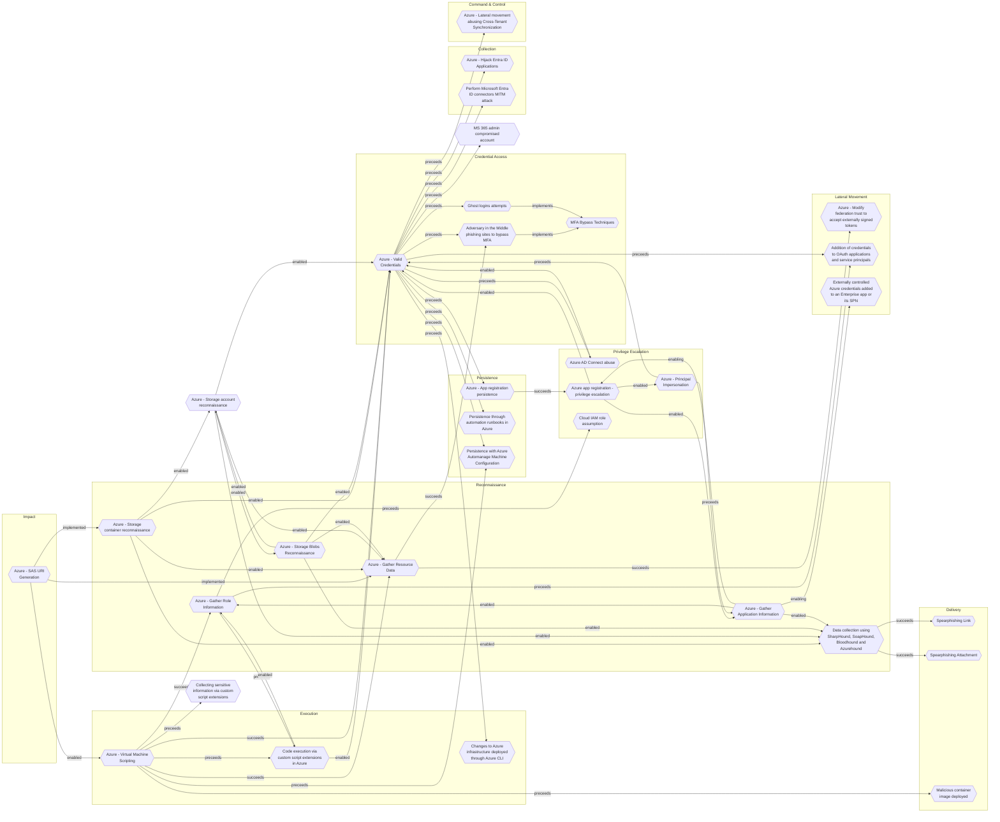

# Azure - Virtual Machine Scripting

## Metadata
| Field | Value |
| --- | --- |
| UUID | `3435c5fd-1069-40ee-ae79-54c672ce454d` |
| Schema | `threat::1.0` |
| Version | `1` |
| Created | `2025-09-03` |
| Modified | `2025-09-04` |
| TLP | clear (`TLP:CLEAR`) |
| Organisation | EC DIGIT CSOC (`56b0a0f0-b0bc-47d9-bb46-02f80ae2065a`) |

## References
### Public
- **1**: [https://microsoft.github.io/Azure-Threat-Research-Matrix/Execution/AZT301/AZT301/](https://microsoft.github.io/Azure-Threat-Research-Matrix/Execution/AZT301/AZT301/)
- **2**: [https://stratus-red-team.cloud/attack-techniques/azure/azure.execution.vm-custom-script-extension/](https://stratus-red-team.cloud/attack-techniques/azure/azure.execution.vm-custom-script-extension/)
- **3**: [https://soroganoth.com/post/research/azure_vm_security/](https://soroganoth.com/post/research/azure_vm_security/)

## Description
This threat vector refers to adversaries running scripts or commands directly 
on Azure virtual machines via built-in features, enabling malicious code execution 
and system compromise.

## Example Attack Scenario
An attacker gains access to Azure portal credentials (via phishing or leaked secrets), 
allowing privilege escalation to interact with the management plane of Azure resources. 
The attacker then uses features like **RunCommand**, **CustomScriptExtension**, 
or **Serial Console** to execute PowerShell or shell scripts directly on a targeted VM. 
For instance, leveraging **CustomScriptExtension**, the intruder injects a script 
to dump credentials, establish persistence, or exfiltrate sensitive files—all as SYSTEM user.

## Attack Goals and Impact
- The primary **goal** is to execute arbitrary commands with SYSTEM privileges, 
enabling full compromise of the VM and escalation to additional assets connected to the VM.
- **Impact** includes:
  - Data exfiltration (sensitive file theft, database dumps)
  - Persistence (deploying webshells, creating new users)
  - Lateral movement (pivoting from VM to network or cloud resources)
  - Disruption (cryptomining, ransomware deployment)
  - Evasion (disabling defenses on the VM level).

## Attack Flow and Methodology
1. The attacker identifies exposed or misconfigured Azure virtual machines, focusing 
  on accounts with management access.
2. - The attacker uses management plane operations: for example, `Microsoft.Compute/virtualMachines/runCommand/action`, 
  `Microsoft.Compute/virtualMachines/extensions/write`, or serial console access.
  - Executes malicious scripts (PowerShell, Bash) as SYSTEM.
3. - Harvests credentials, establishes persistence, or launches further attacks.
  - May leverage logging gaps to avoid detection, or clean up traces after execution.
4. - Activity can be detected via auditing specific events such as `Microsoft.Compute/virtualMachines/extensions/write` 
  or anomalous use of VM scripting features.

## Criticality
**High** - A High priority incident is likely to result in a demonstrable impact to public health or safety, national security, economic security, foreign relations, civil liberties, or public confidence.

## Terrain
Through compromised account credentials or misused RBAC permissions, adversaries 
obtains sufficient access to invoke scripting features (RunCommand, extensions).

## Surface
> **Azure**
> Microsoft Azure cloud platform

> **Windows**
> Microsoft Windows operating systems (all versions)

> **Linux**
> Linux-based operating systems (all distributions)

> **Azure::Compute::Virtual Machines**
> Azure Virtual Machines

## Threat Assessment
| Dimension | Assessment | Description |
| --- | --- | --- |
| Severity | Significant incident | A cyber attack which has a serious impact on a large organisation or on wider / local government, or which poses a considerable risk to central government or (inter)national essential services. |
| Impact | Data Breach IP Loss Reputational Damages Identity Theft | Non-public information has been accessed from the outside, and successfully extracted. Particular, key data, information and blueprint conducive to the organization capability to gain and retain a commercial or geopolitical advantage has been accessed, and their content potentially used by competitors or other adversaries. Damages to the organization public view may be achieved by using directly the access gained, or indirectly with data gathered. Acquisition of sufficient information and privileges to profess as a given individual, for the purpose of abusing and deceiving human trust relationships. |
| Leverage | Elevation of privilege Information Disclosure Infrastructure Compromise | Capacity to augment leverage over the target system by upgrading the compromised access rights Threat action intending to read a file that one was not granted access to, or to read data in transit. The compromised target is likely to be used to further expand the sphere of influence of the attacker and allow more potent vectors to be executed. |
| Viability | Likely | Probable (probably) - 55-80% |
| Kill Chain | Execution | Techniques that result in execution of attacker-controlled code on a local or remote system. |

## Actors
| Actor | ID | Source | Description |
| --- | --- | --- | --- |
| APT29 | `misp::b2056ff0-00b9-482e-b11c-c771daa5f28a` | ('misp',) | A 2015 report by F-Secure describe APT29 as: 'The Dukes are a well-resourced, highly dedicated and organized cyberespionage group that we believe has been working for the Russian Federation since at least 2008 to collect intelligence in support of foreign and security policy decision-making. The Dukes show unusual confidence in their ability to continue successfully compromising their targets, as well as in their ability to operate with impunity. The Dukes primarily target Western governments and related organizations, such as government ministries and agencies, political think tanks, and governmental subcontractors. Their targets have also included the governments of members of the Commonwealth of Independent States;Asian, African, and Middle Eastern governments;organizations associated with Chechen extremism;and Russian speakers engaged in the illicit trade of controlled substances and drugs. The Dukes are known to employ a vast arsenal of malware toolsets, which we identify as MiniDuke, CosmicDuke, OnionDuke, CozyDuke, CloudDuke, SeaDuke, HammerDuke, PinchDuke, and GeminiDuke. In recent years, the Dukes have engaged in apparently biannual large - scale spear - phishing campaigns against hundreds or even thousands of recipients associated with governmental institutions and affiliated organizations. These campaigns utilize a smash - and - grab approach involving a fast but noisy breakin followed by the rapid collection and exfiltration of as much data as possible.If the compromised target is discovered to be of value, the Dukes will quickly switch the toolset used and move to using stealthier tactics focused on persistent compromise and long - term intelligence gathering. This threat actor targets government ministries and agencies in the West, Central Asia, East Africa, and the Middle East; Chechen extremist groups; Russian organized crime; and think tanks. It is suspected to be behind the 2015 compromise of unclassified networks at the White House, Department of State, Pentagon, and the Joint Chiefs of Staff. The threat actor includes all of the Dukes tool sets, including MiniDuke, CosmicDuke, OnionDuke, CozyDuke, SeaDuke, CloudDuke (aka MiniDionis), and HammerDuke (aka Hammertoss). ' |
| [[Enterprise] Akira](https://attack.mitre.org/groups/G1024) | `att&ck::G1024` | ('att&ck',) | [Akira](https://attack.mitre.org/groups/G1024) is a ransomware variant and ransomware deployment entity active since at least March 2023.(Citation: Arctic Wolf Akira 2023) [Akira](https://attack.mitre.org/groups/G1024) uses compromised credentials to access single-factor external access mechanisms such as VPNs for initial access, then various publicly-available tools and techniques for lateral movement.(Citation: Arctic Wolf Akira 2023)(Citation: Secureworks GOLD SAHARA) [Akira](https://attack.mitre.org/groups/G1024) operations are associated with "double extortion" ransomware activity, where data is exfiltrated from victim environments prior to encryption, with threats to publish files if a ransom is not paid. Technical analysis of [Akira](https://attack.mitre.org/software/S1129) ransomware indicates variants capable of targeting Windows or VMWare ESXi hypervisors and multiple overlaps with [Conti](https://attack.mitre.org/software/S0575) ransomware.(Citation: BushidoToken Akira 2023)(Citation: CISA Akira Ransomware APR 2024)(Citation: Cisco Akira Ransomware OCT 2024) |
| APT19 | `misp::066d25c1-71bd-4bd4-8ca7-edbba00063f4` | ('misp',) | Adversary group targeting financial, technology, non-profit organisations. |
| APT28 | `misp::5b4ee3ea-eee3-4c8e-8323-85ae32658754` | ('misp',) | The Sofacy Group (also known as APT28, Pawn Storm, Fancy Bear and Sednit) is a cyber espionage group believed to have ties to the Russian government. Likely operating since 2007, the group is known to target government, military, and security organizations. It has been characterized as an advanced persistent threat. |
| APT29 | `misp::b2056ff0-00b9-482e-b11c-c771daa5f28a` | ('misp',) | A 2015 report by F-Secure describe APT29 as: 'The Dukes are a well-resourced, highly dedicated and organized cyberespionage group that we believe has been working for the Russian Federation since at least 2008 to collect intelligence in support of foreign and security policy decision-making. The Dukes show unusual confidence in their ability to continue successfully compromising their targets, as well as in their ability to operate with impunity. The Dukes primarily target Western governments and related organizations, such as government ministries and agencies, political think tanks, and governmental subcontractors. Their targets have also included the governments of members of the Commonwealth of Independent States;Asian, African, and Middle Eastern governments;organizations associated with Chechen extremism;and Russian speakers engaged in the illicit trade of controlled substances and drugs. The Dukes are known to employ a vast arsenal of malware toolsets, which we identify as MiniDuke, CosmicDuke, OnionDuke, CozyDuke, CloudDuke, SeaDuke, HammerDuke, PinchDuke, and GeminiDuke. In recent years, the Dukes have engaged in apparently biannual large - scale spear - phishing campaigns against hundreds or even thousands of recipients associated with governmental institutions and affiliated organizations. These campaigns utilize a smash - and - grab approach involving a fast but noisy breakin followed by the rapid collection and exfiltration of as much data as possible.If the compromised target is discovered to be of value, the Dukes will quickly switch the toolset used and move to using stealthier tactics focused on persistent compromise and long - term intelligence gathering. This threat actor targets government ministries and agencies in the West, Central Asia, East Africa, and the Middle East; Chechen extremist groups; Russian organized crime; and think tanks. It is suspected to be behind the 2015 compromise of unclassified networks at the White House, Department of State, Pentagon, and the Joint Chiefs of Staff. The threat actor includes all of the Dukes tool sets, including MiniDuke, CosmicDuke, OnionDuke, CozyDuke, SeaDuke, CloudDuke (aka MiniDionis), and HammerDuke (aka Hammertoss). ' |
| [[Enterprise] APT3](https://attack.mitre.org/groups/G0022) | `att&ck::G0022` | ('att&ck',) | [APT3](https://attack.mitre.org/groups/G0022) is a China-based threat group that researchers have attributed to China's Ministry of State Security.(Citation: FireEye Clandestine Wolf)(Citation: Recorded Future APT3 May 2017) This group is responsible for the campaigns known as Operation Clandestine Fox, Operation Clandestine Wolf, and Operation Double Tap.(Citation: FireEye Clandestine Wolf)(Citation: FireEye Operation Double Tap) As of June 2015, the group appears to have shifted from targeting primarily US victims to primarily political organizations in Hong Kong.(Citation: Symantec Buckeye) |
| APT32 | `misp::aa29ae56-e54b-47a2-ad16-d3ab0242d5d7` | ('misp',) | Cyber espionage actors, now designated by FireEye as APT32 (OceanLotus Group), are carrying out intrusions into private sector companies across multiple industries and have also targeted foreign governments, dissidents, and journalists. FireEye assesses that APT32 leverages a unique suite of fully-featured malware, in conjunction with commercially-available tools, to conduct targeted operations that are aligned with Vietnamese state interests. |
| APT33 | `misp::4f69ec6d-cb6b-42af-b8e2-920a2aa4be10` | ('misp',) | Our analysis reveals that APT33 is a capable group that has carried out cyber espionage operations since at least 2013. We assess APT33 works at the behest of the Iranian government. |
| [[Enterprise] APT38](https://attack.mitre.org/groups/G0082) | `att&ck::G0082` | ('att&ck',) | [APT38](https://attack.mitre.org/groups/G0082) is a North Korean state-sponsored threat group that specializes in financial cyber operations; it has been attributed to the Reconnaissance General Bureau.(Citation: CISA AA20-239A BeagleBoyz August 2020) Active since at least 2014, [APT38](https://attack.mitre.org/groups/G0082) has targeted banks, financial institutions, casinos, cryptocurrency exchanges, SWIFT system endpoints, and ATMs in at least 38 countries worldwide. Significant operations include the 2016 Bank of Bangladesh heist, during which [APT38](https://attack.mitre.org/groups/G0082) stole $81 million, as well as attacks against Bancomext (Citation: FireEye APT38 Oct 2018) and Banco de Chile (Citation: FireEye APT38 Oct 2018); some of their attacks have been destructive.(Citation: CISA AA20-239A BeagleBoyz August 2020)(Citation: FireEye APT38 Oct 2018)(Citation: DOJ North Korea Indictment Feb 2021)(Citation: Kaspersky Lazarus Under The Hood Blog 2017)  North Korean group definitions are known to have significant overlap, and some security researchers report all North Korean state-sponsored cyber activity under the name [Lazarus Group](https://attack.mitre.org/groups/G0032) instead of tracking clusters or subgroups. |
| APT39 | `misp::c2c64bd3-a325-446f-91a8-b4c0f173a30b` | ('misp',) | APT39 was created to bring together previous activities and methods used by this actor, and its activities largely align with a group publicly referred to as "Chafer." However, there are differences in what has been publicly reported due to the variances in how organizations track activity. APT39 primarily leverages the SEAWEED and CACHEMONEY backdoors along with a specific variant of the POWBAT backdoor. While APT39's targeting scope is global, its activities are concentrated in the Middle East. APT39 has prioritized the telecommunications sector, with additional targeting of the travel industry and IT firms that support it and the high-tech industry. |
| APT41 | `misp::9c124874-042d-48cd-b72b-ccdc51ecbbd6` | ('misp',) | APT41 is a prolific cyber threat group that carries out Chinese state-sponsored espionage activity in addition to financially motivated activity potentially outside of state control. |
| APT42 | `misp::35f887ad-6709-4d0b-8e9c-6b3fa09c783f` | ('misp',) | Iranian state-sponsored cyber espionage group tasked with conducting information collection and surveillance operations against individuals and organizations of strategic interest to the Iranian government. |
| APT5 | `misp::a47b79ae-7a0c-4308-9efc-294af19cc795` | ('misp',) | We have observed one APT group, which we call APT5, particularly focused on telecommunications and technology companies. More than half of the organizations we have observed being targeted or breached by APT5 operate in these sectors. Several times, APT5 has targeted organizations and personnel based in Southeast Asia. APT5 has been active since at least 2007. It appears to be a large threat group that consists of several subgroups, often with distinct tactics and infrastructure. APT5 has targeted or breached organizations across multiple industries, but its focus appears to be on telecommunications and technology companies, especially information about satellite communications.  APT5 targeted the network of an electronics firm that sells products for both industrial and military applications. The group subsequently stole communications related to the firm’s business relationship with a national military, including inventories and memoranda about specific products they provided.  In one case in late 2014, APT5 breached the network of an international telecommunications company. The group used malware with keylogging capabilities to monitor the computer of an executive who manages the company’s relationships with other telecommunications companies |
| [[Enterprise] Aquatic Panda](https://attack.mitre.org/groups/G0143) | `att&ck::G0143` | ('att&ck',) | [Aquatic Panda](https://attack.mitre.org/groups/G0143) is a suspected China-based threat group with a dual mission of intelligence collection and industrial espionage. Active since at least May 2020, [Aquatic Panda](https://attack.mitre.org/groups/G0143) has primarily targeted entities in the telecommunications, technology, and government sectors.(Citation: CrowdStrike AQUATIC PANDA December 2021) |
| [[Enterprise] BlackByte](https://attack.mitre.org/groups/G1043) | `att&ck::G1043` | ('att&ck',) | [BlackByte](https://attack.mitre.org/groups/G1043) is a ransomware threat actor operating since at least 2021. [BlackByte](https://attack.mitre.org/groups/G1043) is associated with several versions of ransomware also labeled [BlackByte Ransomware](https://attack.mitre.org/software/S1180). [BlackByte](https://attack.mitre.org/groups/G1043) ransomware operations initially used a common encryption key allowing for the development of a universal decryptor, but subsequent versions such as [BlackByte 2.0 Ransomware](https://attack.mitre.org/software/S1181) use more robust encryption mechanisms. [BlackByte](https://attack.mitre.org/groups/G1043) is notable for operations targeting critical infrastructure entities among other targets across North America.(Citation: FBI BlackByte 2022)(Citation: Picus BlackByte 2022)(Citation: Symantec BlackByte 2022)(Citation: Microsoft BlackByte 2023)(Citation: Cisco BlackByte 2024) |
| [[Enterprise] Blue Mockingbird](https://attack.mitre.org/groups/G0108) | `att&ck::G0108` | ('att&ck',) | [Blue Mockingbird](https://attack.mitre.org/groups/G0108) is a cluster of observed activity involving Monero cryptocurrency-mining payloads in dynamic-link library (DLL) form on Windows systems. The earliest observed Blue Mockingbird tools were created in December 2019.(Citation: RedCanary Mockingbird May 2020) |
| [[Enterprise] Chimera](https://attack.mitre.org/groups/G0114) | `att&ck::G0114` | ('att&ck',) | [Chimera](https://attack.mitre.org/groups/G0114) is a suspected China-based threat group that has been active since at least 2018 targeting the semiconductor industry in Taiwan as well as data from the airline industry.(Citation: Cycraft Chimera April 2020)(Citation: NCC Group Chimera January 2021) |
| Winter Vivern | `misp::b7497d28-02de-4722-8b97-1fc53e1d1b68` | ('misp',) | Winter Vivern is a cyberespionage group first revealed by DomainTools in 2021. It is thought to have been active since at least 2020 and it targets governments in Europe and Central Asia. To compromise its targets, the group uses malicious documents, phishing websites, and a custom PowerShell backdoor. |
| Turla | `misp::fa80877c-f509-4daf-8b62-20aba1635f68` | ('misp',) | A 2014 Guardian article described Turla as: 'Dubbed the Turla hackers, initial intelligence had indicated western powers were key targets, but it was later determined embassies for Eastern Bloc nations were of more interest. Embassies in Belgium, Ukraine, China, Jordan, Greece, Kazakhstan, Armenia, Poland, and Germany were all attacked, though researchers from Kaspersky Lab and Symantec could not confirm which countries were the true targets. In one case from May 2012, the office of the prime minister of a former Soviet Union member country was infected, leading to 60 further computers being affected, Symantec researchers said. There were some other victims, including the ministry for health of a Western European country, the ministry for education of a Central American country, a state electricity provider in the Middle East and a medical organisation in the US, according to Symantec. It is believed the group was also responsible for a much - documented 2008 attack on the US Central Command. The attackers - who continue to operate - have ostensibly sought to carry out surveillance on targets and pilfer data, though their use of encryption across their networks has made it difficult to ascertain exactly what the hackers took.Kaspersky Lab, however, picked up a number of the attackers searches through their victims emails, which included terms such as Nato and EU energy dialogue Though attribution is difficult to substantiate, Russia has previously been suspected of carrying out the attacks and Symantecs Gavin O’ Gorman told the Guardian a number of the hackers appeared to be using Russian names and language in their notes for their malicious code. Cyrillic was also seen in use.' |
| Thrip | `misp::98be4300-a9ef-11e8-9a95-bb9221083cfc` | ('misp',) | This threat actor targets organizations in the satellite communications, telecommunications, geospatial-imaging, and defense sectors in the United States and Southeast Asia for espionage purposes. |

## ATT&CK Techniques
| Technique | Name | Description |
| --- | --- | --- |
| `T1059` | [Command and Scripting Interpreter](https://attack.mitre.org/techniques/T1059) | Adversaries may abuse command and script interpreters to execute commands, scripts, or binaries. These interfaces and languages provide ways of interacting with computer systems and are a common feature across many different platforms. Most systems come with some built-in command-line interface and scripting capabilities, for example, macOS and Linux distributions include some flavor of [Unix Shell](https://attack.mitre.org/techniques/T1059/004) while Windows installations include the [Windows Command Shell](https://attack.mitre.org/techniques/T1059/003) and [PowerShell](https://attack.mitre.org/techniques/T1059/001).  There are also cross-platform interpreters such as [Python](https://attack.mitre.org/techniques/T1059/006), as well as those commonly associated with client applications such as [JavaScript](https://attack.mitre.org/techniques/T1059/007) and [Visual Basic](https://attack.mitre.org/techniques/T1059/005).  Adversaries may abuse these technologies in various ways as a means of executing arbitrary commands. Commands and scripts can be embedded in [Initial Access](https://attack.mitre.org/tactics/TA0001) payloads delivered to victims as lure documents or as secondary payloads downloaded from an existing C2. Adversaries may also execute commands through interactive terminals/shells, as well as utilize various [Remote Services](https://attack.mitre.org/techniques/T1021) in order to achieve remote Execution.(Citation: Powershell Remote Commands)(Citation: Cisco IOS Software Integrity Assurance - Command History)(Citation: Remote Shell Execution in Python) |
| `T1078` | [Valid Accounts](https://attack.mitre.org/techniques/T1078) | Adversaries may obtain and abuse credentials of existing accounts as a means of gaining Initial Access, Persistence, Privilege Escalation, or Defense Evasion. Compromised credentials may be used to bypass access controls placed on various resources on systems within the network and may even be used for persistent access to remote systems and externally available services, such as VPNs, Outlook Web Access, network devices, and remote desktop.(Citation: volexity_0day_sophos_FW) Compromised credentials may also grant an adversary increased privilege to specific systems or access to restricted areas of the network. Adversaries may choose not to use malware or tools in conjunction with the legitimate access those credentials provide to make it harder to detect their presence.  In some cases, adversaries may abuse inactive accounts: for example, those belonging to individuals who are no longer part of an organization. Using these accounts may allow the adversary to evade detection, as the original account user will not be present to identify any anomalous activity taking place on their account.(Citation: CISA MFA PrintNightmare)  The overlap of permissions for local, domain, and cloud accounts across a network of systems is of concern because the adversary may be able to pivot across accounts and systems to reach a high level of access (i.e., domain or enterprise administrator) to bypass access controls set within the enterprise.(Citation: TechNet Credential Theft) |
| `T1204` | [User Execution](https://attack.mitre.org/techniques/T1204) | An adversary may rely upon specific actions by a user in order to gain execution. Users may be subjected to social engineering to get them to execute malicious code by, for example, opening a malicious document file or link. These user actions will typically be observed as follow-on behavior from forms of [Phishing](https://attack.mitre.org/techniques/T1566).  While [User Execution](https://attack.mitre.org/techniques/T1204) frequently occurs shortly after Initial Access it may occur at other phases of an intrusion, such as when an adversary places a file in a shared directory or on a user's desktop hoping that a user will click on it. This activity may also be seen shortly after [Internal Spearphishing](https://attack.mitre.org/techniques/T1534).  Adversaries may also deceive users into performing actions such as:  * Enabling [Remote Access Tools](https://attack.mitre.org/techniques/T1219), allowing direct control of the system to the adversary * Running malicious JavaScript in their browser, allowing adversaries to [Steal Web Session Cookie](https://attack.mitre.org/techniques/T1539)s(Citation: Talos Roblox Scam 2023)(Citation: Krebs Discord Bookmarks 2023) * Downloading and executing malware for [User Execution](https://attack.mitre.org/techniques/T1204) * Coerceing users to copy, paste, and execute malicious code manually(Citation: Reliaquest-execution)(Citation: proofpoint-selfpwn)  For example, tech support scams can be facilitated through [Phishing](https://attack.mitre.org/techniques/T1566), vishing, or various forms of user interaction. Adversaries can use a combination of these methods, such as spoofing and promoting toll-free numbers or call centers that are used to direct victims to malicious websites, to deliver and execute payloads containing malware or [Remote Access Tools](https://attack.mitre.org/techniques/T1219).(Citation: Telephone Attack Delivery) |

## Chaining

### Chaining details
#### succeeds -> [Azure - Gather Role Information](azure-gather-role-information.md) (`140907eb-c9fb-4330-9d71-656422388b2b`) (`sequence::succeeds`)
Adversaries need to identify privileged accounts and misconfigured role 
assignments that can be exploited for privilege escalation.

- **Target UUID**: `140907eb-c9fb-4330-9d71-656422388b2b`
#### succeeds -> [Azure - Gather Resource Data](azure-gather-resource-data.md) (`b1593e0b-1b3b-462d-9ab6-21d1c136469d`) (`sequence::succeeds`)
The attacker obtains credentials (via phishing, password spray, leaked keys)
granting at least Reader access to the target Azure tenant.

- **Target UUID**: `b1593e0b-1b3b-462d-9ab6-21d1c136469d`
#### succeeds -> [Azure - Valid Credentials](azure-valid-credentials.md) (`2743bf18-3b86-4721-bf3e-153dcda0b149`) (`sequence::succeeds`)
Adversaries obtain the username and password of an AzureAD user either through
phishing, password spraying, brute-force attacks, or credentials leaked online.

- **Target UUID**: `2743bf18-3b86-4721-bf3e-153dcda0b149`
#### preceeds -> [Code execution via custom script extensions in Azure](code-execution-via-custom-script-extensions-in-azure.md) (`61ddc240-e5a6-4ca8-ae77-6b471b498913`) (`sequence::preceeds`)
Adversaries must have an Azure role that grants the ability to write or deploy 
custom script extensions on virtual machines.

- **Target UUID**: `61ddc240-e5a6-4ca8-ae77-6b471b498913`
#### preceeds -> [Persistence with Azure Automanage Machine Configuration](persistence-with-azure-automanage-machine-configuration.md) (`23f6a192-a25d-48b8-a235-7bb55e483682`) (`sequence::preceeds`)
The adversary needs the owner access role on the targeted Azure subscription to apply
the Azure Policy and grant permissions for the system-managed identities.

- **Target UUID**: `23f6a192-a25d-48b8-a235-7bb55e483682`
#### preceeds -> [Collecting sensitive information via custom script extensions](collecting-sensitive-information-via-custom-script-extensions.md) (`b954303c-0ad0-4dc0-b5ca-492c3de9cd53`) (`sequence::preceeds`)
Attackers need to gain access to an Azure account with the Virtual Machine Contributor 
role (or equivalent) can use custom script extensions to execute arbitrary code 
as SYSTEM or root on VMs.

- **Target UUID**: `b954303c-0ad0-4dc0-b5ca-492c3de9cd53`
#### preceeds -> [Malicious container image deployed](malicious-container-image-deployed.md) (`8934c19a-954b-4dce-8081-0a6acca599f6`) (`sequence::preceeds`)
The adversary need to be able to inject malicious code into container image which will be deployed in
target environment. This can be achieved by putting malicious image into public registry and tricking 
developer into using it, getting access into internal CI/CD pipeline, uploading modified image into 
internal registry or running the image directly on compromised host.

- **Target UUID**: `8934c19a-954b-4dce-8081-0a6acca599f6`
