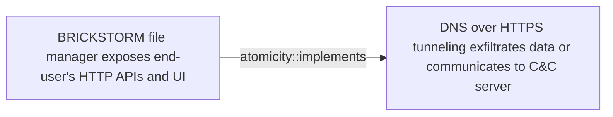

# BRICKSTORM file manager exposes end-user's HTTP APIs and UI

## Metadata

- **UUID**: `5e6af460-db12-4278-b44d-7a7a3fa7fe76`
- **Schema**: `threat::1.0`
- **Version**: `1`
- **Created**: `2025-04-23`
- **Modified**: `2025-05-20`
- **TLP**: clear (`TLP:CLEAR`)
- **Organisation**: EC DIGIT CSOC (`56b0a0f0-b0bc-47d9-bb46-02f80ae2065a`)

## References
### Public
- **1**: [https://blog.nviso.eu/wp-content/uploads/2025/04/NVISO-BRICKSTORM-Report.pdf](https://blog.nviso.eu/wp-content/uploads/2025/04/NVISO-BRICKSTORM-Report.pdf)
- **2**: [https://www.techzine.eu/news/security/130580/belgian-security-experts-find-chinese-espionage-malware-on-windows](https://www.techzine.eu/news/security/130580/belgian-security-experts-find-chinese-espionage-malware-on-windows)
- **3**: [https://b2bdaily.com/it/can-brickstorm-malware-undermine-europes-strategic-industries](https://b2bdaily.com/it/can-brickstorm-malware-undermine-europes-strategic-industries)
- **4**: [https://apt.etda.or.th/cgi-bin/listgroups.cgi?t=BRICKSTORM](https://apt.etda.or.th/cgi-bin/listgroups.cgi?t=BRICKSTORM)

## Description
One of the observed China-nexus cluster achieves their goals with
the involvement and the usage of previously unknown vulnerabilities
(a.k.a., zero-days) alongside with low-noise backdoors like `BRICKSTORM`
family.

The unauthorised access provided by `BRICKSTORM` grants attackers the
ability to execute file management and network tunneling functions
crucial for espionage. These capabilities enable them to browse file
systems, create or delete files and directories, and establish network
connections to facilitate lateral movement within the compromised
environment. Unlike many other forms of malware that create noticeable
disruptions, BRICKSTORM's operations are meticulously crafted to avoid
detection, maintaining a consistent and clandestine presence within
the target network ref [3]. 

Recently identified `BRICKSTORM` executables provide threat actors
with a file manager named `BRICKSTORM file manager`.   

The `BRICKSTORM file manager` exposes an HTTP API and rudimentary UI
(User Interface) encapsulated within the protocol. The backdoor's
JSON-based API provides a wide range of file-related actions such
as uploading, downloading, renaming, and deleting files.

Adversaries can further-more create or delete directories as well
as list their contents. The BRICKSTORM panel is served by the malware
itself and proxied through its protocol towards a Command & Control
server. Further this functionality and specific behavior allows the
adversary to select a drive they wish to browse. Once the drive is
selected, BRICKSTORM allows the adversaries to browse through the
file system and download files by their choice ref [1].

## Criticality
**High** - A High priority incident is likely to result in a demonstrable impact to public health or safety, national security, economic security, foreign relations, civil liberties, or public confidence.

## Terrain
> **A threat actor abuses publicly exposed HTTP APIs
and end-user publicly exposed UIs (User Interfaces).

Domains: Enterprise
Targets: API Endpoints, End-user, Laptop, Workstations, Public-Facing Servers, Web Application Servers
Platforms: Windows, Linux**

## Threat Assessment
| Dimension | Assessment | Description |
| --- | --- | --- |
| Severity | Localised incident | A cyber attack on an individual, or preliminary indications of cyber activity against a small or medium-sized organisation. |
| Impact | Impairement; Lose Capabilities; Operating costs | - |
| Leverage | Infrastructure Compromise; Tampering; Modify data | - |
| Viability | Likely | Probable (probably) - 55-80% |
| Kill Chain | Discovery | Techniques that allow an attacker to gain knowledge about a system and its network environment. |

## Actors
| Actor | ID | Source | Description |
| --- | --- | --- | --- |
| [[Enterprise] APT3](https://attack.mitre.org/groups/G0022) | `att&ck::G0022` | ('att&ck',) | [APT3](https://attack.mitre.org/groups/G0022) is a China-based threat group that researchers have attributed to China's Ministry of State Security.(Citation: FireEye Clandestine Wolf)(Citation: Recorded Future APT3 May 2017) This group is responsible for the campaigns known as Operation Clandestine Fox, Operation Clandestine Wolf, and Operation Double Tap.(Citation: FireEye Clandestine Wolf)(Citation: FireEye Operation Double Tap) As of June 2015, the group appears to have shifted from targeting primarily US victims to primarily political organizations in Hong Kong.(Citation: Symantec Buckeye) |
| APT3 | `misp::d144c83e-2302-4947-9e24-856fbf7949ae` | ('misp',) | Symantec described UPS in  2016 report as: 'Buckeye (also known as APT3, Gothic Panda, UPS Team, and TG-0110) is a cyberespionage group that is believed to have been operating for well over half a decade. Traditionally, the group attacked organizations in the US as well as other targets. However, Buckeyes focus appears to have changed as of June 2015, when the group began compromising political entities in Hong Kong.' |

## ATT&CK Techniques
| Technique | Name | Description |
| --- | --- | --- |
| `T1190` | [Exploit Public-Facing Application](https://attack.mitre.org/techniques/T1190) | Adversaries may attempt to exploit a weakness in an Internet-facing host or system to initially access a network. The weakness in the system can be a software bug, a temporary glitch, or a misconfiguration.  Exploited applications are often websites/web servers, but can also include databases (like SQL), standard services (like SMB or SSH), network device administration and management protocols (like SNMP and Smart Install), and any other system with Internet-accessible open sockets.(Citation: NVD CVE-2016-6662)(Citation: CIS Multiple SMB Vulnerabilities)(Citation: US-CERT TA18-106A Network Infrastructure Devices 2018)(Citation: Cisco Blog Legacy Device Attacks)(Citation: NVD CVE-2014-7169) On ESXi infrastructure, adversaries may exploit exposed OpenSLP services; they may alternatively exploit exposed VMware vCenter servers.(Citation: Recorded Future ESXiArgs Ransomware 2023)(Citation: Ars Technica VMWare Code Execution Vulnerability 2021) Depending on the flaw being exploited, this may also involve [Exploitation for Defense Evasion](https://attack.mitre.org/techniques/T1211) or [Exploitation for Client Execution](https://attack.mitre.org/techniques/T1203).  If an application is hosted on cloud-based infrastructure and/or is containerized, then exploiting it may lead to compromise of the underlying instance or container. This can allow an adversary a path to access the cloud or container APIs (e.g., via the [Cloud Instance Metadata API](https://attack.mitre.org/techniques/T1552/005)), exploit container host access via [Escape to Host](https://attack.mitre.org/techniques/T1611), or take advantage of weak identity and access management policies.  Adversaries may also exploit edge network infrastructure and related appliances, specifically targeting devices that do not support robust host-based defenses.(Citation: Mandiant Fortinet Zero Day)(Citation: Wired Russia Cyberwar)  For websites and databases, the OWASP top 10 and CWE top 25 highlight the most common web-based vulnerabilities.(Citation: OWASP Top 10)(Citation: CWE top 25) |
| `T1204` | [User Execution](https://attack.mitre.org/techniques/T1204) | An adversary may rely upon specific actions by a user in order to gain execution. Users may be subjected to social engineering to get them to execute malicious code by, for example, opening a malicious document file or link. These user actions will typically be observed as follow-on behavior from forms of [Phishing](https://attack.mitre.org/techniques/T1566).  While [User Execution](https://attack.mitre.org/techniques/T1204) frequently occurs shortly after Initial Access it may occur at other phases of an intrusion, such as when an adversary places a file in a shared directory or on a user's desktop hoping that a user will click on it. This activity may also be seen shortly after [Internal Spearphishing](https://attack.mitre.org/techniques/T1534).  Adversaries may also deceive users into performing actions such as:  * Enabling [Remote Access Tools](https://attack.mitre.org/techniques/T1219), allowing direct control of the system to the adversary * Running malicious JavaScript in their browser, allowing adversaries to [Steal Web Session Cookie](https://attack.mitre.org/techniques/T1539)s(Citation: Talos Roblox Scam 2023)(Citation: Krebs Discord Bookmarks 2023) * Downloading and executing malware for [User Execution](https://attack.mitre.org/techniques/T1204) * Coerceing users to copy, paste, and execute malicious code manually(Citation: Reliaquest-execution)(Citation: proofpoint-selfpwn)  For example, tech support scams can be facilitated through [Phishing](https://attack.mitre.org/techniques/T1566), vishing, or various forms of user interaction. Adversaries can use a combination of these methods, such as spoofing and promoting toll-free numbers or call centers that are used to direct victims to malicious websites, to deliver and execute payloads containing malware or [Remote Access Tools](https://attack.mitre.org/techniques/T1219).(Citation: Telephone Attack Delivery) |
| `T1071.001` | [Application Layer Protocol: Web Protocols](https://attack.mitre.org/techniques/T1071/001) | Adversaries may communicate using application layer protocols associated with web traffic to avoid detection/network filtering by blending in with existing traffic. Commands to the remote system, and often the results of those commands, will be embedded within the protocol traffic between the client and server.   Protocols such as HTTP/S(Citation: CrowdStrike Putter Panda) and WebSocket(Citation: Brazking-Websockets) that carry web traffic may be very common in environments. HTTP/S packets have many fields and headers in which data can be concealed. An adversary may abuse these protocols to communicate with systems under their control within a victim network while also mimicking normal, expected traffic. |
| `T1082` | [System Information Discovery](https://attack.mitre.org/techniques/T1082) | An adversary may attempt to get detailed information about the operating system and hardware, including version, patches, hotfixes, service packs, and architecture. Adversaries may use the information from [System Information Discovery](https://attack.mitre.org/techniques/T1082) during automated discovery to shape follow-on behaviors, including whether or not the adversary fully infects the target and/or attempts specific actions.  Tools such as [Systeminfo](https://attack.mitre.org/software/S0096) can be used to gather detailed system information. If running with privileged access, a breakdown of system data can be gathered through the <code>systemsetup</code> configuration tool on macOS. As an example, adversaries with user-level access can execute the <code>df -aH</code> command to obtain currently mounted disks and associated freely available space. Adversaries may also leverage a [Network Device CLI](https://attack.mitre.org/techniques/T1059/008) on network devices to gather detailed system information (e.g. <code>show version</code>).(Citation: US-CERT-TA18-106A) On ESXi servers, threat actors may gather system information from various esxcli utilities, such as `system hostname get`, `system version get`, and `storage filesystem list` (to list storage volumes).(Citation: Crowdstrike Hypervisor Jackpotting Pt 2 2021)(Citation: Varonis)  Infrastructure as a Service (IaaS) cloud providers such as AWS, GCP, and Azure allow access to instance and virtual machine information via APIs. Successful authenticated API calls can return data such as the operating system platform and status of a particular instance or the model view of a virtual machine.(Citation: Amazon Describe Instance)(Citation: Google Instances Resource)(Citation: Microsoft Virutal Machine API)  [System Information Discovery](https://attack.mitre.org/techniques/T1082) combined with information gathered from other forms of discovery and reconnaissance can drive payload development and concealment.(Citation: OSX.FairyTale)(Citation: 20 macOS Common Tools and Techniques) |
| `T1588` | [Obtain Capabilities](https://attack.mitre.org/techniques/T1588) | Adversaries may buy and/or steal capabilities that can be used during targeting. Rather than developing their own capabilities in-house, adversaries may purchase, freely download, or steal them. Activities may include the acquisition of malware, software (including licenses), exploits, certificates, and information relating to vulnerabilities. Adversaries may obtain capabilities to support their operations throughout numerous phases of the adversary lifecycle.  In addition to downloading free malware, software, and exploits from the internet, adversaries may purchase these capabilities from third-party entities. Third-party entities can include technology companies that specialize in malware and exploits, criminal marketplaces, or from individuals.(Citation: NationsBuying)(Citation: PegasusCitizenLab)  In addition to purchasing capabilities, adversaries may steal capabilities from third-party entities (including other adversaries). This can include stealing software licenses, malware, SSL/TLS and code-signing certificates, or raiding closed databases of vulnerabilities or exploits.(Citation: DiginotarCompromise) |
| `T1552` | [Unsecured Credentials](https://attack.mitre.org/techniques/T1552) | Adversaries may search compromised systems to find and obtain insecurely stored credentials. These credentials can be stored and/or misplaced in many locations on a system, including plaintext files (e.g. [Bash History](https://attack.mitre.org/techniques/T1552/003)), operating system or application-specific repositories (e.g. [Credentials in Registry](https://attack.mitre.org/techniques/T1552/002)),  or other specialized files/artifacts (e.g. [Private Keys](https://attack.mitre.org/techniques/T1552/004)).(Citation: Brining MimiKatz to Unix) |

## Chaining

### Chaining details
#### implements -> DNS over HTTPS tunneling exfiltrates data or communicates to C&C server (`atomicity::implements`)
`BRICKSTORM` espionage backdoor provides threat actors the
ability to execute file management and network tunneling
functions and in this way to manipulate files and exfiltrate
data.

- **Target UUID**: `901dd804-00cc-4034-85aa-3d10e257c16c`
