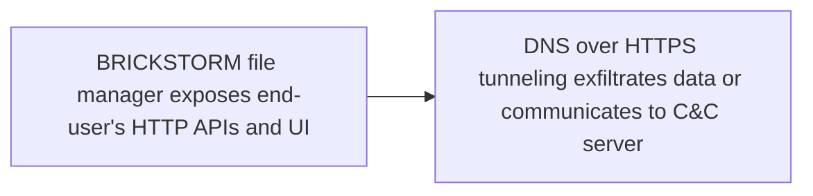

# BRICKSTORM file manager exposes end-user's HTTP APIs and UI

## Metadata

- **UUID**: `5e6af460-db12-4278-b44d-7a7a3fa7fe76`
- **Schema**: `threat::1.0`
- **TLP**: clear

## Description
One of the observed China-nexus cluster achieves their goals with
the involvement and the usage of previously unknown vulnerabilities
(a.k.a., zero-days) alongside with low-noise backdoors like `BRICKSTORM`
family.

The unauthorised access provided by `BRICKSTORM` grants attackers the
ability to execute file management and network tunneling functions
crucial for espionage. These capabilities enable them to browse file
systems, create or delete files and directories, and establish network
connections to facilitate lateral movement within the compromised
environment. Unlike many other forms of malware that create noticeable
disruptions, BRICKSTORM's operations are meticulously crafted to avoid
detection, maintaining a consistent and clandestine presence within
the target network ref [3]. 

Recently identified `BRICKSTORM` executables provide threat actors
with a file manager named `BRICKSTORM file manager`.   

The `BRICKSTORM file manager` exposes an HTTP API and rudimentary UI
(User Interface) encapsulated within the protocol. The backdoor's
JSON-based API provides a wide range of file-related actions such
as uploading, downloading, renaming, and deleting files.

Adversaries can further-more create or delete directories as well
as list their contents. The BRICKSTORM panel is served by the malware
itself and proxied through its protocol towards a Command & Control
server. Further this functionality and specific behavior allows the
adversary to select a drive they wish to browse. Once the drive is
selected, BRICKSTORM allows the adversaries to browse through the
file system and download files by their choice ref [1].

## Techniques
- T1190
- T1204
- T1071.001
- T1082
- T1588
- T1552

## Chaining

