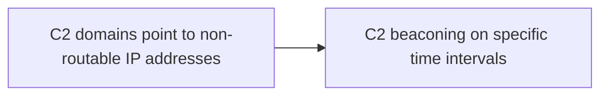

# C2 domains point to non-routable IP addresses

## Metadata

- **UUID**: `ddab407e-d09d-4804-a4af-c11213553146`
- **Schema**: `threat::1.0`
- **TLP**: clear

## Description
The attackers may configure their own C2 domain to point to a non-internet
routable address, localhost (127.0.0.1) or RFC1918 (private) IP addresses [1]. 
By doing so, the underlying IP C2 infrastructure remains hidden, allowing
the threat actor to remain undetected for longer period of time until they
decide to engage infected hosts by changing the DNS A record to point the
actual C2 server.

One of the top threat actor groups is observed to use multiple malicious
domains which are resolving to non-routable addresses (like `127.0.0.1`).
During inactive periods of time, the goal of this technique is to mask the
location of the Command and Control server. Analysis indicates attacks
predominantly occur during night hours in China, originating likely from
North America, and are precisely timed to avoid detection ref [2], [3].     

Evasion of detection - when a threat actor uses this technique, they could 
evade detection by traditional network security monitoring tools and rules, 
which typically focus on outgoing (victim network -> internet) traffic.

Avoiding C2 Indicator of Compromise (IoC) detections - when the threat actor 
has a suspicion of being detected or the C2 IP has been exposed, they may 
change the C2 domain DNS record to a non-routable one while setting up new 
infrastructure.

## Techniques
- T1568

## Chaining

