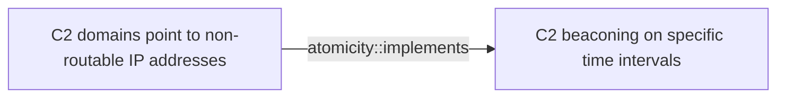

# C2 domains point to non-routable IP addresses

## Metadata

- **UUID**: `ddab407e-d09d-4804-a4af-c11213553146`
- **Schema**: `threat::1.0`
- **Version**: `1`
- **Created**: `2025-08-27`
- **Modified**: `2025-08-28`
- **TLP**: clear (`TLP:CLEAR`)
- **Organisation**: EC DIGIT CSOC (`56b0a0f0-b0bc-47d9-bb46-02f80ae2065a`)

## References
### Public
- **1**: [https://www.ctfiot.com/259781.html](https://www.ctfiot.com/259781.html)
- **2**: [https://cyberpress.org/nighteagle-apt-breaches-industrial-networks](https://cyberpress.org/nighteagle-apt-breaches-industrial-networks)
- **3**: [https://otx.alienvault.com/pulse/68684083b180ae933649d3ee](https://otx.alienvault.com/pulse/68684083b180ae933649d3ee)
- **4**: [https://www.geeksforgeeks.org/computer-networks/non-routable-address-space](https://www.geeksforgeeks.org/computer-networks/non-routable-address-space)
- **5**: [https://www.the-next-tech.com/security/non-routable-ip-addresses](https://www.the-next-tech.com/security/non-routable-ip-addresses)
- **6**: [https://www.corgi-corp.com/post/malicious-c2-domains-how-to-stomp-a-moving-target](https://www.corgi-corp.com/post/malicious-c2-domains-how-to-stomp-a-moving-target)
- **7**: [https://github.com/RedDrip7/NightEagle_Disclose/blob/main/Exclusive%20disclosure%20of%20the%20attack%20activities%20of%20the%20APT%20group%20NightEagle.pdf](https://github.com/RedDrip7/NightEagle_Disclose/blob/main/Exclusive%20disclosure%20of%20the%20attack%20activities%20of%20the%20APT%20group%20NightEagle.pdf)

## Description
The attackers may configure their own C2 domain to point to a non-internet
routable address, localhost (127.0.0.1) or RFC1918 (private) IP addresses [1]. 
By doing so, the underlying IP C2 infrastructure remains hidden, allowing
the threat actor to remain undetected for longer period of time until they
decide to engage infected hosts by changing the DNS A record to point the
actual C2 server.

One of the top threat actor groups is observed to use multiple malicious
domains which are resolving to non-routable addresses (like `127.0.0.1`).
During inactive periods of time, the goal of this technique is to mask the
location of the Command and Control server. Analysis indicates attacks
predominantly occur during night hours in China, originating likely from
North America, and are precisely timed to avoid detection ref [2], [3].     

Evasion of detection - when a threat actor uses this technique, they could 
evade detection by traditional network security monitoring tools and rules, 
which typically focus on outgoing (victim network -> internet) traffic.

Avoiding C2 Indicator of Compromise (IoC) detections - when the threat actor 
has a suspicion of being detected or the C2 IP has been exposed, they may 
change the C2 domain DNS record to a non-routable one while setting up new 
infrastructure.

## Criticality
**High** - A High priority incident is likely to result in a demonstrable impact to public health or safety, national security, economic security, foreign relations, civil liberties, or public confidence.

## Terrain
> **The threat actor needs to have control over the DNS infrastructure that
resolves the C2 domain.

Domains: Enterprise
Targets: Server Logs
Platforms: Windows, Linux, macOS**

## Threat Assessment
| Dimension | Assessment | Description |
| --- | --- | --- |
| Severity | Significant incident | A cyber attack which has a serious impact on a large organisation or on wider / local government, or which poses a considerable risk to central government or (inter)national essential services. |
| Impact | Business disruption; Impairement; Lose Capabilities | - |
| Leverage | Spoofing | Threat action aimed at accessing and use of another user’s credentials, such as username and password. |
| Viability | Likely | Probable (probably) - 55-80% |
| Kill Chain | Command & Control | Techniques that allow attackers to communicate with controlled systems within a target network. |

## Actors
| Actor | ID | Source | Description |
| --- | --- | --- | --- |
| NightEagle | `misp::1b54a3c1-023b-4a3c-8f11-50d811cced88` | ('misp',) | NightEagle is an advanced Threat Actor that targeted China's High-Tech Industry and Military Organisation, leveraging sophisticated techniques, 0 days, and specialized detection avoiding malware. The threat actor seems to have access to significant funding, with dedicated infrastructure, and focuses on low-noise, low-impact intelligence gathering operations. NightEagle is identified as a North-American, state-sponsored or affiliated group that has been active since at least 2023. |

## ATT&CK Techniques
| Technique | Name | Description |
| --- | --- | --- |
| `T1568` | [Dynamic Resolution](https://attack.mitre.org/techniques/T1568) | Adversaries may dynamically establish connections to command and control infrastructure to evade common detections and remediations. This may be achieved by using malware that shares a common algorithm with the infrastructure the adversary uses to receive the malware's communications. These calculations can be used to dynamically adjust parameters such as the domain name, IP address, or port number the malware uses for command and control.  Adversaries may use dynamic resolution for the purpose of [Fallback Channels](https://attack.mitre.org/techniques/T1008). When contact is lost with the primary command and control server malware may employ dynamic resolution as a means to reestablishing command and control.(Citation: Talos CCleanup 2017)(Citation: FireEye POSHSPY April 2017)(Citation: ESET Sednit 2017 Activity) |

## Chaining

### Chaining details
#### implements -> C2 beaconing on specific time intervals (`atomicity::implements`)
C2 beaconing on specific intervals can be a related threat vector to
additional threat actor's technique like point the C2 domain to private
IP address for obfuscation purposes.

- **Target UUID**: `7b122bb4-fc13-438b-a052-4388c501ec59`
