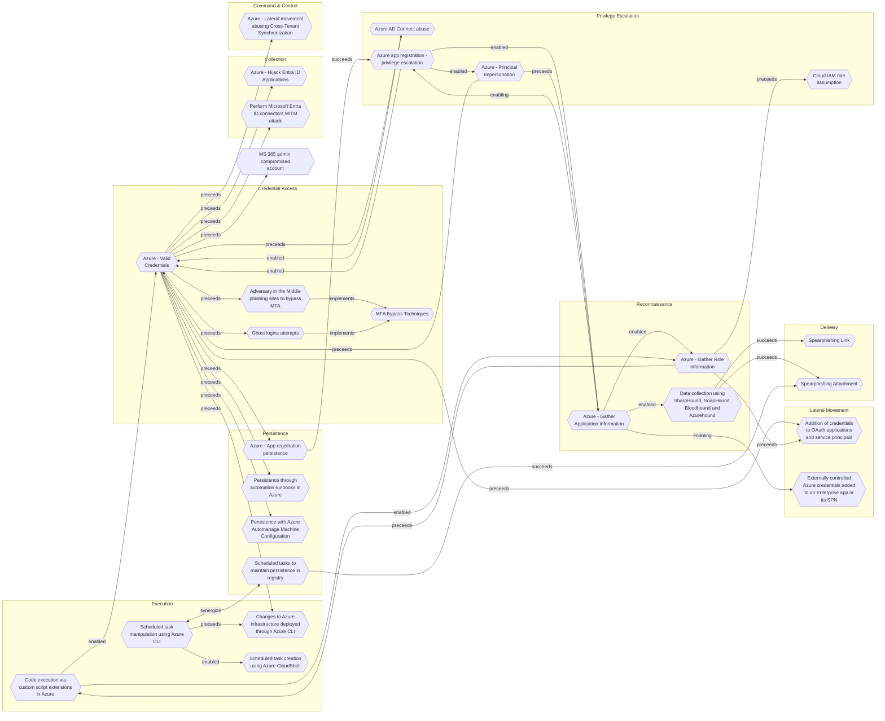

# Changes to Azure infrastructure deployed through Azure CLI

## Metadata
| Field | Value |
| --- | --- |
| UUID | `60c5b065-7d06-4697-850f-c2f80765f10b` |
| Schema | `threat::1.0` |
| Version | `1` |
| Created | `2022-12-22` |
| Modified | `2022-12-22` |
| TLP | clear (`TLP:CLEAR`) |
| Organisation | EC DIGIT CSOC (`56b0a0f0-b0bc-47d9-bb46-02f80ae2065a`) |

## References
### Public
- **1**: [https://learn.microsoft.com/en-us/cli/azure/vm/extension?view=azure-cli-latest](https://learn.microsoft.com/en-us/cli/azure/vm/extension?view=azure-cli-latest)
- **2**: [https://learn.microsoft.com/en-us/cli/azure/sentinel?view=azure-cli-latest](https://learn.microsoft.com/en-us/cli/azure/sentinel?view=azure-cli-latest)

## Description
A threat actor in control of the prerequisites may attempt to use the Azure
CLI to perform changes either to the endpoint from which the CLI is 
accessed or on remote infrastructure, user accounts, service principals, 
or configurations. 

A threat actor can only perform changes that are allowed in the scopes of
credentials, temporary credentials, or service principals that the threat 
actor has control of, barring usage of a vulnerability in Azure to allow
more than that.

## Criticality
**Baseline - Negligible** - A Baseline–Negligible priority incident is an incident that is highly unlikely to affect public health or safety, national security, economic security, foreign relations, civil liberties, or public confidence. The potential for impact, however, exists and warrants additional scrutiny.

## Terrain
A threat actor controls either privileged credentials or a service 
principal (SPN) and an endpoint from which Azure CLI can be run.

## Surface
> **Azure**
> Microsoft Azure cloud platform

> **Remote Access**
> Remote access solutions (non-VPN)

> **AWS::Storage**
> AWS storage services

> **Orchestration::Kubernetes**
> Kubernetes container orchestration platform

> **Domain Name System::DNS**
> Domain Name System resolution protocol

> **Firewalls**
> Network firewall appliances and software

> **Serverless**
> Cloud-agnostic serverless compute (when not provider-specific)

> **Entra ID**
> Microsoft Entra ID (formerly Azure Active Directory)

> **Windows::Server**
> Microsoft Windows Server editions

> **Azure::Security::Key Vault**
> Azure Key Vault secrets and key management

> **Switches**
> Network switches

> **Web Servers**
> HTTP servers and reverse proxies

> **Database Management::MongoDB**
> MongoDB NoSQL document database

> **Database Management::PostgreSQL**
> PostgreSQL open-source relational database

> **Routers**
> Network routers

> **Azure::Compute::Virtual Machines**
> Azure Virtual Machines

> **Windows::Desktop**
> Microsoft Windows desktop editions

## Threat Assessment
| Dimension | Assessment | Description |
| --- | --- | --- |
| Severity | Localised incident | A cyber attack on an individual, or preliminary indications of cyber activity against a small or medium-sized organisation. |
| Impact | Data Breach Identity Theft Impairement Lose Capabilities Nuisance Operating costs | Non-public information has been accessed from the outside, and successfully extracted. Acquisition of sufficient information and privileges to profess as a given individual, for the purpose of abusing and deceiving human trust relationships. Incapacitation of a particular key system that will cause disruptions in day-to-day operations, and eventually service delivery. Vector execution will remove key functions to the organization, which will not be easily circumvented. Most day-to-day is heavily impaired, but processes can reorganize at a loss. Small and mostly inconsequential to day to day operations, but noticed. Increased operating costs |
| Leverage | Modify configuration | Modify configuration or services |
| Viability | Almost certain | Nearly certain - 95-99% |
| Kill Chain | Execution | Techniques that result in execution of attacker-controlled code on a local or remote system. |

## ATT&CK Techniques
| Technique | Name | Description |
| --- | --- | --- |
| `T1059` | [Command and Scripting Interpreter](https://attack.mitre.org/techniques/T1059) | Adversaries may abuse command and script interpreters to execute commands, scripts, or binaries. These interfaces and languages provide ways of interacting with computer systems and are a common feature across many different platforms. Most systems come with some built-in command-line interface and scripting capabilities, for example, macOS and Linux distributions include some flavor of [Unix Shell](https://attack.mitre.org/techniques/T1059/004) while Windows installations include the [Windows Command Shell](https://attack.mitre.org/techniques/T1059/003) and [PowerShell](https://attack.mitre.org/techniques/T1059/001).  There are also cross-platform interpreters such as [Python](https://attack.mitre.org/techniques/T1059/006), as well as those commonly associated with client applications such as [JavaScript](https://attack.mitre.org/techniques/T1059/007) and [Visual Basic](https://attack.mitre.org/techniques/T1059/005).  Adversaries may abuse these technologies in various ways as a means of executing arbitrary commands. Commands and scripts can be embedded in [Initial Access](https://attack.mitre.org/tactics/TA0001) payloads delivered to victims as lure documents or as secondary payloads downloaded from an existing C2. Adversaries may also execute commands through interactive terminals/shells, as well as utilize various [Remote Services](https://attack.mitre.org/techniques/T1021) in order to achieve remote Execution.(Citation: Powershell Remote Commands)(Citation: Cisco IOS Software Integrity Assurance - Command History)(Citation: Remote Shell Execution in Python) |

## Chaining

