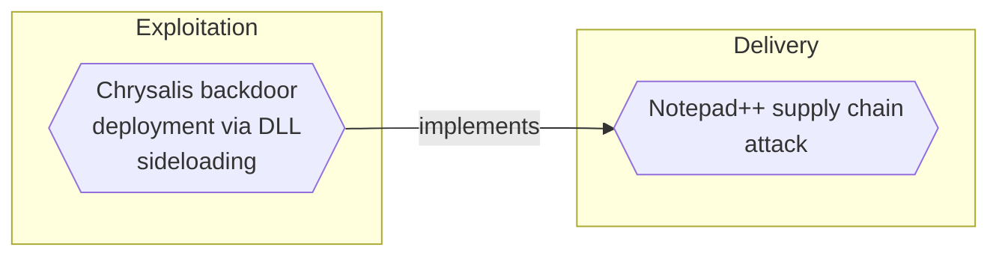
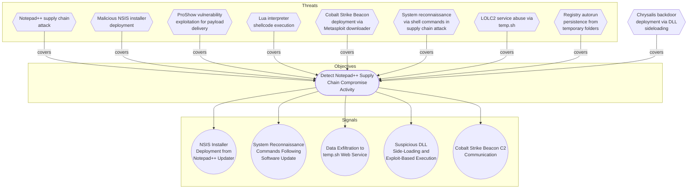

# Chrysalis backdoor deployment via DLL sideloading

## Metadata
| Field | Value |
| --- | --- |
| UUID | `bc95c747-ede2-4c16-a6b4-506b305e744a` |
| Schema | `threat::1.0` |
| Version | `1` |
| Created | `2026-02-09` |
| Modified | `2026-02-09` |
| TLP | clear (`TLP:CLEAR`) |
| Organisation | EC DIGIT CSOC (`56b0a0f0-b0bc-47d9-bb46-02f80ae2065a`) |

## References
### Public
- **1**: [https://www.rapid7.com/blog/post/2026/02/03/notepad-plus-plus-supply-chain-compromise/](https://www.rapid7.com/blog/post/2026/02/03/notepad-plus-plus-supply-chain-compromise/)
- **2**: [https://securelist.com/notepad-supply-chain-attack/115382/](https://securelist.com/notepad-supply-chain-attack/115382/)

## Description
## Executive Summary

The Chrysalis backdoor deployment represents the third and most recent infection 
chain (Chain #3) discovered in the Notepad++ supply chain attack of October 2025. 
This sophisticated malware deployment uses DLL sideloading techniques to establish 
persistent backdoor access on compromised Windows systems. The technique is commonly 
associated with Chinese-speaking threat actors according to Kaspersky research.

## Attack Chain Overview

**Infection Flow**: Malicious NSIS installer → DLL sideloading → Encrypted shellcode execution → Chrysalis backdoor

The attack begins with a malicious update delivered via the compromised Notepad++ 
update infrastructure, ultimately deploying the Chrysalis backdoor through a 
sophisticated DLL sideloading technique.

## Technical Analysis

### Delivery Mechanism

**Malicious Update URL**:
```
http://45.32.144[.]255/update/update.exe
```

The malicious updater drops files to the `%appdata%\Bluetooth\` directory, creating 
a folder structure that appears legitimate to casual inspection.

### Files Dropped to %appdata%\Bluetooth\

1. **BluetoothService.exe** (SHA1: 21a942273c14e4b9d3faa58e4de1fd4d5014a1ed)
   - Legitimate signed executable
   - Used as the host process for DLL sideloading
   - Loads log.dll when executed

2. **log.dll** (SHA1: f7910d943a013eede24ac89d6388c1b98f8b3717)
   - Malicious DLL that performs the sideloading attack
   - Decrypts and executes the BluetoothService shellcode
   - Acts as the loader for the Chrysalis backdoor

3. **BluetoothService** (SHA1: 7e0790226ea461bcc9ecd4be3c315ace41e1c122)
   - Encrypted shellcode containing the Chrysalis backdoor
   - Decrypted and executed by log.dll
   - No file extension to evade basic detection

### Execution Flow

```
Step 1: BluetoothService.exe is launched
   ↓
Step 2: BluetoothService.exe loads log.dll (DLL sideloading)
   ↓
Step 3: log.dll decrypts the BluetoothService file
   ↓
Step 4: log.dll executes the decrypted shellcode
   ↓
Step 5: Chrysalis backdoor is deployed and establishes C2 connection
```

### DLL Sideloading Technique

DLL sideloading (MITRE ATT&CK T1574.002) exploits the Windows DLL search order 
to load a malicious DLL instead of a legitimate one. In this attack:

- The legitimate BluetoothService.exe expects to load a legitimate log.dll
- The malicious log.dll is placed in the same directory as BluetoothService.exe
- Windows DLL search order causes BluetoothService.exe to load the malicious log.dll 
  from the current directory before searching system directories
- The malicious DLL executes while maintaining the appearance of legitimate process activity

This technique is effective because:
- It leverages a legitimate, often signed executable
- It evades application whitelisting that trusts the legitimate executable
- It appears as normal system activity to many security tools
- It's difficult to detect without detailed DLL load monitoring

### Command and Control Infrastructure

**Chrysalis C2 URLs** (identified by Rapid7):

```
https://api.skycloudcenter[.]com/a/chat/s/70521ddf-a2ef-4adf-9cf0-6d8e24aaa821
https://api.wiresguard[.]com/update/v1
https://api.wiresguard[.]com/api/FileUpload/submit
```

The C2 infrastructure uses HTTPS to blend with legitimate traffic and includes:
- Chat-like endpoints suggesting possible data exfiltration channels
- Update endpoints mimicking legitimate software update patterns
- File upload capabilities for data exfiltration

## Indicators of Compromise (IOCs)

### File Hashes (SHA1)

**Primary Attack Chain**:
```
21a942273c14e4b9d3faa58e4de1fd4d5014a1ed - BluetoothService.exe (legitimate, abused)
f7910d943a013eede24ac89d6388c1b98f8b3717 - log.dll (malicious)
7e0790226ea461bcc9ecd4be3c315ace41e1c122 - BluetoothService shellcode (malicious)
```

**Additional Malicious File Hashes** (identified by Rapid7):
```
d7ffd7b588880cf61b603346a3557e7cce648c93
94dffa9de5b665dc51bc36e2693b8a3a0a4cc6b8
73d9d0139eaf89b7df34ceeb60e5f8c7cd2463bf
bd4915b3597942d88f319740a9b803cc51585c4a
c68d09dd50e357fd3de17a70b7724f8949441d77
813ace987a61af909c053607635489ee984534f4
9fbf2195dee991b1e5a727fd51391dcc2d7a4b16
07d2a01e1dc94d59d5ca3bdf0c7848553ae91a51
3090ecf034337857f786084fb14e63354e271c5d
d0662eadbe5ba92acbd3485d8187112543bcfbf5
9c0eff4deeb626730ad6a05c85eb138df48372ce
```

### Network Indicators

**Malicious Update Server**:
```
45.32.144.255
```

**C2 Domains**:
```
api.skycloudcenter[.]com
api.wiresguard[.]com
```

### File System Indicators

**Malicious File Paths**:
```
%appdata%\Bluetooth\BluetoothService.exe
%appdata%\Bluetooth\log.dll
%appdata%\Bluetooth\BluetoothService
```

## Detection Opportunities

### 1. File System Monitoring
- Monitor for file creation in `%appdata%\Bluetooth\` directory
- Alert on creation of BluetoothService.exe, log.dll, or BluetoothService files
- Watch for files without extensions in %appdata% directories

### 2. DLL Loading Monitoring
- Monitor BluetoothService.exe for loading log.dll from non-standard locations
- Alert on DLL loading from %appdata% directories by system-like processes
- Detect DLL loads where the DLL path matches the executable directory

### 3. Process Monitoring
- Monitor for BluetoothService.exe execution from %appdata% directory
- Alert on processes loading encrypted or obfuscated content
- Detect shellcode injection or execution patterns

### 4. Network Monitoring
- Block/alert on connections to known C2 domains (skycloudcenter[.]com, wiresguard[.]com)
- Monitor for HTTPS connections to suspicious cloud-like domains
- Detect unusual outbound connections from Bluetooth-related processes

### 5. Behavioral Detection
- Monitor for legitimate executables spawning from %appdata% directories
- Alert on encryption/decryption activities in memory
- Detect process injection techniques (T1055)

### 6. Hash-Based Detection
- Scan for known malicious file hashes listed in IOCs
- Monitor file creation events and hash new files against IOC database

## Mitigation Recommendations

### Immediate Actions

1. **Hunt for Compromise**:
   - Search all endpoints for files in `%appdata%\Bluetooth\` directory
   - Scan for presence of IOC file hashes
   - Review network logs for connections to C2 infrastructure

2. **Isolate Infected Systems**:
   - Immediately isolate any systems with positive IOC hits
   - Perform full forensic imaging before remediation
   - Analyze for lateral movement and additional compromise

3. **Block Network Indicators**:
   - Block all connections to C2 domains and IPs at network perimeter
   - Block access to malicious update URL (45.32.144.255)
   - Monitor for alternate C2 infrastructure attempts

4. **Verify Notepad++ Installation**:
   - Check Notepad++ installation integrity on all systems
   - Verify update history and sources
   - Reinstall from official sources if any doubt exists

### Long-term Measures

1. **DLL Loading Protection**:
   - Enable Windows Defender Application Control (WDAC) or AppLocker
   - Configure DLL restrictions to prevent loading from user-writable directories
   - Implement DLL signature verification requirements

2. **Application Whitelisting**:
   - Deploy application control to prevent unauthorized executable execution
   - Whitelist only approved executables from %appdata% if absolutely necessary
   - Monitor and alert on whitelist exceptions

3. **Enhanced Monitoring**:
   - Deploy EDR solutions with DLL loading visibility
   - Implement memory scanning for encrypted/obfuscated payloads
   - Enable Sysmon or equivalent with DLL loading events (Event ID 7)

4. **Software Supply Chain Security**:
   - Verify digital signatures on all software updates
   - Use internal software repositories with integrity checking
   - Implement software composition analysis tools

5. **Network Segmentation**:
   - Segment networks to limit lateral movement capabilities
   - Implement zero-trust architecture where possible
   - Restrict outbound connections from workstations

## MITRE ATT&CK Mapping

### T1574.002 - Hijack Execution Flow: DLL Side-Loading
The primary technique used in this attack. The malicious log.dll is loaded by the 
legitimate BluetoothService.exe, hijacking the execution flow to load the Chrysalis 
backdoor.

**Detection**: Monitor DLL loads, particularly from user-writable directories. Use 
Sysmon Event ID 7 (Image loaded) to track DLL loading events.

### T1071 - Application Layer Protocol
The Chrysalis backdoor uses HTTPS for C2 communications, blending with legitimate 
web traffic to evade network-based detection.

**Detection**: Monitor for unusual HTTPS connections to cloud-like domains, 
particularly from system-like processes. Analyze TLS certificates and connection patterns.

### T1055 - Process Injection
The log.dll decrypts and executes shellcode, injecting the Chrysalis backdoor into 
the running process memory.

**Detection**: Monitor for suspicious memory allocation and code injection patterns. 
Use EDR tools capable of detecting memory manipulation.

### T1027 - Obfuscated Files or Information
The BluetoothService file contains encrypted shellcode, requiring decryption before 
execution to evade static analysis and detection.

**Detection**: Monitor for encryption/decryption operations in memory. Scan for 
files without extensions or with unusual entropy patterns.

## Attribution and Context

According to Kaspersky research, DLL sideloading techniques are commonly employed 
by Chinese-speaking threat actors. The sophistication of the Chrysalis backdoor, 
combined with the successful compromise of the Notepad++ supply chain, suggests 
a well-resourced threat actor with significant capabilities.

The deployment of Chrysalis as the third infection chain (October 2025) indicates 
the attackers were evolving their techniques and developing new capabilities 
throughout the six-month active operation period.

## References

- Rapid7: "Notepad++ Supply Chain Compromise Analysis" (February 2026)
- Kaspersky Securelist: "Notepad++ Supply Chain Attack" (February 2026)

## Critical Risk Factors

This threat vector demonstrates:
- **Advanced Evasion**: Use of legitimate signed executables for malicious purposes
- **Encryption**: Shellcode encryption to evade static detection
- **Persistence**: Backdoor deployment ensures long-term access
- **Attribution Markers**: Techniques consistent with known APT tradecraft
- **Supply Chain Vector**: Delivered via compromised legitimate software updates

Organizations affected by the Notepad++ supply chain attack should treat this as a 
**CRITICAL** threat requiring immediate investigation, containment, and remediation.

## Criticality
**Severe** - A Severe priority incident is likely to result in a significant impact to public health or safety, national security, economic security, foreign relations, or civil liberties.

## Terrain
Organizations and individuals who were compromised through the Notepad++ supply 
chain attack (October 2025). The attack specifically targeted victims across 
multiple countries including Vietnam, El Salvador, Australia, and Philippines, 
affecting government agencies, financial services, IT service providers, and 
individual developers. The malicious files were deployed to Windows systems via 
compromised software updates.

## Surface
> **Windows::Desktop**
> Microsoft Windows desktop editions

## Threat Assessment
| Dimension | Assessment | Description |
| --- | --- | --- |
| Severity | Highly significant incident | A cyber attack which has a serious impact on central government, (inter)national essential services, a large proportion of the (inter)national population, or the (inter)national economy. |
| Impact | Data Breach<br>Business disruption<br>Reputational Damages<br>Legal and regulatory<br>Monetary Loss | Non-public information has been accessed from the outside, and successfully extracted.<br>Business disruption<br>Damages to the organization public view may be achieved by using directly the access gained, or indirectly with data gathered.<br>Legal and regulatory costs<br>The vector will directly conduct to loss of value directly impacting the bottom line. |
| Leverage | Elevation of privilege<br>Tampering<br>Information Disclosure<br>Repudiation | Capacity to augment leverage over the target system by upgrading the compromised access rights<br>Threat action intending to maliciously change or modify persistent data, such as records in a database, and the alteration of data in transit between two computers over an open network, such as the Internet.<br>Threat action intending to read a file that one was not granted access to, or to read data in transit.<br>Threat action aimed at performing prohibited operations in a system that lacks the ability to trace the operations. |
| Viability | Almost certain | Nearly certain - 95-99% |
| Kill Chain | Exploitation | Techniques to exploit vulnerabilities in systems that may, amongst others, result in code execution. |

## ATT&CK Techniques
| Technique | Name | Description |
| --- | --- | --- |
| `T1574` | [Hijack Execution Flow](https://attack.mitre.org/techniques/T1574) | Adversaries may execute their own malicious payloads by hijacking the way operating systems run programs. Hijacking execution flow can be for the purposes of persistence, since this hijacked execution may reoccur over time. Adversaries may also use these mechanisms to elevate privileges or evade defenses, such as application control or other restrictions on execution.  There are many ways an adversary may hijack the flow of execution, including by manipulating how the operating system locates programs to be executed. How the operating system locates libraries to be used by a program can also be intercepted. Locations where the operating system looks for programs/resources, such as file directories and in the case of Windows the Registry, could also be poisoned to include malicious payloads. |
| `T1071` | [Application Layer Protocol](https://attack.mitre.org/techniques/T1071) | Adversaries may communicate using OSI application layer protocols to avoid detection/network filtering by blending in with existing traffic. Commands to the remote system, and often the results of those commands, will be embedded within the protocol traffic between the client and server.   Adversaries may utilize many different protocols, including those used for web browsing, transferring files, electronic mail, DNS, or publishing/subscribing. For connections that occur internally within an enclave (such as those between a proxy or pivot node and other nodes), commonly used protocols are SMB, SSH, or RDP.(Citation: Mandiant APT29 Eye Spy Email Nov 22) |
| `T1055` | [Process Injection](https://attack.mitre.org/techniques/T1055) | Adversaries may inject code into processes in order to evade process-based defenses as well as possibly elevate privileges. Process injection is a method of executing arbitrary code in the address space of a separate live process. Running code in the context of another process may allow access to the process's memory, system/network resources, and possibly elevated privileges. Execution via process injection may also evade detection from security products since the execution is masked under a legitimate process.   There are many different ways to inject code into a process, many of which abuse legitimate functionalities. These implementations exist for every major OS but are typically platform specific.   More sophisticated samples may perform multiple process injections to segment modules and further evade detection, utilizing named pipes or other inter-process communication (IPC) mechanisms as a communication channel. |
| `T1027` | [Obfuscated Files or Information](https://attack.mitre.org/techniques/T1027) | Adversaries may attempt to make an executable or file difficult to discover or analyze by encrypting, encoding, or otherwise obfuscating its contents on the system or in transit. This is common behavior that can be used across different platforms and the network to evade defenses.   Payloads may be compressed, archived, or encrypted in order to avoid detection. These payloads may be used during Initial Access or later to mitigate detection. Sometimes a user's action may be required to open and [Deobfuscate/Decode Files or Information](https://attack.mitre.org/techniques/T1140) for [User Execution](https://attack.mitre.org/techniques/T1204). The user may also be required to input a password to open a password protected compressed/encrypted file that was provided by the adversary. (Citation: Volexity PowerDuke November 2016) Adversaries may also use compressed or archived scripts, such as JavaScript.   Portions of files can also be encoded to hide the plain-text strings that would otherwise help defenders with discovery. (Citation: Linux/Cdorked.A We Live Security Analysis) Payloads may also be split into separate, seemingly benign files that only reveal malicious functionality when reassembled. (Citation: Carbon Black Obfuscation Sept 2016)  Adversaries may also abuse [Command Obfuscation](https://attack.mitre.org/techniques/T1027/010) to obscure commands executed from payloads or directly via [Command and Scripting Interpreter](https://attack.mitre.org/techniques/T1059). Environment variables, aliases, characters, and other platform/language specific semantics can be used to evade signature based detections and application control mechanisms. (Citation: FireEye Obfuscation June 2017) (Citation: FireEye Revoke-Obfuscation July 2017)(Citation: PaloAlto EncodedCommand March 2017) |

## Chaining

### Chaining details
#### implements -> [Notepad++ supply chain attack](notepad-supply-chain-attack.md) (`8b7cae6f-b6cf-4414-9cdc-fe8c8ee7ee22`) (`atomicity::implements`)
This threat vector represents Chain #3 of the Notepad++ supply chain attack. 
The Chrysalis backdoor deployment was one of three distinct infection chains 
used by attackers who compromised the Notepad++ update infrastructure between 
June and December 2025.

- **Target UUID**: `8b7cae6f-b6cf-4414-9cdc-fe8c8ee7ee22`

## Coverage

## Related objects
| Type | Name | Direction | Relation |
| --- | --- | --- | --- |
| Objective | [Detect Notepad++ Supply Chain Compromise Activity](../Objectives/detect-notepad-supply-chain-compromise-activity.md) (`3e8b5d7f-9c2a-4f6e-8b1d-7a4c9e3f6b2d`) | Downstream | objective |
| Signal | [System Reconnaissance Commands Following Software Update](../Objectives/detect-notepad-supply-chain-compromise-activity.md#system-reconnaissance-commands-following-software-update) (`2f7c9b4e-8d3a-4e6f-9b1c-7a5d8e2f4b6c`) | Downstream | signal |
| Signal | [Suspicious DLL Side-Loading and Exploit-Based Execution](../Objectives/detect-notepad-supply-chain-compromise-activity.md#suspicious-dll-side-loading-and-exploit-based-execution) (`4e7b9d3f-6c2a-4e8f-9b1d-7a5c8e3f6b2d`) | Downstream | signal |
| Signal | [Data Exfiltration to temp.sh Web Service](../Objectives/detect-notepad-supply-chain-compromise-activity.md#data-exfiltration-to-temp-sh-web-service) (`6c9f3e7b-4d2a-4e8f-9b6d-3a7c5e1f8b4d`) | Downstream | signal |
| Signal | [NSIS Installer Deployment from Notepad++ Updater](../Objectives/detect-notepad-supply-chain-compromise-activity.md#nsis-installer-deployment-from-notepad-updater) (`8d4f6b2e-9c7a-4e1f-8b3d-6a9c5e7f2b4d`) | Downstream | signal |
| Signal | [Cobalt Strike Beacon C2 Communication](../Objectives/detect-notepad-supply-chain-compromise-activity.md#cobalt-strike-beacon-c2-communication) (`9b6e4d8f-7c3a-4e2f-8b1d-6a9c5e7f3b4d`) | Downstream | signal |
