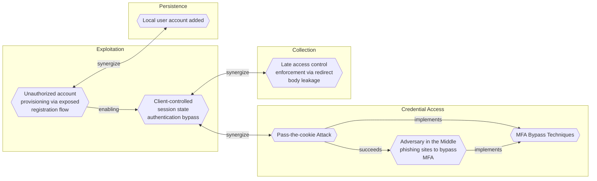
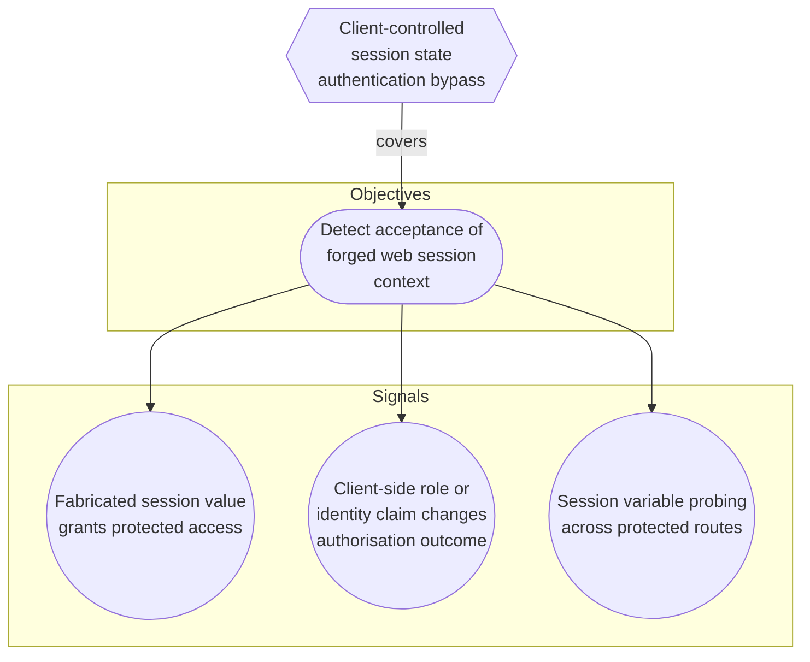

# Client-controlled session state authentication bypass

## Metadata
| Field | Value |
| --- | --- |
| UUID | `38adba1e-0961-4417-bd84-33fa9c42439f` |
| Schema | `threat::1.0` |
| Version | `2` |
| Created | `2026-05-04` |
| Modified | `2026-05-04` |
| TLP | clear (`TLP:CLEAR`) |
| Contributors | Hold Security Threat Research |
| Organisation | EC DIGIT CSOC (`56b0a0f0-b0bc-47d9-bb46-02f80ae2065a`) |

## References
### Public
- **1**: [https://owasp.org/Top10/A01_2021-Broken_Access_Control/](https://owasp.org/Top10/A01_2021-Broken_Access_Control/)
- **2**: [https://owasp.org/Top10/A07_2021-Identification_and_Authentication_Failures/](https://owasp.org/Top10/A07_2021-Identification_and_Authentication_Failures/)
- **3**: [https://cwe.mitre.org/data/definitions/565.html](https://cwe.mitre.org/data/definitions/565.html)
- **4**: [https://cwe.mitre.org/data/definitions/287.html](https://cwe.mitre.org/data/definitions/287.html)
- **5**: [https://cwe.mitre.org/data/definitions/602.html](https://cwe.mitre.org/data/definitions/602.html)

## Description
An adversary bypasses authentication or authorisation by injecting or modifying client-controlled
session state in HTTP requests. The application treats cookies, Authorization headers, or other
request variables as trusted authentication context even when values are arbitrary, unsigned, or
user-controlled.

Typical vulnerable logic checks whether a value is present, whether a simple string equals an
expected flag such as Login=true, or whether an identifier such as AppUsername=Admin is supplied.
The server does not verify that the value was issued by the application, bound to a server-side
session, signed, protected by HMAC, or validated as a JWT or equivalent token. As a result, a
crafted request can be treated as an authenticated or privileged session.

Exploitation is low complexity. The adversary compares behaviour with no cookies or headers,
then resends the same request with injected or modified values. Indicators include access granted
after arbitrary values are supplied, privilege changes after cookie modification, or different
protected content returned based only on client-controlled values. The issue can be systemic
because the same flawed session handling is reused across endpoints, roles, or application modules.

The threat should be confirmed by before/after request evidence showing authentication bypass,
authorisation bypass, or privilege escalation through crafted cookies or headers. Severity depends
on whether the trusted fields represent identity, role, login state, or access flags, and on the
breadth of affected endpoints.

## Criticality
**High** - A High priority incident is likely to result in a demonstrable impact to public health or safety, national security, economic security, foreign relations, civil liberties, or public confidence.

## Terrain
External web applications that derive authentication or authorisation state from client-supplied
cookies, Authorization headers, or other request variables without strong server-side validation.
The vulnerable terrain may be shared middleware or framework logic rather than a single
endpoint. The server accepts the presence of values, simple strings, usernames, role flags, or
fabricated bearer values instead of verifying cryptographic integrity, server-issued session
binding, token signature, expiry, and privilege state.

## Surface
> **Web Servers**
> HTTP servers and reverse proxies

> **Application Layer::HTTP**
> Hypertext Transfer Protocol

> **OAuth / OIDC**
> OAuth 2.0 and OpenID Connect authorisation/authentication protocols

## Threat Assessment
| Dimension | Assessment | Description |
| --- | --- | --- |
| Severity | Substantial incident | A cyber attack which has a serious impact on a medium-sized organisation, or which poses a considerable risk to a large organisation or wider / local government. |
| Impact | Data Breach Identity Theft Business disruption Legal and regulatory | Non-public information has been accessed from the outside, and successfully extracted. Acquisition of sufficient information and privileges to profess as a given individual, for the purpose of abusing and deceiving human trust relationships. Business disruption Legal and regulatory costs |
| Leverage | Spoofing Elevation of privilege Information Disclosure | Threat action aimed at accessing and use of another user’s credentials, such as username and password. Capacity to augment leverage over the target system by upgrading the compromised access rights Threat action intending to read a file that one was not granted access to, or to read data in transit. |
| Viability | Likely | Probable (probably) - 55-80% |
| Kill Chain | Exploitation | Techniques to exploit vulnerabilities in systems that may, amongst others, result in code execution. |

## ATT&CK Techniques
| Technique | Name | Description |
| --- | --- | --- |
| `T1190` | [Exploit Public-Facing Application](https://attack.mitre.org/techniques/T1190) | Adversaries may attempt to exploit a weakness in an Internet-facing host or system to initially access a network. The weakness in the system can be a software bug, a temporary glitch, or a misconfiguration.  Exploited applications are often websites/web servers, but can also include databases (like SQL), standard services (like SMB or SSH), network device administration and management protocols (like SNMP and Smart Install), and any other system with Internet-accessible open sockets.(Citation: NVD CVE-2016-6662)(Citation: CIS Multiple SMB Vulnerabilities)(Citation: US-CERT TA18-106A Network Infrastructure Devices 2018)(Citation: Cisco Blog Legacy Device Attacks)(Citation: NVD CVE-2014-7169) On ESXi infrastructure, adversaries may exploit exposed OpenSLP services; they may alternatively exploit exposed VMware vCenter servers.(Citation: Recorded Future ESXiArgs Ransomware 2023)(Citation: Ars Technica VMWare Code Execution Vulnerability 2021) Depending on the flaw being exploited, this may also involve [Exploitation for Defense Evasion](https://attack.mitre.org/techniques/T1211) or [Exploitation for Client Execution](https://attack.mitre.org/techniques/T1203).  If an application is hosted on cloud-based infrastructure and/or is containerized, then exploiting it may lead to compromise of the underlying instance or container. This can allow an adversary a path to access the cloud or container APIs (e.g., via the [Cloud Instance Metadata API](https://attack.mitre.org/techniques/T1552/005)), exploit container host access via [Escape to Host](https://attack.mitre.org/techniques/T1611), or take advantage of weak identity and access management policies.  Adversaries may also exploit edge network infrastructure and related appliances, specifically targeting devices that do not support robust host-based defenses.(Citation: Mandiant Fortinet Zero Day)(Citation: Wired Russia Cyberwar)  For websites and databases, the OWASP top 10 and CWE top 25 highlight the most common web-based vulnerabilities.(Citation: OWASP Top 10)(Citation: CWE top 25) |

## Chaining

### Chaining details
#### synergize -> [Pass-the-cookie Attack](pass-the-cookie-attack.md) (`b0d6bf74-b204-4a48-9509-4499ed795771`) (`support::synergize`)
Both vectors abuse web session trust. Pass-the-cookie reuses a valid stolen session token,
while this vector fabricates or alters weak client-controlled session values. Detection and
hardening should therefore consider cookie and header integrity together.

- **Target UUID**: `b0d6bf74-b204-4a48-9509-4499ed795771`
#### synergize -> [Late access control enforcement via redirect body leakage](late-access-control-enforcement-via-redirect-body-leakage.md) (`0663c192-cdeb-49a2-994c-4cc8e98f764e`) (`support::synergize`)
Both vectors expose systemic web access-control failures. Differential HTTP testing across
unauthenticated, injected, and modified state can reveal either leaked protected content or
client-controlled authentication decisions.

- **Target UUID**: `0663c192-cdeb-49a2-994c-4cc8e98f764e`

## Coverage

## Related objects
| Type | Name | Direction | Relation |
| --- | --- | --- | --- |
| Objective | [Detect acceptance of forged web session context](../Objectives/detect-acceptance-of-forged-web-session-context.md) (`d4c509d7-f9ab-452a-a91d-4da040095414`) | Downstream | objective |
| Signal | [Session variable probing across protected routes](../Objectives/detect-acceptance-of-forged-web-session-context.md#session-variable-probing-across-protected-routes) (`7ff9ea94-7bf4-4df5-83f1-7d3dc0174653`) | Downstream | signal |
| Signal | [Fabricated session value grants protected access](../Objectives/detect-acceptance-of-forged-web-session-context.md#fabricated-session-value-grants-protected-access) (`9ba566b6-bfed-4059-bdb1-50bb3cac3c29`) | Downstream | signal |
| Signal | [Client-side role or identity claim changes authorisation outcome](../Objectives/detect-acceptance-of-forged-web-session-context.md#client-side-role-or-identity-claim-changes-authorisation-outcome) (`9bfe87d7-c197-4893-b7e1-829ab6d1fcf5`) | Downstream | signal |
