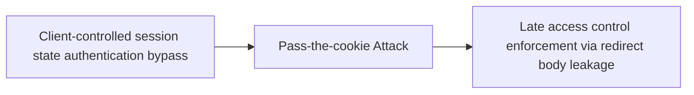
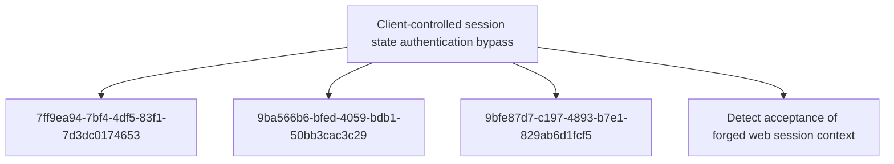

# Client-controlled session state authentication bypass

## Metadata

- **UUID**: `38adba1e-0961-4417-bd84-33fa9c42439f`
- **Schema**: `threat::1.0`
- **TLP**: clear

## Description
An adversary bypasses authentication or authorisation by injecting or modifying client-controlled
session state in HTTP requests. The application treats cookies, Authorization headers, or other
request variables as trusted authentication context even when values are arbitrary, unsigned, or
user-controlled.

Typical vulnerable logic checks whether a value is present, whether a simple string equals an
expected flag such as Login=true, or whether an identifier such as AppUsername=Admin is supplied.
The server does not verify that the value was issued by the application, bound to a server-side
session, signed, protected by HMAC, or validated as a JWT or equivalent token. As a result, a
crafted request can be treated as an authenticated or privileged session.

Exploitation is low complexity. The adversary compares behaviour with no cookies or headers,
then resends the same request with injected or modified values. Indicators include access granted
after arbitrary values are supplied, privilege changes after cookie modification, or different
protected content returned based only on client-controlled values. The issue can be systemic
because the same flawed session handling is reused across endpoints, roles, or application modules.

The threat should be confirmed by before/after request evidence showing authentication bypass,
authorisation bypass, or privilege escalation through crafted cookies or headers. Severity depends
on whether the trusted fields represent identity, role, login state, or access flags, and on the
breadth of affected endpoints.

## Techniques
- T1190

## Chaining

## Relations

