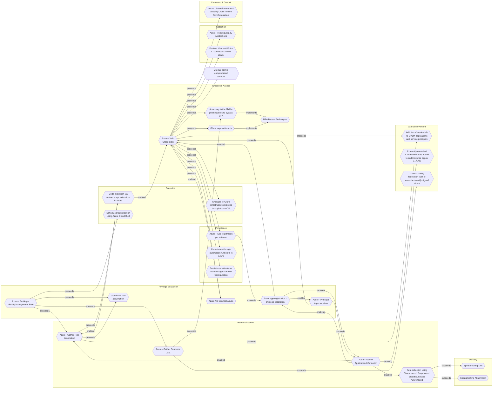

# Cloud IAM role assumption

## Metadata
| Field | Value |
| --- | --- |
| UUID | `f1dc4341-eb45-4d07-8075-b1a6b227cc76` |
| Schema | `threat::1.0` |
| Version | `2` |
| Created | `2022-05-19` |
| Modified | `2025-01-01` |
| TLP | clear (`TLP:CLEAR`) |
| Organisation | EC DIGIT CSOC (`56b0a0f0-b0bc-47d9-bb46-02f80ae2065a`) |

## References
### Public
- **1**: [https://sysdig.com/blog/lateral-movement-cloud-containers/#:~:text=Lateral%20movement%20is%20a%20growing,serve%20as%20an%20entry%20point.](https://sysdig.com/blog/lateral-movement-cloud-containers/#:~:text=Lateral%20movement%20is%20a%20growing,serve%20as%20an%20entry%20point.)
- **2**: [https://hackingthe.cloud/aws/exploitation/iam_privilege_escalation/#iamattachrolepolicy](https://hackingthe.cloud/aws/exploitation/iam_privilege_escalation/#iamattachrolepolicy)

## Description
Once adversaries gained a set of creentials, they will
try to discover and leverage identity policies to increase their
control over the infrastructure. This is especially the case for
instance credentials, which can be stolen through exploitation.

Changing roles will allow the adversary to assume a
more powerful role, escalate privileges and eventually move further
in the cloud to achieve objectives. This can be particularly
impactful if cross account roles are leveraged.

## Criticality
**Severe** - A Severe priority incident is likely to result in a significant impact to public health or safety, national security, economic security, foreign relations, or civil liberties.

## Terrain
Adversaries will have already compromised some cloud credentials,
and now aim at escalating privileges while moving laterally.
The credentials they gained access to also must have sufficient
privileges to allow role assumption.

## Surface
> **AWS::Security::IAM**
> AWS Identity and Access Management

> **Azure::Security::Entra ID**
> Microsoft Entra ID in Azure (cloud identity)

> **Container Runtime::Docker**
> Docker Engine container runtime

> **Azure::Compute::Virtual Machines**
> Azure Virtual Machines

## Threat Assessment
| Dimension | Assessment | Description |
| --- | --- | --- |
| Severity | Substantial incident | A cyber attack which has a serious impact on a medium-sized organisation, or which poses a considerable risk to a large organisation or wider / local government. |
| Impact | Data Breach | Non-public information has been accessed from the outside, and successfully extracted. |
| Leverage | Modify privileges | Modify privileges or permissions |
| Viability | Likely | Probable (probably) - 55-80% |
| Kill Chain | Privilege Escalation | The result of techniques that provide an attacker with higher permissions on a system or network. |

## Actors
| Actor | ID | Source | Description |
| --- | --- | --- | --- |
| [[Enterprise] APT29](https://attack.mitre.org/groups/G0016) | `att&ck::G0016` | ('att&ck',) | [APT29](https://attack.mitre.org/groups/G0016) is threat group that has been attributed to Russia's Foreign Intelligence Service (SVR).(Citation: White House Imposing Costs RU Gov April 2021)(Citation: UK Gov Malign RIS Activity April 2021) They have operated since at least 2008, often targeting government networks in Europe and NATO member countries, research institutes, and think tanks. [APT29](https://attack.mitre.org/groups/G0016) reportedly compromised the Democratic National Committee starting in the summer of 2015.(Citation: F-Secure The Dukes)(Citation: GRIZZLY STEPPE JAR)(Citation: Crowdstrike DNC June 2016)(Citation: UK Gov UK Exposes Russia SolarWinds April 2021)  In April 2021, the US and UK governments attributed the [SolarWinds Compromise](https://attack.mitre.org/campaigns/C0024) to the SVR; public statements included citations to [APT29](https://attack.mitre.org/groups/G0016), Cozy Bear, and The Dukes.(Citation: NSA Joint Advisory SVR SolarWinds April 2021)(Citation: UK NSCS Russia SolarWinds April 2021) Industry reporting also referred to the actors involved in this campaign as UNC2452, NOBELIUM, StellarParticle, Dark Halo, and SolarStorm.(Citation: FireEye SUNBURST Backdoor December 2020)(Citation: MSTIC NOBELIUM Mar 2021)(Citation: CrowdStrike SUNSPOT Implant January 2021)(Citation: Volexity SolarWinds)(Citation: Cybersecurity Advisory SVR TTP May 2021)(Citation: Unit 42 SolarStorm December 2020) |
| UNC2452 | `misp::2ee5ed7a-c4d0-40be-a837-20817474a15b` | ('misp',) | Reporting regarding activity related to the SolarWinds supply chain injection has grown quickly since initial disclosure on 13 December 2020. A significant amount of press reporting has focused on the identification of the actor(s) involved, victim organizations, possible campaign timeline, and potential impact. The US Government and cyber community have also provided detailed information on how the campaign was likely conducted and some of the malware used.  MITRE’s ATT&CK team — with the assistance of contributors — has been mapping techniques used by the actor group, referred to as UNC2452/Dark Halo by FireEye and Volexity respectively, as well as SUNBURST and TEARDROP malware. |

## ATT&CK Techniques
| Technique | Name | Description |
| --- | --- | --- |
| `T1098.003` | [Account Manipulation: Additional Cloud Roles](https://attack.mitre.org/techniques/T1098/003) | An adversary may add additional roles or permissions to an adversary-controlled cloud account to maintain persistent access to a tenant. For example, adversaries may update IAM policies in cloud-based environments or add a new global administrator in Office 365 environments.(Citation: AWS IAM Policies and Permissions)(Citation: Google Cloud IAM Policies)(Citation: Microsoft Support O365 Add Another Admin, October 2019)(Citation: Microsoft O365 Admin Roles) With sufficient permissions, a compromised account can gain almost unlimited access to data and settings (including the ability to reset the passwords of other admins).(Citation: Expel AWS Attacker) (Citation: Microsoft O365 Admin Roles)   This account modification may immediately follow [Create Account](https://attack.mitre.org/techniques/T1136) or other malicious account activity. Adversaries may also modify existing [Valid Accounts](https://attack.mitre.org/techniques/T1078) that they have compromised. This could lead to privilege escalation, particularly if the roles added allow for lateral movement to additional accounts.  For example, in AWS environments, an adversary with appropriate permissions may be able to use the <code>CreatePolicyVersion</code> API to define a new version of an IAM policy or the <code>AttachUserPolicy</code> API to attach an IAM policy with additional or distinct permissions to a compromised user account.(Citation: Rhino Security Labs AWS Privilege Escalation)  In some cases, adversaries may add roles to adversary-controlled accounts outside the victim cloud tenant. This allows these external accounts to perform actions inside the victim tenant without requiring the adversary to [Create Account](https://attack.mitre.org/techniques/T1136) or modify a victim-owned account.(Citation: Invictus IR DangerDev 2024) |

## Chaining

