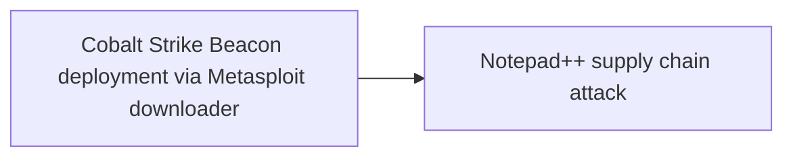
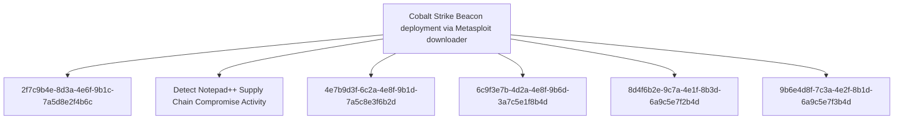

# Cobalt Strike Beacon deployment via Metasploit downloader

## Metadata

- **UUID**: `7c4d9a2e-8f3b-4e6a-9d1c-5a7b8e2f4d3a`
- **Schema**: `threat::1.0`
- **TLP**: clear

## Description
## Executive Summary

Cobalt Strike Beacon was deployed as the final payload in all three infection chains 
of the Notepad++ supply chain attack, using Metasploit downloader shellcode as the 
delivery mechanism. This represents a sophisticated command and control (C2) 
infrastructure deployment using commercial-grade post-exploitation frameworks.

## Technical Overview

### Deployment Mechanism

Metasploit downloader shellcode is executed as a second-stage payload across multiple 
infection chains. The downloader retrieves Cobalt Strike Beacon from attacker-controlled 
URLs and establishes encrypted C2 communications.

### Beacon Configuration Characteristics

**Encryption**: All Cobalt Strike Beacon configurations are encrypted using XOR 
cipher with the key **"CRAZY"**. This consistent encryption key across multiple 
payloads suggests a common operator or shared infrastructure.

**User-Agent Strings**:
```
Mozilla/5.0 (Windows NT 10.0; Win64; x64) AppleWebKit/537.36 (KHTML, like Gecko) Chrome/138.0.0.0 Safari/537.36
Mozilla/5.0 (Windows NT 10.0; Win64; x64) AppleWebKit/537.36 (KHTML, like Gecko) Chrome/140.0.0.0 Safari/537.36
```

These User-Agent strings mimic legitimate Chrome browser traffic to blend with 
normal network activity.

### Deployment Location

Rapid7 researchers identified Cobalt Strike Beacon deployed to:
```
C:\ProgramData\USOShared\
```

This directory mimics Windows Update service locations (USO = Update Session Orchestrator) 
to evade detection through legitimate-appearing file paths.

## Indicators of Compromise (IOCs)

### Metasploit Downloader URLs

These URLs are used by Metasploit downloader shellcode to retrieve Cobalt Strike Beacon:

```
https://45.77.31[.]210/users/admin
https://cdncheck.it[.]com/users/admin
https://safe-dns.it[.]com/help/Get-Start
https://api.wiresguard[.]com/users/admin
```

**Pattern**: Three of four URLs follow the `/users/admin` pattern, suggesting 
automated generation or templated infrastructure setup.

### Cobalt Strike Beacon C2 URLs

Primary C2 infrastructure identified by Kaspersky:

```
https://45.77.31[.]210/api/update/v1
https://45.77.31[.]210/api/FileUpload/submit
https://cdncheck.it[.]com/api/update/v1
https://cdncheck.it[.]com/api/Metadata/submit
https://cdncheck.it[.]com/api/getInfo/v1
https://cdncheck.it[.]com/api/FileUpload/submit
https://safe-dns.it[.]com/resolve
https://safe-dns.it[.]com/dns-query
https://api.wiresguard[.]com/update/v1
https://api.wiresguard[.]com/api/FileUpload/submit
```

**Pattern Analysis**:
- Multiple C2 URLs use `/api/FileUpload/submit` endpoint
- Several use `/api/update/v1` or similar versioned API patterns
- DNS-themed C2 domains use DNS-related paths (`/resolve`, `/dns-query`)
- API versioning suggests organized infrastructure management

### Additional C2 Infrastructure (Rapid7 Findings)

```
http://59.110.7[.]32:8880/uffhxpSy
http://59.110.7[.]32:8880/api/getBasicInfo/v1
http://124.222.137[.]114:9999/3yZR31VK
http://124.222.137[.]114:9999/api/updateStatus/v1
```

**Key Observations**:
- These use HTTP instead of HTTPS, potentially indicating different operational phases
- Non-standard ports (8880, 9999) for HTTP traffic
- Random path components mixed with API-style paths
- Versioned API endpoints consistent with primary infrastructure

### Malicious Domains

```
cdncheck.it[.]com
safe-dns.it[.]com
wiresguard[.]com (typosquat of wireguard.com)
```

**Domain Strategy**:
- DNS/CDN themed domains for legitimacy
- Typosquatting of legitimate services (WireGuard VPN)
- IT-focused naming to blend with enterprise network traffic

### Malicious IP Addresses

```
45.77.31.210
59.110.7.32
124.222.137.114
```

### Cryptographic Indicators

**XOR Encryption Key**: `CRAZY`

This key is consistently used across multiple Cobalt Strike Beacon configurations, 
serving as a strong indicator of related campaigns or shared infrastructure.

## Attack Flow

1. **Initial Compromise**: Victim system compromised via Notepad++ supply chain attack
2. **Metasploit Downloader Execution**: First-stage payload executes Metasploit downloader shellcode
3. **Beacon Retrieval**: Downloader contacts URLs like `/users/admin` to fetch Cobalt Strike Beacon
4. **Beacon Deployment**: Beacon is written to disk (e.g., `C:\ProgramData\USOShared\`)
5. **C2 Establishment**: Beacon initiates encrypted C2 communications using HTTPS
6. **Persistent Access**: Attacker maintains command and control for espionage or lateral movement

## Infrastructure Commonalities

Analysis reveals consistent patterns across the infrastructure:

1. **URL Patterns**: Frequent use of `/users/admin` for payload delivery
2. **API Design**: Versioned API endpoints (e.g., `/api/update/v1`, `/api/updateStatus/v1`)
3. **File Upload Endpoints**: Multiple C2 servers expose `/api/FileUpload/submit`
4. **Encryption**: Uniform use of XOR with key "CRAZY"
5. **User-Agent**: Consistent Chrome User-Agent strings across campaigns

These similarities indicate:
- Shared infrastructure or operational templates
- Likely common threat actor or coordinated operation
- Professional infrastructure management and organization

## Detection Opportunities

### Network Detection

1. **URL Pattern Matching**:
   - Monitor for HTTP(S) requests to `/users/admin` paths
   - Alert on connections to `/api/FileUpload/submit` endpoints
   - Detect versioned API patterns (`/api/*/v1`)

2. **Domain Reputation**:
   - Block/alert on connections to IOC domains
   - Monitor for typosquat domains of legitimate services
   - Flag DNS-themed domains in non-DNS contexts

3. **SSL/TLS Inspection**:
   - Inspect HTTPS traffic for Cobalt Strike malleable C2 profiles
   - Look for consistent User-Agent patterns
   - Detect encrypted payloads with XOR patterns

4. **Port Usage**:
   - Monitor HTTP traffic on non-standard ports (8880, 9999)

### Host-Based Detection

1. **File System Monitoring**:
   - Alert on file creation in `C:\ProgramData\USOShared\` by non-system processes
   - Monitor for PE files in unusual locations with network activity

2. **Process Monitoring**:
   - Detect Metasploit downloader shellcode execution patterns
   - Monitor for process injection behaviors common to Cobalt Strike
   - Alert on unusual parent-child process relationships

3. **Memory Analysis**:
   - Scan for XOR-encrypted Cobalt Strike configurations in memory
   - Search for the XOR key "CRAZY" in process memory
   - Detect Cobalt Strike reflective DLL injection techniques

4. **Registry Monitoring**:
   - Watch for persistence mechanisms in Run keys or scheduled tasks

### Behavioral Detection

1. **Beaconing Activity**:
   - Detect periodic network connections at regular intervals
   - Monitor for consistent User-Agent strings across multiple connections
   - Identify low-volume, high-frequency HTTPS connections

2. **Data Exfiltration**:
   - Monitor POST requests to `/api/FileUpload/submit` endpoints
   - Alert on large data transfers to external IPs

3. **Lateral Movement**:
   - Detect credential theft attempts (common Cobalt Strike capability)
   - Monitor for lateral movement using SMB, WMI, or PsExec

## MITRE ATT&CK Mapping

### T1071.001 - Application Layer Protocol: Web Protocols

Cobalt Strike Beacon uses HTTPS/HTTP for C2 communications to blend with legitimate 
web traffic. The use of standard ports (443, 80) and Chrome User-Agents mimics 
normal browser behavior.

### T1573.001 - Encrypted Channel: Symmetric Cryptography

Beacon configurations are encrypted using XOR cipher with the key "CRAZY". 
Additionally, HTTPS provides transport layer encryption for C2 communications.

### T1105 - Ingress Tool Transfer

Metasploit downloader fetches Cobalt Strike Beacon from remote URLs, transferring 
the post-exploitation framework to the compromised system.

### T1059 - Command and Scripting Interpreter

Cobalt Strike Beacon provides interactive command execution capabilities, allowing 
operators to execute commands and scripts on compromised systems.

## Mitigation Recommendations

### Immediate Actions

1. **Network Blocking**:
   - Block all IOC IPs and domains at firewall/proxy level
   - Implement DNS sinkholing for malicious domains

2. **Threat Hunting**:
   - Search for files in `C:\ProgramData\USOShared\` created by non-system processes
   - Hunt for network connections to IOC infrastructure
   - Scan memory for XOR key "CRAZY" or Cobalt Strike artifacts

3. **Endpoint Isolation**:
   - Isolate systems showing signs of Cobalt Strike infection
   - Prevent lateral movement through network segmentation

### Long-Term Measures

1. **EDR Deployment**:
   - Deploy EDR solutions with Cobalt Strike detection capabilities
   - Enable memory scanning and behavioral detection

2. **Network Monitoring**:
   - Implement SSL/TLS inspection for encrypted traffic
   - Deploy IDS/IPS rules for Cobalt Strike indicators
   - Monitor for beaconing behavior patterns

3. **Application Control**:
   - Implement application whitelisting to prevent unauthorized executables
   - Block execution from non-standard directories like `C:\ProgramData\USOShared\`

4. **Supply Chain Security**:
   - Verify software update integrity through code signing
   - Restrict software installation to official channels only

5. **User Education**:
   - Train users on supply chain attack risks
   - Educate on identifying suspicious system behavior

## Threat Actor Assessment

The consistent infrastructure patterns, encryption keys, and professional operational 
security suggest a coordinated threat actor or shared infrastructure among related 
groups. The targeting of government and financial sectors across multiple countries 
indicates espionage or financial crime motivations.

**Sophistication Level**: High
- Use of commercial-grade post-exploitation framework (Cobalt Strike)
- Organized C2 infrastructure with versioned APIs
- Persistent operations across multiple months
- Supply chain compromise capabilities

**Operational Security**:
- HTTPS encryption for C2 traffic
- Legitimate-appearing domain names and URL paths
- Mimicking Windows system directories for file placement
- Use of common User-Agent strings

## Conclusion

The deployment of Cobalt Strike Beacon via Metasploit downloader represents a 
critical threat to organizations worldwide. The consistent use of specific encryption 
keys, infrastructure patterns, and professional tradecraft indicates an organized 
and persistent adversary. Organizations should prioritize detection and mitigation 
efforts focusing on the specific IOCs and behavioral patterns identified in this 
threat vector.

Immediate action is required to:
1. Detect existing infections through IOC sweeps
2. Block C2 communications through network controls
3. Hunt for artifacts in memory and on disk
4. Implement long-term defenses against post-exploitation frameworks

This threat vector should be considered **CRITICAL** priority for incident response 
and threat hunting operations.

## Techniques
- T1071.001
- T1573.001
- T1105
- T1059

## Chaining


## Relations

