# Code execution via custom script extensions in Azure

## Metadata
| Field | Value |
| --- | --- |
| UUID | `61ddc240-e5a6-4ca8-ae77-6b471b498913` |
| Schema | `threat::1.0` |
| Version | `3` |
| Created | `2025-05-15` |
| Modified | `2025-09-08` |
| TLP | clear (`TLP:CLEAR`) |
| Organisation | EC DIGIT CSOC (`56b0a0f0-b0bc-47d9-bb46-02f80ae2065a`) |

## References
### Public
- **1**: [https://www.netspi.com/blog/technical-blog/cloud-pentesting/attacking-azure-with-custom-script-extensions/](https://www.netspi.com/blog/technical-blog/cloud-pentesting/attacking-azure-with-custom-script-extensions/)
- **2**: [https://learn.microsoft.com/en-us/azure/virtual-machines/extensions/custom-script-windows](https://learn.microsoft.com/en-us/azure/virtual-machines/extensions/custom-script-windows)
- **3**: [https://blog.pwnedlabs.io/diving-deep-into-azure-vm-attack-vectors](https://blog.pwnedlabs.io/diving-deep-into-azure-vm-attack-vectors)

## Description
The Azure Custom Script Extension (CSE) is designed to automate post-deployment 
tasks on virtual machines (VMs) by downloading and executing scripts provided by 
users. While this is intended for legitimate configuration and management, it introduces 
a powerful threat vector: attackers with sufficient Azure permissions can leverage 
CSE to execute arbitrary code as SYSTEM (Windows) or root (Linux) on any accessible VM.

### How Attackers Exploit This Vector

- **Privilege Abuse**: If an attacker compromises an account with the *Virtual Machine 
Contributor* role or any role that grants `Microsoft.Compute/virtualMachines/extensions/write` 
permissions, they can deploy or update custom script extensions on target VMs.
- **Arbitrary Code Execution**: The attacker can specify any script (PowerShell, Bash, etc.) 
to be downloaded from a remote location (such as a malicious website or public repository) 
and executed with the highest local privileges on the VM.
- **Bypassing Network Controls**: Because CSE operates through the Azure control 
plane, it does not require direct network access to the VM. Scripts can be executed 
even if RDP or SSH ports are closed, bypassing traditional network-based restrictions.
- **Persistence and Lateral Movement**: Attackers can use CSE to establish persistence 
(e.g., by installing backdoors), harvest credentials, or pivot to other resources 
within the environment.
- **Stealth**: Since CSE operations are part of normal Azure VM management workflows, 
malicious activity may blend in with legitimate administrative actions.

### Example Attack Scenario
- An attacker uploads a malicious script to a public storage location.
- Using compromised credentials with the necessary Azure permissions, the attacker 
configures the CSE on a target VM to download and execute the script.
- The script runs as SYSTEM/root, granting full control over the VM, and can perform 
actions such as installing malware, mining cryptocurrency, exfiltrating data, or 
creating new privileged accounts.

### Real-World Impact
- **Observed Cases**: There have been documented incidents where attackers used 
the CSE to deploy cryptocurrency miners across multiple customer environments by 
referencing a malicious script hosted on a public GitHub repository.
- **Scope of Access**: This technique is not limited to individual VMs; it can be 
used on VM scale sets and Azure ARC-managed resources, amplifying the potential impact.
- **No Network Barriers**: The attack is effective regardless of the VM’s network 
security group settings or firewall rules, as it leverages the Azure management plane.

## Criticality
**High** - A High priority incident is likely to result in a demonstrable impact to public health or safety, national security, economic security, foreign relations, civil liberties, or public confidence.

## Terrain
Adversaries must have an Azure role that grants the ability to write or deploy custom 
script extensions on virtual machines.

## Surface
> **Azure**
> Microsoft Azure cloud platform

> **Windows**
> Microsoft Windows operating systems (all versions)

> **Linux**
> Linux-based operating systems (all distributions)

> **Azure::Compute::Virtual Machines**
> Azure Virtual Machines

> **AWS::Storage**
> AWS storage services

> **Orchestration::Kubernetes**
> Kubernetes container orchestration platform

> **Web Servers**
> HTTP servers and reverse proxies

> **Serverless**
> Cloud-agnostic serverless compute (when not provider-specific)

> **Application Layer::HTTP**
> Hypertext Transfer Protocol

> **AWS::Compute::EC2**
> Amazon Elastic Compute Cloud (virtual servers)

> **Kerberos**
> Kerberos network authentication protocol

> **Log Management**
> Dedicated log management and log aggregation solutions

## Threat Assessment
| Dimension | Assessment | Description |
| --- | --- | --- |
| Severity | Significant incident | A cyber attack which has a serious impact on a large organisation or on wider / local government, or which poses a considerable risk to central government or (inter)national essential services. |
| Impact | Data Breach IP Loss Reputational Damages Identity Theft Monetary Loss Lose Capabilities Business disruption | Non-public information has been accessed from the outside, and successfully extracted. Particular, key data, information and blueprint conducive to the organization capability to gain and retain a commercial or geopolitical advantage has been accessed, and their content potentially used by competitors or other adversaries. Damages to the organization public view may be achieved by using directly the access gained, or indirectly with data gathered. Acquisition of sufficient information and privileges to profess as a given individual, for the purpose of abusing and deceiving human trust relationships. The vector will directly conduct to loss of value directly impacting the bottom line. Vector execution will remove key functions to the organization, which will not be easily circumvented. Most day-to-day is heavily impaired, but processes can reorganize at a loss. Business disruption |
| Leverage | Elevation of privilege Information Disclosure Infrastructure Compromise Tampering Spoofing | Capacity to augment leverage over the target system by upgrading the compromised access rights Threat action intending to read a file that one was not granted access to, or to read data in transit. The compromised target is likely to be used to further expand the sphere of influence of the attacker and allow more potent vectors to be executed. Threat action intending to maliciously change or modify persistent data, such as records in a database, and the alteration of data in transit between two computers over an open network, such as the Internet. Threat action aimed at accessing and use of another user’s credentials, such as username and password. |
| Viability | Very Likely | Highly probable - 80-95% |
| Kill Chain | Execution | Techniques that result in execution of attacker-controlled code on a local or remote system. |

## ATT&CK Techniques
| Technique | Name | Description |
| --- | --- | --- |
| `T1555` | [Credentials from Password Stores](https://attack.mitre.org/techniques/T1555) | Adversaries may search for common password storage locations to obtain user credentials.(Citation: F-Secure The Dukes) Passwords are stored in several places on a system, depending on the operating system or application holding the credentials. There are also specific applications and services that store passwords to make them easier for users to manage and maintain, such as password managers and cloud secrets vaults. Once credentials are obtained, they can be used to perform lateral movement and access restricted information. |
| `T1190` | [Exploit Public-Facing Application](https://attack.mitre.org/techniques/T1190) | Adversaries may attempt to exploit a weakness in an Internet-facing host or system to initially access a network. The weakness in the system can be a software bug, a temporary glitch, or a misconfiguration.  Exploited applications are often websites/web servers, but can also include databases (like SQL), standard services (like SMB or SSH), network device administration and management protocols (like SNMP and Smart Install), and any other system with Internet-accessible open sockets.(Citation: NVD CVE-2016-6662)(Citation: CIS Multiple SMB Vulnerabilities)(Citation: US-CERT TA18-106A Network Infrastructure Devices 2018)(Citation: Cisco Blog Legacy Device Attacks)(Citation: NVD CVE-2014-7169) On ESXi infrastructure, adversaries may exploit exposed OpenSLP services; they may alternatively exploit exposed VMware vCenter servers.(Citation: Recorded Future ESXiArgs Ransomware 2023)(Citation: Ars Technica VMWare Code Execution Vulnerability 2021) Depending on the flaw being exploited, this may also involve [Exploitation for Defense Evasion](https://attack.mitre.org/techniques/T1211) or [Exploitation for Client Execution](https://attack.mitre.org/techniques/T1203).  If an application is hosted on cloud-based infrastructure and/or is containerized, then exploiting it may lead to compromise of the underlying instance or container. This can allow an adversary a path to access the cloud or container APIs (e.g., via the [Cloud Instance Metadata API](https://attack.mitre.org/techniques/T1552/005)), exploit container host access via [Escape to Host](https://attack.mitre.org/techniques/T1611), or take advantage of weak identity and access management policies.  Adversaries may also exploit edge network infrastructure and related appliances, specifically targeting devices that do not support robust host-based defenses.(Citation: Mandiant Fortinet Zero Day)(Citation: Wired Russia Cyberwar)  For websites and databases, the OWASP top 10 and CWE top 25 highlight the most common web-based vulnerabilities.(Citation: OWASP Top 10)(Citation: CWE top 25) |
| `T1204` | [User Execution](https://attack.mitre.org/techniques/T1204) | An adversary may rely upon specific actions by a user in order to gain execution. Users may be subjected to social engineering to get them to execute malicious code by, for example, opening a malicious document file or link. These user actions will typically be observed as follow-on behavior from forms of [Phishing](https://attack.mitre.org/techniques/T1566).  While [User Execution](https://attack.mitre.org/techniques/T1204) frequently occurs shortly after Initial Access it may occur at other phases of an intrusion, such as when an adversary places a file in a shared directory or on a user's desktop hoping that a user will click on it. This activity may also be seen shortly after [Internal Spearphishing](https://attack.mitre.org/techniques/T1534).  Adversaries may also deceive users into performing actions such as:  * Enabling [Remote Access Tools](https://attack.mitre.org/techniques/T1219), allowing direct control of the system to the adversary * Running malicious JavaScript in their browser, allowing adversaries to [Steal Web Session Cookie](https://attack.mitre.org/techniques/T1539)s(Citation: Talos Roblox Scam 2023)(Citation: Krebs Discord Bookmarks 2023) * Downloading and executing malware for [User Execution](https://attack.mitre.org/techniques/T1204) * Coerceing users to copy, paste, and execute malicious code manually(Citation: Reliaquest-execution)(Citation: proofpoint-selfpwn)  For example, tech support scams can be facilitated through [Phishing](https://attack.mitre.org/techniques/T1566), vishing, or various forms of user interaction. Adversaries can use a combination of these methods, such as spoofing and promoting toll-free numbers or call centers that are used to direct victims to malicious websites, to deliver and execute payloads containing malware or [Remote Access Tools](https://attack.mitre.org/techniques/T1219).(Citation: Telephone Attack Delivery) |

## Chaining

```mermaid
flowchart LR
subgraph "Execution"
61ddc240_e5a6_4ca8_ae77_6b471b498913{{"Code execution via<br>custom script extensions<br>in Azure"}}
4d9cc646_debc_477b_93cb_4ea74c47c02c{{"Azure - Managed Device<br>Scripting"}}
0815bc77_169d_4320_aa32_770cf062509a{{"Azure - Unmanaged<br>Scripting"}}
3435c5fd_1069_40ee_ae79_54c672ce454d{{"Azure - Virtual Machine<br>Scripting"}}
60c5b065_7d06_4697_850f_c2f80765f10b{{"Changes to Azure<br>infrastructure deployed<br>through Azure CLI"}}
end
subgraph "Reconnaissance"
140907eb_c9fb_4330_9d71_656422388b2b{{"Azure - Gather Role<br>Information"}}
b1593e0b_1b3b_462d_9ab6_21d1c136469d{{"Azure - Gather Resource<br>Data"}}
fe6827f2_efb4_43b3_9ca3_b7d417111b32{{"Azure - Gather<br>Application Information"}}
53063205_4404_4e6d_a2f5_d566c6085d96{{"Data collection using<br>SharpHound, SoapHound,<br>Bloodhound and<br>Azurehound"}}
end
subgraph "Lateral Movement"
a8c7b250_a2d4_4a0d_82f8_23dc99c77d7b{{"Addition of credentials<br>to OAuth applications<br>and service principals"}}
9bb31c65_8abd_48fc_afe3_8aca76109737{{"Azure - Modify<br>federation trust to<br>accept externally signed<br>tokens"}}
ca2751c7_8641_4fb0_a90b_30c5987015dc{{"Externally controlled<br>Azure credentials added<br>to an Enterprise app or<br>its SPN"}}
end
subgraph "Privilege Escalation"
f1dc4341_eb45_4d07_8075_b1a6b227cc76{{"Cloud IAM role<br>assumption"}}
bb2501d5_99c7_44a6_ac5a_9510102d6611{{"Azure - Principal<br>Impersonation"}}
c698fc79_3ed6_44a7_a9d7_bc447600e4c3{{"Azure AD Connect abuse"}}
c7e260d8_d391_41eb_be1a_7f276c99b383{{"Azure app registration -<br>privilege escalation"}}
end
subgraph "Persistence"
23f6a192_a25d_48b8_a235_7bb55e483682{{"Persistence with Azure<br>Automanage Machine<br>Configuration"}}
37f24c48_4a38_4682_aa76_5845ed2d6890{{"Azure - Policy with<br>DeployIfNotExists<br>definition"}}
5d43ef75_4637_4a75_b1ed_6716052cff0e{{"Azure - App registration<br>persistence"}}
50c7e353_ac1c_48a7_8c98_2515b45f31f4{{"Persistence through<br>automation runbooks in<br>Azure"}}
end
subgraph "Credential Access"
2743bf18_3b86_4721_bf3e_153dcda0b149{{"Azure - Valid<br>Credentials"}}
b6543cff_2e86_4fe6_afb7_6d3595188190{{"Azure - Steal Service<br>Principal Certificate"}}
66aafb61_9a46_4287_8b40_4785b42b77a3{{"Adversary in the Middle<br>phishing sites to bypass<br>MFA"}}
4a807ac4_f764_41b1_ae6f_94239041d349{{"MFA Bypass Techniques"}}
6e988fa7_69c9_4aef_897c_a34fa5066dac{{"Ghost logins attempts"}}
end
subgraph "Delivery"
8934c19a_954b_4dce_8081_0a6acca599f6{{"Malicious container<br>image deployed"}}
1a68b5eb_0112_424d_a21f_88dda0b6b8df{{"Spearphishing Link"}}
dd5d942c_bac4_4000_b9a6_ca4fef6cfb84{{"Spearphishing Attachment"}}
end
subgraph "Collection"
78d5e363_14db_40c0_a1c4_4ba02a3e60d4{{"Azure - Hijack Entra ID<br>Applications"}}
f18be76e_f2b3_410a_80c5_d67e7b8e7b03{{"Perform Microsoft Entra<br>ID connectors MITM<br>attack"}}
end
subgraph "Command & Control"
2fd1cddb_c66d_4a99_9779_31e32b67495e{{"Azure - Lateral movement<br>abusing Cross-Tenant<br>Synchronization"}}
end
b954303c_0ad0_4dc0_b5ca_492c3de9cd53{{"Collecting sensitive<br>information via custom<br>script extensions"}}
20bd3620_b13b_4895_b291_b1a26bd9aef3{{"MS 365 admin compromised<br>account"}}
140907eb_c9fb_4330_9d71_656422388b2b -->|preceeds| 61ddc240_e5a6_4ca8_ae77_6b471b498913
140907eb_c9fb_4330_9d71_656422388b2b -->|preceeds| a8c7b250_a2d4_4a0d_82f8_23dc99c77d7b
140907eb_c9fb_4330_9d71_656422388b2b -->|preceeds| f1dc4341_eb45_4d07_8075_b1a6b227cc76
4d9cc646_debc_477b_93cb_4ea74c47c02c -->|preceeds| 61ddc240_e5a6_4ca8_ae77_6b471b498913
4d9cc646_debc_477b_93cb_4ea74c47c02c -->|preceeds| 23f6a192_a25d_48b8_a235_7bb55e483682
4d9cc646_debc_477b_93cb_4ea74c47c02c -->|succeeds| 140907eb_c9fb_4330_9d71_656422388b2b
4d9cc646_debc_477b_93cb_4ea74c47c02c -->|succeeds| b1593e0b_1b3b_462d_9ab6_21d1c136469d
4d9cc646_debc_477b_93cb_4ea74c47c02c -->|succeeds| 2743bf18_3b86_4721_bf3e_153dcda0b149
37f24c48_4a38_4682_aa76_5845ed2d6890 -->|preceeds| 61ddc240_e5a6_4ca8_ae77_6b471b498913
37f24c48_4a38_4682_aa76_5845ed2d6890 -->|preceeds| 2743bf18_3b86_4721_bf3e_153dcda0b149
37f24c48_4a38_4682_aa76_5845ed2d6890 -->|preceeds| 23f6a192_a25d_48b8_a235_7bb55e483682
37f24c48_4a38_4682_aa76_5845ed2d6890 -->|preceeds| b954303c_0ad0_4dc0_b5ca_492c3de9cd53
37f24c48_4a38_4682_aa76_5845ed2d6890 -->|enabled| fe6827f2_efb4_43b3_9ca3_b7d417111b32
37f24c48_4a38_4682_aa76_5845ed2d6890 -->|enabled| b1593e0b_1b3b_462d_9ab6_21d1c136469d
37f24c48_4a38_4682_aa76_5845ed2d6890 -->|enabled| 53063205_4404_4e6d_a2f5_d566c6085d96
b6543cff_2e86_4fe6_afb7_6d3595188190 -->|preceeds| 61ddc240_e5a6_4ca8_ae77_6b471b498913
b6543cff_2e86_4fe6_afb7_6d3595188190 -->|preceeds| 23f6a192_a25d_48b8_a235_7bb55e483682
b6543cff_2e86_4fe6_afb7_6d3595188190 -->|succeeds| 140907eb_c9fb_4330_9d71_656422388b2b
b6543cff_2e86_4fe6_afb7_6d3595188190 -->|succeeds| b1593e0b_1b3b_462d_9ab6_21d1c136469d
b6543cff_2e86_4fe6_afb7_6d3595188190 -->|succeeds| 2743bf18_3b86_4721_bf3e_153dcda0b149
b6543cff_2e86_4fe6_afb7_6d3595188190 -->|enabled| bb2501d5_99c7_44a6_ac5a_9510102d6611
b6543cff_2e86_4fe6_afb7_6d3595188190 -->|enabled| 53063205_4404_4e6d_a2f5_d566c6085d96
b6543cff_2e86_4fe6_afb7_6d3595188190 -->|enabled| a8c7b250_a2d4_4a0d_82f8_23dc99c77d7b
0815bc77_169d_4320_aa32_770cf062509a -->|preceeds| 61ddc240_e5a6_4ca8_ae77_6b471b498913
0815bc77_169d_4320_aa32_770cf062509a -->|preceeds| 23f6a192_a25d_48b8_a235_7bb55e483682
0815bc77_169d_4320_aa32_770cf062509a -->|preceeds| b954303c_0ad0_4dc0_b5ca_492c3de9cd53
0815bc77_169d_4320_aa32_770cf062509a -->|succeeds| 140907eb_c9fb_4330_9d71_656422388b2b
0815bc77_169d_4320_aa32_770cf062509a -->|succeeds| b1593e0b_1b3b_462d_9ab6_21d1c136469d
0815bc77_169d_4320_aa32_770cf062509a -->|succeeds| 2743bf18_3b86_4721_bf3e_153dcda0b149
3435c5fd_1069_40ee_ae79_54c672ce454d -->|preceeds| 61ddc240_e5a6_4ca8_ae77_6b471b498913
3435c5fd_1069_40ee_ae79_54c672ce454d -->|preceeds| 23f6a192_a25d_48b8_a235_7bb55e483682
3435c5fd_1069_40ee_ae79_54c672ce454d -->|preceeds| b954303c_0ad0_4dc0_b5ca_492c3de9cd53
3435c5fd_1069_40ee_ae79_54c672ce454d -->|preceeds| 8934c19a_954b_4dce_8081_0a6acca599f6
3435c5fd_1069_40ee_ae79_54c672ce454d -->|succeeds| 140907eb_c9fb_4330_9d71_656422388b2b
3435c5fd_1069_40ee_ae79_54c672ce454d -->|succeeds| b1593e0b_1b3b_462d_9ab6_21d1c136469d
3435c5fd_1069_40ee_ae79_54c672ce454d -->|succeeds| 2743bf18_3b86_4721_bf3e_153dcda0b149
b1593e0b_1b3b_462d_9ab6_21d1c136469d -->|succeeds| 66aafb61_9a46_4287_8b40_4785b42b77a3
b1593e0b_1b3b_462d_9ab6_21d1c136469d -->|succeeds| 9bb31c65_8abd_48fc_afe3_8aca76109737
66aafb61_9a46_4287_8b40_4785b42b77a3 -->|implements| 4a807ac4_f764_41b1_ae6f_94239041d349
2743bf18_3b86_4721_bf3e_153dcda0b149 -->|preceeds| a8c7b250_a2d4_4a0d_82f8_23dc99c77d7b
2743bf18_3b86_4721_bf3e_153dcda0b149 -->|preceeds| 66aafb61_9a46_4287_8b40_4785b42b77a3
2743bf18_3b86_4721_bf3e_153dcda0b149 -->|preceeds| c698fc79_3ed6_44a7_a9d7_bc447600e4c3
2743bf18_3b86_4721_bf3e_153dcda0b149 -->|preceeds| 5d43ef75_4637_4a75_b1ed_6716052cff0e
2743bf18_3b86_4721_bf3e_153dcda0b149 -->|preceeds| 60c5b065_7d06_4697_850f_c2f80765f10b
2743bf18_3b86_4721_bf3e_153dcda0b149 -->|preceeds| 6e988fa7_69c9_4aef_897c_a34fa5066dac
2743bf18_3b86_4721_bf3e_153dcda0b149 -->|preceeds| 78d5e363_14db_40c0_a1c4_4ba02a3e60d4
2743bf18_3b86_4721_bf3e_153dcda0b149 -->|preceeds| 2fd1cddb_c66d_4a99_9779_31e32b67495e
2743bf18_3b86_4721_bf3e_153dcda0b149 -->|preceeds| 20bd3620_b13b_4895_b291_b1a26bd9aef3
2743bf18_3b86_4721_bf3e_153dcda0b149 -->|preceeds| f18be76e_f2b3_410a_80c5_d67e7b8e7b03
2743bf18_3b86_4721_bf3e_153dcda0b149 -->|preceeds| 50c7e353_ac1c_48a7_8c98_2515b45f31f4
2743bf18_3b86_4721_bf3e_153dcda0b149 -->|preceeds| 23f6a192_a25d_48b8_a235_7bb55e483682
c698fc79_3ed6_44a7_a9d7_bc447600e4c3 -->|enabled| 2743bf18_3b86_4721_bf3e_153dcda0b149
5d43ef75_4637_4a75_b1ed_6716052cff0e -->|succeeds| c7e260d8_d391_41eb_be1a_7f276c99b383
c7e260d8_d391_41eb_be1a_7f276c99b383 -->|enabled| bb2501d5_99c7_44a6_ac5a_9510102d6611
c7e260d8_d391_41eb_be1a_7f276c99b383 -->|enabled| 2743bf18_3b86_4721_bf3e_153dcda0b149
c7e260d8_d391_41eb_be1a_7f276c99b383 -->|enabled| fe6827f2_efb4_43b3_9ca3_b7d417111b32
bb2501d5_99c7_44a6_ac5a_9510102d6611 -->|preceeds| 2743bf18_3b86_4721_bf3e_153dcda0b149
bb2501d5_99c7_44a6_ac5a_9510102d6611 -->|preceeds| fe6827f2_efb4_43b3_9ca3_b7d417111b32
6e988fa7_69c9_4aef_897c_a34fa5066dac -->|implements| 4a807ac4_f764_41b1_ae6f_94239041d349
fe6827f2_efb4_43b3_9ca3_b7d417111b32 -->|enabled| 140907eb_c9fb_4330_9d71_656422388b2b
fe6827f2_efb4_43b3_9ca3_b7d417111b32 -->|enabled| 53063205_4404_4e6d_a2f5_d566c6085d96
fe6827f2_efb4_43b3_9ca3_b7d417111b32 -->|enabling| ca2751c7_8641_4fb0_a90b_30c5987015dc
fe6827f2_efb4_43b3_9ca3_b7d417111b32 -->|enabling| c7e260d8_d391_41eb_be1a_7f276c99b383
53063205_4404_4e6d_a2f5_d566c6085d96 -->|succeeds| 1a68b5eb_0112_424d_a21f_88dda0b6b8df
53063205_4404_4e6d_a2f5_d566c6085d96 -->|succeeds| dd5d942c_bac4_4000_b9a6_ca4fef6cfb84
61ddc240_e5a6_4ca8_ae77_6b471b498913 -->|enabled| 140907eb_c9fb_4330_9d71_656422388b2b
61ddc240_e5a6_4ca8_ae77_6b471b498913 -->|enabled| 2743bf18_3b86_4721_bf3e_153dcda0b149
```

### Chaining details
#### enabled -> [Azure - Gather Role Information](azure-gather-role-information.md) (`140907eb-c9fb-4330-9d71-656422388b2b`) (`support::enabled`)
Adversaries need to identify privileged accounts and misconfigured role assignments 
that can be exploited for privilege escalation.

- **Target UUID**: `140907eb-c9fb-4330-9d71-656422388b2b`
#### enabled -> [Azure - Valid Credentials](azure-valid-credentials.md) (`2743bf18-3b86-4721-bf3e-153dcda0b149`) (`support::enabled`)
Adversaries obtain the username and password of an AzureAD user either through phishing, 
password spraying, brute-force attacks, or credentials leaked online.

- **Target UUID**: `2743bf18-3b86-4721-bf3e-153dcda0b149`
