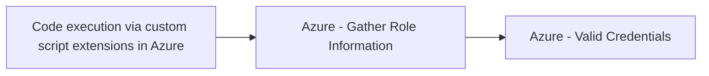

# Code execution via custom script extensions in Azure

## Metadata

- **UUID**: `61ddc240-e5a6-4ca8-ae77-6b471b498913`
- **Schema**: `threat::1.0`
- **TLP**: clear

## Description
The Azure Custom Script Extension (CSE) is designed to automate post-deployment 
tasks on virtual machines (VMs) by downloading and executing scripts provided by 
users. While this is intended for legitimate configuration and management, it introduces 
a powerful threat vector: attackers with sufficient Azure permissions can leverage 
CSE to execute arbitrary code as SYSTEM (Windows) or root (Linux) on any accessible VM.

### How Attackers Exploit This Vector

- **Privilege Abuse**: If an attacker compromises an account with the *Virtual Machine 
Contributor* role or any role that grants `Microsoft.Compute/virtualMachines/extensions/write` 
permissions, they can deploy or update custom script extensions on target VMs.
- **Arbitrary Code Execution**: The attacker can specify any script (PowerShell, Bash, etc.) 
to be downloaded from a remote location (such as a malicious website or public repository) 
and executed with the highest local privileges on the VM.
- **Bypassing Network Controls**: Because CSE operates through the Azure control 
plane, it does not require direct network access to the VM. Scripts can be executed 
even if RDP or SSH ports are closed, bypassing traditional network-based restrictions.
- **Persistence and Lateral Movement**: Attackers can use CSE to establish persistence 
(e.g., by installing backdoors), harvest credentials, or pivot to other resources 
within the environment.
- **Stealth**: Since CSE operations are part of normal Azure VM management workflows, 
malicious activity may blend in with legitimate administrative actions.

### Example Attack Scenario
- An attacker uploads a malicious script to a public storage location.
- Using compromised credentials with the necessary Azure permissions, the attacker 
configures the CSE on a target VM to download and execute the script.
- The script runs as SYSTEM/root, granting full control over the VM, and can perform 
actions such as installing malware, mining cryptocurrency, exfiltrating data, or 
creating new privileged accounts.

### Real-World Impact
- **Observed Cases**: There have been documented incidents where attackers used 
the CSE to deploy cryptocurrency miners across multiple customer environments by 
referencing a malicious script hosted on a public GitHub repository.
- **Scope of Access**: This technique is not limited to individual VMs; it can be 
used on VM scale sets and Azure ARC-managed resources, amplifying the potential impact.
- **No Network Barriers**: The attack is effective regardless of the VM’s network 
security group settings or firewall rules, as it leverages the Azure management plane.

## Techniques
- T1555
- T1190
- T1204

## Chaining

