# Collecting sensitive information via custom script extensions

## Metadata
| Field | Value |
| --- | --- |
| UUID | `b954303c-0ad0-4dc0-b5ca-492c3de9cd53` |
| Schema | `threat::1.0` |
| Version | `1` |
| Created | `2025-06-11` |
| Modified | `2025-06-11` |
| TLP | clear (`TLP:CLEAR`) |
| Organisation | EC DIGIT CSOC (`56b0a0f0-b0bc-47d9-bb46-02f80ae2065a`) |

## References
### Public
- **1**: [https://learn.microsoft.com/en-us/azure/virtual-machines/extensions/custom-script-windows](https://learn.microsoft.com/en-us/azure/virtual-machines/extensions/custom-script-windows)
- **2**: [https://www.netspi.com/blog/technical-blog/cloud-pentesting/attacking-azure-with-custom-script-extensions/](https://www.netspi.com/blog/technical-blog/cloud-pentesting/attacking-azure-with-custom-script-extensions/)
- **3**: [https://blog.devsecopsguides.com/p/attacking-azure](https://blog.devsecopsguides.com/p/attacking-azure)
- **4**: [https://learn.microsoft.com/en-us/azure/virtual-machines/extensions/custom-script-linux](https://learn.microsoft.com/en-us/azure/virtual-machines/extensions/custom-script-linux)

## Description
Custom Script Extensions in Azure are powerful automation tools for configuring 
and managing Virtual Machines (VMs). However, attackers can exploit these extensions 
to collect sensitive information in a variety of ways.

## Credential Harvesting
- **Stored Credentials:** Attackers deploy scripts that search for credentials stored 
in plaintext files, configuration files, or environment variables.
- **Credential Managers:** Scripts can target credential managers or vaults such 
as Azure Key Vault, Windows Credential Manager, or third-party vaults to extract 
stored credentials.

## Configuration Files and Secrets
- **Configuration Files:** Scripts can systematically search for and exfiltrate 
configuration files containing sensitive data like database connection strings, 
API keys, or other secrets.
- **Environment Variables:** Attackers can extract environment variables that hold 
sensitive configuration or authentication information.

## Log Files and Audit Trails
- **Log Files:** Scripts can access and exfiltrate log files that may contain sensitive 
information, such as authentication logs, database logs, or application logs.
- **Audit Trails:** Attackers can collect and exfiltrate audit trails that record 
administrative actions or other sensitive activities.

## Memory Scraping
- **Running Processes:** Scripts can be designed to scrape memory from running processes 
to extract sensitive information like session tokens, encryption keys, or other 
in-memory data.
- **DLL Injection:** Attackers can use DLL injection techniques within scripts to 
extract sensitive data from running processes.

## Network Traffic Interception
- **Network Sniffing:** Scripts can enable network sniffing tools to capture sensitive 
information transmitted over the network.
- **Proxy Servers:** Attackers can configure proxy servers via scripts to intercept 
and log network traffic, capturing sensitive data in transit.

## Exploitation of Vulnerabilities
- **Unpatched Software:** Attackers can exploit vulnerabilities in unpatched software 
to gain elevated privileges and execute scripts that collect sensitive information.
- **Misconfigurations:** Misconfigurations in the VM or the environment can be exploited 
to deploy and run malicious scripts.

## Data Exfiltration Channels
- **External Storage:** Scripts can exfiltrate collected data to external storage 
solutions such as Azure Blob Storage, external servers, or other cloud storage services.
- **Email Exfiltration:** Attackers can use scripts to send sensitive information 
via email to an external address.
- **Command and Control (C2) Servers:** Scripts can communicate with C2 servers 
to exfiltrate data and receive further instructions.

## Persistent Data Collection
- **Scheduled Tasks:** Attackers can create scheduled tasks or services that periodically 
execute scripts to collect and exfiltrate sensitive information over time.
- **Backdoor Scripts:** Scripts can be designed to act as backdoors, allowing attackers 
to execute commands and collect data as needed.

## Criticality
**High** - A High priority incident is likely to result in a demonstrable impact to public health or safety, national security, economic security, foreign relations, civil liberties, or public confidence.

## Terrain
Attackers need to gain access to an Azure account with the Virtual Machine Contributor 
role (or equivalent) can use custom script extensions to execute arbitrary code 
as SYSTEM or root on VMs.

## Surface
> **Azure**
> Microsoft Azure cloud platform

> **Windows**
> Microsoft Windows operating systems (all versions)

> **Linux**
> Linux-based operating systems (all distributions)

> **Azure::Security::Entra ID**
> Microsoft Entra ID in Azure (cloud identity)

> **Azure::Storage::Blob Storage**
> Azure Blob Storage (object storage)

> **AWS::Storage**
> AWS storage services

> **Azure::Security::Key Vault**
> Azure Key Vault secrets and key management

> **Azure::Compute::Virtual Machines**
> Azure Virtual Machines

> **Serverless**
> Cloud-agnostic serverless compute (when not provider-specific)

> **Application Layer::HTTP**
> Hypertext Transfer Protocol

> **Database Management::PostgreSQL**
> PostgreSQL open-source relational database

> **Database Management::MongoDB**
> MongoDB NoSQL document database

> **Container Runtime::Docker**
> Docker Engine container runtime

## Threat Assessment
| Dimension | Assessment | Description |
| --- | --- | --- |
| Severity | Significant incident | A cyber attack which has a serious impact on a large organisation or on wider / local government, or which poses a considerable risk to central government or (inter)national essential services. |
| Impact | Data Breach IP Loss Reputational Damages Identity Theft Monetary Loss Business disruption | Non-public information has been accessed from the outside, and successfully extracted. Particular, key data, information and blueprint conducive to the organization capability to gain and retain a commercial or geopolitical advantage has been accessed, and their content potentially used by competitors or other adversaries. Damages to the organization public view may be achieved by using directly the access gained, or indirectly with data gathered. Acquisition of sufficient information and privileges to profess as a given individual, for the purpose of abusing and deceiving human trust relationships. The vector will directly conduct to loss of value directly impacting the bottom line. Business disruption |
| Leverage | Information Disclosure Elevation of privilege Tampering Repudiation Infrastructure Compromise | Threat action intending to read a file that one was not granted access to, or to read data in transit. Capacity to augment leverage over the target system by upgrading the compromised access rights Threat action intending to maliciously change or modify persistent data, such as records in a database, and the alteration of data in transit between two computers over an open network, such as the Internet. Threat action aimed at performing prohibited operations in a system that lacks the ability to trace the operations. The compromised target is likely to be used to further expand the sphere of influence of the attacker and allow more potent vectors to be executed. |
| Viability | Likely | Probable (probably) - 55-80% |

## ATT&CK Techniques
| Technique | Name | Description |
| --- | --- | --- |
| `T1059` | [Command and Scripting Interpreter](https://attack.mitre.org/techniques/T1059) | Adversaries may abuse command and script interpreters to execute commands, scripts, or binaries. These interfaces and languages provide ways of interacting with computer systems and are a common feature across many different platforms. Most systems come with some built-in command-line interface and scripting capabilities, for example, macOS and Linux distributions include some flavor of [Unix Shell](https://attack.mitre.org/techniques/T1059/004) while Windows installations include the [Windows Command Shell](https://attack.mitre.org/techniques/T1059/003) and [PowerShell](https://attack.mitre.org/techniques/T1059/001).  There are also cross-platform interpreters such as [Python](https://attack.mitre.org/techniques/T1059/006), as well as those commonly associated with client applications such as [JavaScript](https://attack.mitre.org/techniques/T1059/007) and [Visual Basic](https://attack.mitre.org/techniques/T1059/005).  Adversaries may abuse these technologies in various ways as a means of executing arbitrary commands. Commands and scripts can be embedded in [Initial Access](https://attack.mitre.org/tactics/TA0001) payloads delivered to victims as lure documents or as secondary payloads downloaded from an existing C2. Adversaries may also execute commands through interactive terminals/shells, as well as utilize various [Remote Services](https://attack.mitre.org/techniques/T1021) in order to achieve remote Execution.(Citation: Powershell Remote Commands)(Citation: Cisco IOS Software Integrity Assurance - Command History)(Citation: Remote Shell Execution in Python) |
| `T1651` | [Cloud Administration Command](https://attack.mitre.org/techniques/T1651) | Adversaries may abuse cloud management services to execute commands within virtual machines. Resources such as AWS Systems Manager, Azure RunCommand, and Runbooks allow users to remotely run scripts in virtual machines by leveraging installed virtual machine agents. (Citation: AWS Systems Manager Run Command)(Citation: Microsoft Run Command)  If an adversary gains administrative access to a cloud environment, they may be able to abuse cloud management services to execute commands in the environment’s virtual machines. Additionally, an adversary that compromises a service provider or delegated administrator account may similarly be able to leverage a [Trusted Relationship](https://attack.mitre.org/techniques/T1199) to execute commands in connected virtual machines.(Citation: MSTIC Nobelium Oct 2021) |
| `T1119` | [Automated Collection](https://attack.mitre.org/techniques/T1119) | Once established within a system or network, an adversary may use automated techniques for collecting internal data. Methods for performing this technique could include use of a [Command and Scripting Interpreter](https://attack.mitre.org/techniques/T1059) to search for and copy information fitting set criteria such as file type, location, or name at specific time intervals.   In cloud-based environments, adversaries may also use cloud APIs, data pipelines, command line interfaces, or extract, transform, and load (ETL) services to automatically collect data.(Citation: Mandiant UNC3944 SMS Phishing 2023)   This functionality could also be built into remote access tools.   This technique may incorporate use of other techniques such as [File and Directory Discovery](https://attack.mitre.org/techniques/T1083) and [Lateral Tool Transfer](https://attack.mitre.org/techniques/T1570) to identify and move files, as well as [Cloud Service Dashboard](https://attack.mitre.org/techniques/T1538) and [Cloud Storage Object Discovery](https://attack.mitre.org/techniques/T1619) to identify resources in cloud environments. |

## Chaining

```mermaid
flowchart LR
subgraph "Persistence"
37f24c48_4a38_4682_aa76_5845ed2d6890{{"Azure - Policy with<br>DeployIfNotExists<br>definition"}}
23f6a192_a25d_48b8_a235_7bb55e483682{{"Persistence with Azure<br>Automanage Machine<br>Configuration"}}
5d43ef75_4637_4a75_b1ed_6716052cff0e{{"Azure - App registration<br>persistence"}}
50c7e353_ac1c_48a7_8c98_2515b45f31f4{{"Persistence through<br>automation runbooks in<br>Azure"}}
end
subgraph "Credential Access"
2743bf18_3b86_4721_bf3e_153dcda0b149{{"Azure - Valid<br>Credentials"}}
66aafb61_9a46_4287_8b40_4785b42b77a3{{"Adversary in the Middle<br>phishing sites to bypass<br>MFA"}}
6e988fa7_69c9_4aef_897c_a34fa5066dac{{"Ghost logins attempts"}}
4a807ac4_f764_41b1_ae6f_94239041d349{{"MFA Bypass Techniques"}}
end
subgraph "Execution"
61ddc240_e5a6_4ca8_ae77_6b471b498913{{"Code execution via<br>custom script extensions<br>in Azure"}}
0815bc77_169d_4320_aa32_770cf062509a{{"Azure - Unmanaged<br>Scripting"}}
3435c5fd_1069_40ee_ae79_54c672ce454d{{"Azure - Virtual Machine<br>Scripting"}}
60c5b065_7d06_4697_850f_c2f80765f10b{{"Changes to Azure<br>infrastructure deployed<br>through Azure CLI"}}
end
subgraph "Reconnaissance"
fe6827f2_efb4_43b3_9ca3_b7d417111b32{{"Azure - Gather<br>Application Information"}}
b1593e0b_1b3b_462d_9ab6_21d1c136469d{{"Azure - Gather Resource<br>Data"}}
53063205_4404_4e6d_a2f5_d566c6085d96{{"Data collection using<br>SharpHound, SoapHound,<br>Bloodhound and<br>Azurehound"}}
140907eb_c9fb_4330_9d71_656422388b2b{{"Azure - Gather Role<br>Information"}}
end
subgraph "Delivery"
8934c19a_954b_4dce_8081_0a6acca599f6{{"Malicious container<br>image deployed"}}
1a68b5eb_0112_424d_a21f_88dda0b6b8df{{"Spearphishing Link"}}
dd5d942c_bac4_4000_b9a6_ca4fef6cfb84{{"Spearphishing Attachment"}}
end
subgraph "Lateral Movement"
a8c7b250_a2d4_4a0d_82f8_23dc99c77d7b{{"Addition of credentials<br>to OAuth applications<br>and service principals"}}
ca2751c7_8641_4fb0_a90b_30c5987015dc{{"Externally controlled<br>Azure credentials added<br>to an Enterprise app or<br>its SPN"}}
9bb31c65_8abd_48fc_afe3_8aca76109737{{"Azure - Modify<br>federation trust to<br>accept externally signed<br>tokens"}}
end
subgraph "Privilege Escalation"
c698fc79_3ed6_44a7_a9d7_bc447600e4c3{{"Azure AD Connect abuse"}}
c7e260d8_d391_41eb_be1a_7f276c99b383{{"Azure app registration -<br>privilege escalation"}}
bb2501d5_99c7_44a6_ac5a_9510102d6611{{"Azure - Principal<br>Impersonation"}}
f1dc4341_eb45_4d07_8075_b1a6b227cc76{{"Cloud IAM role<br>assumption"}}
end
subgraph "Collection"
78d5e363_14db_40c0_a1c4_4ba02a3e60d4{{"Azure - Hijack Entra ID<br>Applications"}}
f18be76e_f2b3_410a_80c5_d67e7b8e7b03{{"Perform Microsoft Entra<br>ID connectors MITM<br>attack"}}
end
subgraph "Command & Control"
2fd1cddb_c66d_4a99_9779_31e32b67495e{{"Azure - Lateral movement<br>abusing Cross-Tenant<br>Synchronization"}}
end
b954303c_0ad0_4dc0_b5ca_492c3de9cd53{{"Collecting sensitive<br>information via custom<br>script extensions"}}
20bd3620_b13b_4895_b291_b1a26bd9aef3{{"MS 365 admin compromised<br>account"}}
37f24c48_4a38_4682_aa76_5845ed2d6890 -->|preceeds| b954303c_0ad0_4dc0_b5ca_492c3de9cd53
37f24c48_4a38_4682_aa76_5845ed2d6890 -->|preceeds| 2743bf18_3b86_4721_bf3e_153dcda0b149
37f24c48_4a38_4682_aa76_5845ed2d6890 -->|preceeds| 61ddc240_e5a6_4ca8_ae77_6b471b498913
37f24c48_4a38_4682_aa76_5845ed2d6890 -->|preceeds| 23f6a192_a25d_48b8_a235_7bb55e483682
37f24c48_4a38_4682_aa76_5845ed2d6890 -->|enabled| fe6827f2_efb4_43b3_9ca3_b7d417111b32
37f24c48_4a38_4682_aa76_5845ed2d6890 -->|enabled| b1593e0b_1b3b_462d_9ab6_21d1c136469d
37f24c48_4a38_4682_aa76_5845ed2d6890 -->|enabled| 53063205_4404_4e6d_a2f5_d566c6085d96
0815bc77_169d_4320_aa32_770cf062509a -->|preceeds| b954303c_0ad0_4dc0_b5ca_492c3de9cd53
0815bc77_169d_4320_aa32_770cf062509a -->|preceeds| 61ddc240_e5a6_4ca8_ae77_6b471b498913
0815bc77_169d_4320_aa32_770cf062509a -->|preceeds| 23f6a192_a25d_48b8_a235_7bb55e483682
0815bc77_169d_4320_aa32_770cf062509a -->|succeeds| 140907eb_c9fb_4330_9d71_656422388b2b
0815bc77_169d_4320_aa32_770cf062509a -->|succeeds| b1593e0b_1b3b_462d_9ab6_21d1c136469d
0815bc77_169d_4320_aa32_770cf062509a -->|succeeds| 2743bf18_3b86_4721_bf3e_153dcda0b149
3435c5fd_1069_40ee_ae79_54c672ce454d -->|preceeds| b954303c_0ad0_4dc0_b5ca_492c3de9cd53
3435c5fd_1069_40ee_ae79_54c672ce454d -->|preceeds| 61ddc240_e5a6_4ca8_ae77_6b471b498913
3435c5fd_1069_40ee_ae79_54c672ce454d -->|preceeds| 23f6a192_a25d_48b8_a235_7bb55e483682
3435c5fd_1069_40ee_ae79_54c672ce454d -->|preceeds| 8934c19a_954b_4dce_8081_0a6acca599f6
3435c5fd_1069_40ee_ae79_54c672ce454d -->|succeeds| 140907eb_c9fb_4330_9d71_656422388b2b
3435c5fd_1069_40ee_ae79_54c672ce454d -->|succeeds| b1593e0b_1b3b_462d_9ab6_21d1c136469d
3435c5fd_1069_40ee_ae79_54c672ce454d -->|succeeds| 2743bf18_3b86_4721_bf3e_153dcda0b149
2743bf18_3b86_4721_bf3e_153dcda0b149 -->|preceeds| a8c7b250_a2d4_4a0d_82f8_23dc99c77d7b
2743bf18_3b86_4721_bf3e_153dcda0b149 -->|preceeds| 66aafb61_9a46_4287_8b40_4785b42b77a3
2743bf18_3b86_4721_bf3e_153dcda0b149 -->|preceeds| c698fc79_3ed6_44a7_a9d7_bc447600e4c3
2743bf18_3b86_4721_bf3e_153dcda0b149 -->|preceeds| 5d43ef75_4637_4a75_b1ed_6716052cff0e
2743bf18_3b86_4721_bf3e_153dcda0b149 -->|preceeds| 60c5b065_7d06_4697_850f_c2f80765f10b
2743bf18_3b86_4721_bf3e_153dcda0b149 -->|preceeds| 6e988fa7_69c9_4aef_897c_a34fa5066dac
2743bf18_3b86_4721_bf3e_153dcda0b149 -->|preceeds| 78d5e363_14db_40c0_a1c4_4ba02a3e60d4
2743bf18_3b86_4721_bf3e_153dcda0b149 -->|preceeds| 2fd1cddb_c66d_4a99_9779_31e32b67495e
2743bf18_3b86_4721_bf3e_153dcda0b149 -->|preceeds| 20bd3620_b13b_4895_b291_b1a26bd9aef3
2743bf18_3b86_4721_bf3e_153dcda0b149 -->|preceeds| f18be76e_f2b3_410a_80c5_d67e7b8e7b03
2743bf18_3b86_4721_bf3e_153dcda0b149 -->|preceeds| 50c7e353_ac1c_48a7_8c98_2515b45f31f4
2743bf18_3b86_4721_bf3e_153dcda0b149 -->|preceeds| 23f6a192_a25d_48b8_a235_7bb55e483682
66aafb61_9a46_4287_8b40_4785b42b77a3 -->|implements| 4a807ac4_f764_41b1_ae6f_94239041d349
c698fc79_3ed6_44a7_a9d7_bc447600e4c3 -->|enabled| 2743bf18_3b86_4721_bf3e_153dcda0b149
5d43ef75_4637_4a75_b1ed_6716052cff0e -->|succeeds| c7e260d8_d391_41eb_be1a_7f276c99b383
c7e260d8_d391_41eb_be1a_7f276c99b383 -->|enabled| bb2501d5_99c7_44a6_ac5a_9510102d6611
c7e260d8_d391_41eb_be1a_7f276c99b383 -->|enabled| 2743bf18_3b86_4721_bf3e_153dcda0b149
c7e260d8_d391_41eb_be1a_7f276c99b383 -->|enabled| fe6827f2_efb4_43b3_9ca3_b7d417111b32
bb2501d5_99c7_44a6_ac5a_9510102d6611 -->|preceeds| 2743bf18_3b86_4721_bf3e_153dcda0b149
bb2501d5_99c7_44a6_ac5a_9510102d6611 -->|preceeds| fe6827f2_efb4_43b3_9ca3_b7d417111b32
6e988fa7_69c9_4aef_897c_a34fa5066dac -->|implements| 4a807ac4_f764_41b1_ae6f_94239041d349
fe6827f2_efb4_43b3_9ca3_b7d417111b32 -->|enabled| 140907eb_c9fb_4330_9d71_656422388b2b
fe6827f2_efb4_43b3_9ca3_b7d417111b32 -->|enabled| 53063205_4404_4e6d_a2f5_d566c6085d96
fe6827f2_efb4_43b3_9ca3_b7d417111b32 -->|enabling| ca2751c7_8641_4fb0_a90b_30c5987015dc
fe6827f2_efb4_43b3_9ca3_b7d417111b32 -->|enabling| c7e260d8_d391_41eb_be1a_7f276c99b383
140907eb_c9fb_4330_9d71_656422388b2b -->|preceeds| a8c7b250_a2d4_4a0d_82f8_23dc99c77d7b
140907eb_c9fb_4330_9d71_656422388b2b -->|preceeds| 61ddc240_e5a6_4ca8_ae77_6b471b498913
140907eb_c9fb_4330_9d71_656422388b2b -->|preceeds| f1dc4341_eb45_4d07_8075_b1a6b227cc76
61ddc240_e5a6_4ca8_ae77_6b471b498913 -->|enabled| 140907eb_c9fb_4330_9d71_656422388b2b
61ddc240_e5a6_4ca8_ae77_6b471b498913 -->|enabled| 2743bf18_3b86_4721_bf3e_153dcda0b149
53063205_4404_4e6d_a2f5_d566c6085d96 -->|succeeds| 1a68b5eb_0112_424d_a21f_88dda0b6b8df
53063205_4404_4e6d_a2f5_d566c6085d96 -->|succeeds| dd5d942c_bac4_4000_b9a6_ca4fef6cfb84
b1593e0b_1b3b_462d_9ab6_21d1c136469d -->|succeeds| 66aafb61_9a46_4287_8b40_4785b42b77a3
b1593e0b_1b3b_462d_9ab6_21d1c136469d -->|succeeds| 9bb31c65_8abd_48fc_afe3_8aca76109737
```

