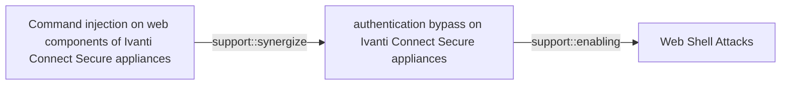

# Command injection on web components of Ivanti Connect Secure appliances

## Metadata

- **UUID**: `4b1c47ee-f45a-4b89-98e7-e943bcd5dd19`
- **Schema**: `threat::1.0`
- **Version**: `3`
- **Created**: `2024-01-15`
- **Modified**: `2024-04-18`
- **TLP**: clear (`TLP:CLEAR`)
- **Organisation**: EC DIGIT CSOC (`56b0a0f0-b0bc-47d9-bb46-02f80ae2065a`)

## References
### Public
- **1**: [https://www.volexity.com/blog/2024/01/10/active-exploitation-of-two-zero-day-vulnerabilities-in-ivanti-connect-secure-vpn/](https://www.volexity.com/blog/2024/01/10/active-exploitation-of-two-zero-day-vulnerabilities-in-ivanti-connect-secure-vpn/)
- **2**: [https://cert.europa.eu/publications/security-advisories/2024-004/](https://cert.europa.eu/publications/security-advisories/2024-004/)
- **3**: [https://lolbas-project.github.io/#](https://lolbas-project.github.io/#)

## Description
Attackers may manage to inject commands to an Ivanti Connect Secure 
appliance (that provide remote VPN access to corporate 
infrastructures) either with valid credentials for vulnerable 
authenticated endpoints or exploiting a vulnerability to bypass 
authentication.  

These vulnerabilities are identified as CVE-2024-21888 and 
CVE-2024-21893. CVE-2024-21893 have been exploited in the wild chained 
with CVE-2024-21887 and can lead to remote adversaries to execute 
arbitrary commands on targeted gateways.

In addition to the list of LOLbins see [3], following commands were 
used in the ICS attack is the following:
- aria2c
- at
- cat 
- check_ssl_cert
- crash
- crontab
- echo
- mount
- nohup
- pidstat
- sed
- split
- sysctl
- tcpdump
- wireshark
- tshark

## Criticality
**Severe** - A Severe priority incident is likely to result in a significant impact to public health or safety, national security, economic security, foreign relations, or civil liberties.

## Terrain
> **Attacker need remote access to an Ivanti Connect Secure appliance vulnerable to command injection

Domains: Embedded, Enterprise, Networking
Cve: CVE-2024-21887, CVE-2024-21888, CVE-2024-21893
Targets: Remote access, VPN Client
Platforms: Placeholder**

## Threat Assessment
| Dimension | Assessment | Description |
| --- | --- | --- |
| Severity | Highly significant incident | A cyber attack which has a serious impact on central government, (inter)national essential services, a large proportion of the (inter)national population, or the (inter)national economy. |
| Impact | Business disruption; Operating costs; Reputational Damages; Data Breach | - |
| Leverage | Infrastructure Compromise; Elevation of privilege; Log tampering; Modify configuration; Tampering; New Accounts | - |
| Viability | Almost certain | Nearly certain - 95-99% |
| Kill Chain | Exploitation | Techniques to exploit vulnerabilities in systems that may, amongst others, result in code execution. |

## Actors
| Actor | ID | Source | Description |
| --- | --- | --- | --- |
| Gelsemium | `misp::2dd31182-bae1-48ed-8bb3-805a3df89783` | ('misp',) | The Gelsemium group has been active since at least 2014 and was described in the past by a few security companies. Gelsemium’s name comes from one possible translation ESET found while reading a report from VenusTech who dubbed the group 狼毒草 for the first time. It’s the name of a genus of flowering plants belonging to the family Gelsemiaceae, Gelsemium elegans is the species that contains toxic compounds like Gelsemine, Gelsenicine and Gelsevirine, which ESET choses as names for the three components of this malware family. |

## ATT&CK Techniques
| Technique | Name | Description |
| --- | --- | --- |
| `T1190` | [Exploit Public-Facing Application](https://attack.mitre.org/techniques/T1190) | Adversaries may attempt to exploit a weakness in an Internet-facing host or system to initially access a network. The weakness in the system can be a software bug, a temporary glitch, or a misconfiguration.  Exploited applications are often websites/web servers, but can also include databases (like SQL), standard services (like SMB or SSH), network device administration and management protocols (like SNMP and Smart Install), and any other system with Internet-accessible open sockets.(Citation: NVD CVE-2016-6662)(Citation: CIS Multiple SMB Vulnerabilities)(Citation: US-CERT TA18-106A Network Infrastructure Devices 2018)(Citation: Cisco Blog Legacy Device Attacks)(Citation: NVD CVE-2014-7169) On ESXi infrastructure, adversaries may exploit exposed OpenSLP services; they may alternatively exploit exposed VMware vCenter servers.(Citation: Recorded Future ESXiArgs Ransomware 2023)(Citation: Ars Technica VMWare Code Execution Vulnerability 2021) Depending on the flaw being exploited, this may also involve [Exploitation for Defense Evasion](https://attack.mitre.org/techniques/T1211) or [Exploitation for Client Execution](https://attack.mitre.org/techniques/T1203).  If an application is hosted on cloud-based infrastructure and/or is containerized, then exploiting it may lead to compromise of the underlying instance or container. This can allow an adversary a path to access the cloud or container APIs (e.g., via the [Cloud Instance Metadata API](https://attack.mitre.org/techniques/T1552/005)), exploit container host access via [Escape to Host](https://attack.mitre.org/techniques/T1611), or take advantage of weak identity and access management policies.  Adversaries may also exploit edge network infrastructure and related appliances, specifically targeting devices that do not support robust host-based defenses.(Citation: Mandiant Fortinet Zero Day)(Citation: Wired Russia Cyberwar)  For websites and databases, the OWASP top 10 and CWE top 25 highlight the most common web-based vulnerabilities.(Citation: OWASP Top 10)(Citation: CWE top 25) |

## Chaining

### Chaining details
#### synergize -> authentication bypass on Ivanti Connect Secure appliances (`support::synergize`)
upon successful authentication bypass, attackers attempt to 
inject commands

- **Target UUID**: `810057c6-cb84-41e4-add4-ae56b52c8ab7`
#### enabling -> Web Shell Attacks (`support::enabling`)
attacker can drop web shell to add file or replace legit ones

- **Target UUID**: `4d6104e3-10d4-4a12-b081-d937df848891`
