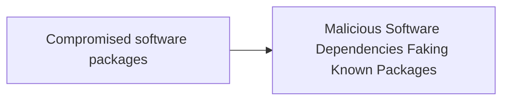

# Compromised software packages

## Metadata

- **UUID**: `1c1c9665-a30e-479b-bd80-1afb7b53ac83`
- **Schema**: `threat::1.0`
- **TLP**: clear

## Description
Compromised software packages in a supply chain attack refer to the
intentional or unintentional inclusion of malicious code or vulnerabilities
in software components, libraries, or dependencies that are used by multiple
organizations or products. This type of attack targets the software supply
chain, which includes all the organizations, people, and processes involved
in designing, developing, testing, building, delivering, and maintaining
software.

### Types of compromised software packages

- Malicious libraries or dependencies: Open-source or third-party libraries
that contain malicious code, which can be used to steal sensitive data,
disrupt operations, or create backdoors.
- Tampered software updates: Legitimate software updates that have been
compromised by an attacker, allowing them to inject malware or backdoors
into the updated software.
- Infected software components: Software components, such as DLLs or
executables, that contain malware or vulnerabilities, which can be
used to compromise the entire system.
- Fake or counterfeit software: Software that is intentionally designed
to mimic legitimate software, but contains malware or vulnerabilities.
- Typosquatting attacks: This type of approach includes a small changes
in the name of the software packages. In this way is very difficult to
recognise a malicious from a legitimate software package for installation.
The packages with names similar to legitimate ones could be deceiving and
easily lure the victim to download and use them. 

### Dependency poisoning 

Threat actors can add intentional vulnerabilities to open-source libraries
by exploiting their accessibility. Such example is typosquatting attacks
in which an adversary uploads malicious packages with names similar to
popular NPM or PyPI libraries to trick developers into downloading
the wrong one. Threat actors can also inject malicious code into trusted
libraries,for example: Log4j, NPM, or PyPI, compromising thousands of
applications that rely on them. This type of attack, often referred
to as “supply chain poisoning,” can have a massive impactful
consequences. ref [2].  

It's recommended a security officer to establish robust policies for
evaluating, approving, and managing open-source libraries. This includes
selecting packages from trusted sources and monitoring their activity.

## Techniques
- T1546.016
- T1195

## Chaining

