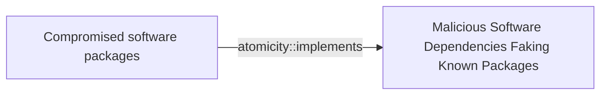

# Compromised software packages

## Metadata

- **UUID**: `1c1c9665-a30e-479b-bd80-1afb7b53ac83`
- **Schema**: `threat::1.0`
- **Version**: `1`
- **Created**: `2025-04-15`
- **Modified**: `2025-04-22`
- **TLP**: clear (`TLP:CLEAR`)
- **Organisation**: EC DIGIT CSOC (`56b0a0f0-b0bc-47d9-bb46-02f80ae2065a`)

## References
### Public
- **1**: [https://cycode.com/blog/software-supply-chain-risks/](https://cycode.com/blog/software-supply-chain-risks/)
- **2**: [https://www.balbix.com/insights/what-are-software-supply-chain-vulnerabilities-understanding-the-risks-how-to-mitigate-them/](https://www.balbix.com/insights/what-are-software-supply-chain-vulnerabilities-understanding-the-risks-how-to-mitigate-them/)
- **3**: [https://secureframe.com/blog/software-supply-chain-security](https://secureframe.com/blog/software-supply-chain-security)
- **4**: [https://www.bleepingcomputer.com/news/security/infostealer-campaign-compromises-10-npm-packages-targets-devs/](https://www.bleepingcomputer.com/news/security/infostealer-campaign-compromises-10-npm-packages-targets-devs/)
- **5**: [https://www.reversinglabs.com/blog/malicious-npm-patch-delivers-reverse-shell](https://www.reversinglabs.com/blog/malicious-npm-patch-delivers-reverse-shell)

## Description
Compromised software packages in a supply chain attack refer to the
intentional or unintentional inclusion of malicious code or vulnerabilities
in software components, libraries, or dependencies that are used by multiple
organizations or products. This type of attack targets the software supply
chain, which includes all the organizations, people, and processes involved
in designing, developing, testing, building, delivering, and maintaining
software.

### Types of compromised software packages

- Malicious libraries or dependencies: Open-source or third-party libraries
that contain malicious code, which can be used to steal sensitive data,
disrupt operations, or create backdoors.
- Tampered software updates: Legitimate software updates that have been
compromised by an attacker, allowing them to inject malware or backdoors
into the updated software.
- Infected software components: Software components, such as DLLs or
executables, that contain malware or vulnerabilities, which can be
used to compromise the entire system.
- Fake or counterfeit software: Software that is intentionally designed
to mimic legitimate software, but contains malware or vulnerabilities.
- Typosquatting attacks: This type of approach includes a small changes
in the name of the software packages. In this way is very difficult to
recognise a malicious from a legitimate software package for installation.
The packages with names similar to legitimate ones could be deceiving and
easily lure the victim to download and use them. 

### Dependency poisoning 

Threat actors can add intentional vulnerabilities to open-source libraries
by exploiting their accessibility. Such example is typosquatting attacks
in which an adversary uploads malicious packages with names similar to
popular NPM or PyPI libraries to trick developers into downloading
the wrong one. Threat actors can also inject malicious code into trusted
libraries,for example: Log4j, NPM, or PyPI, compromising thousands of
applications that rely on them. This type of attack, often referred
to as “supply chain poisoning,” can have a massive impactful
consequences. ref [2].  

It's recommended a security officer to establish robust policies for
evaluating, approving, and managing open-source libraries. This includes
selecting packages from trusted sources and monitoring their activity.

## Criticality
**High** - A High priority incident is likely to result in a demonstrable impact to public health or safety, national security, economic security, foreign relations, civil liberties, or public confidence.

## Terrain
> **A threat actor can use vulnerabilities in the function and appearance
of software malicious dev packages to entice a developer to install them.

Domains: Enterprise, IoT, Private Cloud, Public Cloud
Targets: CI/CD Pipelines, Developer, Workstations, Laptop
Platforms: Windows, macOS, Linux**

## Threat Assessment
| Dimension | Assessment | Description |
| --- | --- | --- |
| Severity | Highly significant incident | A cyber attack which has a serious impact on central government, (inter)national essential services, a large proportion of the (inter)national population, or the (inter)national economy. |
| Impact | Business disruption; Impairement; Lose Capabilities | - |
| Leverage | Information Disclosure; Infrastructure Compromise; Elevation of privilege; Tampering | - |
| Viability | Likely | Probable (probably) - 55-80% |
| Kill Chain | Exploitation | Techniques to exploit vulnerabilities in systems that may, amongst others, result in code execution. |

## Actors
| Actor | ID | Source | Description |
| --- | --- | --- | --- |
| UNC2452 | `misp::2ee5ed7a-c4d0-40be-a837-20817474a15b` | ('misp',) | Reporting regarding activity related to the SolarWinds supply chain injection has grown quickly since initial disclosure on 13 December 2020. A significant amount of press reporting has focused on the identification of the actor(s) involved, victim organizations, possible campaign timeline, and potential impact. The US Government and cyber community have also provided detailed information on how the campaign was likely conducted and some of the malware used.  MITRE’s ATT&CK team — with the assistance of contributors — has been mapping techniques used by the actor group, referred to as UNC2452/Dark Halo by FireEye and Volexity respectively, as well as SUNBURST and TEARDROP malware. |
| APT29 | `misp::b2056ff0-00b9-482e-b11c-c771daa5f28a` | ('misp',) | A 2015 report by F-Secure describe APT29 as: 'The Dukes are a well-resourced, highly dedicated and organized cyberespionage group that we believe has been working for the Russian Federation since at least 2008 to collect intelligence in support of foreign and security policy decision-making. The Dukes show unusual confidence in their ability to continue successfully compromising their targets, as well as in their ability to operate with impunity. The Dukes primarily target Western governments and related organizations, such as government ministries and agencies, political think tanks, and governmental subcontractors. Their targets have also included the governments of members of the Commonwealth of Independent States;Asian, African, and Middle Eastern governments;organizations associated with Chechen extremism;and Russian speakers engaged in the illicit trade of controlled substances and drugs. The Dukes are known to employ a vast arsenal of malware toolsets, which we identify as MiniDuke, CosmicDuke, OnionDuke, CozyDuke, CloudDuke, SeaDuke, HammerDuke, PinchDuke, and GeminiDuke. In recent years, the Dukes have engaged in apparently biannual large - scale spear - phishing campaigns against hundreds or even thousands of recipients associated with governmental institutions and affiliated organizations. These campaigns utilize a smash - and - grab approach involving a fast but noisy breakin followed by the rapid collection and exfiltration of as much data as possible.If the compromised target is discovered to be of value, the Dukes will quickly switch the toolset used and move to using stealthier tactics focused on persistent compromise and long - term intelligence gathering. This threat actor targets government ministries and agencies in the West, Central Asia, East Africa, and the Middle East; Chechen extremist groups; Russian organized crime; and think tanks. It is suspected to be behind the 2015 compromise of unclassified networks at the White House, Department of State, Pentagon, and the Joint Chiefs of Staff. The threat actor includes all of the Dukes tool sets, including MiniDuke, CosmicDuke, OnionDuke, CozyDuke, SeaDuke, CloudDuke (aka MiniDionis), and HammerDuke (aka Hammertoss). ' |
| [[Enterprise] APT29](https://attack.mitre.org/groups/G0016) | `att&ck::G0016` | ('att&ck',) | [APT29](https://attack.mitre.org/groups/G0016) is threat group that has been attributed to Russia's Foreign Intelligence Service (SVR).(Citation: White House Imposing Costs RU Gov April 2021)(Citation: UK Gov Malign RIS Activity April 2021) They have operated since at least 2008, often targeting government networks in Europe and NATO member countries, research institutes, and think tanks. [APT29](https://attack.mitre.org/groups/G0016) reportedly compromised the Democratic National Committee starting in the summer of 2015.(Citation: F-Secure The Dukes)(Citation: GRIZZLY STEPPE JAR)(Citation: Crowdstrike DNC June 2016)(Citation: UK Gov UK Exposes Russia SolarWinds April 2021)  In April 2021, the US and UK governments attributed the [SolarWinds Compromise](https://attack.mitre.org/campaigns/C0024) to the SVR; public statements included citations to [APT29](https://attack.mitre.org/groups/G0016), Cozy Bear, and The Dukes.(Citation: NSA Joint Advisory SVR SolarWinds April 2021)(Citation: UK NSCS Russia SolarWinds April 2021) Industry reporting also referred to the actors involved in this campaign as UNC2452, NOBELIUM, StellarParticle, Dark Halo, and SolarStorm.(Citation: FireEye SUNBURST Backdoor December 2020)(Citation: MSTIC NOBELIUM Mar 2021)(Citation: CrowdStrike SUNSPOT Implant January 2021)(Citation: Volexity SolarWinds)(Citation: Cybersecurity Advisory SVR TTP May 2021)(Citation: Unit 42 SolarStorm December 2020) |
| [[Enterprise] HAFNIUM](https://attack.mitre.org/groups/G0125) | `att&ck::G0125` | ('att&ck',) | [HAFNIUM](https://attack.mitre.org/groups/G0125) is a likely state-sponsored cyber espionage group operating out of China that has been active since at least January 2021. [HAFNIUM](https://attack.mitre.org/groups/G0125) primarily targets entities in the US across a number of industry sectors, including infectious disease researchers, law firms, higher education institutions, defense contractors, policy think tanks, and NGOs. [HAFNIUM](https://attack.mitre.org/groups/G0125) has targeted remote management tools and cloud software for intial access and has demonstrated an ability to quickly operationalize exploits for identified vulnerabilities in edge devices.(Citation: Microsoft HAFNIUM March 2020)(Citation: Volexity Exchange Marauder March 2021)(Citation: Microsoft Silk Typhoon MAR 2025) |
| HAFNIUM | `misp::4f05d6c1-3fc1-4567-91cd-dd4637cc38b5` | ('misp',) | HAFNIUM primarily targets entities in the United States across a number of industry sectors, including infectious disease researchers, law firms, higher education institutions, defense contractors, policy think tanks, and NGOs. Microsoft Threat Intelligence Center (MSTIC) attributes this campaign with high confidence to HAFNIUM, a group assessed to be state-sponsored and operating out of China, based on observed victimology, tactics and procedures. HAFNIUM has previously compromised victims by exploiting vulnerabilities in internet-facing servers, and has used legitimate open-source frameworks, like Covenant, for command and control. Once they’ve gained access to a victim network, HAFNIUM typically exfiltrates data to file sharing sites like MEGA.In campaigns unrelated to these vulnerabilities, Microsoft has observed HAFNIUM interacting with victim Office 365 tenants. While they are often unsuccessful in compromising customer accounts, this reconnaissance activity helps the adversary identify more details about their targets’ environments. HAFNIUM operates primarily from leased virtual private servers (VPS) in the United States. |
| [[Enterprise] menuPass](https://attack.mitre.org/groups/G0045) | `att&ck::G0045` | ('att&ck',) | [menuPass](https://attack.mitre.org/groups/G0045) is a threat group that has been active since at least 2006. Individual members of [menuPass](https://attack.mitre.org/groups/G0045) are known to have acted in association with the Chinese Ministry of State Security's (MSS) Tianjin State Security Bureau and worked for the Huaying Haitai Science and Technology Development Company.(Citation: DOJ APT10 Dec 2018)(Citation: District Court of NY APT10 Indictment December 2018)  [menuPass](https://attack.mitre.org/groups/G0045) has targeted healthcare, defense, aerospace, finance, maritime, biotechnology, energy, and government sectors globally, with an emphasis on Japanese organizations. In 2016 and 2017, the group is known to have targeted managed IT service providers (MSPs), manufacturing and mining companies, and a university.(Citation: Palo Alto menuPass Feb 2017)(Citation: Crowdstrike CrowdCast Oct 2013)(Citation: FireEye Poison Ivy)(Citation: PWC Cloud Hopper April 2017)(Citation: FireEye APT10 April 2017)(Citation: DOJ APT10 Dec 2018)(Citation: District Court of NY APT10 Indictment December 2018) |
| APT10 | `misp::56b37b05-72e7-4a89-ba8a-61ce45269a8c` | ('misp',) | menuPass is a threat group that has been active since at least 2006. Individual members of menuPass are known to have acted in association with the Chinese Ministry of State Security's (MSS) Tianjin State Security Bureau and worked for the Huaying Haitai Science and Technology Development Company. |
| [[Enterprise] Ke3chang](https://attack.mitre.org/groups/G0004) | `att&ck::G0004` | ('att&ck',) | [Ke3chang](https://attack.mitre.org/groups/G0004) is a threat group attributed to actors operating out of China. [Ke3chang](https://attack.mitre.org/groups/G0004) has targeted oil, government, diplomatic, military, and NGOs in Central and South America, the Caribbean, Europe, and North America since at least 2010.(Citation: Mandiant Operation Ke3chang November 2014)(Citation: NCC Group APT15 Alive and Strong)(Citation: APT15 Intezer June 2018)(Citation: Microsoft NICKEL December 2021) |
| APT15 | `misp::3501fbf2-098f-47e7-be6a-6b0ff5742ce8` | ('misp',) | This threat actor uses phishing techniques to compromise the networks of foreign ministries of European countries for espionage purposes. |
| [[Enterprise] Lazarus Group](https://attack.mitre.org/groups/G0032) | `att&ck::G0032` | ('att&ck',) | [Lazarus Group](https://attack.mitre.org/groups/G0032) is a North Korean state-sponsored cyber threat group that has been attributed to the Reconnaissance General Bureau.(Citation: US-CERT HIDDEN COBRA June 2017)(Citation: Treasury North Korean Cyber Groups September 2019) The group has been active since at least 2009 and was reportedly responsible for the November 2014 destructive wiper attack against Sony Pictures Entertainment as part of a campaign named Operation Blockbuster by Novetta. Malware used by [Lazarus Group](https://attack.mitre.org/groups/G0032) correlates to other reported campaigns, including Operation Flame, Operation 1Mission, Operation Troy, DarkSeoul, and Ten Days of Rain.(Citation: Novetta Blockbuster)  North Korean group definitions are known to have significant overlap, and some security researchers report all North Korean state-sponsored cyber activity under the name [Lazarus Group](https://attack.mitre.org/groups/G0032) instead of tracking clusters or subgroups, such as [Andariel](https://attack.mitre.org/groups/G0138), [APT37](https://attack.mitre.org/groups/G0067), [APT38](https://attack.mitre.org/groups/G0082), and [Kimsuky](https://attack.mitre.org/groups/G0094). |
| Lazarus Group | `misp::68391641-859f-4a9a-9a1e-3e5cf71ec376` | ('misp',) | Since 2009, HIDDEN COBRA actors have leveraged their capabilities to target and compromise a range of victims; some intrusions have resulted in the exfiltration of data while others have been disruptive in nature. Commercial reporting has referred to this activity as Lazarus Group and Guardians of Peace. Tools and capabilities used by HIDDEN COBRA actors include DDoS botnets, keyloggers, remote access tools (RATs), and wiper malware. Variants of malware and tools used by HIDDEN COBRA actors include Destover, Duuzer, and Hangman. |

## ATT&CK Techniques
| Technique | Name | Description |
| --- | --- | --- |
| `T1546.016` | [Event Triggered Execution: Installer Packages](https://attack.mitre.org/techniques/T1546/016) | Adversaries may establish persistence and elevate privileges by using an installer to trigger the execution of malicious content. Installer packages are OS specific and contain the resources an operating system needs to install applications on a system. Installer packages can include scripts that run prior to installation as well as after installation is complete. Installer scripts may inherit elevated permissions when executed. Developers often use these scripts to prepare the environment for installation, check requirements, download dependencies, and remove files after installation.(Citation: Installer Package Scripting Rich Trouton)  Using legitimate applications, adversaries have distributed applications with modified installer scripts to execute malicious content. When a user installs the application, they may be required to grant administrative permissions to allow the installation. At the end of the installation process of the legitimate application, content such as macOS `postinstall` scripts can be executed with the inherited elevated permissions. Adversaries can use these scripts to execute a malicious executable or install other malicious components (such as a [Launch Daemon](https://attack.mitre.org/techniques/T1543/004)) with the elevated permissions.(Citation: Application Bundle Manipulation Brandon Dalton)(Citation: wardle evilquest parti)(Citation: Windows AppleJeus GReAT)(Citation: Debian Manual Maintainer Scripts)  Depending on the distribution, Linux versions of package installer scripts are sometimes called maintainer scripts or post installation scripts. These scripts can include `preinst`, `postinst`, `prerm`, `postrm` scripts and run as root when executed.  For Windows, the Microsoft Installer services uses `.msi` files to manage the installing, updating, and uninstalling of applications. These installation routines may also include instructions to perform additional actions that may be abused by adversaries.(Citation: Microsoft Installation Procedures) |
| `T1195` | [Supply Chain Compromise](https://attack.mitre.org/techniques/T1195) | Adversaries may manipulate products or product delivery mechanisms prior to receipt by a final consumer for the purpose of data or system compromise.  Supply chain compromise can take place at any stage of the supply chain including:  * Manipulation of development tools * Manipulation of a development environment * Manipulation of source code repositories (public or private) * Manipulation of source code in open-source dependencies * Manipulation of software update/distribution mechanisms * Compromised/infected system images (multiple cases of removable media infected at the factory)(Citation: IBM Storwize)(Citation: Schneider Electric USB Malware)  * Replacement of legitimate software with modified versions * Sales of modified/counterfeit products to legitimate distributors * Shipment interdiction  While supply chain compromise can impact any component of hardware or software, adversaries looking to gain execution have often focused on malicious additions to legitimate software in software distribution or update channels.(Citation: Avast CCleaner3 2018)(Citation: Microsoft Dofoil 2018)(Citation: Command Five SK 2011) Targeting may be specific to a desired victim set or malicious software may be distributed to a broad set of consumers but only move on to additional tactics on specific victims.(Citation: Symantec Elderwood Sept 2012)(Citation: Avast CCleaner3 2018)(Citation: Command Five SK 2011) Popular open source projects that are used as dependencies in many applications may also be targeted as a means to add malicious code to users of the dependency.(Citation: Trendmicro NPM Compromise) |

## Chaining

### Chaining details
#### implements -> Malicious Software Dependencies Faking Known Packages (`atomicity::implements`)
Threat actors use a technique to mimic legitimate software
packages in order to mislead the developers in downloading
and infecting their systems.

- **Target UUID**: `78683822-44dc-41ac-8fef-b5f0968743c9`
