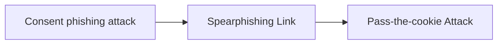

# Consent phishing attack

## Metadata

- **UUID**: `518ff777-f10d-4201-9e54-2779c31c512e`
- **Schema**: `threat::1.0`
- **TLP**: clear

## Description
In consent phishing, attackers create a phishing scheme, such as emailing a user with a
link to a required password update. If the user clicks the link, they are redirected to
a Microsoft 365 permission request. It may include this language:

“This app would like to
  Read your contacts
  Read and write access to your mail
  Send mail as you
  Sign you in and read your profile”

If the user consents to the permission request, the third-party app, controlled by the
attacker, will have high-level access to their account. The attacker can then use the 
account without actually having credential access or MFA codes.

## How the attack works

There are two components for a successful consent phishing attack, the OAuth 2.0
authorization protocol and social engineering.

OAuth 2.0 providers are used to allow applications to access a user's resources 
without needing passwords. If a user wants to use a new application, they may be 
presented with an option to sign up using their Google account, for example.
If they choose this option, Google will send an authorization code which will 
share the information needed to create an account.

Attackers exploit this permission step. They can register a malicious app with
an OAuth 2.0 provider to trick users into thinking it is a legitimate and trusted
source. Below are the steps typically seen while deploying a malicious OAuth app:

- Register a new single tenant application with the naming convention of
  [domain name]_([a-zA-Z]){3} (for example: Contoso_GhY)
- Add the legacy permission Exchange.ManageAsApp which can be used for app-only
  authentication of Exchange Online PowerShell module
- Grant admin consent to the above permission
- Give global admin and Exchange Online admin roles to the previously 
  registered application
- Add application credentials (key/certificate/both)  

Social engineering is also an important part of a consent phishing attack. 
Consent phishing emails are typically well crafted: the email is branded with a
spoof but legitimate-sounding business company, and the malicious link looks real
because the app had been properly registered with an OAuth 2.0 provider.

The legitimate components within a consent phishing campaign make it more dangerous.
Even the use of security measures such as MFA is no match for consent phishing.
The attack happens after the credentials have been entered and then acts
post-authentication to carry out persistent access to user data.

The consent phishing email also tricked users by playing on a sense of urgency 
and concern to review and sign an important business document. Here is what a
consent phishing attempt usually looks like:

- The attacker registers a malicious app with an OAuth 2.0 provider (eg. Azure AD).
- The app carries a reliable name and structure not to raise suspicion.
- The attacker sends a phishing email with a link to a user, asking to grant
  permission to the malicious app.
- The user clicks on the OAuth 2.0 URL which generates an authentic permission request.
- The user grants access to a malicious app, and an authorization code is sent
  to the attacker.
- The authorization code is redeemed for access tokens which an attacker uses
  to gain access to user data.

Once the user accepts the message, their data becomes accessible to the attacker.
This can include email, contacts, forwarding rules, files, notes, profile, etc.

## Techniques
- T1566.002

## Chaining

