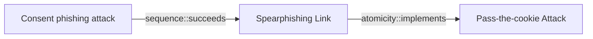

# Consent phishing attack

## Metadata

- **UUID**: `518ff777-f10d-4201-9e54-2779c31c512e`
- **Schema**: `threat::1.0`
- **Version**: `1`
- **Created**: `2024-10-23`
- **Modified**: `2024-11-05`
- **TLP**: clear (`TLP:CLEAR`)
- **Organisation**: EC DIGIT CSOC (`56b0a0f0-b0bc-47d9-bb46-02f80ae2065a`)

## References
### Public
- **1**: [https://www.infosecinstitute.com/resources/phishing/consent-phishing-how-attackers-abuse-oauth-2-0-permissions-to-dupe-users/](https://www.infosecinstitute.com/resources/phishing/consent-phishing-how-attackers-abuse-oauth-2-0-permissions-to-dupe-users/)
- **2**: [https://www.trendmicro.com/en_us/research/17/d/pawn-storm-abuses-open-authentication-advanced-social-engineering-attacks.html](https://www.trendmicro.com/en_us/research/17/d/pawn-storm-abuses-open-authentication-advanced-social-engineering-attacks.html)

## Description
In consent phishing, attackers create a phishing scheme, such as emailing a user with a
link to a required password update. If the user clicks the link, they are redirected to
a Microsoft 365 permission request. It may include this language:

“This app would like to
  Read your contacts
  Read and write access to your mail
  Send mail as you
  Sign you in and read your profile”

If the user consents to the permission request, the third-party app, controlled by the
attacker, will have high-level access to their account. The attacker can then use the 
account without actually having credential access or MFA codes.

## How the attack works

There are two components for a successful consent phishing attack, the OAuth 2.0
authorization protocol and social engineering.

OAuth 2.0 providers are used to allow applications to access a user's resources 
without needing passwords. If a user wants to use a new application, they may be 
presented with an option to sign up using their Google account, for example.
If they choose this option, Google will send an authorization code which will 
share the information needed to create an account.

Attackers exploit this permission step. They can register a malicious app with
an OAuth 2.0 provider to trick users into thinking it is a legitimate and trusted
source. Below are the steps typically seen while deploying a malicious OAuth app:

- Register a new single tenant application with the naming convention of
  [domain name]_([a-zA-Z]){3} (for example: Contoso_GhY)
- Add the legacy permission Exchange.ManageAsApp which can be used for app-only
  authentication of Exchange Online PowerShell module
- Grant admin consent to the above permission
- Give global admin and Exchange Online admin roles to the previously 
  registered application
- Add application credentials (key/certificate/both)  

Social engineering is also an important part of a consent phishing attack. 
Consent phishing emails are typically well crafted: the email is branded with a
spoof but legitimate-sounding business company, and the malicious link looks real
because the app had been properly registered with an OAuth 2.0 provider.

The legitimate components within a consent phishing campaign make it more dangerous.
Even the use of security measures such as MFA is no match for consent phishing.
The attack happens after the credentials have been entered and then acts
post-authentication to carry out persistent access to user data.

The consent phishing email also tricked users by playing on a sense of urgency 
and concern to review and sign an important business document. Here is what a
consent phishing attempt usually looks like:

- The attacker registers a malicious app with an OAuth 2.0 provider (eg. Azure AD).
- The app carries a reliable name and structure not to raise suspicion.
- The attacker sends a phishing email with a link to a user, asking to grant
  permission to the malicious app.
- The user clicks on the OAuth 2.0 URL which generates an authentic permission request.
- The user grants access to a malicious app, and an authorization code is sent
  to the attacker.
- The authorization code is redeemed for access tokens which an attacker uses
  to gain access to user data.

Once the user accepts the message, their data becomes accessible to the attacker.
This can include email, contacts, forwarding rules, files, notes, profile, etc.

## Criticality
**High** - A High priority incident is likely to result in a demonstrable impact to public health or safety, national security, economic security, foreign relations, civil liberties, or public confidence.

## Terrain
> **User must click on a malicious link sent via email by attackers

Domains: SaaS, Public Cloud
Targets: API Endpoints, End-user, Auth token, Cloud Portal
Platforms: Azure, Office 365, Azure AD, Exchange**

## Threat Assessment
| Dimension | Assessment | Description |
| --- | --- | --- |
| Severity | Moderate incident | A cyber attack on a small organisation, or which poses a considerable risk to a medium-sized organisation, or preliminary indications of cyber activity against a large organisation or the government. |
| Impact | Identity Theft; Impairement; Reputational Damages | - |
| Leverage | Elevation of privilege; Spoofing; Modify privileges; Infrastructure Compromise | - |
| Viability | Likely | Probable (probably) - 55-80% |
| Kill Chain | Credential Access | Techniques resulting in the access of, or control over, system, service or domain credentials. |

## Actors
| Actor | ID | Source | Description |
| --- | --- | --- | --- |
| [[Enterprise] APT28](https://attack.mitre.org/groups/G0007) | `att&ck::G0007` | ('att&ck',) | [APT28](https://attack.mitre.org/groups/G0007) is a threat group that has been attributed to Russia's General Staff Main Intelligence Directorate (GRU) 85th Main Special Service Center (GTsSS) military unit 26165.(Citation: NSA/FBI Drovorub August 2020)(Citation: Cybersecurity Advisory GRU Brute Force Campaign July 2021) This group has been active since at least 2004.(Citation: DOJ GRU Indictment Jul 2018)(Citation: Ars Technica GRU indictment Jul 2018)(Citation: Crowdstrike DNC June 2016)(Citation: FireEye APT28)(Citation: SecureWorks TG-4127)(Citation: FireEye APT28 January 2017)(Citation: GRIZZLY STEPPE JAR)(Citation: Sofacy DealersChoice)(Citation: Palo Alto Sofacy 06-2018)(Citation: Symantec APT28 Oct 2018)(Citation: ESET Zebrocy May 2019)  [APT28](https://attack.mitre.org/groups/G0007) reportedly compromised the Hillary Clinton campaign, the Democratic National Committee, and the Democratic Congressional Campaign Committee in 2016 in an attempt to interfere with the U.S. presidential election.(Citation: Crowdstrike DNC June 2016) In 2018, the US indicted five GRU Unit 26165 officers associated with [APT28](https://attack.mitre.org/groups/G0007) for cyber operations (including close-access operations) conducted between 2014 and 2018 against the World Anti-Doping Agency (WADA), the US Anti-Doping Agency, a US nuclear facility, the Organization for the Prohibition of Chemical Weapons (OPCW), the Spiez Swiss Chemicals Laboratory, and other organizations.(Citation: US District Court Indictment GRU Oct 2018) Some of these were conducted with the assistance of GRU Unit 74455, which is also referred to as [Sandworm Team](https://attack.mitre.org/groups/G0034). |
| APT28 | `misp::5b4ee3ea-eee3-4c8e-8323-85ae32658754` | ('misp',) | The Sofacy Group (also known as APT28, Pawn Storm, Fancy Bear and Sednit) is a cyber espionage group believed to have ties to the Russian government. Likely operating since 2007, the group is known to target government, military, and security organizations. It has been characterized as an advanced persistent threat. |
| [[Enterprise] APT29](https://attack.mitre.org/groups/G0016) | `att&ck::G0016` | ('att&ck',) | [APT29](https://attack.mitre.org/groups/G0016) is threat group that has been attributed to Russia's Foreign Intelligence Service (SVR).(Citation: White House Imposing Costs RU Gov April 2021)(Citation: UK Gov Malign RIS Activity April 2021) They have operated since at least 2008, often targeting government networks in Europe and NATO member countries, research institutes, and think tanks. [APT29](https://attack.mitre.org/groups/G0016) reportedly compromised the Democratic National Committee starting in the summer of 2015.(Citation: F-Secure The Dukes)(Citation: GRIZZLY STEPPE JAR)(Citation: Crowdstrike DNC June 2016)(Citation: UK Gov UK Exposes Russia SolarWinds April 2021)  In April 2021, the US and UK governments attributed the [SolarWinds Compromise](https://attack.mitre.org/campaigns/C0024) to the SVR; public statements included citations to [APT29](https://attack.mitre.org/groups/G0016), Cozy Bear, and The Dukes.(Citation: NSA Joint Advisory SVR SolarWinds April 2021)(Citation: UK NSCS Russia SolarWinds April 2021) Industry reporting also referred to the actors involved in this campaign as UNC2452, NOBELIUM, StellarParticle, Dark Halo, and SolarStorm.(Citation: FireEye SUNBURST Backdoor December 2020)(Citation: MSTIC NOBELIUM Mar 2021)(Citation: CrowdStrike SUNSPOT Implant January 2021)(Citation: Volexity SolarWinds)(Citation: Cybersecurity Advisory SVR TTP May 2021)(Citation: Unit 42 SolarStorm December 2020) |
| UNC2452 | `misp::2ee5ed7a-c4d0-40be-a837-20817474a15b` | ('misp',) | Reporting regarding activity related to the SolarWinds supply chain injection has grown quickly since initial disclosure on 13 December 2020. A significant amount of press reporting has focused on the identification of the actor(s) involved, victim organizations, possible campaign timeline, and potential impact. The US Government and cyber community have also provided detailed information on how the campaign was likely conducted and some of the malware used.  MITRE’s ATT&CK team — with the assistance of contributors — has been mapping techniques used by the actor group, referred to as UNC2452/Dark Halo by FireEye and Volexity respectively, as well as SUNBURST and TEARDROP malware. |

## ATT&CK Techniques
| Technique | Name | Description |
| --- | --- | --- |
| `T1566.002` | [Phishing: Spearphishing Link](https://attack.mitre.org/techniques/T1566/002) | Adversaries may send spearphishing emails with a malicious link in an attempt to gain access to victim systems. Spearphishing with a link is a specific variant of spearphishing. It is different from other forms of spearphishing in that it employs the use of links to download malware contained in email, instead of attaching malicious files to the email itself, to avoid defenses that may inspect email attachments. Spearphishing may also involve social engineering techniques, such as posing as a trusted source.  All forms of spearphishing are electronically delivered social engineering targeted at a specific individual, company, or industry. In this case, the malicious emails contain links. Generally, the links will be accompanied by social engineering text and require the user to actively click or copy and paste a URL into a browser, leveraging [User Execution](https://attack.mitre.org/techniques/T1204). The visited website may compromise the web browser using an exploit, or the user will be prompted to download applications, documents, zip files, or even executables depending on the pretext for the email in the first place.  Adversaries may also include links that are intended to interact directly with an email reader, including embedded images intended to exploit the end system directly. Additionally, adversaries may use seemingly benign links that abuse special characters to mimic legitimate websites (known as an "IDN homograph attack").(Citation: CISA IDN ST05-016) URLs may also be obfuscated by taking advantage of quirks in the URL schema, such as the acceptance of integer- or hexadecimal-based hostname formats and the automatic discarding of text before an “@” symbol: for example, `hxxp://google.com@1157586937`.(Citation: Mandiant URL Obfuscation 2023)  Adversaries may also utilize links to perform consent phishing, typically with OAuth 2.0 request URLs that when accepted by the user provide permissions/access for malicious applications, allowing adversaries to  [Steal Application Access Token](https://attack.mitre.org/techniques/T1528)s.(Citation: Trend Micro Pawn Storm OAuth 2017) These stolen access tokens allow the adversary to perform various actions on behalf of the user via API calls. (Citation: Microsoft OAuth 2.0 Consent Phishing 2021)  Adversaries may also utilize spearphishing links to [Steal Application Access Token](https://attack.mitre.org/techniques/T1528)s that grant immediate access to the victim environment. For example, a user may be lured through “consent phishing” into granting adversaries permissions/access via a malicious OAuth 2.0 request URL .(Citation: Trend Micro Pawn Storm OAuth 2017)(Citation: Microsoft OAuth 2.0 Consent Phishing 2021)  Similarly, malicious links may also target device-based authorization, such as OAuth 2.0 device authorization grant flow which is typically used to authenticate devices without UIs/browsers. Known as “device code phishing,” an adversary may send a link that directs the victim to a malicious authorization page where the user is tricked into entering a code/credentials that produces a device token.(Citation: SecureWorks Device Code Phishing 2021)(Citation: Netskope Device Code Phishing 2021)(Citation: Optiv Device Code Phishing 2021) |

## Chaining

### Chaining details
#### succeeds -> Spearphishing Link (`sequence::succeeds`)
targeted user must click on a link

- **Target UUID**: `1a68b5eb-0112-424d-a21f-88dda0b6b8df`
#### implements -> Pass-the-cookie Attack (`atomicity::implements`)
technique used to steal browser cookies

- **Target UUID**: `b0d6bf74-b204-4a48-9509-4499ed795771`
