# Credential manipulation on local Windows endpoint

## Metadata

- **UUID**: `ec8201d4-c135-406b-a3b5-4a070e80a2ee`
- **Schema**: `threat::1.0`
- **TLP**: clear

## Description
Credential manipulation on a local Windows endpoint refers to an act of
modifying, altering, or stealing sensitive information such as usernames,
passwords, and other authentication data.   

An example of credential manipulation could be the usage of a tool, for
example like Mimikatz to extract login credentials from memory or to
manipulate and modify existing credentials stored on the local system.
The threat actor could use these manipulated credentials to gain
unauthorized access to other systems or network resources.   

The threat actors abuse and some legitimate administrator tools, such as
the Microsoft Sysinternals tool: ProcDump or Task Manager to dump lsass.exe
process memory and to collect credentials. This approach is common and
known as "living-off-the-land", which means usage of legit native Windows
tools in order to avoid possible detection.   

Threat actors can gather, modify or delete credentials on the local Windows
system also by using Windows Explorer manually or with scrips to access
local files that may store user's or system credentials. For example
Keepass or other local databases which contain passwords.   

Examples:   

Threat actors are using Mimikatz LSADUMP Module to collect SAM registry
hashes.   

lsadump::sam   

Or to extract credentials from LSASS Dump files. 
Mimikatz module lsass.exe dumps credentials in a more stealthy mode.
The lsass.exe process manages many user credential secrets and can be
associated with credential theft behavior.   

sekurlsa::minidump lsass.dmp
log lsass.txt
sekurlsa::logonPasswords   

For extracting of Domain Controller cached credentials is used LSADUMP module:
lsadump::cache   

Locally, the threat actors can run sekurlsa Mimikatz module to obtain logon
credentials:   

sekurlsa::Minidump lsassdump.dmp
sekurlsa::logonPasswords   

Built-in Windows tools such as comsvcs.dll can also be used:   

rundll32.exe C:\Windows\System32\comsvcs.dll MiniDump PID lsass.dmp full   

There are variety of different tools that the threat actors use for
memory dump, for example:   

- Taskmgr.exe
- ProcDump
- ProcessExplorer.exe
- Process Hacker
- SQLDumper
- PowerSploit – Out-MiniDump
- VM Memory Dump Files
- Hibernation Files

## Techniques
- T1098
- T1098.001
- T1552.001
- T1003.001
- T1003

## Chaining

```mermaid
flowchart LR
ec8201d4_c135_406b_a3b5_4a070e80a2ee["Credential manipulation on local Windows endpoint"]
5ea50181_1124_49aa_9d2c_c74103e86fd5["Pass-the-hash on SMB network shares"]
03cc9593_e7cf_484b_ae9c_684bf6f7199f["Pass the ticket using Kerberos ticket"]
479a8b31_5f7e_4fd6_94ca_a5556315e1b8["Pass the hash using impersonation within an existing process"]
4472e2b0_3dca_4d84_aab0_626fcba04fce["Pass the hash attack to elevate privileges"]
7351e2ca_e198_427c_9cfa_202df36f6e2a["Mimikatz execution on compromised endpoint"]
06523ed4_7881_4466_9ac5_f8417e972d13["Using a Windows command prompt for credential manipulation"]
e3d7cb59_7aca_4c3d_b488_48c785930b6d["PowerShell usage for credential manipulation"]
a566e405_e9db_475f_8447_7875fa127716["Script execution on Windows for credential manipulation"]
2d0beed6_6520_4114_be1f_24067628e93c["Manipulation of credentials stored in LSASS"]
ec8201d4_c135_406b_a3b5_4a070e80a2ee --> 5ea50181_1124_49aa_9d2c_c74103e86fd5
5ea50181_1124_49aa_9d2c_c74103e86fd5 --> 03cc9593_e7cf_484b_ae9c_684bf6f7199f
03cc9593_e7cf_484b_ae9c_684bf6f7199f --> 479a8b31_5f7e_4fd6_94ca_a5556315e1b8
479a8b31_5f7e_4fd6_94ca_a5556315e1b8 --> 4472e2b0_3dca_4d84_aab0_626fcba04fce
4472e2b0_3dca_4d84_aab0_626fcba04fce --> 7351e2ca_e198_427c_9cfa_202df36f6e2a
7351e2ca_e198_427c_9cfa_202df36f6e2a --> 06523ed4_7881_4466_9ac5_f8417e972d13
06523ed4_7881_4466_9ac5_f8417e972d13 --> e3d7cb59_7aca_4c3d_b488_48c785930b6d
e3d7cb59_7aca_4c3d_b488_48c785930b6d --> a566e405_e9db_475f_8447_7875fa127716
a566e405_e9db_475f_8447_7875fa127716 --> 2d0beed6_6520_4114_be1f_24067628e93c
```

