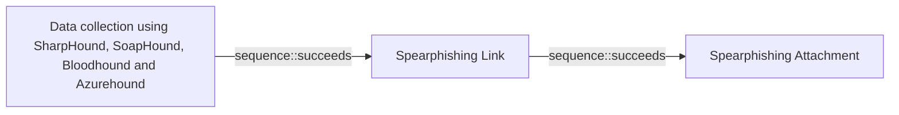

# Data collection using SharpHound, SoapHound, Bloodhound and Azurehound

## Metadata

- **UUID**: `53063205-4404-4e6d-a2f5-d566c6085d96`
- **Schema**: `threat::1.0`
- **Version**: `2`
- **Created**: `2025-03-20`
- **Modified**: `2025-05-12`
- **TLP**: clear (`TLP:CLEAR`)
- **Organisation**: EC DIGIT CSOC (`56b0a0f0-b0bc-47d9-bb46-02f80ae2065a`)

## References
### Public
- **1**: [https://www.evolvesecurity.com/blog-posts/tools-of-the-trade-tracking-security-misconfigurations-with-bloodhound](https://www.evolvesecurity.com/blog-posts/tools-of-the-trade-tracking-security-misconfigurations-with-bloodhound)
- **2**: [https://bloodhound.readthedocs.io/en/latest/data-analysis/bloodhound-gui.html](https://bloodhound.readthedocs.io/en/latest/data-analysis/bloodhound-gui.html)
- **3**: [https://www.sans.org/blog/bloodhound-sniffing-out-path-through-windows-domains/](https://www.sans.org/blog/bloodhound-sniffing-out-path-through-windows-domains/)
- **4**: [https://support.bloodhoundenterprise.io/hc/en-us/articles/9263138135963-SharpHound-Enterprise-Data-Collection-and-Permissions](https://support.bloodhoundenterprise.io/hc/en-us/articles/9263138135963-SharpHound-Enterprise-Data-Collection-and-Permissions)
- **5**: [https://posts.specterops.io/introducing-bloodhound-4-0-the-azure-update-9b2b26c5e350](https://posts.specterops.io/introducing-bloodhound-4-0-the-azure-update-9b2b26c5e350)

## Description
The threat vector of data collection using SharpHound, BloodHound, and AzureHound 
represents a sophisticated method for gathering and analyzing information about 
an organization's Active Directory (AD) and Azure environments. This vector is 
particularly concerning because it can be used by both security professionals and 
malicious actors to map out potential attack paths and vulnerabilities.    

## Tools Overview    

**SharpHound**: A data collection tool designed for Active Directory environments. 
It gathers information about users, groups, computers, and their relationships within 
the AD structure.    

**BloodHound**: A visualization tool that ingests data collected by SharpHound and 
AzureHound. It presents the information in a graph format, allowing for the identification 
of complex attack paths and security misconfigurations.    

**AzureHound**: The cloud counterpart to SharpHound, specifically designed to collect 
data from Azure Active Directory and Azure Resource Manager.    

**SoapHound**: It is an enumeration tool in Active Directory Web Services (ADWS) debug logs. 
ADWS enumeration creates multiple GetXmlValue events for each attribute, it leverages the ADWS 
protocol (SOAP over port 9389) instead of traditional LDAP queries.
LDAP queries are wrapped within a series of SOAP messages, which are sent to the ADWS server 
using NET TCP Binding communication channel. Following, ADWS server unwraps the LDAP queries
and forwards them to the LDAP server running on the same Domain Controller. As a result, LDAP
traffic is not sent via the wire and therefore is not easily detected by common monitoring tools.

## Threat Vector Mechanics    

The mechanics of this threat vector involve the systematic collection, processing, 
and analysis of data from Active Directory (AD) and Azure environments to identify 
potential attack paths. Here's how it works:    

1. **Data Collection**:
  - **SharpHound** gathers data from Active Directory using LDAP/LDAPS queries 
  and RPC over named pipes. It collects information on domain trusts, object properties 
  (users, groups, computers, etc.), ACLs, group memberships, and more.
  - **AzureHound** collects data from Azure AD and Azure Resource Manager (AzureRM) 
  using Microsoft Graph and Azure REST APIs. It retrieves information about admin 
  roles, users, groups, apps, devices, service principals, and other Azure objects 
  accessible to the authenticated user.
  - These tools generate JSON files containing detailed information about the target 
  environment.    

2. **Data Packaging**:
  - The collected data is compressed into ZIP files for efficient transfer and 
  storage. These files are ready for ingestion into the BloodHound database.    

3. **Data Ingestion**:
  - The ZIP files are imported into a Neo4j graph database via the BloodHound interface. 
  This database serves as the backbone for analyzing relationships and permissions 
  within the collected data.    

4. **Graph Analysis**:
  - BloodHound visualizes the data as a graph where nodes represent objects 
  (e.g., users, groups, computers) and edges represent relationships or permissions 
  (e.g., group memberships or access rights).
  - Users can perform Cypher queries to identify attack paths such as privilege 
  escalation opportunities or lateral movement routes.    

5. **Attack Path Discovery**:
  - The visualized graph highlights misconfigurations or exploitable relationships 
  that attackers can leverage (e.g., accounts with excessive privileges or vulnerable trust relationships).    

This process enables attackers to systematically uncover weaknesses in AD or Azure 
environments for exploitation.

### How the Threat Works

- **Stealthy Protocol**: SOAPHound uses ADWS, which is less commonly monitored than 
LDAP, allowing attackers to collect data with minimal detection.
- **Bulk Collection**: It gathers large amounts of directory data-such as users, 
groups, computers, group memberships, and access control lists (ACLs)-in a few bulk 
queries rather than thousands of individual LDAP requests.
- **Sensitive Information**: The data collected includes everything needed to map 
attack paths, identify privilege escalation opportunities, and plan lateral movement 
within the AD environment.
- **BloodHound Compatibility**: The output is formatted for BloodHound, a tool used 
to visualize and analyze attack paths in AD.

### Key Data Collected

- **User and Group Listings**: Names, SIDs, group memberships.
- **Computer Accounts**: Details about machines in the domain.
- **ACLs/Permissions**: Who has rights over what objects.
- **Certificate Authority Info**: For potential abuse in AD CS attacks.

## Criticality
**High** - A High priority incident is likely to result in a demonstrable impact to public health or safety, national security, economic security, foreign relations, civil liberties, or public confidence.

## Terrain
> **Attackers need to establish an initial presence within the target environment, in 
order to gather sufficient permissions to execute the data collection tools.

Domains: Embedded, Enterprise, Networking, Private Cloud, Public Cloud
Targets: Identity Services, Public-Facing Servers, Virtual Machines, Serverless, Email Platform, Web Application Servers, API Endpoints, Cloud Portal, Software Containers, IaaS, SAML-Joined Applications, Server Authentication
Platforms: Azure, Azure AD, Windows, Active Directory, Azure AKS, Linux**

## Threat Assessment
| Dimension | Assessment | Description |
| --- | --- | --- |
| Severity | Significant incident | A cyber attack which has a serious impact on a large organisation or on wider / local government, or which poses a considerable risk to central government or (inter)national essential services. |
| Impact | Data Breach; IP Loss; Reputational Damages; Identity Theft; Monetary Loss; Lose Capabilities; Catastrophic Loss | - |
| Leverage | Spoofing; Tampering; Repudiation; Infrastructure Compromise; Information Disclosure; Elevation of privilege | - |
| Viability | Likely | Probable (probably) - 55-80% |
| Kill Chain | Reconnaissance | Researching, identifying and selecting targets using active or passive reconnaissance. |

## Actors
| Actor | ID | Source | Description |
| --- | --- | --- | --- |
| WIZARD SPIDER | `misp::bdf4fe4f-af8a-495f-a719-cf175cecda1f` | ('misp',) | Wizard Spider is reportedly associated with Grim Spider and Lunar Spider. The WIZARD SPIDER threat group is the Russia-based operator of the TrickBot banking malware. This group represents a growing criminal enterprise of which GRIM SPIDER appears to be a subset. The LUNAR SPIDER threat group is the Eastern European-based operator and developer of the commodity banking malware called BokBot (aka IcedID), which was first observed in April 2017. The BokBot malware provides LUNAR SPIDER affiliates with a variety of capabilities to enable credential theft and wire fraud, through the use of webinjects and a malware distribution function. GRIM SPIDER is a sophisticated eCrime group that has been operating the Ryuk ransomware since August 2018, targeting large organizations for a high-ransom return. This methodology, known as “big game hunting,” signals a shift in operations for WIZARD SPIDER, a criminal enterprise of which GRIM SPIDER appears to be a cell. The WIZARD SPIDER threat group, known as the Russia-based operator of the TrickBot banking malware, had focused primarily on wire fraud in the past. |
| APT29 | `misp::b2056ff0-00b9-482e-b11c-c771daa5f28a` | ('misp',) | A 2015 report by F-Secure describe APT29 as: 'The Dukes are a well-resourced, highly dedicated and organized cyberespionage group that we believe has been working for the Russian Federation since at least 2008 to collect intelligence in support of foreign and security policy decision-making. The Dukes show unusual confidence in their ability to continue successfully compromising their targets, as well as in their ability to operate with impunity. The Dukes primarily target Western governments and related organizations, such as government ministries and agencies, political think tanks, and governmental subcontractors. Their targets have also included the governments of members of the Commonwealth of Independent States;Asian, African, and Middle Eastern governments;organizations associated with Chechen extremism;and Russian speakers engaged in the illicit trade of controlled substances and drugs. The Dukes are known to employ a vast arsenal of malware toolsets, which we identify as MiniDuke, CosmicDuke, OnionDuke, CozyDuke, CloudDuke, SeaDuke, HammerDuke, PinchDuke, and GeminiDuke. In recent years, the Dukes have engaged in apparently biannual large - scale spear - phishing campaigns against hundreds or even thousands of recipients associated with governmental institutions and affiliated organizations. These campaigns utilize a smash - and - grab approach involving a fast but noisy breakin followed by the rapid collection and exfiltration of as much data as possible.If the compromised target is discovered to be of value, the Dukes will quickly switch the toolset used and move to using stealthier tactics focused on persistent compromise and long - term intelligence gathering. This threat actor targets government ministries and agencies in the West, Central Asia, East Africa, and the Middle East; Chechen extremist groups; Russian organized crime; and think tanks. It is suspected to be behind the 2015 compromise of unclassified networks at the White House, Department of State, Pentagon, and the Joint Chiefs of Staff. The threat actor includes all of the Dukes tool sets, including MiniDuke, CosmicDuke, OnionDuke, CozyDuke, SeaDuke, CloudDuke (aka MiniDionis), and HammerDuke (aka Hammertoss). ' |
| TA505 | `misp::03c80674-35f8-4fe0-be2b-226ed0fcd69f` | ('misp',) | TA505, the name given by Proofpoint, has been in the cybercrime business for at least four years. This is the group behind the infamous Dridex banking trojan and Locky ransomware, delivered through malicious email campaigns via Necurs botnet. Other malware associated with TA505 include Philadelphia and GlobeImposter ransomware families. |

## ATT&CK Techniques
| Technique | Name | Description |
| --- | --- | --- |
| `T1087` | [Account Discovery](https://attack.mitre.org/techniques/T1087) | Adversaries may attempt to get a listing of valid accounts, usernames, or email addresses on a system or within a compromised environment. This information can help adversaries determine which accounts exist, which can aid in follow-on behavior such as brute-forcing, spear-phishing attacks, or account takeovers (e.g., [Valid Accounts](https://attack.mitre.org/techniques/T1078)).  Adversaries may use several methods to enumerate accounts, including abuse of existing tools, built-in commands, and potential misconfigurations that leak account names and roles or permissions in the targeted environment.  For examples, cloud environments typically provide easily accessible interfaces to obtain user lists.(Citation: AWS List Users)(Citation: Google Cloud - IAM Servie Accounts List API) On hosts, adversaries can use default [PowerShell](https://attack.mitre.org/techniques/T1059/001) and other command line functionality to identify accounts. Information about email addresses and accounts may also be extracted by searching an infected system’s files. |
| `T1069` | [Permission Groups Discovery](https://attack.mitre.org/techniques/T1069) | Adversaries may attempt to discover group and permission settings. This information can help adversaries determine which user accounts and groups are available, the membership of users in particular groups, and which users and groups have elevated permissions.  Adversaries may attempt to discover group permission settings in many different ways. This data may provide the adversary with information about the compromised environment that can be used in follow-on activity and targeting.(Citation: CrowdStrike BloodHound April 2018) |
| `T1482` | [Domain Trust Discovery](https://attack.mitre.org/techniques/T1482) | Adversaries may attempt to gather information on domain trust relationships that may be used to identify lateral movement opportunities in Windows multi-domain/forest environments. Domain trusts provide a mechanism for a domain to allow access to resources based on the authentication procedures of another domain.(Citation: Microsoft Trusts) Domain trusts allow the users of the trusted domain to access resources in the trusting domain. The information discovered may help the adversary conduct [SID-History Injection](https://attack.mitre.org/techniques/T1134/005), [Pass the Ticket](https://attack.mitre.org/techniques/T1550/003), and [Kerberoasting](https://attack.mitre.org/techniques/T1558/003).(Citation: AdSecurity Forging Trust Tickets)(Citation: Harmj0y Domain Trusts) Domain trusts can be enumerated using the `DSEnumerateDomainTrusts()` Win32 API call, .NET methods, and LDAP.(Citation: Harmj0y Domain Trusts) The Windows utility [Nltest](https://attack.mitre.org/software/S0359) is known to be used by adversaries to enumerate domain trusts.(Citation: Microsoft Operation Wilysupply) |
| `T1018` | [Remote System Discovery](https://attack.mitre.org/techniques/T1018) | Adversaries may attempt to get a listing of other systems by IP address, hostname, or other logical identifier on a network that may be used for Lateral Movement from the current system. Functionality could exist within remote access tools to enable this, but utilities available on the operating system could also be used such as  [Ping](https://attack.mitre.org/software/S0097), <code>net view</code> using [Net](https://attack.mitre.org/software/S0039), or, on ESXi servers, `esxcli network diag ping`.  Adversaries may also analyze data from local host files (ex: <code>C:\Windows\System32\Drivers\etc\hosts</code> or <code>/etc/hosts</code>) or other passive means (such as local [Arp](https://attack.mitre.org/software/S0099) cache entries) in order to discover the presence of remote systems in an environment.  Adversaries may also target discovery of network infrastructure as well as leverage [Network Device CLI](https://attack.mitre.org/techniques/T1059/008) commands on network devices to gather detailed information about systems within a network (e.g. <code>show cdp neighbors</code>, <code>show arp</code>).(Citation: US-CERT-TA18-106A)(Citation: CISA AR21-126A FIVEHANDS May 2021) |
| `T1201` | [Password Policy Discovery](https://attack.mitre.org/techniques/T1201) | Adversaries may attempt to access detailed information about the password policy used within an enterprise network or cloud environment. Password policies are a way to enforce complex passwords that are difficult to guess or crack through [Brute Force](https://attack.mitre.org/techniques/T1110). This information may help the adversary to create a list of common passwords and launch dictionary and/or brute force attacks which adheres to the policy (e.g. if the minimum password length should be 8, then not trying passwords such as 'pass123'; not checking for more than 3-4 passwords per account if the lockout is set to 6 as to not lock out accounts).  Password policies can be set and discovered on Windows, Linux, and macOS systems via various command shell utilities such as <code>net accounts (/domain)</code>, <code>Get-ADDefaultDomainPasswordPolicy</code>, <code>chage -l <username></code>, <code>cat /etc/pam.d/common-password</code>, and <code>pwpolicy getaccountpolicies</code> (Citation: Superuser Linux Password Policies) (Citation: Jamf User Password Policies). Adversaries may also leverage a [Network Device CLI](https://attack.mitre.org/techniques/T1059/008) on network devices to discover password policy information (e.g. <code>show aaa</code>, <code>show aaa common-criteria policy all</code>).(Citation: US-CERT-TA18-106A)  Password policies can be discovered in cloud environments using available APIs such as <code>GetAccountPasswordPolicy</code> in AWS (Citation: AWS GetPasswordPolicy). |

## Chaining

### Chaining details
#### succeeds -> Spearphishing Link (`sequence::succeeds`)
Adversaries may send spearphishing emails with a malicious link in an
attempt to gain access to victim systems.

- **Target UUID**: `1a68b5eb-0112-424d-a21f-88dda0b6b8df`
#### succeeds -> Spearphishing Attachment (`sequence::succeeds`)
In Spearphishing Attachment attacks, recipients receive emails that
contain malicious attachments. The email message entices users to open
the attachment(s) using the knowlege gained.

- **Target UUID**: `dd5d942c-bac4-4000-b9a6-ca4fef6cfb84`
