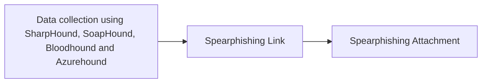

# Data collection using SharpHound, SoapHound, Bloodhound and Azurehound

## Metadata

- **UUID**: `53063205-4404-4e6d-a2f5-d566c6085d96`
- **Schema**: `threat::1.0`
- **TLP**: clear

## Description
The threat vector of data collection using SharpHound, BloodHound, and AzureHound 
represents a sophisticated method for gathering and analyzing information about 
an organization's Active Directory (AD) and Azure environments. This vector is 
particularly concerning because it can be used by both security professionals and 
malicious actors to map out potential attack paths and vulnerabilities.    

## Tools Overview    

**SharpHound**: A data collection tool designed for Active Directory environments. 
It gathers information about users, groups, computers, and their relationships within 
the AD structure.    

**BloodHound**: A visualization tool that ingests data collected by SharpHound and 
AzureHound. It presents the information in a graph format, allowing for the identification 
of complex attack paths and security misconfigurations.    

**AzureHound**: The cloud counterpart to SharpHound, specifically designed to collect 
data from Azure Active Directory and Azure Resource Manager.    

**SoapHound**: It is an enumeration tool in Active Directory Web Services (ADWS) debug logs. 
ADWS enumeration creates multiple GetXmlValue events for each attribute, it leverages the ADWS 
protocol (SOAP over port 9389) instead of traditional LDAP queries.
LDAP queries are wrapped within a series of SOAP messages, which are sent to the ADWS server 
using NET TCP Binding communication channel. Following, ADWS server unwraps the LDAP queries
and forwards them to the LDAP server running on the same Domain Controller. As a result, LDAP
traffic is not sent via the wire and therefore is not easily detected by common monitoring tools.

## Threat Vector Mechanics    

The mechanics of this threat vector involve the systematic collection, processing, 
and analysis of data from Active Directory (AD) and Azure environments to identify 
potential attack paths. Here's how it works:    

1. **Data Collection**:
  - **SharpHound** gathers data from Active Directory using LDAP/LDAPS queries 
  and RPC over named pipes. It collects information on domain trusts, object properties 
  (users, groups, computers, etc.), ACLs, group memberships, and more.
  - **AzureHound** collects data from Azure AD and Azure Resource Manager (AzureRM) 
  using Microsoft Graph and Azure REST APIs. It retrieves information about admin 
  roles, users, groups, apps, devices, service principals, and other Azure objects 
  accessible to the authenticated user.
  - These tools generate JSON files containing detailed information about the target 
  environment.    

2. **Data Packaging**:
  - The collected data is compressed into ZIP files for efficient transfer and 
  storage. These files are ready for ingestion into the BloodHound database.    

3. **Data Ingestion**:
  - The ZIP files are imported into a Neo4j graph database via the BloodHound interface. 
  This database serves as the backbone for analyzing relationships and permissions 
  within the collected data.    

4. **Graph Analysis**:
  - BloodHound visualizes the data as a graph where nodes represent objects 
  (e.g., users, groups, computers) and edges represent relationships or permissions 
  (e.g., group memberships or access rights).
  - Users can perform Cypher queries to identify attack paths such as privilege 
  escalation opportunities or lateral movement routes.    

5. **Attack Path Discovery**:
  - The visualized graph highlights misconfigurations or exploitable relationships 
  that attackers can leverage (e.g., accounts with excessive privileges or vulnerable trust relationships).    

This process enables attackers to systematically uncover weaknesses in AD or Azure 
environments for exploitation.

### How the Threat Works

- **Stealthy Protocol**: SOAPHound uses ADWS, which is less commonly monitored than 
LDAP, allowing attackers to collect data with minimal detection.
- **Bulk Collection**: It gathers large amounts of directory data-such as users, 
groups, computers, group memberships, and access control lists (ACLs)-in a few bulk 
queries rather than thousands of individual LDAP requests.
- **Sensitive Information**: The data collected includes everything needed to map 
attack paths, identify privilege escalation opportunities, and plan lateral movement 
within the AD environment.
- **BloodHound Compatibility**: The output is formatted for BloodHound, a tool used 
to visualize and analyze attack paths in AD.

### Key Data Collected

- **User and Group Listings**: Names, SIDs, group memberships.
- **Computer Accounts**: Details about machines in the domain.
- **ACLs/Permissions**: Who has rights over what objects.
- **Certificate Authority Info**: For potential abuse in AD CS attacks.

## Techniques
- T1087
- T1069
- T1482
- T1018
- T1201

## Chaining

