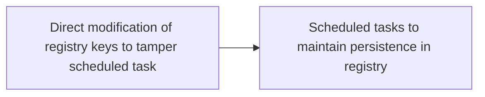

# Direct modification of registry keys to tamper scheduled task

## Metadata

- **UUID**: `efe13bd7-c621-423b-b226-9b536766a252`
- **Schema**: `threat::1.0`
- **TLP**: clear

## Description
Direct modification of registry keys to tamper with scheduled tasks
involves altering the Windows Registry to manipulate or disable scheduled
tasks. 

Scheduled tasks are stored in the Windows Registry, and modifying these
registry keys can allow an attacker to:

- Disable or modify existing tasks: by changing the registry keys
associated with a scheduled task, an attacker can prevent the task from
running or alter its behavior.
- Create new malicious tasks: An attacker can add new registry keys
to create a malicious scheduled task that runs without the user's
knowledge.
- Elevate privileges: modifying registry keys can allow an attacker
to escalate privileges, enabling them to execute tasks with higher
privileges.

The registry keys which involved in scheduled tasks could be:

```
HKEY_LOCAL_MACHINE\SOFTWARE\Microsoft\Windows NT\CurrentVersion\Schedule\TaskCache

```
This key contains subkeys for each scheduled task, including:

- Tasks: Stores information about each task, such as the task name,
description, and execution settings.
- Boot: Stores information about tasks that run at boot time.
- Logon: Stores information about tasks that run at logon time.

### Modifying registry keys to tamper with scheduled tasks

To modify registry keys and tamper with scheduled tasks, an attacker
would typically follow these steps:

  - Access the Registry Editor: The attacker would need to access the
  Windows Registry Editor (Regedit.exe) with administrative privileges.
  - Navigate to the scheduled task registry key. 
  The attacker would navigate to the registry key:
  `HKEY_LOCAL_MACHINE\SOFTWARE\Microsoft\Windows NT\CurrentVersion\Schedule\TaskCache key`.
  - Identify the target task: The attacker would identify the subkey
  associated with the scheduled task they want to modify or disable.
  - Modify the registry key: The attacker would modify the registry
  key to change the task's behavior, such as changing the execution
  settings or disabling the task.  

### Examples of registry key modifications

Some examples of registry key modifications that can tamper
with scheduled tasks include:

- Disabling a task: Setting the Enabled value to 0 in the task's subkey.
- Changing the task's execution settings: Modifying the Actions or Triggers
values in the task's subkey.
- Creating a new malicious task: Adding a new subkey with malicious
settings, such as executing a malicious executable.

## Techniques
- T1112
- T1543
- T1543.003
- T1053.005

## Chaining

