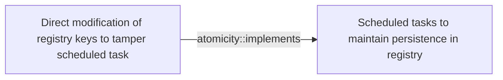

# Direct modification of registry keys to tamper scheduled task

## Metadata

- **UUID**: `efe13bd7-c621-423b-b226-9b536766a252`
- **Schema**: `threat::1.0`
- **Version**: `1`
- **Created**: `2025-05-22`
- **Modified**: `2025-06-02`
- **TLP**: clear (`TLP:CLEAR`)
- **Organisation**: EC DIGIT CSOC (`56b0a0f0-b0bc-47d9-bb46-02f80ae2065a`)

## References
### Public
- **1**: [https://cybersecuritynews.com/hackers-modifying-registry-keys](https://cybersecuritynews.com/hackers-modifying-registry-keys)
- **2**: [https://ipurple.team/2024/01/03/scheduled-task-tampering](https://ipurple.team/2024/01/03/scheduled-task-tampering)
- **3**: [https://cyberbuff.github.io/TheAtomicPlaybook/tactics/execution/T1053.005.html](https://cyberbuff.github.io/TheAtomicPlaybook/tactics/execution/T1053.005.html)
- **4**: [https://github.com/netero1010/GhostTask](https://github.com/netero1010/GhostTask)

## Description
Direct modification of registry keys to tamper with scheduled tasks
involves altering the Windows Registry to manipulate or disable scheduled
tasks. 

Scheduled tasks are stored in the Windows Registry, and modifying these
registry keys can allow an attacker to:

- Disable or modify existing tasks: by changing the registry keys
associated with a scheduled task, an attacker can prevent the task from
running or alter its behavior.
- Create new malicious tasks: An attacker can add new registry keys
to create a malicious scheduled task that runs without the user's
knowledge.
- Elevate privileges: modifying registry keys can allow an attacker
to escalate privileges, enabling them to execute tasks with higher
privileges.

The registry keys which involved in scheduled tasks could be:

```
HKEY_LOCAL_MACHINE\SOFTWARE\Microsoft\Windows NT\CurrentVersion\Schedule\TaskCache

```
This key contains subkeys for each scheduled task, including:

- Tasks: Stores information about each task, such as the task name,
description, and execution settings.
- Boot: Stores information about tasks that run at boot time.
- Logon: Stores information about tasks that run at logon time.

### Modifying registry keys to tamper with scheduled tasks

To modify registry keys and tamper with scheduled tasks, an attacker
would typically follow these steps:

  - Access the Registry Editor: The attacker would need to access the
  Windows Registry Editor (Regedit.exe) with administrative privileges.
  - Navigate to the scheduled task registry key. 
  The attacker would navigate to the registry key:
  `HKEY_LOCAL_MACHINE\SOFTWARE\Microsoft\Windows NT\CurrentVersion\Schedule\TaskCache key`.
  - Identify the target task: The attacker would identify the subkey
  associated with the scheduled task they want to modify or disable.
  - Modify the registry key: The attacker would modify the registry
  key to change the task's behavior, such as changing the execution
  settings or disabling the task.  

### Examples of registry key modifications

Some examples of registry key modifications that can tamper
with scheduled tasks include:

- Disabling a task: Setting the Enabled value to 0 in the task's subkey.
- Changing the task's execution settings: Modifying the Actions or Triggers
values in the task's subkey.
- Creating a new malicious task: Adding a new subkey with malicious
settings, such as executing a malicious executable.

## Criticality
**Medium** - A Medium priority incident may affect public health or safety, national security, economic security, foreign relations, civil liberties, or public confidence.

## Terrain
> **A threat actor needs an Admin Windows System level to a target
endpoint in order to perform direct modification of the registries.

Domains: Enterprise, Private Cloud, Public Cloud
Targets: End-user, Workstations, Other
Platforms: Windows**

## Threat Assessment
| Dimension | Assessment | Description |
| --- | --- | --- |
| Severity | Moderate incident | A cyber attack on a small organisation, or which poses a considerable risk to a medium-sized organisation, or preliminary indications of cyber activity against a large organisation or the government. |
| Impact | Business disruption; Impairement; Lose Capabilities; Operating costs | - |
| Leverage | Infrastructure Compromise; Tampering; Modify configuration | - |
| Viability | Likely | Probable (probably) - 55-80% |
| Kill Chain | Persistence | Any access, action or change to a system that gives an attacker persistent presence on the system. |

## Actors
| Actor | ID | Source | Description |
| --- | --- | --- | --- |
| [[Enterprise] HAFNIUM](https://attack.mitre.org/groups/G0125) | `att&ck::G0125` | ('att&ck',) | [HAFNIUM](https://attack.mitre.org/groups/G0125) is a likely state-sponsored cyber espionage group operating out of China that has been active since at least January 2021. [HAFNIUM](https://attack.mitre.org/groups/G0125) primarily targets entities in the US across a number of industry sectors, including infectious disease researchers, law firms, higher education institutions, defense contractors, policy think tanks, and NGOs. [HAFNIUM](https://attack.mitre.org/groups/G0125) has targeted remote management tools and cloud software for intial access and has demonstrated an ability to quickly operationalize exploits for identified vulnerabilities in edge devices.(Citation: Microsoft HAFNIUM March 2020)(Citation: Volexity Exchange Marauder March 2021)(Citation: Microsoft Silk Typhoon MAR 2025) |
| HAFNIUM | `misp::4f05d6c1-3fc1-4567-91cd-dd4637cc38b5` | ('misp',) | HAFNIUM primarily targets entities in the United States across a number of industry sectors, including infectious disease researchers, law firms, higher education institutions, defense contractors, policy think tanks, and NGOs. Microsoft Threat Intelligence Center (MSTIC) attributes this campaign with high confidence to HAFNIUM, a group assessed to be state-sponsored and operating out of China, based on observed victimology, tactics and procedures. HAFNIUM has previously compromised victims by exploiting vulnerabilities in internet-facing servers, and has used legitimate open-source frameworks, like Covenant, for command and control. Once they’ve gained access to a victim network, HAFNIUM typically exfiltrates data to file sharing sites like MEGA.In campaigns unrelated to these vulnerabilities, Microsoft has observed HAFNIUM interacting with victim Office 365 tenants. While they are often unsuccessful in compromising customer accounts, this reconnaissance activity helps the adversary identify more details about their targets’ environments. HAFNIUM operates primarily from leased virtual private servers (VPS) in the United States. |
| [[Enterprise] APT28](https://attack.mitre.org/groups/G0007) | `att&ck::G0007` | ('att&ck',) | [APT28](https://attack.mitre.org/groups/G0007) is a threat group that has been attributed to Russia's General Staff Main Intelligence Directorate (GRU) 85th Main Special Service Center (GTsSS) military unit 26165.(Citation: NSA/FBI Drovorub August 2020)(Citation: Cybersecurity Advisory GRU Brute Force Campaign July 2021) This group has been active since at least 2004.(Citation: DOJ GRU Indictment Jul 2018)(Citation: Ars Technica GRU indictment Jul 2018)(Citation: Crowdstrike DNC June 2016)(Citation: FireEye APT28)(Citation: SecureWorks TG-4127)(Citation: FireEye APT28 January 2017)(Citation: GRIZZLY STEPPE JAR)(Citation: Sofacy DealersChoice)(Citation: Palo Alto Sofacy 06-2018)(Citation: Symantec APT28 Oct 2018)(Citation: ESET Zebrocy May 2019)  [APT28](https://attack.mitre.org/groups/G0007) reportedly compromised the Hillary Clinton campaign, the Democratic National Committee, and the Democratic Congressional Campaign Committee in 2016 in an attempt to interfere with the U.S. presidential election.(Citation: Crowdstrike DNC June 2016) In 2018, the US indicted five GRU Unit 26165 officers associated with [APT28](https://attack.mitre.org/groups/G0007) for cyber operations (including close-access operations) conducted between 2014 and 2018 against the World Anti-Doping Agency (WADA), the US Anti-Doping Agency, a US nuclear facility, the Organization for the Prohibition of Chemical Weapons (OPCW), the Spiez Swiss Chemicals Laboratory, and other organizations.(Citation: US District Court Indictment GRU Oct 2018) Some of these were conducted with the assistance of GRU Unit 74455, which is also referred to as [Sandworm Team](https://attack.mitre.org/groups/G0034). |
| APT28 | `misp::5b4ee3ea-eee3-4c8e-8323-85ae32658754` | ('misp',) | The Sofacy Group (also known as APT28, Pawn Storm, Fancy Bear and Sednit) is a cyber espionage group believed to have ties to the Russian government. Likely operating since 2007, the group is known to target government, military, and security organizations. It has been characterized as an advanced persistent threat. |
| [[Enterprise] Lazarus Group](https://attack.mitre.org/groups/G0032) | `att&ck::G0032` | ('att&ck',) | [Lazarus Group](https://attack.mitre.org/groups/G0032) is a North Korean state-sponsored cyber threat group that has been attributed to the Reconnaissance General Bureau.(Citation: US-CERT HIDDEN COBRA June 2017)(Citation: Treasury North Korean Cyber Groups September 2019) The group has been active since at least 2009 and was reportedly responsible for the November 2014 destructive wiper attack against Sony Pictures Entertainment as part of a campaign named Operation Blockbuster by Novetta. Malware used by [Lazarus Group](https://attack.mitre.org/groups/G0032) correlates to other reported campaigns, including Operation Flame, Operation 1Mission, Operation Troy, DarkSeoul, and Ten Days of Rain.(Citation: Novetta Blockbuster)  North Korean group definitions are known to have significant overlap, and some security researchers report all North Korean state-sponsored cyber activity under the name [Lazarus Group](https://attack.mitre.org/groups/G0032) instead of tracking clusters or subgroups, such as [Andariel](https://attack.mitre.org/groups/G0138), [APT37](https://attack.mitre.org/groups/G0067), [APT38](https://attack.mitre.org/groups/G0082), and [Kimsuky](https://attack.mitre.org/groups/G0094). |
| Lazarus Group | `misp::68391641-859f-4a9a-9a1e-3e5cf71ec376` | ('misp',) | Since 2009, HIDDEN COBRA actors have leveraged their capabilities to target and compromise a range of victims; some intrusions have resulted in the exfiltration of data while others have been disruptive in nature. Commercial reporting has referred to this activity as Lazarus Group and Guardians of Peace. Tools and capabilities used by HIDDEN COBRA actors include DDoS botnets, keyloggers, remote access tools (RATs), and wiper malware. Variants of malware and tools used by HIDDEN COBRA actors include Destover, Duuzer, and Hangman. |

## ATT&CK Techniques
| Technique | Name | Description |
| --- | --- | --- |
| `T1112` | [Modify Registry](https://attack.mitre.org/techniques/T1112) | Adversaries may interact with the Windows Registry as part of a variety of other techniques to aid in defense evasion, persistence, and execution.  Access to specific areas of the Registry depends on account permissions, with some keys requiring administrator-level access. The built-in Windows command-line utility [Reg](https://attack.mitre.org/software/S0075) may be used for local or remote Registry modification.(Citation: Microsoft Reg) Other tools, such as remote access tools, may also contain functionality to interact with the Registry through the Windows API.  The Registry may be modified in order to hide configuration information or malicious payloads via [Obfuscated Files or Information](https://attack.mitre.org/techniques/T1027).(Citation: Unit42 BabyShark Feb 2019)(Citation: Avaddon Ransomware 2021)(Citation: Microsoft BlackCat Jun 2022)(Citation: CISA Russian Gov Critical Infra 2018) The Registry may also be modified to [Impair Defenses](https://attack.mitre.org/techniques/T1562), such as by enabling macros for all Microsoft Office products, allowing privilege escalation without alerting the user, increasing the maximum number of allowed outbound requests, and/or modifying systems to store plaintext credentials in memory.(Citation: CISA LockBit 2023)(Citation: Unit42 BabyShark Feb 2019)  The Registry of a remote system may be modified to aid in execution of files as part of lateral movement. It requires the remote Registry service to be running on the target system.(Citation: Microsoft Remote) Often [Valid Accounts](https://attack.mitre.org/techniques/T1078) are required, along with access to the remote system's [SMB/Windows Admin Shares](https://attack.mitre.org/techniques/T1021/002) for RPC communication.  Finally, Registry modifications may also include actions to hide keys, such as prepending key names with a null character, which will cause an error and/or be ignored when read via [Reg](https://attack.mitre.org/software/S0075) or other utilities using the Win32 API.(Citation: Microsoft Reghide NOV 2006) Adversaries may abuse these pseudo-hidden keys to conceal payloads/commands used to maintain persistence.(Citation: TrendMicro POWELIKS AUG 2014)(Citation: SpectorOps Hiding Reg Jul 2017) |
| `T1543` | [Create or Modify System Process](https://attack.mitre.org/techniques/T1543) | Adversaries may create or modify system-level processes to repeatedly execute malicious payloads as part of persistence. When operating systems boot up, they can start processes that perform background system functions. On Windows and Linux, these system processes are referred to as services.(Citation: TechNet Services) On macOS, launchd processes known as [Launch Daemon](https://attack.mitre.org/techniques/T1543/004) and [Launch Agent](https://attack.mitre.org/techniques/T1543/001) are run to finish system initialization and load user specific parameters.(Citation: AppleDocs Launch Agent Daemons)   Adversaries may install new services, daemons, or agents that can be configured to execute at startup or a repeatable interval in order to establish persistence. Similarly, adversaries may modify existing services, daemons, or agents to achieve the same effect.    Services, daemons, or agents may be created with administrator privileges but executed under root/SYSTEM privileges. Adversaries may leverage this functionality to create or modify system processes in order to escalate privileges.(Citation: OSX Malware Detection) |
| `T1543.003` | [Create or Modify System Process: Windows Service](https://attack.mitre.org/techniques/T1543/003) | Adversaries may create or modify Windows services to repeatedly execute malicious payloads as part of persistence. When Windows boots up, it starts programs or applications called services that perform background system functions.(Citation: TechNet Services) Windows service configuration information, including the file path to the service's executable or recovery programs/commands, is stored in the Windows Registry.  Adversaries may install a new service or modify an existing service to execute at startup in order to persist on a system. Service configurations can be set or modified using system utilities (such as sc.exe), by directly modifying the Registry, or by interacting directly with the Windows API.   Adversaries may also use services to install and execute malicious drivers. For example, after dropping a driver file (ex: `.sys`) to disk, the payload can be loaded and registered via [Native API](https://attack.mitre.org/techniques/T1106) functions such as `CreateServiceW()` (or manually via functions such as `ZwLoadDriver()` and `ZwSetValueKey()`), by creating the required service Registry values (i.e. [Modify Registry](https://attack.mitre.org/techniques/T1112)), or by using command-line utilities such as `PnPUtil.exe`.(Citation: Symantec W.32 Stuxnet Dossier)(Citation: Crowdstrike DriveSlayer February 2022)(Citation: Unit42 AcidBox June 2020) Adversaries may leverage these drivers as [Rootkit](https://attack.mitre.org/techniques/T1014)s to hide the presence of malicious activity on a system. Adversaries may also load a signed yet vulnerable driver onto a compromised machine (known as "Bring Your Own Vulnerable Driver" (BYOVD)) as part of [Exploitation for Privilege Escalation](https://attack.mitre.org/techniques/T1068).(Citation: ESET InvisiMole June 2020)(Citation: Unit42 AcidBox June 2020)  Services may be created with administrator privileges but are executed under SYSTEM privileges, so an adversary may also use a service to escalate privileges. Adversaries may also directly start services through [Service Execution](https://attack.mitre.org/techniques/T1569/002).  To make detection analysis more challenging, malicious services may also incorporate [Masquerade Task or Service](https://attack.mitre.org/techniques/T1036/004) (ex: using a service and/or payload name related to a legitimate OS or benign software component). Adversaries may also create ‘hidden’ services (i.e., [Hide Artifacts](https://attack.mitre.org/techniques/T1564)), for example by using the `sc sdset` command to set service permissions via the Service Descriptor Definition Language (SDDL). This may hide a Windows service from the view of standard service enumeration methods such as `Get-Service`, `sc query`, and `services.exe`.(Citation: SANS 1)(Citation: SANS 2) |
| `T1053.005` | [Scheduled Task/Job: Scheduled Task](https://attack.mitre.org/techniques/T1053/005) | Adversaries may abuse the Windows Task Scheduler to perform task scheduling for initial or recurring execution of malicious code. There are multiple ways to access the Task Scheduler in Windows. The [schtasks](https://attack.mitre.org/software/S0111) utility can be run directly on the command line, or the Task Scheduler can be opened through the GUI within the Administrator Tools section of the Control Panel.(Citation: Stack Overflow) In some cases, adversaries have used a .NET wrapper for the Windows Task Scheduler, and alternatively, adversaries have used the Windows netapi32 library and [Windows Management Instrumentation](https://attack.mitre.org/techniques/T1047) (WMI) to create a scheduled task. Adversaries may also utilize the Powershell Cmdlet `Invoke-CimMethod`, which leverages WMI class `PS_ScheduledTask` to create a scheduled task via an XML path.(Citation: Red Canary - Atomic Red Team)  An adversary may use Windows Task Scheduler to execute programs at system startup or on a scheduled basis for persistence. The Windows Task Scheduler can also be abused to conduct remote Execution as part of Lateral Movement and/or to run a process under the context of a specified account (such as SYSTEM). Similar to [System Binary Proxy Execution](https://attack.mitre.org/techniques/T1218), adversaries have also abused the Windows Task Scheduler to potentially mask one-time execution under signed/trusted system processes.(Citation: ProofPoint Serpent)  Adversaries may also create "hidden" scheduled tasks (i.e. [Hide Artifacts](https://attack.mitre.org/techniques/T1564)) that may not be visible to defender tools and manual queries used to enumerate tasks. Specifically, an adversary may hide a task from `schtasks /query` and the Task Scheduler by deleting the associated Security Descriptor (SD) registry value (where deletion of this value must be completed using SYSTEM permissions).(Citation: SigmaHQ)(Citation: Tarrask scheduled task) Adversaries may also employ alternate methods to hide tasks, such as altering the metadata (e.g., `Index` value) within associated registry keys.(Citation: Defending Against Scheduled Task Attacks in Windows Environments) |

## Chaining

### Chaining details
#### implements -> Scheduled tasks to maintain persistence in registry (`atomicity::implements`)
Direct access and modification of the Windows registry
can tamper or create a new scheduled task. Threat actors
use this technique usually to hide their activities and
to establish persistent to the system.

- **Target UUID**: `5e66f826-4c4b-4357-b9c5-2f40da207f34`
