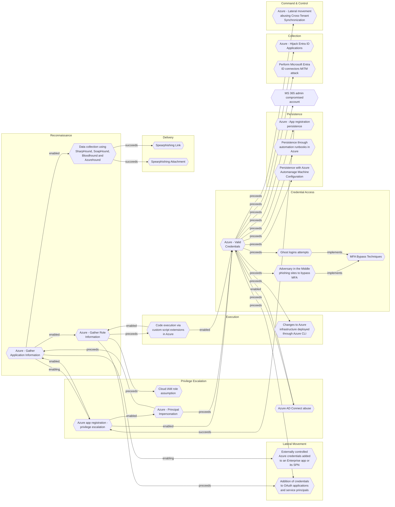

# Externally controlled Azure credentials added to an Enterprise app or its SPN

## Metadata
| Field | Value |
| --- | --- |
| UUID | `ca2751c7-8641-4fb0-a90b-30c5987015dc` |
| Schema | `threat::1.0` |
| Version | `1` |
| Created | `2022-11-28` |
| Modified | `2022-11-28` |
| TLP | clear (`TLP:CLEAR`) |
| Organisation | EC DIGIT CSOC (`56b0a0f0-b0bc-47d9-bb46-02f80ae2065a`) |

## References
### Public
- **1**: [https://www.secureworks.com/research/abusing-azure-application-credentials-to-attack-supply-chains](https://www.secureworks.com/research/abusing-azure-application-credentials-to-attack-supply-chains)
- **2**: [https://media.defense.gov/2020/Dec/17/2002554125/-1/-1/0/AUTHENTICATION_MECHANISMS_CSA_U_OO_198854_20.PDF](https://media.defense.gov/2020/Dec/17/2002554125/-1/-1/0/AUTHENTICATION_MECHANISMS_CSA_U_OO_198854_20.PDF)

## Description
Threat actors may assign valid azure credentials to an Azure Enterprise App or its SPN (service
principal). NSA writes in its advisory that the app was seen leveraged
to access emails from the Enterprise app, but the attack vector could be
used for many other types of leverage.

## Criticality
**Medium** - A Medium priority incident may affect public health or safety, national security, economic security, foreign relations, civil liberties, or public confidence.

## Terrain
A threat actor needs to control highly privileged Azure credentials in
order to be able to assign Azure credentials to an Azure Enterprise app or
it's service principal

## Surface
> **Azure::Security::Entra ID**
> Microsoft Entra ID in Azure (cloud identity)

> **Application Layer::HTTP**
> Hypertext Transfer Protocol

> **OAuth / OIDC**
> OAuth 2.0 and OpenID Connect authorisation/authentication protocols

> **Development::CI/CD**
> Continuous integration and continuous delivery platforms

> **Azure**
> Microsoft Azure cloud platform

> **Entra ID**
> Microsoft Entra ID (formerly Azure Active Directory)

## Threat Assessment
| Dimension | Assessment | Description |
| --- | --- | --- |
| Severity | Localised incident | A cyber attack on an individual, or preliminary indications of cyber activity against a small or medium-sized organisation. |
| Impact | Data Breach Identity Theft IP Loss | Non-public information has been accessed from the outside, and successfully extracted. Acquisition of sufficient information and privileges to profess as a given individual, for the purpose of abusing and deceiving human trust relationships. Particular, key data, information and blueprint conducive to the organization capability to gain and retain a commercial or geopolitical advantage has been accessed, and their content potentially used by competitors or other adversaries. |
| Leverage | Information Disclosure Modify configuration Modify data Modify privileges Infrastructure Compromise Dwelling | Threat action intending to read a file that one was not granted access to, or to read data in transit. Modify configuration or services Modify stored data or content Modify privileges or permissions The compromised target is likely to be used to further expand the sphere of influence of the attacker and allow more potent vectors to be executed. Active or passive extended presence in the target, which performs adversarial operations continuously. |
| Viability | Likely | Probable (probably) - 55-80% |
| Kill Chain | Lateral Movement | Techniques that enable an adversary to horizontally access and control other remote systems. |

## ATT&CK Techniques
| Technique | Name | Description |
| --- | --- | --- |
| `T1098.003` | [Account Manipulation: Additional Cloud Roles](https://attack.mitre.org/techniques/T1098/003) | An adversary may add additional roles or permissions to an adversary-controlled cloud account to maintain persistent access to a tenant. For example, adversaries may update IAM policies in cloud-based environments or add a new global administrator in Office 365 environments.(Citation: AWS IAM Policies and Permissions)(Citation: Google Cloud IAM Policies)(Citation: Microsoft Support O365 Add Another Admin, October 2019)(Citation: Microsoft O365 Admin Roles) With sufficient permissions, a compromised account can gain almost unlimited access to data and settings (including the ability to reset the passwords of other admins).(Citation: Expel AWS Attacker) (Citation: Microsoft O365 Admin Roles)   This account modification may immediately follow [Create Account](https://attack.mitre.org/techniques/T1136) or other malicious account activity. Adversaries may also modify existing [Valid Accounts](https://attack.mitre.org/techniques/T1078) that they have compromised. This could lead to privilege escalation, particularly if the roles added allow for lateral movement to additional accounts.  For example, in AWS environments, an adversary with appropriate permissions may be able to use the <code>CreatePolicyVersion</code> API to define a new version of an IAM policy or the <code>AttachUserPolicy</code> API to attach an IAM policy with additional or distinct permissions to a compromised user account.(Citation: Rhino Security Labs AWS Privilege Escalation)  In some cases, adversaries may add roles to adversary-controlled accounts outside the victim cloud tenant. This allows these external accounts to perform actions inside the victim tenant without requiring the adversary to [Create Account](https://attack.mitre.org/techniques/T1136) or modify a victim-owned account.(Citation: Invictus IR DangerDev 2024) |

## Chaining

