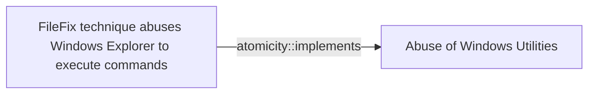

# FileFix technique abuses Windows Explorer to execute commands

## Metadata

- **UUID**: `59d2eb7f-63cd-4ac4-9608-e65663fea667`
- **Schema**: `threat::1.0`
- **Version**: `1`
- **Created**: `2025-09-24`
- **Modified**: `2025-09-25`
- **TLP**: clear (`TLP:CLEAR`)
- **Organisation**: EC DIGIT CSOC (`56b0a0f0-b0bc-47d9-bb46-02f80ae2065a`)

## References
### Public
- **1**: [https://blog.checkpoint.com/research/filefix-the-new-social-engineering-attack-building-on-clickfix-tested-in-the-wild](https://blog.checkpoint.com/research/filefix-the-new-social-engineering-attack-building-on-clickfix-tested-in-the-wild)
- **2**: [https://www.acronis.com/en/tru/posts/filefix-in-the-wild-new-filefix-campaign-goes-beyond-poc-and-leverages-steganography](https://www.acronis.com/en/tru/posts/filefix-in-the-wild-new-filefix-campaign-goes-beyond-poc-and-leverages-steganography)
- **3**: [https://mrd0x.com/filefix-clickfix-alternative](https://mrd0x.com/filefix-clickfix-alternative)
- **4**: [https://thehackernews.com/2025/06/new-filefix-method-emerges-as-threat.html](https://thehackernews.com/2025/06/new-filefix-method-emerges-as-threat.html)
- **5**: [https://blog.checkpoint.com/research/filefix-the-new-social-engineering-attack-building-on-clickfix-tested-in-the-wild](https://blog.checkpoint.com/research/filefix-the-new-social-engineering-attack-building-on-clickfix-tested-in-the-wild)

## Description
The `FileFix` technique is a new social engineering method similar to
`ClickFix` attack. `FileFix` is used by the threat actors to abuse Windows
Explorer and execute malicious commands on a compromised system. This
technique takes advantage of the Windows Explorer feature that allows users
to specify a custom executable to open a file with. The goal of this
technique is to harvest user's credentials. Threat actor can execute
commands through the user's Windows Explorer and deploy further a loader
which drops infostealer, harvesting browsers, wallets and cloud credentials
ref [1],[2].

Unlike `ClickFix`, which tricks users into running malicious commands via
the Windows Run dialog, `FileFix` takes a subtler approach: A malicious
webpage will open a legitimate File Explorer window while covertly copying
a disguised PowerShell one-liner into the clipboard. The user is then asked
to paste into the Explorer address bar (or otherwise paste into a UI), and
the pasted content runs in the user context, often invoking PowerShell to
download and execute follow-on payloads ref [1].  

### How FileFix Works

- User Interaction: The attack typically begins when a user is lured to a
  compromised website that prompts them to perform actions that seem benign, 
  such as opening File Explorer to access a shared document.
- Clipboard Manipulation: The website uses JavaScript to copy a malicious
  PowerShell command to the clipboard while simultaneously opening a File
  Explorer window.
- Execution: The user is instructed to paste the clipboard content into the
  File Explorer address bar, which leads to the execution of the malicious
  command.

To the victims, this process appears to be a simple task of opening a shared
file or folder, making it feel routine and safe. This subtle manipulation
makes `FileFix` a more stealthy and potentially more dangerous evolution of
the `ClickFix` social engineering attack.

## Criticality
**Medium** - A Medium priority incident may affect public health or safety, national security, economic security, foreign relations, civil liberties, or public confidence.

## Terrain
> **The attack requires Windows hosts with interactive users who have the
ability to open File Explorer or paste into the Explorer address bar.
The browser must allow JavaScript to run (standard), and the victim must
be able to interactively paste content from the clipboard into the Explorer
address bar or other UI (e.g., Run dialog).

Domains: Enterprise
Targets: Workstations, Customer, End-user
Platforms: Windows, PowerShell**

## Threat Assessment
| Dimension | Assessment | Description |
| --- | --- | --- |
| Severity | Moderate incident | A cyber attack on a small organisation, or which poses a considerable risk to a medium-sized organisation, or preliminary indications of cyber activity against a large organisation or the government. |
| Impact | Business disruption; Impairement; Lose Capabilities | - |
| Leverage | Elevation of privilege; Infrastructure Compromise; Tampering | - |
| Viability | Likely | Probable (probably) - 55-80% |
| Kill Chain | Credential Access | Techniques resulting in the access of, or control over, system, service or domain credentials. |

## ATT&CK Techniques
| Technique | Name | Description |
| --- | --- | --- |
| `T1555.003` | [Credentials from Password Stores: Credentials from Web Browsers](https://attack.mitre.org/techniques/T1555/003) | Adversaries may acquire credentials from web browsers by reading files specific to the target browser.(Citation: Talos Olympic Destroyer 2018) Web browsers commonly save credentials such as website usernames and passwords so that they do not need to be entered manually in the future. Web browsers typically store the credentials in an encrypted format within a credential store; however, methods exist to extract plaintext credentials from web browsers.  For example, on Windows systems, encrypted credentials may be obtained from Google Chrome by reading a database file, <code>AppData\Local\Google\Chrome\User Data\Default\Login Data</code> and executing a SQL query: <code>SELECT action_url, username_value, password_value FROM logins;</code>. The plaintext password can then be obtained by passing the encrypted credentials to the Windows API function <code>CryptUnprotectData</code>, which uses the victim’s cached logon credentials as the decryption key.(Citation: Microsoft CryptUnprotectData April 2018)   Adversaries have executed similar procedures for common web browsers such as FireFox, Safari, Edge, etc.(Citation: Proofpoint Vega Credential Stealer May 2018)(Citation: FireEye HawkEye Malware July 2017) Windows stores Internet Explorer and Microsoft Edge credentials in Credential Lockers managed by the [Windows Credential Manager](https://attack.mitre.org/techniques/T1555/004).  Adversaries may also acquire credentials by searching web browser process memory for patterns that commonly match credentials.(Citation: GitHub Mimikittenz July 2016)  After acquiring credentials from web browsers, adversaries may attempt to recycle the credentials across different systems and/or accounts in order to expand access. This can result in significantly furthering an adversary's objective in cases where credentials gained from web browsers overlap with privileged accounts (e.g. domain administrator). |
| `T1204.004` | [User Execution: Malicious Copy and Paste](https://attack.mitre.org/techniques/T1204/004) | An adversary may rely upon a user copying and pasting code in order to gain execution. Users may be subjected to social engineering to get them to copy and paste code directly into a [Command and Scripting Interpreter](https://attack.mitre.org/techniques/T1059).    Malicious websites, such as those used in [Drive-by Compromise](https://attack.mitre.org/techniques/T1189), may present fake error messages or CAPTCHA prompts that instruct users to open a terminal or the Windows Run Dialog box and execute an arbitrary command. These commands may be obfuscated using encoding or other techniques to conceal malicious intent. Once executed, the adversary will typically be able to establish a foothold on the victim's machine.(Citation: CloudSEK Lumma Stealer 2024)(Citation: Sekoia ClickFake 2025)(Citation: Reliaquest CAPTCHA 2024)(Citation: AhnLab LummaC2 2025)  Adversaries may also leverage phishing emails for this purpose. When a user attempts to open an attachment, they may be presented with a fake error and offered a malicious command to paste as a solution.(Citation: Proofpoint ClickFix 2024)(Citation: AhnLab Malicioys Copy Paste 2024)  Tricking a user into executing a command themselves may help to bypass email filtering, browser sandboxing, or other mitigations designed to protect users against malicious downloaded files. |

## Chaining

### Chaining details
#### implements -> Abuse of Windows Utilities (`atomicity::implements`)
A threat actor uses native Windows utilities as Windows Explorer to
execute binaries on the victim's system.

- **Target UUID**: `d5039f2c-9fcc-4ba3-ad6a-da8c891ba745`
