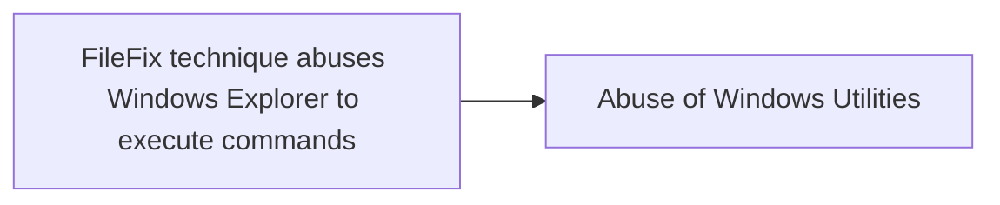

# FileFix technique abuses Windows Explorer to execute commands

## Metadata

- **UUID**: `59d2eb7f-63cd-4ac4-9608-e65663fea667`
- **Schema**: `threat::1.0`
- **TLP**: clear

## Description
The `FileFix` technique is a new social engineering method similar to
`ClickFix` attack. `FileFix` is used by the threat actors to abuse Windows
Explorer and execute malicious commands on a compromised system. This
technique takes advantage of the Windows Explorer feature that allows users
to specify a custom executable to open a file with. The goal of this
technique is to harvest user's credentials. Threat actor can execute
commands through the user's Windows Explorer and deploy further a loader
which drops infostealer, harvesting browsers, wallets and cloud credentials
ref [1],[2].

Unlike `ClickFix`, which tricks users into running malicious commands via
the Windows Run dialog, `FileFix` takes a subtler approach: A malicious
webpage will open a legitimate File Explorer window while covertly copying
a disguised PowerShell one-liner into the clipboard. The user is then asked
to paste into the Explorer address bar (or otherwise paste into a UI), and
the pasted content runs in the user context, often invoking PowerShell to
download and execute follow-on payloads ref [1].  

### How FileFix Works

- User Interaction: The attack typically begins when a user is lured to a
  compromised website that prompts them to perform actions that seem benign, 
  such as opening File Explorer to access a shared document.
- Clipboard Manipulation: The website uses JavaScript to copy a malicious
  PowerShell command to the clipboard while simultaneously opening a File
  Explorer window.
- Execution: The user is instructed to paste the clipboard content into the
  File Explorer address bar, which leads to the execution of the malicious
  command.

To the victims, this process appears to be a simple task of opening a shared
file or folder, making it feel routine and safe. This subtle manipulation
makes `FileFix` a more stealthy and potentially more dangerous evolution of
the `ClickFix` social engineering attack.

## Techniques
- T1555.003
- T1204.004

## Chaining

