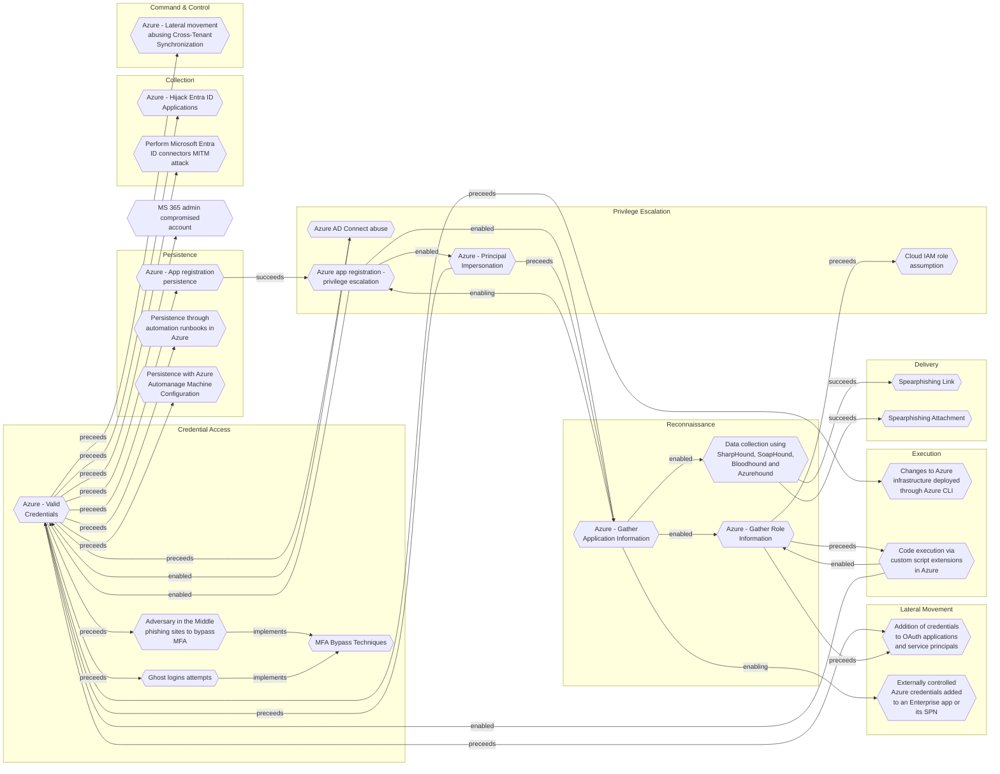

# Ghost logins attempts

## Metadata
| Field | Value |
| --- | --- |
| UUID | `6e988fa7-69c9-4aef-897c-a34fa5066dac` |
| Schema | `threat::1.0` |
| Version | `1` |
| Created | `2024-11-06` |
| Modified | `2024-11-11` |
| TLP | clear (`TLP:CLEAR`) |
| Organisation | EC DIGIT CSOC (`56b0a0f0-b0bc-47d9-bb46-02f80ae2065a`) |

## References
### Public
- **1**: [https://www.savvy.security/saas-security-glossary/what-are-ghost-logins/](https://www.savvy.security/saas-security-glossary/what-are-ghost-logins/)
- **2**: [https://pushsecurity.com/blog/identity-attacks-in-the-wild/#id-snowflake-june-2024](https://pushsecurity.com/blog/identity-attacks-in-the-wild/#id-snowflake-june-2024)

## Description
Ghost logins is a technique that exploits the fact that SaaS user accounts
often enable multiple simultaneous logins using different sign-in methods. 

Ghost logins can be used for both the initial access and persistence stages of
a cyber attack, doubling up as a defense evasion technique because of low login
method visibility.

For initial access, the technique exploits the fact that local and SSO logins
can exist simultaneously. Given that many apps are self-adopted by users, it is
likely that many users will default to a local username and password login at 
this stage. If the app is later adopted companywide and brought into SSO,
the original local login will continue to exist unless explicitly disabled or deleted.

Because MFA is applied at the app and IdP level independently, it is possible to
end up with an SSO login that requires MFA (via the IdP login), but a local
login that does not. This creates an easy target identity for attackers to look for.

When combined with other identity vulnerabilities such as weak, breached, and/or
reused passwords, attackers can easily automate ghost login discovery and
exploitation at scale.  

Ghost logins can also be created after an attacker has established access to an app.
For example, if a social login is used to access an account, an adversary may be 
able to configure a separate username/password login, or even connect a second
social account that the adversary controls.

If the account has sufficient privileges, it may also be possible to set up or
change the SAML login settings to inject a malicious URL, for example to an
attacker controlled tenant.

## Criticality
**High** - A High priority incident is likely to result in a demonstrable impact to public health or safety, national security, economic security, foreign relations, civil liberties, or public confidence.

## Terrain
Application with SSO login requiring MFA, with legacy authentication (local login) not disabled.

## Surface
> **Azure**
> Microsoft Azure cloud platform

> **Microsoft::Microsoft 365**
> Microsoft 365 cloud-based productivity suite (formerly Office 365)

> **SAML**
> Security Assertion Markup Language federation protocol

> **Kerberos**
> Kerberos network authentication protocol

## Threat Assessment
| Dimension | Assessment | Description |
| --- | --- | --- |
| Severity | Moderate incident | A cyber attack on a small organisation, or which poses a considerable risk to a medium-sized organisation, or preliminary indications of cyber activity against a large organisation or the government. |
| Impact | Identity Theft Impairement | Acquisition of sufficient information and privileges to profess as a given individual, for the purpose of abusing and deceiving human trust relationships. Incapacitation of a particular key system that will cause disruptions in day-to-day operations, and eventually service delivery. |
| Leverage | Elevation of privilege Spoofing | Capacity to augment leverage over the target system by upgrading the compromised access rights Threat action aimed at accessing and use of another user’s credentials, such as username and password. |
| Viability | Environment dependent | Depends |
| Kill Chain | Credential Access | Techniques resulting in the access of, or control over, system, service or domain credentials. |

## ATT&CK Techniques
| Technique | Name | Description |
| --- | --- | --- |
| `T1556` | [Modify Authentication Process](https://attack.mitre.org/techniques/T1556) | Adversaries may modify authentication mechanisms and processes to access user credentials or enable otherwise unwarranted access to accounts. The authentication process is handled by mechanisms, such as the Local Security Authentication Server (LSASS) process and the Security Accounts Manager (SAM) on Windows, pluggable authentication modules (PAM) on Unix-based systems, and authorization plugins on MacOS systems, responsible for gathering, storing, and validating credentials. By modifying an authentication process, an adversary may be able to authenticate to a service or system without using [Valid Accounts](https://attack.mitre.org/techniques/T1078).  Adversaries may maliciously modify a part of this process to either reveal credentials or bypass authentication mechanisms. Compromised credentials or access may be used to bypass access controls placed on various resources on systems within the network and may even be used for persistent access to remote systems and externally available services, such as VPNs, Outlook Web Access and remote desktop. |
| `T1078.003` | [Valid Accounts: Local Accounts](https://attack.mitre.org/techniques/T1078/003) | Adversaries may obtain and abuse credentials of a local account as a means of gaining Initial Access, Persistence, Privilege Escalation, or Defense Evasion. Local accounts are those configured by an organization for use by users, remote support, services, or for administration on a single system or service.  Local Accounts may also be abused to elevate privileges and harvest credentials through [OS Credential Dumping](https://attack.mitre.org/techniques/T1003). Password reuse may allow the abuse of local accounts across a set of machines on a network for the purposes of Privilege Escalation and Lateral Movement. |

## Chaining

### Chaining details
#### implements -> [MFA Bypass Techniques](mfa-bypass-techniques.md) (`4a807ac4-f764-41b1-ae6f-94239041d349`) (`atomicity::implements`)
MFA bypass technique

- **Target UUID**: `4a807ac4-f764-41b1-ae6f-94239041d349`
