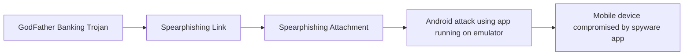

# GodFather Banking Trojan

## Metadata

- **UUID**: `46a79e6f-3df1-4332-a452-3f1fe83bdaf3`
- **Schema**: `threat::1.0`
- **TLP**: clear

## Description
The GodFather malware is a highly advanced Android banking trojan that has evolved 
into one of the most effective and disruptive mobile threats targeting financial, 
banking, and cryptocurrency applications globally.

### Main Threat Vectors

- **On-Device Virtualization**: GodFather’s core tactic is deploying a virtualization 
framework on infected Android devices. It creates a virtual environment into which 
it loads real banking or crypto apps. When a legitimate app is launched, the user 
is redirected invisibly to the app’s clone running inside the sandbox, allowing 
the malware to monitor every action, tap, and credential input in real-time.
- **Overlay Attacks**: Beyond virtualization, GodFather can also display fake overlays 
that look identical to lock screens or login pages, capturing PINs, patterns, or 
passwords as users enter them, further compromising device and account security.
- **Hooking and Network Interception**: The malware uses the Xposed framework to 
hook into the OkHttp network library, which is utilized by many Android apps, thus 
logging network requests and credentials.

### Infection and Evasion

- **Infection Chain**: Typically distributed as trojanized or impersonated apps 
(e.g., fake music downloaders or bogus “Google Protect” apps), GodFather prompts 
users to grant invasive permissions for storage, SMS, contacts, and especially accessibility 
services.
- **Bypassing Security**: It employs advanced ZIP manipulation and code shifting 
to the Java layer to bypass static analysis tools. It also hooks Android APIs such 
as `getEnabledAccessibilityServiceList` to hide from anti-malware scans.
- **Command Capabilities**: Once active, it supports a broad command set for attackers, 
including remote control to simulate gestures, manipulate settings, execute overlay 
attacks, log keystrokes, and exfiltrate a wide range of sensitive data.

### Targets and Impact

- **Scope**: GodFather targets over 484 of the world’s most popular financial and 
cryptocurrency apps, with campaigns observed in Europe, the U.S., Canada, Asia, 
and the Middle East.
- **Consequences**: It can lead to severe financial loss, reputational damage, operational 
disruption, and regulatory fines for both consumers and organizations. The malware 
is particularly dangerous in BYOD enterprise environments, as it can compromise 
corporate data if personal devices are infected.
- **Stealth**: The virtualization attack results in “perfect deception,” as users 
interact with their real apps, making visual or user-driven detection virtually 
impossible.

## Techniques
- T1055
- T1497
- T1056.001

## Chaining

