# GodFather Banking Trojan

## Metadata

- **UUID**: `46a79e6f-3df1-4332-a452-3f1fe83bdaf3`
- **Schema**: `threat::1.0`
- **Version**: `1`
- **Created**: `2025-09-17`
- **Modified**: `2025-09-17`
- **TLP**: clear (`TLP:CLEAR`)
- **Organisation**: EC DIGIT CSOC (`56b0a0f0-b0bc-47d9-bb46-02f80ae2065a`)

## References
### Public
- **1**: [https://securityaffairs.com/179191/malware/godfather-android-trojan-uses-virtualization-to-hijack-banking-and-crypto-apps.html](https://securityaffairs.com/179191/malware/godfather-android-trojan-uses-virtualization-to-hijack-banking-and-crypto-apps.html)
- **2**: [https://zimperium.com/blog/your-mobile-app-their-playground-the-dark-side-of-the-virtualization](https://zimperium.com/blog/your-mobile-app-their-playground-the-dark-side-of-the-virtualization)
- **3**: [https://www.americanbanker.com/news/godfather-malware-poses-new-threat-to-android-banking-apps](https://www.americanbanker.com/news/godfather-malware-poses-new-threat-to-android-banking-apps)

## Description
The GodFather malware is a highly advanced Android banking trojan that has evolved 
into one of the most effective and disruptive mobile threats targeting financial, 
banking, and cryptocurrency applications globally.

### Main Threat Vectors

- **On-Device Virtualization**: GodFather’s core tactic is deploying a virtualization 
framework on infected Android devices. It creates a virtual environment into which 
it loads real banking or crypto apps. When a legitimate app is launched, the user 
is redirected invisibly to the app’s clone running inside the sandbox, allowing 
the malware to monitor every action, tap, and credential input in real-time.
- **Overlay Attacks**: Beyond virtualization, GodFather can also display fake overlays 
that look identical to lock screens or login pages, capturing PINs, patterns, or 
passwords as users enter them, further compromising device and account security.
- **Hooking and Network Interception**: The malware uses the Xposed framework to 
hook into the OkHttp network library, which is utilized by many Android apps, thus 
logging network requests and credentials.

### Infection and Evasion

- **Infection Chain**: Typically distributed as trojanized or impersonated apps 
(e.g., fake music downloaders or bogus “Google Protect” apps), GodFather prompts 
users to grant invasive permissions for storage, SMS, contacts, and especially accessibility 
services.
- **Bypassing Security**: It employs advanced ZIP manipulation and code shifting 
to the Java layer to bypass static analysis tools. It also hooks Android APIs such 
as `getEnabledAccessibilityServiceList` to hide from anti-malware scans.
- **Command Capabilities**: Once active, it supports a broad command set for attackers, 
including remote control to simulate gestures, manipulate settings, execute overlay 
attacks, log keystrokes, and exfiltrate a wide range of sensitive data.

### Targets and Impact

- **Scope**: GodFather targets over 484 of the world’s most popular financial and 
cryptocurrency apps, with campaigns observed in Europe, the U.S., Canada, Asia, 
and the Middle East.
- **Consequences**: It can lead to severe financial loss, reputational damage, operational 
disruption, and regulatory fines for both consumers and organizations. The malware 
is particularly dangerous in BYOD enterprise environments, as it can compromise 
corporate data if personal devices are infected.
- **Stealth**: The virtualization attack results in “perfect deception,” as users 
interact with their real apps, making visual or user-driven detection virtually 
impossible.

## Criticality
**High** - A High priority incident is likely to result in a demonstrable impact to public health or safety, national security, economic security, foreign relations, civil liberties, or public confidence.

## Terrain
> **Adversaries achieve granting AccessibilityService permissions to GodFather
malware primarily through social engineering techniques that trick users into
enabling these permissions.

Domains: Mobile
Targets: Mobile phone, Personal Information
Platforms: Android**

## Threat Assessment
| Dimension | Assessment | Description |
| --- | --- | --- |
| Severity | Significant incident | A cyber attack which has a serious impact on a large organisation or on wider / local government, or which poses a considerable risk to central government or (inter)national essential services. |
| Impact | Data Breach; Monetary Loss; Identity Theft | - |
| Leverage | Spoofing; Tampering; Information Disclosure; Elevation of privilege | - |
| Viability | Very Likely | Highly probable - 80-95% |
| Kill Chain | Delivery | Techniques resulting in the transmission of a weaponized object to the targeted environment. |

## Actors
| Actor | ID | Source | Description |
| --- | --- | --- | --- |
| DarkHotel | `misp::b8c8b96d-61e6-47b1-8e38-fd8ad5d9854d` | ('misp',) | Kaspersky described DarkHotel in a 2014 report as: '... DarkHotel drives its campaigns by spear-phishing targets with highly advanced Flash zero-day exploits that effectively evade the latest Windows and Adobe defenses, and yet they also imprecisely spread among large numbers of vague targets with peer-to-peer spreading tactics. Moreover, this crews most unusual characteristic is that for several years the Darkhotel APT has maintained a capability to use hotel networks to follow and hit selected targets as they travel around the world.' |
| [[Enterprise] Saint Bear](https://attack.mitre.org/groups/G1031) | `att&ck::G1031` | ('att&ck',) | [Saint Bear](https://attack.mitre.org/groups/G1031) is a Russian-nexus threat actor active since early 2021, primarily targeting entities in Ukraine and Georgia. The group is notable for a specific remote access tool, [Saint Bot](https://attack.mitre.org/software/S1018), and information stealer, [OutSteel](https://attack.mitre.org/software/S1017) in campaigns. [Saint Bear](https://attack.mitre.org/groups/G1031) typically relies on phishing or web staging of malicious documents and related file types for initial access, spoofing government or related entities.(Citation: Palo Alto Unit 42 OutSteel SaintBot February 2022 )(Citation: Cadet Blizzard emerges as novel threat actor) [Saint Bear](https://attack.mitre.org/groups/G1031) has previously been confused with [Ember Bear](https://attack.mitre.org/groups/G1003) operations, but analysis of behaviors, tools, and targeting indicates these are distinct clusters. |

## ATT&CK Techniques
| Technique | Name | Description |
| --- | --- | --- |
| `T1055` | [Process Injection](https://attack.mitre.org/techniques/T1055) | Adversaries may inject code into processes in order to evade process-based defenses as well as possibly elevate privileges. Process injection is a method of executing arbitrary code in the address space of a separate live process. Running code in the context of another process may allow access to the process's memory, system/network resources, and possibly elevated privileges. Execution via process injection may also evade detection from security products since the execution is masked under a legitimate process.   There are many different ways to inject code into a process, many of which abuse legitimate functionalities. These implementations exist for every major OS but are typically platform specific.   More sophisticated samples may perform multiple process injections to segment modules and further evade detection, utilizing named pipes or other inter-process communication (IPC) mechanisms as a communication channel. |
| `T1497` | [Virtualization/Sandbox Evasion](https://attack.mitre.org/techniques/T1497) | Adversaries may employ various means to detect and avoid virtualization and analysis environments. This may include changing behaviors based on the results of checks for the presence of artifacts indicative of a virtual machine environment (VME) or sandbox. If the adversary detects a VME, they may alter their malware to disengage from the victim or conceal the core functions of the implant. They may also search for VME artifacts before dropping secondary or additional payloads. Adversaries may use the information learned from [Virtualization/Sandbox Evasion](https://attack.mitre.org/techniques/T1497) during automated discovery to shape follow-on behaviors.(Citation: Deloitte Environment Awareness)  Adversaries may use several methods to accomplish [Virtualization/Sandbox Evasion](https://attack.mitre.org/techniques/T1497) such as checking for security monitoring tools (e.g., Sysinternals, Wireshark, etc.) or other system artifacts associated with analysis or virtualization. Adversaries may also check for legitimate user activity to help determine if it is in an analysis environment. Additional methods include use of sleep timers or loops within malware code to avoid operating within a temporary sandbox.(Citation: Unit 42 Pirpi July 2015) |
| `T1056.001` | [Input Capture: Keylogging](https://attack.mitre.org/techniques/T1056/001) | Adversaries may log user keystrokes to intercept credentials as the user types them. Keylogging is likely to be used to acquire credentials for new access opportunities when [OS Credential Dumping](https://attack.mitre.org/techniques/T1003) efforts are not effective, and may require an adversary to intercept keystrokes on a system for a substantial period of time before credentials can be successfully captured. In order to increase the likelihood of capturing credentials quickly, an adversary may also perform actions such as clearing browser cookies to force users to reauthenticate to systems.(Citation: Talos Kimsuky Nov 2021)  Keylogging is the most prevalent type of input capture, with many different ways of intercepting keystrokes.(Citation: Adventures of a Keystroke) Some methods include:  * Hooking API callbacks used for processing keystrokes. Unlike [Credential API Hooking](https://attack.mitre.org/techniques/T1056/004), this focuses solely on API functions intended for processing keystroke data. * Reading raw keystroke data from the hardware buffer. * Windows Registry modifications. * Custom drivers. * [Modify System Image](https://attack.mitre.org/techniques/T1601) may provide adversaries with hooks into the operating system of network devices to read raw keystrokes for login sessions.(Citation: Cisco Blog Legacy Device Attacks) |

## Chaining

```mermaid
flowchart LR
46a79e6f_3df1_4332_a452_3f1fe83bdaf3["GodFather Banking Trojan"]
1a68b5eb_0112_424d_a21f_88dda0b6b8df["Spearphishing Link"]
dd5d942c_bac4_4000_b9a6_ca4fef6cfb84["Spearphishing Attachment"]
4a4a7c81_ca98_4761_8f23_7ef6354e9d1c["Android attack using app running on emulator"]
99c78650_8e19_4756_90fb_2573242577ca["Mobile device compromised by spyware app"]
46a79e6f_3df1_4332_a452_3f1fe83bdaf3 -->|sequence::succeeds| 1a68b5eb_0112_424d_a21f_88dda0b6b8df
1a68b5eb_0112_424d_a21f_88dda0b6b8df -->|sequence::succeeds| dd5d942c_bac4_4000_b9a6_ca4fef6cfb84
dd5d942c_bac4_4000_b9a6_ca4fef6cfb84 -->|support::synergize| 4a4a7c81_ca98_4761_8f23_7ef6354e9d1c
4a4a7c81_ca98_4761_8f23_7ef6354e9d1c -->|support::enabled| 99c78650_8e19_4756_90fb_2573242577ca
```

### Chaining details
#### succeeds -> Spearphishing Link (`sequence::succeeds`)
Attacker must be able to compromise the username and password of a valid account.

- **Target UUID**: `1a68b5eb-0112-424d-a21f-88dda0b6b8df`
#### succeeds -> Spearphishing Attachment (`sequence::succeeds`)
Attacker must be able to compromise the username and password of a valid account.

- **Target UUID**: `dd5d942c-bac4-4000-b9a6-ca4fef6cfb84`
#### synergize -> Android attack using app running on emulator (`support::synergize`)
Adversaries require users to download emulators that have been compromised or
misconfigured and through these, they can carry out malicious activities.

- **Target UUID**: `4a4a7c81-ca98-4761-8f23-7ef6354e9d1c`
#### enabled -> Mobile device compromised by spyware app (`support::enabled`)
Adversaries can abuse iOS or Android devices which are vulnerable to a zero-click
or zero-day exploitation, without user intervention.

- **Target UUID**: `99c78650-8e19-4756-90fb-2573242577ca`
