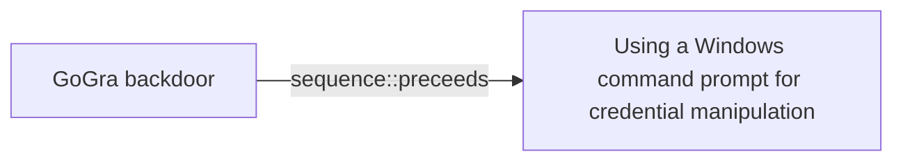

# GoGra backdoor

## Metadata

- **UUID**: `f2c59a8e-3b1f-4a99-80f0-3675b8c1f184`
- **Schema**: `threat::1.0`
- **Version**: `1`
- **Created**: `2023-10-15`
- **Modified**: `2023-10-15`
- **TLP**: clear (`TLP:CLEAR`)
- **Organisation**: EC DIGIT CSOC (`56b0a0f0-b0bc-47d9-bb46-02f80ae2065a`)

## References
### Public
- **1**: [https://thehackernews.com/2024/08/new-go-based-backdoor-gogra-targets.html](https://thehackernews.com/2024/08/new-go-based-backdoor-gogra-targets.html)
- **2**: [https://thehackernews.com/2024/05/hackers-increasingly-abusing-microsoft.html](https://thehackernews.com/2024/05/hackers-increasingly-abusing-microsoft.html)
- **3**: [https://www.security.com/threat-intelligence/cloud-espionage-attacks](https://www.security.com/threat-intelligence/cloud-espionage-attacks)

## Description
GoGra or also known as Trojan.Gogra is a newly discovered backdoor,
deployed against a media organization in South Asia in November 2023.
Written in Go, it uses the Microsoft Graph API to communicate with a
Command and Control server hosted on Microsoft mail services ref [1].  

Its authentication is managed via OAuth access tokens. GoGra is configured
to read messages from an Outlook account with the username "FNU LNU" whose
subject line begins with "Input". It decrypts the content using AES-256 in
Cipher Block Chaining (CBC) mode, with a specific key. The malware can
execute commands via cmd.exe and supports a "cd" command to change
directories ref [1, 3].        

After the command execution, the output is encrypted and sent back to the
Outlook account with the subject "Output". GoGra is believed to be
developed by a nation-state-backed group known for targeting South Asian
organizations.      

GoGra is functionally similar to another known tool used by the same threat
actor called Graphon, written in .NET. Aside from the different programming
languages used, Graphon is using a different AES key and didn't contain an
extra “cd” command as well as haven't a hardcoded Outlook username to
communicate with. The username instead is received directly from the
C&C server ref [3].

## Criticality
**High** - A High priority incident is likely to result in a demonstrable impact to public health or safety, national security, economic security, foreign relations, civil liberties, or public confidence.

## Terrain
> **Cloud environments, with a primary focus on Microsoft cloud services
such as Microsoft 365 and Outlook. This threat leverages legitimate
Microsoft Graph APIs and authentication mechanisms (OAuth) to interact
with Microsoft services via a Command and Control server ref [a, 3].

Domains: Enterprise, Private Cloud, Public Cloud
Targets: End-user, Windows API, Workstations, Desktop, Media, Public-Facing Servers, Email Platform
Platforms: Office 365, Windows**

## Threat Assessment
| Dimension | Assessment | Description |
| --- | --- | --- |
| Severity | Localised incident | A cyber attack on an individual, or preliminary indications of cyber activity against a small or medium-sized organisation. |
| Impact | Nuisance; Impairement; Data Breach; Operating costs | - |
| Leverage | Dwelling; Infrastructure Compromise; Information Disclosure; Spoofing | - |
| Viability | Likely | Probable (probably) - 55-80% |
| Kill Chain | Exploitation | Techniques to exploit vulnerabilities in systems that may, amongst others, result in code execution. |

## ATT&CK Techniques
| Technique | Name | Description |
| --- | --- | --- |
| `T1134` | [Access Token Manipulation](https://attack.mitre.org/techniques/T1134) | Adversaries may modify access tokens to operate under a different user or system security context to perform actions and bypass access controls. Windows uses access tokens to determine the ownership of a running process. A user can manipulate access tokens to make a running process appear as though it is the child of a different process or belongs to someone other than the user that started the process. When this occurs, the process also takes on the security context associated with the new token.  An adversary can use built-in Windows API functions to copy access tokens from existing processes; this is known as token stealing. These token can then be applied to an existing process (i.e. [Token Impersonation/Theft](https://attack.mitre.org/techniques/T1134/001)) or used to spawn a new process (i.e. [Create Process with Token](https://attack.mitre.org/techniques/T1134/002)). An adversary must already be in a privileged user context (i.e. administrator) to steal a token. However, adversaries commonly use token stealing to elevate their security context from the administrator level to the SYSTEM level. An adversary can then use a token to authenticate to a remote system as the account for that token if the account has appropriate permissions on the remote system.(Citation: Pentestlab Token Manipulation)  Any standard user can use the <code>runas</code> command, and the Windows API functions, to create impersonation tokens; it does not require access to an administrator account. There are also other mechanisms, such as Active Directory fields, that can be used to modify access tokens. |
| `T1027` | [Obfuscated Files or Information](https://attack.mitre.org/techniques/T1027) | Adversaries may attempt to make an executable or file difficult to discover or analyze by encrypting, encoding, or otherwise obfuscating its contents on the system or in transit. This is common behavior that can be used across different platforms and the network to evade defenses.   Payloads may be compressed, archived, or encrypted in order to avoid detection. These payloads may be used during Initial Access or later to mitigate detection. Sometimes a user's action may be required to open and [Deobfuscate/Decode Files or Information](https://attack.mitre.org/techniques/T1140) for [User Execution](https://attack.mitre.org/techniques/T1204). The user may also be required to input a password to open a password protected compressed/encrypted file that was provided by the adversary. (Citation: Volexity PowerDuke November 2016) Adversaries may also use compressed or archived scripts, such as JavaScript.   Portions of files can also be encoded to hide the plain-text strings that would otherwise help defenders with discovery. (Citation: Linux/Cdorked.A We Live Security Analysis) Payloads may also be split into separate, seemingly benign files that only reveal malicious functionality when reassembled. (Citation: Carbon Black Obfuscation Sept 2016)  Adversaries may also abuse [Command Obfuscation](https://attack.mitre.org/techniques/T1027/010) to obscure commands executed from payloads or directly via [Command and Scripting Interpreter](https://attack.mitre.org/techniques/T1059). Environment variables, aliases, characters, and other platform/language specific semantics can be used to evade signature based detections and application control mechanisms. (Citation: FireEye Obfuscation June 2017) (Citation: FireEye Revoke-Obfuscation July 2017)(Citation: PaloAlto EncodedCommand March 2017) |
| `T1059.003` | [Command and Scripting Interpreter: Windows Command Shell](https://attack.mitre.org/techniques/T1059/003) | Adversaries may abuse the Windows command shell for execution. The Windows command shell ([cmd](https://attack.mitre.org/software/S0106)) is the primary command prompt on Windows systems. The Windows command prompt can be used to control almost any aspect of a system, with various permission levels required for different subsets of commands. The command prompt can be invoked remotely via [Remote Services](https://attack.mitre.org/techniques/T1021) such as [SSH](https://attack.mitre.org/techniques/T1021/004).(Citation: SSH in Windows)  Batch files (ex: .bat or .cmd) also provide the shell with a list of sequential commands to run, as well as normal scripting operations such as conditionals and loops. Common uses of batch files include long or repetitive tasks, or the need to run the same set of commands on multiple systems.  Adversaries may leverage [cmd](https://attack.mitre.org/software/S0106) to execute various commands and payloads. Common uses include [cmd](https://attack.mitre.org/software/S0106) to execute a single command, or abusing [cmd](https://attack.mitre.org/software/S0106) interactively with input and output forwarded over a command and control channel. |
| `T1204.002` | [User Execution: Malicious File](https://attack.mitre.org/techniques/T1204/002) | An adversary may rely upon a user opening a malicious file in order to gain execution. Users may be subjected to social engineering to get them to open a file that will lead to code execution. This user action will typically be observed as follow-on behavior from [Spearphishing Attachment](https://attack.mitre.org/techniques/T1566/001). Adversaries may use several types of files that require a user to execute them, including .doc, .pdf, .xls, .rtf, .scr, .exe, .lnk, .pif, .cpl, and .reg.  Adversaries may employ various forms of [Masquerading](https://attack.mitre.org/techniques/T1036) and [Obfuscated Files or Information](https://attack.mitre.org/techniques/T1027) to increase the likelihood that a user will open and successfully execute a malicious file. These methods may include using a familiar naming convention and/or password protecting the file and supplying instructions to a user on how to open it.(Citation: Password Protected Word Docs)   While [Malicious File](https://attack.mitre.org/techniques/T1204/002) frequently occurs shortly after Initial Access it may occur at other phases of an intrusion, such as when an adversary places a file in a shared directory or on a user's desktop hoping that a user will click on it. This activity may also be seen shortly after [Internal Spearphishing](https://attack.mitre.org/techniques/T1534). |

## Chaining

### Chaining details
#### preceeds -> Using a Windows command prompt for credential manipulation (`sequence::preceeds`)
GoGra malware can execute cmd commands and change directories
for hiding and persistence purposes.

- **Target UUID**: `06523ed4-7881-4466-9ac5-f8417e972d13`
