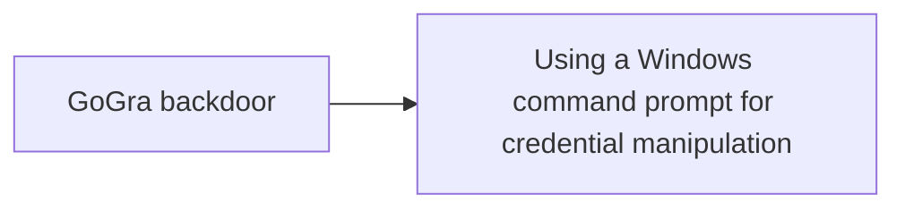

# GoGra backdoor

## Metadata

- **UUID**: `f2c59a8e-3b1f-4a99-80f0-3675b8c1f184`
- **Schema**: `threat::1.0`
- **TLP**: clear

## Description
GoGra or also known as Trojan.Gogra is a newly discovered backdoor,
deployed against a media organization in South Asia in November 2023.
Written in Go, it uses the Microsoft Graph API to communicate with a
Command and Control server hosted on Microsoft mail services ref [1].  

Its authentication is managed via OAuth access tokens. GoGra is configured
to read messages from an Outlook account with the username "FNU LNU" whose
subject line begins with "Input". It decrypts the content using AES-256 in
Cipher Block Chaining (CBC) mode, with a specific key. The malware can
execute commands via cmd.exe and supports a "cd" command to change
directories ref [1, 3].        

After the command execution, the output is encrypted and sent back to the
Outlook account with the subject "Output". GoGra is believed to be
developed by a nation-state-backed group known for targeting South Asian
organizations.      

GoGra is functionally similar to another known tool used by the same threat
actor called Graphon, written in .NET. Aside from the different programming
languages used, Graphon is using a different AES key and didn't contain an
extra “cd” command as well as haven't a hardcoded Outlook username to
communicate with. The username instead is received directly from the
C&C server ref [3].

## Techniques
- T1134
- T1027
- T1059.003
- T1204.002

## Chaining

