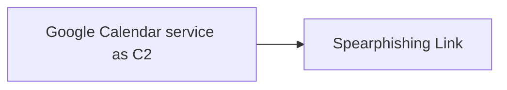

# Google Calendar service as C2

## Metadata

- **UUID**: `3f0b4b8e-6017-406a-9461-740d542d0917`
- **Schema**: `threat::1.0`
- **TLP**: clear

## Description
In some of the reports and analysis a Chinese-affiliated threat actor was
observed abusing Google Calendar to deliver malware and establish Command
and Control (CnC) communication.  

### Abuse of Google calendar

A malware delivered payload has the capability to read and write events with
an attacker-controlled Google calendar. Once executed, this malware creates
a zero minute calendar event at a hardcoded date, with data collected from
the compromised host being encrypted and written in the calendar event
description.  

A threat operator places encrypted commands in calendar events on this date
and next one day, which are predetermined dates also hardcoded into the
malware. The malicious code then begins polling calendar for these events.
When an event is retrieved, the event description is decrypted and the
command it contains is executed on the compromised host. Results from the
command execution are encrypted and written back to another calendar event
ref [1]. 

In several steps below is represented the threat vector pattern how the
threat actor manages to exploit a Google calendar ref [1]. 

- Initial access : The threat actor gains initial access to a victim's
Google account, often through phishing or credential reuse.
- Google calendar creation: As a next step the malicious actor creates
a new Google Calendar event, which is used as a mechanism to deliver
malware to the victim's device.
- Malicious event creation: The threat actor creates a new event in the
victim's Google calendar, which includes a malicious link or attachment.
The event is often titled with a misleading or innocuous name to avoid
suspicion.
- Notification and delivery: When the event is created, Google calendar
sends a notification to the victim's device, which includes the malicious
link or attachment. If the victim interacts with the notification,
the malware is delivered to their device.
- CnC Communication: Once the malware is installed, the threat actor
uses the compromised device to establish CnC communication. The malware
communicates with the threat actor's command and control server, allowing
them to issue commands, exfiltrate data, and further compromise the
victim's network.  

Where

- C2 server - is the attacker controlled calendar. C2 commands are passed as
encrypted google calendar events.
- C2 communication - established from the agent to the attacker controlled
google calendar over HTTPS to Google API, using valid credentials.
- C2 agent - posts computer information into the attacker controlled google
calendar. 

More detailed explanation is provided in ref [1].  

### Used known tactics

- Event titles and descriptions: A Chinese-based threat actor group uses
misleading event titles and descriptions to avoid suspicion and increase
the likelihood of the victim interacting with the malicious event.
- Malicious links and attachments: The threat actor uses malicious links or
attachments in the event to deliver malware to the victim's
device.
- Calendar settings abuse: The threat actor configures the Google calendar
settings to send notifications to the victim's device, ensuring that the
malware is delivered even if the victim doesn't actively check their
calendar.

By abusing Google calendar, the threat actor is able to deliver malware and
establish CnC communication in a way that is difficult to detect and block.
This tactic highlights the importance of monitoring cloud services and
implementing robust security controls to prevent such attacks ref [1], [2].

## Techniques
- T1566.002
- T1204.002
- T1190

## Chaining

