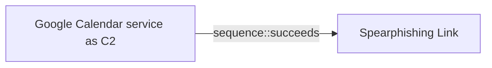

# Google Calendar service as C2

## Metadata

- **UUID**: `3f0b4b8e-6017-406a-9461-740d542d0917`
- **Schema**: `threat::1.0`
- **Version**: `1`
- **Created**: `2025-06-11`
- **Modified**: `2025-07-04`
- **TLP**: clear (`TLP:CLEAR`)
- **Organisation**: EC DIGIT CSOC (`56b0a0f0-b0bc-47d9-bb46-02f80ae2065a`)

## References
### Public
- **1**: [https://cloud.google.com/blog/topics/threat-intelligence/apt41-innovative-tactics?hl=en](https://cloud.google.com/blog/topics/threat-intelligence/apt41-innovative-tactics?hl=en)
- **2**: [https://thehackernews.com/2025/05/chinese-apt41-exploits-google-calendar.html](https://thehackernews.com/2025/05/chinese-apt41-exploits-google-calendar.html)
- **3**: [https://www.cybersecuritydive.com/news/china-hackers-google-calendar-events-research/749290](https://www.cybersecuritydive.com/news/china-hackers-google-calendar-events-research/749290)
- **4**: [https://github.com/MrSaighnal/GCR-Google-Calendar-RAT](https://github.com/MrSaighnal/GCR-Google-Calendar-RAT)

## Description
In some of the reports and analysis a Chinese-affiliated threat actor was
observed abusing Google Calendar to deliver malware and establish Command
and Control (CnC) communication.  

### Abuse of Google calendar

A malware delivered payload has the capability to read and write events with
an attacker-controlled Google calendar. Once executed, this malware creates
a zero minute calendar event at a hardcoded date, with data collected from
the compromised host being encrypted and written in the calendar event
description.  

A threat operator places encrypted commands in calendar events on this date
and next one day, which are predetermined dates also hardcoded into the
malware. The malicious code then begins polling calendar for these events.
When an event is retrieved, the event description is decrypted and the
command it contains is executed on the compromised host. Results from the
command execution are encrypted and written back to another calendar event
ref [1]. 

In several steps below is represented the threat vector pattern how the
threat actor manages to exploit a Google calendar ref [1]. 

- Initial access : The threat actor gains initial access to a victim's
Google account, often through phishing or credential reuse.
- Google calendar creation: As a next step the malicious actor creates
a new Google Calendar event, which is used as a mechanism to deliver
malware to the victim's device.
- Malicious event creation: The threat actor creates a new event in the
victim's Google calendar, which includes a malicious link or attachment.
The event is often titled with a misleading or innocuous name to avoid
suspicion.
- Notification and delivery: When the event is created, Google calendar
sends a notification to the victim's device, which includes the malicious
link or attachment. If the victim interacts with the notification,
the malware is delivered to their device.
- CnC Communication: Once the malware is installed, the threat actor
uses the compromised device to establish CnC communication. The malware
communicates with the threat actor's command and control server, allowing
them to issue commands, exfiltrate data, and further compromise the
victim's network.  

Where

- C2 server - is the attacker controlled calendar. C2 commands are passed as
encrypted google calendar events.
- C2 communication - established from the agent to the attacker controlled
google calendar over HTTPS to Google API, using valid credentials.
- C2 agent - posts computer information into the attacker controlled google
calendar. 

More detailed explanation is provided in ref [1].  

### Used known tactics

- Event titles and descriptions: A Chinese-based threat actor group uses
misleading event titles and descriptions to avoid suspicion and increase
the likelihood of the victim interacting with the malicious event.
- Malicious links and attachments: The threat actor uses malicious links or
attachments in the event to deliver malware to the victim's
device.
- Calendar settings abuse: The threat actor configures the Google calendar
settings to send notifications to the victim's device, ensuring that the
malware is delivered even if the victim doesn't actively check their
calendar.

By abusing Google calendar, the threat actor is able to deliver malware and
establish CnC communication in a way that is difficult to detect and block.
This tactic highlights the importance of monitoring cloud services and
implementing robust security controls to prevent such attacks ref [1], [2].

## Criticality
**Medium** - A Medium priority incident may affect public health or safety, national security, economic security, foreign relations, civil liberties, or public confidence.

## Terrain
> **A threat actor is using social engineering initial technique to entice an
end-user to open a malicious Google invitation (a mail or calendar
invitation event) and get infected. 

The goal is an access and maintain of a persistence.

Domains: Enterprise, Private Cloud, Public Cloud
Targets: Laptop, Customer, Control Server, Remote access, Other, Workstations
Platforms: Google Workspace**

## Threat Assessment
| Dimension | Assessment | Description |
| --- | --- | --- |
| Severity | Moderate incident | A cyber attack on a small organisation, or which poses a considerable risk to a medium-sized organisation, or preliminary indications of cyber activity against a large organisation or the government. |
| Impact | Data Breach; Impairement; Lose Capabilities | - |
| Leverage | Infrastructure Compromise; Information Disclosure; Modify configuration | - |
| Viability | Likely | Probable (probably) - 55-80% |
| Kill Chain | Persistence | Any access, action or change to a system that gives an attacker persistent presence on the system. |

## Actors
| Actor | ID | Source | Description |
| --- | --- | --- | --- |
| [[Enterprise] APT41](https://attack.mitre.org/groups/G0096) | `att&ck::G0096` | ('att&ck',) | [APT41](https://attack.mitre.org/groups/G0096) is a threat group that researchers have assessed as Chinese state-sponsored espionage group that also conducts financially-motivated operations. Active since at least 2012, [APT41](https://attack.mitre.org/groups/G0096) has been observed targeting various industries, including but not limited to healthcare, telecom, technology, finance, education, retail and video game industries in 14 countries.(Citation: apt41_mandiant) Notable behaviors include using a wide range of malware and tools to complete mission objectives. [APT41](https://attack.mitre.org/groups/G0096) overlaps at least partially with public reporting on groups including BARIUM and [Winnti Group](https://attack.mitre.org/groups/G0044).(Citation: FireEye APT41 Aug 2019)(Citation: Group IB APT 41 June 2021) |
| APT41 | `misp::9c124874-042d-48cd-b72b-ccdc51ecbbd6` | ('misp',) | APT41 is a prolific cyber threat group that carries out Chinese state-sponsored espionage activity in addition to financially motivated activity potentially outside of state control. |

## ATT&CK Techniques
| Technique | Name | Description |
| --- | --- | --- |
| `T1566.002` | [Phishing: Spearphishing Link](https://attack.mitre.org/techniques/T1566/002) | Adversaries may send spearphishing emails with a malicious link in an attempt to gain access to victim systems. Spearphishing with a link is a specific variant of spearphishing. It is different from other forms of spearphishing in that it employs the use of links to download malware contained in email, instead of attaching malicious files to the email itself, to avoid defenses that may inspect email attachments. Spearphishing may also involve social engineering techniques, such as posing as a trusted source.  All forms of spearphishing are electronically delivered social engineering targeted at a specific individual, company, or industry. In this case, the malicious emails contain links. Generally, the links will be accompanied by social engineering text and require the user to actively click or copy and paste a URL into a browser, leveraging [User Execution](https://attack.mitre.org/techniques/T1204). The visited website may compromise the web browser using an exploit, or the user will be prompted to download applications, documents, zip files, or even executables depending on the pretext for the email in the first place.  Adversaries may also include links that are intended to interact directly with an email reader, including embedded images intended to exploit the end system directly. Additionally, adversaries may use seemingly benign links that abuse special characters to mimic legitimate websites (known as an "IDN homograph attack").(Citation: CISA IDN ST05-016) URLs may also be obfuscated by taking advantage of quirks in the URL schema, such as the acceptance of integer- or hexadecimal-based hostname formats and the automatic discarding of text before an “@” symbol: for example, `hxxp://google.com@1157586937`.(Citation: Mandiant URL Obfuscation 2023)  Adversaries may also utilize links to perform consent phishing, typically with OAuth 2.0 request URLs that when accepted by the user provide permissions/access for malicious applications, allowing adversaries to  [Steal Application Access Token](https://attack.mitre.org/techniques/T1528)s.(Citation: Trend Micro Pawn Storm OAuth 2017) These stolen access tokens allow the adversary to perform various actions on behalf of the user via API calls. (Citation: Microsoft OAuth 2.0 Consent Phishing 2021)  Adversaries may also utilize spearphishing links to [Steal Application Access Token](https://attack.mitre.org/techniques/T1528)s that grant immediate access to the victim environment. For example, a user may be lured through “consent phishing” into granting adversaries permissions/access via a malicious OAuth 2.0 request URL .(Citation: Trend Micro Pawn Storm OAuth 2017)(Citation: Microsoft OAuth 2.0 Consent Phishing 2021)  Similarly, malicious links may also target device-based authorization, such as OAuth 2.0 device authorization grant flow which is typically used to authenticate devices without UIs/browsers. Known as “device code phishing,” an adversary may send a link that directs the victim to a malicious authorization page where the user is tricked into entering a code/credentials that produces a device token.(Citation: SecureWorks Device Code Phishing 2021)(Citation: Netskope Device Code Phishing 2021)(Citation: Optiv Device Code Phishing 2021) |
| `T1204.002` | [User Execution: Malicious File](https://attack.mitre.org/techniques/T1204/002) | An adversary may rely upon a user opening a malicious file in order to gain execution. Users may be subjected to social engineering to get them to open a file that will lead to code execution. This user action will typically be observed as follow-on behavior from [Spearphishing Attachment](https://attack.mitre.org/techniques/T1566/001). Adversaries may use several types of files that require a user to execute them, including .doc, .pdf, .xls, .rtf, .scr, .exe, .lnk, .pif, .cpl, and .reg.  Adversaries may employ various forms of [Masquerading](https://attack.mitre.org/techniques/T1036) and [Obfuscated Files or Information](https://attack.mitre.org/techniques/T1027) to increase the likelihood that a user will open and successfully execute a malicious file. These methods may include using a familiar naming convention and/or password protecting the file and supplying instructions to a user on how to open it.(Citation: Password Protected Word Docs)   While [Malicious File](https://attack.mitre.org/techniques/T1204/002) frequently occurs shortly after Initial Access it may occur at other phases of an intrusion, such as when an adversary places a file in a shared directory or on a user's desktop hoping that a user will click on it. This activity may also be seen shortly after [Internal Spearphishing](https://attack.mitre.org/techniques/T1534). |
| `T1190` | [Exploit Public-Facing Application](https://attack.mitre.org/techniques/T1190) | Adversaries may attempt to exploit a weakness in an Internet-facing host or system to initially access a network. The weakness in the system can be a software bug, a temporary glitch, or a misconfiguration.  Exploited applications are often websites/web servers, but can also include databases (like SQL), standard services (like SMB or SSH), network device administration and management protocols (like SNMP and Smart Install), and any other system with Internet-accessible open sockets.(Citation: NVD CVE-2016-6662)(Citation: CIS Multiple SMB Vulnerabilities)(Citation: US-CERT TA18-106A Network Infrastructure Devices 2018)(Citation: Cisco Blog Legacy Device Attacks)(Citation: NVD CVE-2014-7169) On ESXi infrastructure, adversaries may exploit exposed OpenSLP services; they may alternatively exploit exposed VMware vCenter servers.(Citation: Recorded Future ESXiArgs Ransomware 2023)(Citation: Ars Technica VMWare Code Execution Vulnerability 2021) Depending on the flaw being exploited, this may also involve [Exploitation for Defense Evasion](https://attack.mitre.org/techniques/T1211) or [Exploitation for Client Execution](https://attack.mitre.org/techniques/T1203).  If an application is hosted on cloud-based infrastructure and/or is containerized, then exploiting it may lead to compromise of the underlying instance or container. This can allow an adversary a path to access the cloud or container APIs (e.g., via the [Cloud Instance Metadata API](https://attack.mitre.org/techniques/T1552/005)), exploit container host access via [Escape to Host](https://attack.mitre.org/techniques/T1611), or take advantage of weak identity and access management policies.  Adversaries may also exploit edge network infrastructure and related appliances, specifically targeting devices that do not support robust host-based defenses.(Citation: Mandiant Fortinet Zero Day)(Citation: Wired Russia Cyberwar)  For websites and databases, the OWASP top 10 and CWE top 25 highlight the most common web-based vulnerabilities.(Citation: OWASP Top 10)(Citation: CWE top 25) |

## Chaining

### Chaining details
#### succeeds -> Spearphishing Link (`sequence::succeeds`)
A threat actor initially sent spear phishing emails containing a link to
the ZIP archive hosted on the exploited government website. The archive
contains an LNK file, masquerading as a PDF, and a directory ref [1].

- **Target UUID**: `1a68b5eb-0112-424d-a21f-88dda0b6b8df`
