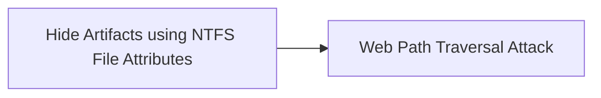

# Hide Artifacts using NTFS File Attributes

## Metadata

- **UUID**: `d15bff6c-b902-4975-ad3a-7a18f3026aca`
- **Schema**: `threat::1.0`
- **TLP**: clear

## Description
Threat actors are using a hiding technique to conceal malicious files,
folders, or other artifacts on a Windows system by leveraging the attributes
of the NTFS file system. NTFS provides a range of attributes that can be
used to hide or obscure files and folders, making them difficult to detect
ref [1].  

Threat actors may use NTFS alternate data stream attribute to evade
detection and deliver binary or other files that would have been otherwise
blocked by the security controls.

They may store malicious data or binaries in file attribute metadata instead
of directly in files. This may be done to evade some defenses, such as
static indicator scanning tools and anti-virus ref [1], [2].      

An example is to attach a binary or a DLL as an ADS to a PDF file or text
file that does not contain anything suspicious (decoy content) and acts just
a carrier for the malicious payload store into the ADS.

In one of the malicious campaign a Russian affiliated threat actor is
observed to use Alternate Data Streams (ADSes) vulnerability `CVE-2025-8088`
for path traversal. The attackers specially crafted the archive to
apparently contain only one benign file, while it contains many malicious
addresses. Once a victim opens this seemingly benign file, WinRAR unpacks it
along with all its ADSes ref [5].  

### Known Techniques used by Threat Actors

- Setting attributes using the command line - a malicious operator can use
  the attrib command to set attributes on files and folders.
- Using API calls -  threat actor can use Windows API calls, such as
  `SetFileAttributes` or `SetFileAttribute`, to set attributes on files and
  folders.
- Exploiting vulnerabilities - exploit vulnerabilities in software or the
  operating system is another common used technique. Using these type of
  vulnerabilities a threat actor can set attributes on files and folders
  without being detected.

## Techniques
- T1564.004

## Chaining

