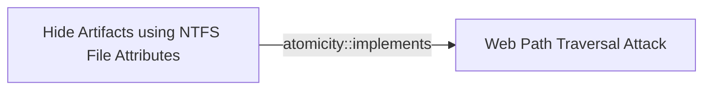

# Hide Artifacts using NTFS File Attributes

## Metadata

- **UUID**: `d15bff6c-b902-4975-ad3a-7a18f3026aca`
- **Schema**: `threat::1.0`
- **Version**: `1`
- **Created**: `2025-06-27`
- **Modified**: `2025-08-26`
- **TLP**: clear (`TLP:CLEAR`)
- **Organisation**: EC DIGIT CSOC (`56b0a0f0-b0bc-47d9-bb46-02f80ae2065a`)

## References
### Public
- **1**: [https://www.atomicredteam.io/atomic-red-team/atomics/T1564.004](https://www.atomicredteam.io/atomic-red-team/atomics/T1564.004)
- **2**: [https://axelarator.github.io/posts/ntfs](https://axelarator.github.io/posts/ntfs)
- **3**: [https://cyber-kill-chain.ch/techniques/T1564/001](https://cyber-kill-chain.ch/techniques/T1564/001)
- **4**: [https://www.cisa.gov/eviction-strategies-tool/info-attack/T1564](https://www.cisa.gov/eviction-strategies-tool/info-attack/T1564)
- **5**: [https://www.welivesecurity.com/en/eset-research/update-winrar-tools-now-romcom-and-others-exploiting-zero-day-vulnerability](https://www.welivesecurity.com/en/eset-research/update-winrar-tools-now-romcom-and-others-exploiting-zero-day-vulnerability)

## Description
Threat actors are using a hiding technique to conceal malicious files,
folders, or other artifacts on a Windows system by leveraging the attributes
of the NTFS file system. NTFS provides a range of attributes that can be
used to hide or obscure files and folders, making them difficult to detect
ref [1].  

Threat actors may use NTFS alternate data stream attribute to evade
detection and deliver binary or other files that would have been otherwise
blocked by the security controls.

They may store malicious data or binaries in file attribute metadata instead
of directly in files. This may be done to evade some defenses, such as
static indicator scanning tools and anti-virus ref [1], [2].      

An example is to attach a binary or a DLL as an ADS to a PDF file or text
file that does not contain anything suspicious (decoy content) and acts just
a carrier for the malicious payload store into the ADS.

In one of the malicious campaign a Russian affiliated threat actor is
observed to use Alternate Data Streams (ADSes) vulnerability `CVE-2025-8088`
for path traversal. The attackers specially crafted the archive to
apparently contain only one benign file, while it contains many malicious
addresses. Once a victim opens this seemingly benign file, WinRAR unpacks it
along with all its ADSes ref [5].  

### Known Techniques used by Threat Actors

- Setting attributes using the command line - a malicious operator can use
  the attrib command to set attributes on files and folders.
- Using API calls -  threat actor can use Windows API calls, such as
  `SetFileAttributes` or `SetFileAttribute`, to set attributes on files and
  folders.
- Exploiting vulnerabilities - exploit vulnerabilities in software or the
  operating system is another common used technique. Using these type of
  vulnerabilities a threat actor can set attributes on files and folders
  without being detected.

## Criticality
**High** - A High priority incident is likely to result in a demonstrable impact to public health or safety, national security, economic security, foreign relations, civil liberties, or public confidence.

## Terrain
> **Threat actors need to deliver on the host a file that uses NTFS extended
attributes.

Domains: Enterprise
Cve: CVE-2025-8088
Targets: Desktop, Workstations
Platforms: Windows**

## Threat Assessment
| Dimension | Assessment | Description |
| --- | --- | --- |
| Severity | Localised incident | A cyber attack on an individual, or preliminary indications of cyber activity against a small or medium-sized organisation. |
| Impact | Business disruption; Impairement | - |
| Leverage | Dwelling; Elevation of privilege | - |
| Viability | Likely | Probable (probably) - 55-80% |
| Kill Chain | Defense Evasion | Techniques an attacker may specifically use for evading detection or avoiding other defenses. |

## Actors
| Actor | ID | Source | Description |
| --- | --- | --- | --- |
| [[Enterprise] APT28](https://attack.mitre.org/groups/G0007) | `att&ck::G0007` | ('att&ck',) | [APT28](https://attack.mitre.org/groups/G0007) is a threat group that has been attributed to Russia's General Staff Main Intelligence Directorate (GRU) 85th Main Special Service Center (GTsSS) military unit 26165.(Citation: NSA/FBI Drovorub August 2020)(Citation: Cybersecurity Advisory GRU Brute Force Campaign July 2021) This group has been active since at least 2004.(Citation: DOJ GRU Indictment Jul 2018)(Citation: Ars Technica GRU indictment Jul 2018)(Citation: Crowdstrike DNC June 2016)(Citation: FireEye APT28)(Citation: SecureWorks TG-4127)(Citation: FireEye APT28 January 2017)(Citation: GRIZZLY STEPPE JAR)(Citation: Sofacy DealersChoice)(Citation: Palo Alto Sofacy 06-2018)(Citation: Symantec APT28 Oct 2018)(Citation: ESET Zebrocy May 2019)  [APT28](https://attack.mitre.org/groups/G0007) reportedly compromised the Hillary Clinton campaign, the Democratic National Committee, and the Democratic Congressional Campaign Committee in 2016 in an attempt to interfere with the U.S. presidential election.(Citation: Crowdstrike DNC June 2016) In 2018, the US indicted five GRU Unit 26165 officers associated with [APT28](https://attack.mitre.org/groups/G0007) for cyber operations (including close-access operations) conducted between 2014 and 2018 against the World Anti-Doping Agency (WADA), the US Anti-Doping Agency, a US nuclear facility, the Organization for the Prohibition of Chemical Weapons (OPCW), the Spiez Swiss Chemicals Laboratory, and other organizations.(Citation: US District Court Indictment GRU Oct 2018) Some of these were conducted with the assistance of GRU Unit 74455, which is also referred to as [Sandworm Team](https://attack.mitre.org/groups/G0034). |
| APT28 | `misp::5b4ee3ea-eee3-4c8e-8323-85ae32658754` | ('misp',) | The Sofacy Group (also known as APT28, Pawn Storm, Fancy Bear and Sednit) is a cyber espionage group believed to have ties to the Russian government. Likely operating since 2007, the group is known to target government, military, and security organizations. It has been characterized as an advanced persistent threat. |
| RomCom | `misp::ba9e1ed2-e142-48d0-a593-f73ac6d59ccd` | ('misp',) | ROMCOM is an evolving and sophisticated threat actor group that has been using the malware tool ROMCOM for espionage and financially motivated attacks. They have targeted organizations in Ukraine and NATO countries, including military personnel, government agencies, and political leaders. The ROMCOM backdoor is capable of stealing sensitive information and deploying other malware, showcasing the group's adaptability and growing sophistication. |

## ATT&CK Techniques
| Technique | Name | Description |
| --- | --- | --- |
| `T1564.004` | [Hide Artifacts: NTFS File Attributes](https://attack.mitre.org/techniques/T1564/004) | Adversaries may use NTFS file attributes to hide their malicious data in order to evade detection. Every New Technology File System (NTFS) formatted partition contains a Master File Table (MFT) that maintains a record for every file/directory on the partition. (Citation: SpectorOps Host-Based Jul 2017) Within MFT entries are file attributes, (Citation: Microsoft NTFS File Attributes Aug 2010) such as Extended Attributes (EA) and Data [known as Alternate Data Streams (ADSs) when more than one Data attribute is present], that can be used to store arbitrary data (and even complete files). (Citation: SpectorOps Host-Based Jul 2017) (Citation: Microsoft File Streams) (Citation: MalwareBytes ADS July 2015) (Citation: Microsoft ADS Mar 2014)  Adversaries may store malicious data or binaries in file attribute metadata instead of directly in files. This may be done to evade some defenses, such as static indicator scanning tools and anti-virus. (Citation: Journey into IR ZeroAccess NTFS EA) (Citation: MalwareBytes ADS July 2015) |

## Chaining

### Chaining details
#### implements -> Web Path Traversal Attack (`atomicity::implements`)
A threat actor can provide multiple ADSes with increasing depths of
parent directory relative path elements (`..\\`). They can use ADSes for
path traversal attack. An example is WinRAR traversal exploitation
disclosed on June and August 2025 ref [5].

- **Target UUID**: `b330d3a8-1783-4210-9fec-11e6ecfe135e`
