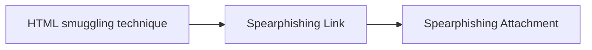

# HTML smuggling technique

## Metadata

- **UUID**: `c7ed4fad-a58f-47da-9938-4a673526b3f4`
- **Schema**: `threat::1.0`
- **TLP**: clear

## Description
HTML smuggling is a technique used by attackers to embed a malicious
code within HTML files, which are then smuggled past security controls,
such as firewalls, intrusion detection systems, and web application
firewalls. This is achieved by exploiting the way HTML files are
processed by web browsers.

### How HTML smuggling works?

HTML smuggling uses legitimate features of HTML5 and JavaScript,
which are both supported by all modern browsers, to generate malicious
files behind the firewall. Specifically, HTML smuggling leverages the
HTML5 “download” attribute for anchor tags, as well as the creation
and use of a JavaScript Blob to put together the payload downloaded
into an affected device.

In HTML5, when a user clicks a link, the “download” attribute lets
an HTML file automatically download a file referenced in the “href”
tag. For example, the code below instructs the browser to download
a malicious document from its location and save it into an own
device (save “malicious.docx” to “safe.docx”) ref [1].  

```html
<a href="/malware/malicious.docx" download="safe.docx">Click</a>
```

In some of the reports and analysis is mentioned that a threat actor
can create an HTML file that contains malicious code, such as JavaScript,
executable files or other type of malicious payload, encoded in a way
that evades detection by security controls. The HTML file is then sent
to the victim's web browser, which processes the file and executes the 
malicious code. The code can be used to download and install malware,
steal sensitive information (PII or other data of interest, belongings
to an organisation or a company), or in some cases to fully take control
of the victim's system ref [2],[3].    

HTML smuggling can be used for malware delivery, for example in an email
to the end user when after execution can deploy a Trojan, RAT, a backdoor
or other type of malware depends on the attacker's goal ref [1]. 

### Different types of HTML smuggling

There are several types of HTML smuggling techniques, for example:

- CSS smuggling - this involves using Cascading Style Sheets (CSS) to
embed malicious code within an HTML file.
- JavaScript smuggling - this involves using JavaScript to embed malicious
code within an HTML file.
- HTML5 smuggling - this involves using HTML5 features, such as the
<canvas> element, to embed malicious code within an HTML file.

## Techniques
- T1190
- T1189
- T1204
- T1027.006

## Chaining

