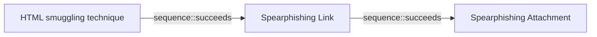

# HTML smuggling technique

## Metadata

- **UUID**: `c7ed4fad-a58f-47da-9938-4a673526b3f4`
- **Schema**: `threat::1.0`
- **Version**: `1`
- **Created**: `2025-06-30`
- **Modified**: `2025-07-01`
- **TLP**: clear (`TLP:CLEAR`)
- **Organisation**: EC DIGIT CSOC (`56b0a0f0-b0bc-47d9-bb46-02f80ae2065a`)

## References
### Public
- **1**: [https://www.microsoft.com/en-us/security/blog/2021/11/11/html-smuggling-surges-highly-evasive-loader-technique-increasingly-used-in-banking-malware-targeted-attacks](https://www.microsoft.com/en-us/security/blog/2021/11/11/html-smuggling-surges-highly-evasive-loader-technique-increasingly-used-in-banking-malware-targeted-attacks)
- **2**: [https://www.insecure.in/blog/html-smuggling](https://www.insecure.in/blog/html-smuggling)
- **3**: [https://www.outflank.nl/blog/2018/08/14/html-smuggling-explained](https://www.outflank.nl/blog/2018/08/14/html-smuggling-explained)
- **4**: [https://www.xorlab.com/en/blog/html-smuggling-how-malicious-actors-use-javascript-and-html-to-fly-under-the-radar](https://www.xorlab.com/en/blog/html-smuggling-how-malicious-actors-use-javascript-and-html-to-fly-under-the-radar)
- **5**: [https://www.forcepoint.com/blog/insights/what-is-html-smuggling](https://www.forcepoint.com/blog/insights/what-is-html-smuggling)

## Description
HTML smuggling is a technique used by attackers to embed a malicious
code within HTML files, which are then smuggled past security controls,
such as firewalls, intrusion detection systems, and web application
firewalls. This is achieved by exploiting the way HTML files are
processed by web browsers.

### How HTML smuggling works?

HTML smuggling uses legitimate features of HTML5 and JavaScript,
which are both supported by all modern browsers, to generate malicious
files behind the firewall. Specifically, HTML smuggling leverages the
HTML5 “download” attribute for anchor tags, as well as the creation
and use of a JavaScript Blob to put together the payload downloaded
into an affected device.

In HTML5, when a user clicks a link, the “download” attribute lets
an HTML file automatically download a file referenced in the “href”
tag. For example, the code below instructs the browser to download
a malicious document from its location and save it into an own
device (save “malicious.docx” to “safe.docx”) ref [1].  

```html
<a href="/malware/malicious.docx" download="safe.docx">Click</a>
```

In some of the reports and analysis is mentioned that a threat actor
can create an HTML file that contains malicious code, such as JavaScript,
executable files or other type of malicious payload, encoded in a way
that evades detection by security controls. The HTML file is then sent
to the victim's web browser, which processes the file and executes the 
malicious code. The code can be used to download and install malware,
steal sensitive information (PII or other data of interest, belongings
to an organisation or a company), or in some cases to fully take control
of the victim's system ref [2],[3].    

HTML smuggling can be used for malware delivery, for example in an email
to the end user when after execution can deploy a Trojan, RAT, a backdoor
or other type of malware depends on the attacker's goal ref [1]. 

### Different types of HTML smuggling

There are several types of HTML smuggling techniques, for example:

- CSS smuggling - this involves using Cascading Style Sheets (CSS) to
embed malicious code within an HTML file.
- JavaScript smuggling - this involves using JavaScript to embed malicious
code within an HTML file.
- HTML5 smuggling - this involves using HTML5 features, such as the
<canvas> element, to embed malicious code within an HTML file.

## Criticality
**Medium** - A Medium priority incident may affect public health or safety, national security, economic security, foreign relations, civil liberties, or public confidence.

## Terrain
> **A threat actor uses a legitimate and native features of
web page scripting languages as HTML, CSS, JavaScript
and others. This vulnerability in the page can lead
to an initial access to a targeted system.

Domains: Enterprise, Mobile
Targets: Customer, End-user, Workstations, Laptop, Web Application Servers, Public-Facing Servers, Personal Information, Remote access
Platforms: Windows, iOS, Android**

## Threat Assessment
| Dimension | Assessment | Description |
| --- | --- | --- |
| Severity | Localised incident | A cyber attack on an individual, or preliminary indications of cyber activity against a small or medium-sized organisation. |
| Impact | Identity Theft; Impairement; Data Breach; Lose Capabilities; Business disruption | - |
| Leverage | Elevation of privilege; Information Disclosure; Infrastructure Compromise; Tampering | - |
| Viability | Likely | Probable (probably) - 55-80% |
| Kill Chain | Defense Evasion | Techniques an attacker may specifically use for evading detection or avoiding other defenses. |

## Actors
| Actor | ID | Source | Description |
| --- | --- | --- | --- |
| [[Enterprise] APT29](https://attack.mitre.org/groups/G0016) | `att&ck::G0016` | ('att&ck',) | [APT29](https://attack.mitre.org/groups/G0016) is threat group that has been attributed to Russia's Foreign Intelligence Service (SVR).(Citation: White House Imposing Costs RU Gov April 2021)(Citation: UK Gov Malign RIS Activity April 2021) They have operated since at least 2008, often targeting government networks in Europe and NATO member countries, research institutes, and think tanks. [APT29](https://attack.mitre.org/groups/G0016) reportedly compromised the Democratic National Committee starting in the summer of 2015.(Citation: F-Secure The Dukes)(Citation: GRIZZLY STEPPE JAR)(Citation: Crowdstrike DNC June 2016)(Citation: UK Gov UK Exposes Russia SolarWinds April 2021)  In April 2021, the US and UK governments attributed the [SolarWinds Compromise](https://attack.mitre.org/campaigns/C0024) to the SVR; public statements included citations to [APT29](https://attack.mitre.org/groups/G0016), Cozy Bear, and The Dukes.(Citation: NSA Joint Advisory SVR SolarWinds April 2021)(Citation: UK NSCS Russia SolarWinds April 2021) Industry reporting also referred to the actors involved in this campaign as UNC2452, NOBELIUM, StellarParticle, Dark Halo, and SolarStorm.(Citation: FireEye SUNBURST Backdoor December 2020)(Citation: MSTIC NOBELIUM Mar 2021)(Citation: CrowdStrike SUNSPOT Implant January 2021)(Citation: Volexity SolarWinds)(Citation: Cybersecurity Advisory SVR TTP May 2021)(Citation: Unit 42 SolarStorm December 2020) |
| APT29 | `misp::b2056ff0-00b9-482e-b11c-c771daa5f28a` | ('misp',) | A 2015 report by F-Secure describe APT29 as: 'The Dukes are a well-resourced, highly dedicated and organized cyberespionage group that we believe has been working for the Russian Federation since at least 2008 to collect intelligence in support of foreign and security policy decision-making. The Dukes show unusual confidence in their ability to continue successfully compromising their targets, as well as in their ability to operate with impunity. The Dukes primarily target Western governments and related organizations, such as government ministries and agencies, political think tanks, and governmental subcontractors. Their targets have also included the governments of members of the Commonwealth of Independent States;Asian, African, and Middle Eastern governments;organizations associated with Chechen extremism;and Russian speakers engaged in the illicit trade of controlled substances and drugs. The Dukes are known to employ a vast arsenal of malware toolsets, which we identify as MiniDuke, CosmicDuke, OnionDuke, CozyDuke, CloudDuke, SeaDuke, HammerDuke, PinchDuke, and GeminiDuke. In recent years, the Dukes have engaged in apparently biannual large - scale spear - phishing campaigns against hundreds or even thousands of recipients associated with governmental institutions and affiliated organizations. These campaigns utilize a smash - and - grab approach involving a fast but noisy breakin followed by the rapid collection and exfiltration of as much data as possible.If the compromised target is discovered to be of value, the Dukes will quickly switch the toolset used and move to using stealthier tactics focused on persistent compromise and long - term intelligence gathering. This threat actor targets government ministries and agencies in the West, Central Asia, East Africa, and the Middle East; Chechen extremist groups; Russian organized crime; and think tanks. It is suspected to be behind the 2015 compromise of unclassified networks at the White House, Department of State, Pentagon, and the Joint Chiefs of Staff. The threat actor includes all of the Dukes tool sets, including MiniDuke, CosmicDuke, OnionDuke, CozyDuke, SeaDuke, CloudDuke (aka MiniDionis), and HammerDuke (aka Hammertoss). ' |

## ATT&CK Techniques
| Technique | Name | Description |
| --- | --- | --- |
| `T1190` | [Exploit Public-Facing Application](https://attack.mitre.org/techniques/T1190) | Adversaries may attempt to exploit a weakness in an Internet-facing host or system to initially access a network. The weakness in the system can be a software bug, a temporary glitch, or a misconfiguration.  Exploited applications are often websites/web servers, but can also include databases (like SQL), standard services (like SMB or SSH), network device administration and management protocols (like SNMP and Smart Install), and any other system with Internet-accessible open sockets.(Citation: NVD CVE-2016-6662)(Citation: CIS Multiple SMB Vulnerabilities)(Citation: US-CERT TA18-106A Network Infrastructure Devices 2018)(Citation: Cisco Blog Legacy Device Attacks)(Citation: NVD CVE-2014-7169) On ESXi infrastructure, adversaries may exploit exposed OpenSLP services; they may alternatively exploit exposed VMware vCenter servers.(Citation: Recorded Future ESXiArgs Ransomware 2023)(Citation: Ars Technica VMWare Code Execution Vulnerability 2021) Depending on the flaw being exploited, this may also involve [Exploitation for Defense Evasion](https://attack.mitre.org/techniques/T1211) or [Exploitation for Client Execution](https://attack.mitre.org/techniques/T1203).  If an application is hosted on cloud-based infrastructure and/or is containerized, then exploiting it may lead to compromise of the underlying instance or container. This can allow an adversary a path to access the cloud or container APIs (e.g., via the [Cloud Instance Metadata API](https://attack.mitre.org/techniques/T1552/005)), exploit container host access via [Escape to Host](https://attack.mitre.org/techniques/T1611), or take advantage of weak identity and access management policies.  Adversaries may also exploit edge network infrastructure and related appliances, specifically targeting devices that do not support robust host-based defenses.(Citation: Mandiant Fortinet Zero Day)(Citation: Wired Russia Cyberwar)  For websites and databases, the OWASP top 10 and CWE top 25 highlight the most common web-based vulnerabilities.(Citation: OWASP Top 10)(Citation: CWE top 25) |
| `T1189` | [Drive-by Compromise](https://attack.mitre.org/techniques/T1189) | Adversaries may gain access to a system through a user visiting a website over the normal course of browsing. Multiple ways of delivering exploit code to a browser exist (i.e., [Drive-by Target](https://attack.mitre.org/techniques/T1608/004)), including:  * A legitimate website is compromised, allowing adversaries to inject malicious code * Script files served to a legitimate website from a publicly writeable cloud storage bucket are modified by an adversary * Malicious ads are paid for and served through legitimate ad providers (i.e., [Malvertising](https://attack.mitre.org/techniques/T1583/008)) * Built-in web application interfaces that allow user-controllable content are leveraged for the insertion of malicious scripts or iFrames (e.g., cross-site scripting)  Browser push notifications may also be abused by adversaries and leveraged for malicious code injection via [User Execution](https://attack.mitre.org/techniques/T1204). By clicking "allow" on browser push notifications, users may be granting a website permission to run JavaScript code on their browser.(Citation: Push notifications - viruspositive)(Citation: push notification -mcafee)(Citation: push notifications - malwarebytes)  Often the website used by an adversary is one visited by a specific community, such as government, a particular industry, or a particular region, where the goal is to compromise a specific user or set of users based on a shared interest. This kind of targeted campaign is often referred to a strategic web compromise or watering hole attack. There are several known examples of this occurring.(Citation: Shadowserver Strategic Web Compromise)  Typical drive-by compromise process:  1. A user visits a website that is used to host the adversary controlled content. 2. Scripts automatically execute, typically searching versions of the browser and plugins for a potentially vulnerable version. The user may be required to assist in this process by enabling scripting, notifications, or active website components and ignoring warning dialog boxes. 3. Upon finding a vulnerable version, exploit code is delivered to the browser. 4. If exploitation is successful, the adversary will gain code execution on the user's system unless other protections are in place. In some cases, a second visit to the website after the initial scan is required before exploit code is delivered.  Unlike [Exploit Public-Facing Application](https://attack.mitre.org/techniques/T1190), the focus of this technique is to exploit software on a client endpoint upon visiting a website. This will commonly give an adversary access to systems on the internal network instead of external systems that may be in a DMZ. |
| `T1204` | [User Execution](https://attack.mitre.org/techniques/T1204) | An adversary may rely upon specific actions by a user in order to gain execution. Users may be subjected to social engineering to get them to execute malicious code by, for example, opening a malicious document file or link. These user actions will typically be observed as follow-on behavior from forms of [Phishing](https://attack.mitre.org/techniques/T1566).  While [User Execution](https://attack.mitre.org/techniques/T1204) frequently occurs shortly after Initial Access it may occur at other phases of an intrusion, such as when an adversary places a file in a shared directory or on a user's desktop hoping that a user will click on it. This activity may also be seen shortly after [Internal Spearphishing](https://attack.mitre.org/techniques/T1534).  Adversaries may also deceive users into performing actions such as:  * Enabling [Remote Access Tools](https://attack.mitre.org/techniques/T1219), allowing direct control of the system to the adversary * Running malicious JavaScript in their browser, allowing adversaries to [Steal Web Session Cookie](https://attack.mitre.org/techniques/T1539)s(Citation: Talos Roblox Scam 2023)(Citation: Krebs Discord Bookmarks 2023) * Downloading and executing malware for [User Execution](https://attack.mitre.org/techniques/T1204) * Coerceing users to copy, paste, and execute malicious code manually(Citation: Reliaquest-execution)(Citation: proofpoint-selfpwn)  For example, tech support scams can be facilitated through [Phishing](https://attack.mitre.org/techniques/T1566), vishing, or various forms of user interaction. Adversaries can use a combination of these methods, such as spoofing and promoting toll-free numbers or call centers that are used to direct victims to malicious websites, to deliver and execute payloads containing malware or [Remote Access Tools](https://attack.mitre.org/techniques/T1219).(Citation: Telephone Attack Delivery) |
| `T1027.006` | [Obfuscated Files or Information: HTML Smuggling](https://attack.mitre.org/techniques/T1027/006) | Adversaries may smuggle data and files past content filters by hiding malicious payloads inside of seemingly benign HTML files. HTML documents can store large binary objects known as JavaScript Blobs (immutable data that represents raw bytes) that can later be constructed into file-like objects. Data may also be stored in Data URLs, which enable embedding media type or MIME files inline of HTML documents. HTML5 also introduced a download attribute that may be used to initiate file downloads.(Citation: HTML Smuggling Menlo Security 2020)(Citation: Outlflank HTML Smuggling 2018)  Adversaries may deliver payloads to victims that bypass security controls through HTML Smuggling by abusing JavaScript Blobs and/or HTML5 download attributes. Security controls such as web content filters may not identify smuggled malicious files inside of HTML/JS files, as the content may be based on typically benign MIME types such as <code>text/plain</code> and/or <code>text/html</code>. Malicious files or data can be obfuscated and hidden inside of HTML files through Data URLs and/or JavaScript Blobs and can be deobfuscated when they reach the victim (i.e. [Deobfuscate/Decode Files or Information](https://attack.mitre.org/techniques/T1140)), potentially bypassing content filters.  For example, JavaScript Blobs can be abused to dynamically generate malicious files in the victim machine and may be dropped to disk by abusing JavaScript functions such as <code>msSaveBlob</code>.(Citation: HTML Smuggling Menlo Security 2020)(Citation: MSTIC NOBELIUM May 2021)(Citation: Outlflank HTML Smuggling 2018)(Citation: nccgroup Smuggling HTA 2017) |

## Chaining

### Chaining details
#### succeeds -> Spearphishing Link (`sequence::succeeds`)
A threat actor can send a phishing email to a victim with
embedded URL leading to an HTML page and further malicious
smuggling exploitation.

- **Target UUID**: `1a68b5eb-0112-424d-a21f-88dda0b6b8df`
#### succeeds -> Spearphishing Attachment (`sequence::succeeds`)
A threat actor used HTML smuggling to deliver a password-protected
ZIP archive containing a VBScript loader for AsyncRAT in an AI generated
malware campaign in France.

- **Target UUID**: `dd5d942c-bac4-4000-b9a6-ca4fef6cfb84`
