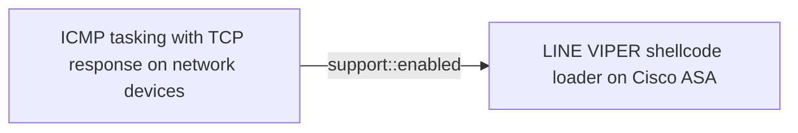
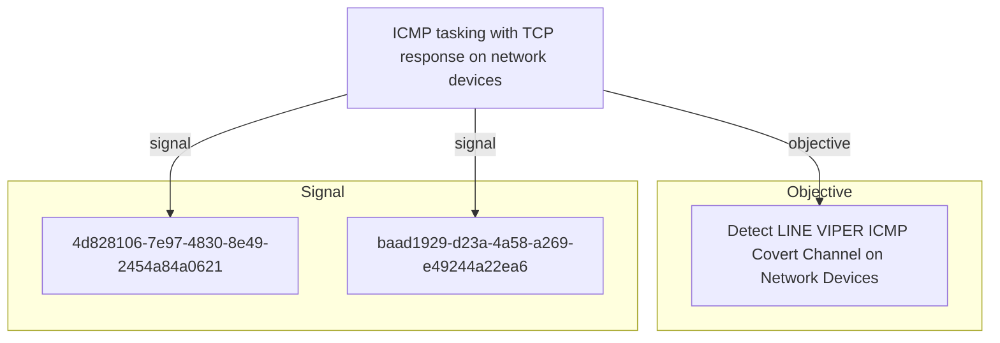

# ICMP tasking with TCP response on network devices

## Metadata

- **UUID**: `2a5faf22-c526-4d49-81b9-6a7b895de58b`
- **Schema**: `threat::1.0`
- **Version**: `1`
- **Created**: `2026-06-18`
- **Modified**: `2026-06-18`
- **TLP**: clear (`TLP:CLEAR`)
- **Organisation**: EC DIGIT CSOC (`56b0a0f0-b0bc-47d9-bb46-02f80ae2065a`)

## References
### Public
- **1**: [https://www.ncsc.gov.uk/static-assets/documents/malware-analysis-reports/RayInitiator-LINE-VIPER/ncsc-mar-rayinitiator-line-viper.pdf](https://www.ncsc.gov.uk/static-assets/documents/malware-analysis-reports/RayInitiator-LINE-VIPER/ncsc-mar-rayinitiator-line-viper.pdf)

## Description
LINE VIPER implements a sophisticated alternative command and
control mechanism that uses ICMP (Internet Control Message Protocol)
for receiving tasking commands and raw TCP connections for
responding with results [1]. This dual-protocol approach provides
operational flexibility and defence evasion capabilities.

#### Protocol Design

The ICMP-based C2 channel operates through a split-protocol design
where incoming tasking and outgoing responses use different network
protocols [1]:

**Incoming Tasking (ICMP):** The malware monitors for specially
crafted ICMP packets that contain encrypted tasking commands. ICMP
is commonly used for network diagnostics (ping, traceroute) and is
typically allowed through firewalls, making it an ideal covert
channel. The use of ICMP for tasking allows the attacker to send
commands without establishing TCP connections, reducing the network
footprint.

**Outgoing Responses (Raw TCP):** Rather than responding via ICMP,
LINE VIPER sends results back over raw TCP connections. This
asymmetric approach provides several advantages:
- TCP provides reliable delivery for potentially large result sets
- Raw TCP sockets allow arbitrary port selection
- Separation of inbound and outbound protocols complicates analysis

#### Port Usage and Network Behaviour

LINE VIPER responds to ICMP tasking via raw TCP using
high-ephemeral ports [1]. Ephemeral ports are typically in the
range 32768-65535 on Linux systems. The use of high-ephemeral ports
provides several operational security benefits:

- **Dynamic Selection:** Different ephemeral ports can be used for
  each response, avoiding patterns that could be detected through
  long-term network monitoring.

- **Legitimate Appearance:** High-ephemeral ports are commonly used
  for outbound connections from network devices, making the traffic
  appear normal.

- **Firewall Traversal:** Most firewall configurations allow
  outbound connections on ephemeral ports, as blocking them would
  break legitimate functionality.

#### Encryption and Authentication

Like the WebVPN-based C2 channel, the ICMP/TCP method implements
strong cryptographic protections [1]:

- **Per-Request AES Encryption:** Tasking commands received via
  ICMP are encrypted using AES with unique symmetric keys for each
  request. This prevents replay attacks and ensures confidentiality.

- **RSA Key Exchange:** LINE VIPER uses per-victim RSA public keys
  to perform symmetric key exchange. This ensures that only the
  actor with the corresponding private key can decrypt and verify
  tasking commands.

- **Victim-Specific Tokens:** Environmental keying through
  victim-specific tokens ensures that captured ICMP tasking packets
  cannot be replayed against different devices or at different
  times.

#### Operational Advantages

The ICMP-based tasking mechanism provides several advantages for
the attacker [1]:

- **Stealth:** ICMP traffic is common in networks and often not
  logged or inspected as thoroughly as application-layer protocols.

- **Resilience:** Provides an alternative C2 channel if WebVPN-
  based communication is detected or blocked.

- **Flexibility:** ICMP packets can often reach devices even when
  normal network access is restricted, as ICMP is essential for
  network diagnostics.

- **Protocol Confusion:** The split-protocol design (ICMP in, TCP
  out) makes it difficult to correlate incoming commands with
  outgoing responses, complicating network forensics.

#### Detection Challenges

The ICMP/TCP C2 mechanism presents significant detection challenges:

- **Volume Analysis Limitations:** ICMP is frequently used for
  legitimate purposes, making volume-based detection unreliable
  without baseline understanding of normal ICMP patterns.

- **Payload Encryption:** The encrypted nature of tasking commands
  prevents signature-based detection of malicious ICMP packets.

- **Dynamic Ports:** The use of varying high-ephemeral ports for
  TCP responses makes connection tracking difficult without
  comprehensive network visibility.

- **Protocol Legitimacy:** Both ICMP and high-port TCP connections
  are legitimate network behaviours, requiring behavioural analysis
  to identify anomalies.

This dual-protocol C2 mechanism demonstrates sophisticated
understanding of network protocols and operational security. The
technique represents an evolution in network device implant
communication methods, moving beyond simple HTTP/HTTPS-based C2 to
leverage lower-layer protocols for increased stealth and resilience.

## Criticality
**High** - A High priority incident is likely to result in a demonstrable impact to public health or safety, national security, economic security, foreign relations, civil liberties, or public confidence.

## Terrain
> **Network configurations where ICMP traffic is permitted to reach
Cisco ASA LAN interfaces, particularly through established VPN
tunnels [1]. In observed operations, ICMP tasking is not sent to the
WAN interface but instead tunnelled through an established VPN
session to a LAN interface. The VPN connection allows actor-
controlled systems within the local network to send ICMP Echo
Requests that bypass traditional WAN-focused network monitoring.

Domains: Enterprise, Networking
Targets: Network Equipment
Platforms: Network Router**

## Threat Assessment
| Dimension | Assessment | Description |
| --- | --- | --- |
| Severity | Substantial incident | A cyber attack which has a serious impact on a medium-sized organisation, or which poses a considerable risk to a large organisation or wider / local government. |
| Impact | Data Breach; Lose Capabilities; Reputational Damages; National Security | - |
| Leverage | Infrastructure Compromise; Information Disclosure; Spoofing | - |
| Viability | Likely | Probable (probably) - 55-80% |
| Kill Chain | Command & Control | Techniques that allow attackers to communicate with controlled systems within a target network. |

## ATT&CK Techniques
| Technique | Name | Description |
| --- | --- | --- |
| `T1095` | [Non-Application Layer Protocol](https://attack.mitre.org/techniques/T1095) | Adversaries may use an OSI non-application layer protocol for communication between host and C2 server or among infected hosts within a network. The list of possible protocols is extensive.(Citation: Wikipedia OSI) Specific examples include use of network layer protocols, such as the Internet Control Message Protocol (ICMP), transport layer protocols, such as the User Datagram Protocol (UDP), session layer protocols, such as Socket Secure (SOCKS), as well as redirected/tunneled protocols, such as Serial over LAN (SOL).  ICMP communication between hosts is one example.(Citation: Cisco Synful Knock Evolution) Because ICMP is part of the Internet Protocol Suite, it is required to be implemented by all IP-compatible hosts.(Citation: Microsoft ICMP) However, it is not as commonly monitored as other Internet Protocols such as TCP or UDP and may be used by adversaries to hide communications.  In ESXi environments, adversaries may leverage the Virtual Machine Communication Interface (VMCI) for communication between guest virtual machines and the ESXi host. This traffic is similar to client-server communications on traditional network sockets but is localized to the physical machine running the ESXi host, meaning it does not traverse external networks (routers, switches). This results in communications that are invisible to external monitoring and standard networking tools like tcpdump, netstat, nmap, and Wireshark. By adding a VMCI backdoor to a compromised ESXi host, adversaries may persistently regain access from any guest VM to the compromised ESXi host’s backdoor, regardless of network segmentation or firewall rules in place.(Citation: Google Cloud Threat Intelligence VMWare ESXi Zero-Day 2023) |
| `T1571` | [Non-Standard Port](https://attack.mitre.org/techniques/T1571) | Adversaries may communicate using a protocol and port pairing that are typically not associated. For example, HTTPS over port 8088(Citation: Symantec Elfin Mar 2019) or port 587(Citation: Fortinet Agent Tesla April 2018) as opposed to the traditional port 443. Adversaries may make changes to the standard port used by a protocol to bypass filtering or muddle analysis/parsing of network data.  Adversaries may also make changes to victim systems to abuse non-standard ports. For example, Registry keys and other configuration settings can be used to modify protocol and port pairings.(Citation: change_rdp_port_conti) |
| `T1573.001` | [Encrypted Channel: Symmetric Cryptography](https://attack.mitre.org/techniques/T1573/001) | Adversaries may employ a known symmetric encryption algorithm to conceal command and control traffic rather than relying on any inherent protections provided by a communication protocol. Symmetric encryption algorithms use the same key for plaintext encryption and ciphertext decryption. Common symmetric encryption algorithms include AES, DES, 3DES, Blowfish, and RC4. |
| `T1573.002` | [Encrypted Channel: Asymmetric Cryptography](https://attack.mitre.org/techniques/T1573/002) | Adversaries may employ a known asymmetric encryption algorithm to conceal command and control traffic rather than relying on any inherent protections provided by a communication protocol. Asymmetric cryptography, also known as public key cryptography, uses a keypair per party: one public that can be freely distributed, and one private. Due to how the keys are generated, the sender encrypts data with the receiver’s public key and the receiver decrypts the data with their private key. This ensures that only the intended recipient can read the encrypted data. Common public key encryption algorithms include RSA and ElGamal.  For efficiency, many protocols (including SSL/TLS) use symmetric cryptography once a connection is established, but use asymmetric cryptography to establish or transmit a key. As such, these protocols are classified as [Asymmetric Cryptography](https://attack.mitre.org/techniques/T1573/002). |
| `T1480.001` | [Execution Guardrails: Environmental Keying](https://attack.mitre.org/techniques/T1480/001) | Adversaries may environmentally key payloads or other features of malware to evade defenses and constraint execution to a specific target environment. Environmental keying uses cryptography to constrain execution or actions based on adversary supplied environment specific conditions that are expected to be present on the target. Environmental keying is an implementation of [Execution Guardrails](https://attack.mitre.org/techniques/T1480) that utilizes cryptographic techniques for deriving encryption/decryption keys from specific types of values in a given computing environment.(Citation: EK Clueless Agents)  Values can be derived from target-specific elements and used to generate a decryption key for an encrypted payload. Target-specific values can be derived from specific network shares, physical devices, software/software versions, files, joined AD domains, system time, and local/external IP addresses.(Citation: Kaspersky Gauss Whitepaper)(Citation: Proofpoint Router Malvertising)(Citation: EK Impeding Malware Analysis)(Citation: Environmental Keyed HTA)(Citation: Ebowla: Genetic Malware) By generating the decryption keys from target-specific environmental values, environmental keying can make sandbox detection, anti-virus detection, crowdsourcing of information, and reverse engineering difficult.(Citation: Kaspersky Gauss Whitepaper)(Citation: Ebowla: Genetic Malware) These difficulties can slow down the incident response process and help adversaries hide their tactics, techniques, and procedures (TTPs).  Similar to [Obfuscated Files or Information](https://attack.mitre.org/techniques/T1027), adversaries may use environmental keying to help protect their TTPs and evade detection. Environmental keying may be used to deliver an encrypted payload to the target that will use target-specific values to decrypt the payload before execution.(Citation: Kaspersky Gauss Whitepaper)(Citation: EK Impeding Malware Analysis)(Citation: Environmental Keyed HTA)(Citation: Ebowla: Genetic Malware)(Citation: Demiguise Guardrail Router Logo) By utilizing target-specific values to decrypt the payload the adversary can avoid packaging the decryption key with the payload or sending it over a potentially monitored network connection. Depending on the technique for gathering target-specific values, reverse engineering of the encrypted payload can be exceptionally difficult.(Citation: Kaspersky Gauss Whitepaper) This can be used to prevent exposure of capabilities in environments that are not intended to be compromised or operated within.  Like other [Execution Guardrails](https://attack.mitre.org/techniques/T1480), environmental keying can be used to prevent exposure of capabilities in environments that are not intended to be compromised or operated within. This activity is distinct from typical [Virtualization/Sandbox Evasion](https://attack.mitre.org/techniques/T1497). While use of [Virtualization/Sandbox Evasion](https://attack.mitre.org/techniques/T1497) may involve checking for known sandbox values and continuing with execution only if there is no match, the use of environmental keying will involve checking for an expected target-specific value that must match for decryption and subsequent execution to be successful. |

## Chaining

### Chaining details
#### enabled -> LINE VIPER shellcode loader on Cisco ASA (`support::enabled`)
This ICMP-based C2 channel is enabled by the LINE VIPER implant
resident in lina. LINE VIPER monitors for specially crafted ICMP
Echo Requests containing encrypted tasking and responds over raw
TCP connections on high-ephemeral ports, providing a secondary
C2 channel independent of WebVPN access [1].

- **Target UUID**: `b6175f16-2b61-4116-bd97-de54b02b197e`

## Relations

