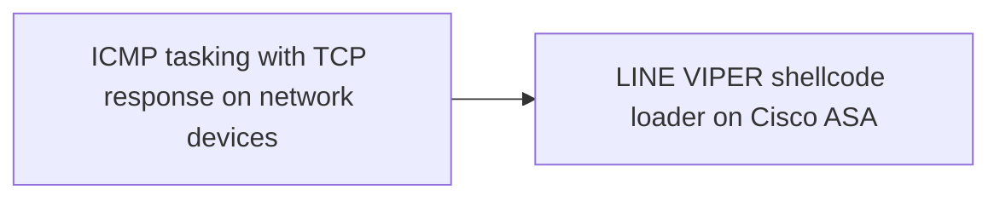
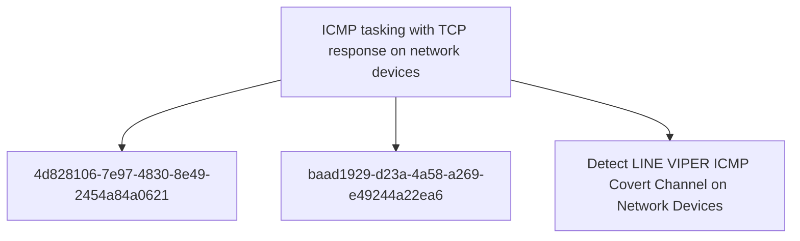

# ICMP tasking with TCP response on network devices

## Metadata

- **UUID**: `2a5faf22-c526-4d49-81b9-6a7b895de58b`
- **Schema**: `threat::1.0`
- **TLP**: clear

## Description
LINE VIPER implements a sophisticated alternative command and
control mechanism that uses ICMP (Internet Control Message Protocol)
for receiving tasking commands and raw TCP connections for
responding with results [1]. This dual-protocol approach provides
operational flexibility and defence evasion capabilities.

#### Protocol Design

The ICMP-based C2 channel operates through a split-protocol design
where incoming tasking and outgoing responses use different network
protocols [1]:

**Incoming Tasking (ICMP):** The malware monitors for specially
crafted ICMP packets that contain encrypted tasking commands. ICMP
is commonly used for network diagnostics (ping, traceroute) and is
typically allowed through firewalls, making it an ideal covert
channel. The use of ICMP for tasking allows the attacker to send
commands without establishing TCP connections, reducing the network
footprint.

**Outgoing Responses (Raw TCP):** Rather than responding via ICMP,
LINE VIPER sends results back over raw TCP connections. This
asymmetric approach provides several advantages:
- TCP provides reliable delivery for potentially large result sets
- Raw TCP sockets allow arbitrary port selection
- Separation of inbound and outbound protocols complicates analysis

#### Port Usage and Network Behaviour

LINE VIPER responds to ICMP tasking via raw TCP using
high-ephemeral ports [1]. Ephemeral ports are typically in the
range 32768-65535 on Linux systems. The use of high-ephemeral ports
provides several operational security benefits:

- **Dynamic Selection:** Different ephemeral ports can be used for
  each response, avoiding patterns that could be detected through
  long-term network monitoring.

- **Legitimate Appearance:** High-ephemeral ports are commonly used
  for outbound connections from network devices, making the traffic
  appear normal.

- **Firewall Traversal:** Most firewall configurations allow
  outbound connections on ephemeral ports, as blocking them would
  break legitimate functionality.

#### Encryption and Authentication

Like the WebVPN-based C2 channel, the ICMP/TCP method implements
strong cryptographic protections [1]:

- **Per-Request AES Encryption:** Tasking commands received via
  ICMP are encrypted using AES with unique symmetric keys for each
  request. This prevents replay attacks and ensures confidentiality.

- **RSA Key Exchange:** LINE VIPER uses per-victim RSA public keys
  to perform symmetric key exchange. This ensures that only the
  actor with the corresponding private key can decrypt and verify
  tasking commands.

- **Victim-Specific Tokens:** Environmental keying through
  victim-specific tokens ensures that captured ICMP tasking packets
  cannot be replayed against different devices or at different
  times.

#### Operational Advantages

The ICMP-based tasking mechanism provides several advantages for
the attacker [1]:

- **Stealth:** ICMP traffic is common in networks and often not
  logged or inspected as thoroughly as application-layer protocols.

- **Resilience:** Provides an alternative C2 channel if WebVPN-
  based communication is detected or blocked.

- **Flexibility:** ICMP packets can often reach devices even when
  normal network access is restricted, as ICMP is essential for
  network diagnostics.

- **Protocol Confusion:** The split-protocol design (ICMP in, TCP
  out) makes it difficult to correlate incoming commands with
  outgoing responses, complicating network forensics.

#### Detection Challenges

The ICMP/TCP C2 mechanism presents significant detection challenges:

- **Volume Analysis Limitations:** ICMP is frequently used for
  legitimate purposes, making volume-based detection unreliable
  without baseline understanding of normal ICMP patterns.

- **Payload Encryption:** The encrypted nature of tasking commands
  prevents signature-based detection of malicious ICMP packets.

- **Dynamic Ports:** The use of varying high-ephemeral ports for
  TCP responses makes connection tracking difficult without
  comprehensive network visibility.

- **Protocol Legitimacy:** Both ICMP and high-port TCP connections
  are legitimate network behaviours, requiring behavioural analysis
  to identify anomalies.

This dual-protocol C2 mechanism demonstrates sophisticated
understanding of network protocols and operational security. The
technique represents an evolution in network device implant
communication methods, moving beyond simple HTTP/HTTPS-based C2 to
leverage lower-layer protocols for increased stealth and resilience.

## Techniques
- T1095
- T1571
- T1573.001
- T1573.002
- T1480.001

## Chaining

## Relations

