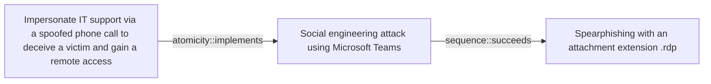

# Impersonate IT support via a spoofed phone call to deceive a victim and gain a remote access

## Metadata

- **UUID**: `c4456134-df7b-4969-b5ff-a24794996890`
- **Schema**: `threat::1.0`
- **Version**: `1`
- **Created**: `2025-06-02`
- **Modified**: `2025-06-02`
- **TLP**: clear (`TLP:CLEAR`)
- **Organisation**: EC DIGIT CSOC (`56b0a0f0-b0bc-47d9-bb46-02f80ae2065a`)

## References
### Public
- **1**: [https://news.sophos.com/en-us/2025/05/20/a-familiar-playbook-with-a-twist-3am-ransomware-actors-dropped-virtual-machine-with-vishing-and-quick-assist](https://news.sophos.com/en-us/2025/05/20/a-familiar-playbook-with-a-twist-3am-ransomware-actors-dropped-virtual-machine-with-vishing-and-quick-assist)
- **2**: [https://www.bleepingcomputer.com/news/security/3am-ransomware-uses-spoofed-it-calls-email-bombing-to-breach-networks/](https://www.bleepingcomputer.com/news/security/3am-ransomware-uses-spoofed-it-calls-email-bombing-to-breach-networks/)
- **3**: [https://www.intrinsec.com/wp-content/uploads/2024/01/TLP-CLEAR-2024-01-09-ThreeAM-EN-Information-report.pdf](https://www.intrinsec.com/wp-content/uploads/2024/01/TLP-CLEAR-2024-01-09-ThreeAM-EN-Information-report.pdf)
- **4**: [https://www.security.com/threat-intelligence/3am-ransomware-lockbit](https://www.security.com/threat-intelligence/3am-ransomware-lockbit)
- **5**: [https://www.ransomlook.io/group/3am](https://www.ransomlook.io/group/3am)

## Description
IT support impersonation via spoofed phone calls is a common social
engineering technique used by attackers to gain initial access to an
organisation's network. This tactic is often combined with other
techniques, such as email flooding or phishing, to create a sense
of urgency and legitimacy. To deceive victims, attackers may use
one of the following methids:

- Use spoofed phone numbers: The threat actors can use spoofed phone
numbers that appear to be from the organisation's IT department or a
legitimate company.  
- Create a sense of urgency: Attackers may claim that there is a critical
issue with the victim's computer or account that requires immediate
attention.
- Use technical jargon: Some threat actor groups are observed to use
technical terms and acronyms to sound legitimate and knowledgeable.
- Request remote access: Attackers may ask the victim to grant remote
access to their computer or network, often through tools like Zoom,
Anydesk, Any Connect, TeamViewer or Microsoft Quick Assist.    

### Possible scenario

Threat actor groups are targeting an organisation by gathering variety of
user's data, for example, employee email addresses and the IT department's
phone number. They can flood an employee with unsolicited emails and then
impersonate IT support via a spoofed phone call, tricking the employee
into granting remote access through `Microsoft Quick Assist` ref [1].   

Because `Quick Assist` uses the RDP stack (T1021.001), the attacker gains
an RDP session under the user's context. If the targeted users has extended
rights, the attacker can sidesteps perimeter ACLs, and disables input
monitoring. A hidden admin account is added ref [1], [3]:  

```
*net user svc_updater P@ss123! /add*,
*net localgroup administrators svc_updater /add*)
```

and a signed Hyper-V VHDX (`*windows_storage.vhdx*`) containing Cobalt
Strike and the 3AM encryptor is transferred over SMB. Credential dumping
from *lsass.exe* and *net group "domain admins" /DOMAIN* follow, before
the payload encrypts mapped drives and drops *README_3AM.txt*.  

By performing such attack, the threat actor maintains persistence and
can exfiltrates available data towards any server he controls.

## Criticality
**Medium** - A Medium priority incident may affect public health or safety, national security, economic security, foreign relations, civil liberties, or public confidence.

## Terrain
> **A threat actor needs initial user's interaction to gain access
to the platform. For example assistance, accept invitation to
a fake technical support or other "assistance".

Domains: Enterprise, Mobile
Targets: Call center, Customer, End-user, Laptop, Workstations, Email Platform, Remote access, Desktop
Platforms: Windows, Microsoft Teams, iOS, Android**

## Threat Assessment
| Dimension | Assessment | Description |
| --- | --- | --- |
| Severity | Moderate incident | A cyber attack on a small organisation, or which poses a considerable risk to a medium-sized organisation, or preliminary indications of cyber activity against a large organisation or the government. |
| Impact | Identity Theft; Data Breach; Impairement; Reputational Damages; Business disruption | - |
| Leverage | Information Disclosure; Infrastructure Compromise; Spoofing; Elevation of privilege | - |
| Viability | Likely | Probable (probably) - 55-80% |
| Kill Chain | Social Engineering | Techniques aimed at the manipulation of people to perform unsafe actions. |

## ATT&CK Techniques
| Technique | Name | Description |
| --- | --- | --- |
| `T1624` | [Mobile : Event Triggered Execution](https://attack.mitre.org/techniques/T1624) | Adversaries may establish persistence using system mechanisms that trigger execution based on specific events. Mobile operating systems have means to subscribe to events such as receiving an SMS message, device boot completion, or other device activities.   Adversaries may abuse these mechanisms as a means of maintaining persistent access to a victim via automatically and repeatedly executing malicious code. After gaining access to a victim’s system, adversaries may create or modify event triggers to point to malicious content that will be executed whenever the event trigger is invoked. |
| `T1566` | [Phishing](https://attack.mitre.org/techniques/T1566) | Adversaries may send phishing messages to gain access to victim systems. All forms of phishing are electronically delivered social engineering. Phishing can be targeted, known as spearphishing. In spearphishing, a specific individual, company, or industry will be targeted by the adversary. More generally, adversaries can conduct non-targeted phishing, such as in mass malware spam campaigns.  Adversaries may send victims emails containing malicious attachments or links, typically to execute malicious code on victim systems. Phishing may also be conducted via third-party services, like social media platforms. Phishing may also involve social engineering techniques, such as posing as a trusted source, as well as evasive techniques such as removing or manipulating emails or metadata/headers from compromised accounts being abused to send messages (e.g., [Email Hiding Rules](https://attack.mitre.org/techniques/T1564/008)).(Citation: Microsoft OAuth Spam 2022)(Citation: Palo Alto Unit 42 VBA Infostealer 2014) Another way to accomplish this is by [Email Spoofing](https://attack.mitre.org/techniques/T1672)(Citation: Proofpoint-spoof) the identity of the sender, which can be used to fool both the human recipient as well as automated security tools,(Citation: cyberproof-double-bounce) or by including the intended target as a party to an existing email thread that includes malicious files or links (i.e., "thread hijacking").(Citation: phishing-krebs)  Victims may also receive phishing messages that instruct them to call a phone number where they are directed to visit a malicious URL, download malware,(Citation: sygnia Luna Month)(Citation: CISA Remote Monitoring and Management Software) or install adversary-accessible remote management tools onto their computer (i.e., [User Execution](https://attack.mitre.org/techniques/T1204)).(Citation: Unit42 Luna Moth) |
| `T1566.004` | [Phishing: Spearphishing Voice](https://attack.mitre.org/techniques/T1566/004) | Adversaries may use voice communications to ultimately gain access to victim systems. Spearphishing voice is a specific variant of spearphishing. It is different from other forms of spearphishing in that is employs the use of manipulating a user into providing access to systems through a phone call or other forms of voice communications. Spearphishing frequently involves social engineering techniques, such as posing as a trusted source (ex: [Impersonation](https://attack.mitre.org/techniques/T1656)) and/or creating a sense of urgency or alarm for the recipient.  All forms of phishing are electronically delivered social engineering. In this scenario, adversaries are not directly sending malware to a victim vice relying on [User Execution](https://attack.mitre.org/techniques/T1204) for delivery and execution. For example, victims may receive phishing messages that instruct them to call a phone number where they are directed to visit a malicious URL, download malware,(Citation: sygnia Luna Month)(Citation: CISA Remote Monitoring and Management Software) or install adversary-accessible remote management tools ([Remote Access Tools](https://attack.mitre.org/techniques/T1219)) onto their computer.(Citation: Unit42 Luna Moth)  Adversaries may also combine voice phishing with [Multi-Factor Authentication Request Generation](https://attack.mitre.org/techniques/T1621) in order to trick users into divulging MFA credentials or accepting authentication prompts.(Citation: Proofpoint Vishing) |
| `T1210` | [Exploitation of Remote Services](https://attack.mitre.org/techniques/T1210) | Adversaries may exploit remote services to gain unauthorized access to internal systems once inside of a network. Exploitation of a software vulnerability occurs when an adversary takes advantage of a programming error in a program, service, or within the operating system software or kernel itself to execute adversary-controlled code.xa0A common goal for post-compromise exploitation of remote services is for lateral movement to enable access to a remote system.  An adversary may need to determine if the remote system is in a vulnerable state, which may be done through [Network Service Discovery](https://attack.mitre.org/techniques/T1046) or other Discovery methods looking for common, vulnerable software that may be deployed in the network, the lack of certain patches that may indicate vulnerabilities,  or security software that may be used to detect or contain remote exploitation. Servers are likely a high value target for lateral movement exploitation, but endpoint systems may also be at risk if they provide an advantage or access to additional resources.  There are several well-known vulnerabilities that exist in common services such as SMB(Citation: CIS Multiple SMB Vulnerabilities) and RDP(Citation: NVD CVE-2017-0176) as well as applications that may be used within internal networks such as MySQL(Citation: NVD CVE-2016-6662) and web server services.(Citation: NVD CVE-2014-7169)(Citation: Ars Technica VMWare Code Execution Vulnerability 2021) Additionally, there have been a number of vulnerabilities in VMware vCenter installations, which may enable threat actors to move laterally from the compromised vCenter server to virtual machines or even to ESXi hypervisors.(Citation: Broadcom VMSA-2024-0019)  Depending on the permissions level of the vulnerable remote service an adversary may achieve [Exploitation for Privilege Escalation](https://attack.mitre.org/techniques/T1068) as a result of lateral movement exploitation as well. |
| `T1033` | [System Owner/User Discovery](https://attack.mitre.org/techniques/T1033) | Adversaries may attempt to identify the primary user, currently logged in user, set of users that commonly uses a system, or whether a user is actively using the system. They may do this, for example, by retrieving account usernames or by using [OS Credential Dumping](https://attack.mitre.org/techniques/T1003). The information may be collected in a number of different ways using other Discovery techniques, because user and username details are prevalent throughout a system and include running process ownership, file/directory ownership, session information, and system logs. Adversaries may use the information from [System Owner/User Discovery](https://attack.mitre.org/techniques/T1033) during automated discovery to shape follow-on behaviors, including whether or not the adversary fully infects the target and/or attempts specific actions.  Various utilities and commands may acquire this information, including <code>whoami</code>. In macOS and Linux, the currently logged in user can be identified with <code>w</code> and <code>who</code>. On macOS the <code>dscl . list /Users \| grep -v '_'</code> command can also be used to enumerate user accounts. Environment variables, such as <code>%USERNAME%</code> and <code>$USER</code>, may also be used to access this information.  On network devices, [Network Device CLI](https://attack.mitre.org/techniques/T1059/008) commands such as `show users` and `show ssh` can be used to display users currently logged into the device.(Citation: show_ssh_users_cmd_cisco)(Citation: US-CERT TA18-106A Network Infrastructure Devices 2018) |
| `T1016` | [System Network Configuration Discovery](https://attack.mitre.org/techniques/T1016) | Adversaries may look for details about the network configuration and settings, such as IP and/or MAC addresses, of systems they access or through information discovery of remote systems. Several operating system administration utilities exist that can be used to gather this information. Examples include [Arp](https://attack.mitre.org/software/S0099), [ipconfig](https://attack.mitre.org/software/S0100)/[ifconfig](https://attack.mitre.org/software/S0101), [nbtstat](https://attack.mitre.org/software/S0102), and [route](https://attack.mitre.org/software/S0103).  Adversaries may also leverage a [Network Device CLI](https://attack.mitre.org/techniques/T1059/008) on network devices to gather information about configurations and settings, such as IP addresses of configured interfaces and static/dynamic routes (e.g. <code>show ip route</code>, <code>show ip interface</code>).(Citation: US-CERT-TA18-106A)(Citation: Mandiant APT41 Global Intrusion ) On ESXi, adversaries may leverage esxcli to gather network configuration information. For example, the command `esxcli network nic list` will retrieve the MAC address, while `esxcli network ip interface ipv4 get` will retrieve the local IPv4 address.(Citation: Trellix Rnasomhouse 2024)  Adversaries may use the information from [System Network Configuration Discovery](https://attack.mitre.org/techniques/T1016) during automated discovery to shape follow-on behaviors, including determining certain access within the target network and what actions to do next. |
| `T1219` | [Remote Access Tools](https://attack.mitre.org/techniques/T1219) | An adversary may use legitimate remote access tools to establish an interactive command and control channel within a network. Remote access tools create a session between two trusted hosts through a graphical interface, a command line interaction, a protocol tunnel via development or management software, or hardware-level access such as KVM (Keyboard, Video, Mouse) over IP solutions. Desktop support software (usually graphical interface) and remote management software (typically command line interface) allow a user to control a computer remotely as if they are a local user inheriting the user or software permissions. This software is commonly used for troubleshooting, software installation, and system management.(Citation: Symantec Living off the Land)(Citation: CrowdStrike 2015 Global Threat Report)(Citation: CrySyS Blog TeamSpy) Adversaries may similarly abuse response features included in EDR and other defensive tools that enable remote access.  Remote access tools may be installed and used post-compromise as an alternate communications channel for redundant access or to establish an interactive remote desktop session with the target system. It may also be used as a malware component to establish a reverse connection or back-connect to a service or adversary-controlled system.  Installation of many remote access tools may also include persistence (e.g., the software's installation routine creates a [Windows Service](https://attack.mitre.org/techniques/T1543/003)). Remote access modules/features may also exist as part of otherwise existing software (e.g., Google Chrome’s Remote Desktop).(Citation: Google Chrome Remote Desktop)(Citation: Chrome Remote Desktop) |
| `T1078` | [Valid Accounts](https://attack.mitre.org/techniques/T1078) | Adversaries may obtain and abuse credentials of existing accounts as a means of gaining Initial Access, Persistence, Privilege Escalation, or Defense Evasion. Compromised credentials may be used to bypass access controls placed on various resources on systems within the network and may even be used for persistent access to remote systems and externally available services, such as VPNs, Outlook Web Access, network devices, and remote desktop.(Citation: volexity_0day_sophos_FW) Compromised credentials may also grant an adversary increased privilege to specific systems or access to restricted areas of the network. Adversaries may choose not to use malware or tools in conjunction with the legitimate access those credentials provide to make it harder to detect their presence.  In some cases, adversaries may abuse inactive accounts: for example, those belonging to individuals who are no longer part of an organization. Using these accounts may allow the adversary to evade detection, as the original account user will not be present to identify any anomalous activity taking place on their account.(Citation: CISA MFA PrintNightmare)  The overlap of permissions for local, domain, and cloud accounts across a network of systems is of concern because the adversary may be able to pivot across accounts and systems to reach a high level of access (i.e., domain or enterprise administrator) to bypass access controls set within the enterprise.(Citation: TechNet Credential Theft) |
| `T1105` | [Ingress Tool Transfer](https://attack.mitre.org/techniques/T1105) | Adversaries may transfer tools or other files from an external system into a compromised environment. Tools or files may be copied from an external adversary-controlled system to the victim network through the command and control channel or through alternate protocols such as [ftp](https://attack.mitre.org/software/S0095). Once present, adversaries may also transfer/spread tools between victim devices within a compromised environment (i.e. [Lateral Tool Transfer](https://attack.mitre.org/techniques/T1570)).   On Windows, adversaries may use various utilities to download tools, such as `copy`, `finger`, [certutil](https://attack.mitre.org/software/S0160), and [PowerShell](https://attack.mitre.org/techniques/T1059/001) commands such as <code>IEX(New-Object Net.WebClient).downloadString()</code> and <code>Invoke-WebRequest</code>. On Linux and macOS systems, a variety of utilities also exist, such as `curl`, `scp`, `sftp`, `tftp`, `rsync`, `finger`, and `wget`.(Citation: t1105_lolbas)  A number of these tools, such as `wget`, `curl`, and `scp`, also exist on ESXi. After downloading a file, a threat actor may attempt to verify its integrity by checking its hash value (e.g., via `certutil -hashfile`).(Citation: Google Cloud Threat Intelligence COSCMICENERGY 2023)  Adversaries may also abuse installers and package managers, such as `yum` or `winget`, to download tools to victim hosts. Adversaries have also abused file application features, such as the Windows `search-ms` protocol handler, to deliver malicious files to victims through remote file searches invoked by [User Execution](https://attack.mitre.org/techniques/T1204) (typically after interacting with [Phishing](https://attack.mitre.org/techniques/T1566) lures).(Citation: T1105: Trellix_search-ms)  Files can also be transferred using various [Web Service](https://attack.mitre.org/techniques/T1102)s as well as native or otherwise present tools on the victim system.(Citation: PTSecurity Cobalt Dec 2016) In some cases, adversaries may be able to leverage services that sync between a web-based and an on-premises client, such as Dropbox or OneDrive, to transfer files onto victim systems. For example, by compromising a cloud account and logging into the service's web portal, an adversary may be able to trigger an automatic syncing process that transfers the file onto the victim's machine.(Citation: Dropbox Malware Sync) |

## Chaining

### Chaining details
#### implements -> Social engineering attack using Microsoft Teams (`atomicity::implements`)
In one of the ransomware campaigns is observed that the threat actors
are purchasing intentionally Teams accounts which are used further for
impersonation purposes. Example: 3AM Ransomware activities. 

Further the threat actor groups use these accounts for Teams-vishing,
which means using “email bombing” to overload a targeted organisation's
employees with unwanted emails, and then making a voice or video call
over Microsoft Teams posing as a tech support team member to deceive
that employee into allowing remote access to their computer ref [1].

- **Target UUID**: `06c60af1-5fa8-493c-bf9b-6b2e215819f1`
#### succeeds -> Spearphishing with an attachment extension .rdp (`sequence::succeeds`)
A threat actor may send emails with a .rdp attachment to entice 
the victim to establish a remote destop session with a server under 
attacker control. The RDP session might have broad device mapping
configured granting the attacker some access back to local drives.

- **Target UUID**: `58b98d75-fc63-4662-8908-a2a7f4200902`
